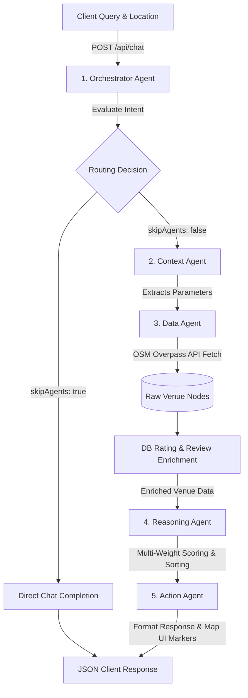

# WorkSphere Multi-Agent AI Architecture & Decision Pipeline

WorkSphere employs a modular, coordinated **Multi-Agent AI Pipeline** to handle workspace searching, parameters extraction, database enrichment, scoring, and UI/Map rendering. This document details the orchestration flow, prompt engineering standards, data schema transitions, and optimization strategies using the **Groq Llama-3.3-70B** model.

---

## 1. Pipeline Overview & Agent State Transitions

The pipeline operates on a sequential chain of responsibility coordinated by the **Orchestrator Agent**. This architecture ensures that query parsing, third-party data retrieval, database overlay, and decision ranking are cleanly separated.

### Pipeline Flow Diagram
The following Mermaid diagram illustrates how context flows from the client query down to the final UI response:



---

## 2. Agent Specifications & Data Schemas

### Agent 1: Orchestrator Agent
The gatekeeper of the pipeline. It inspects the user message and location context to determine which subset of agents are required, or decides if the query is a generic chat message that can skip the pipeline.

* **System Instruction Prompt:**
  ```text
  You are the Orchestrator Agent for WorkHub. Analyze user messages and determine which agents are needed.

  Available agents:
  - ContextAgent: Extracts search parameters (workType, amenities, location)
  - DataAgent: Fetches venue data
  - ReasoningAgent: Scores and ranks venues
  - ActionAgent: Updates map UI and generates responses

  Rules:
  1. Finding/searching workspaces → Use all 4 agents
  2. Asking about specific venue → DataAgent + ActionAgent
  3. Directions to venue → ActionAgent only
  4. General conversation → Skip agents

  Output ONLY valid JSON:
  {"agentsToUse": ["ContextAgent", "DataAgent", "ReasoningAgent", "ActionAgent"], "reasoning": "reason here", "skipAgents": false}

  For general chat: {"skipAgents": true, "reasoning": "General conversation"}
  ```
* **Output Data Schema (JSON):**
  ```typescript
  interface OrchestratorOutput {
    agentsToUse: ("ContextAgent" | "DataAgent" | "ReasoningAgent" | "ActionAgent")[];
    reasoning: string;
    skipAgents: boolean;
  }
  ```

---

### Agent 2: Context Agent
Extracts search parameters, intent, and filters from the user query.

* **System Instruction Prompt:**
  ```text
  You are the Context Agent. Extract search parameters from user queries.

  Extract:
  1. workType: "focus" | "calls" | "collaboration" | "casual"
  2. amenities: ["wifi", "outlets", "quiet", "parking", "outdoor"]
  3. radius: meters (nearby=1000, close=2000, "2 miles"=3200)
  4. category: ["cafe", "coworking", "library"]
  5. timeOfDay: "morning" | "afternoon" | "evening" | null
  6. duration: minutes

  Output ONLY valid JSON:
  {"intent": "Find quiet cafe", "parameters": {"workType": "focus", "amenities": ["wifi", "quiet"], "radius": 2000, "category": ["cafe", "coworking"], "timeOfDay": null, "duration": 120}, "reasoning": "User needs quiet focus space"}
  ```
* **Output Data Schema (JSON):**
  ```typescript
  interface ContextOutput {
    intent: string;
    parameters: {
      workType: "focus" | "calls" | "collaboration" | "casual";
      amenities: ("wifi" | "outlets" | "quiet" | "parking" | "outdoor")[];
      radius: number;
      category: ("cafe" | "coworking" | "library")[];
      location: { lat: number; lng: number } | null;
      timeOfDay: "morning" | "afternoon" | "evening" | null;
      duration?: number; // minutes
    };
    reasoning: string;
  }
  ```

---

### Agent 3: Data Agent (Overpass Fetch & DB Enrichment)
Queries external OpenStreetMap (OSM) nodes via the Overpass API interpreter. 

* **OSM Query Construction:**
  ```sql
  [out:json][timeout:25];
  (
    node["amenity"~"cafe|coworking_space|library"](around:2000,40.7128,-74.006);
    way["amenity"~"cafe|coworking_space|library"](around:2000,40.7128,-74.006);
  );
  out center body;
  ```
* **Local Database Enrichment (Overlay):**
  Matches nodes by `placeId` (Google/OSM ID) against PostgreSQL `Venue` and `VenueRating` records to load crowdsourced features:
  - **WiFi Quality**: Converts user ratings (1-5 scale) to a unified `0-10` scale.
  - **Power Outlets**: Marks outlets as `true` if >50% of community reviews confirm availability.
  - **Noise Level**: Dynamically calculates the mode (most common noise value) across submitted reviews.
* **Output Data Schema (JSON):**
  ```typescript
  interface EnrichedVenue {
    id: string;
    name: string;
    lat: number;
    lng: number;
    category: string;
    address: string | null;
    wifi: boolean;
    hasOutlets: boolean;
    noiseLevel: "quiet" | "moderate" | "loud";
    wifiQuality: number | null; // 0-10 scale
    openingHours: string | null;
  }
  ```

---

### Agent 4: Reasoning Agent
A deterministic agent that scores and ranks enriched venues according to the user's specific `workType` constraints and requested amenities.

* **Scoring Weight Matrix:**

| Work Type | Wi-Fi Weight | Noise Weight | Outlets Weight | Rating Weight |
|---|---|---|---|---|
| **focus** | 25% | 35% | 25% | 15% |
| **calls** | 40% | 30% | 15% | 15% |
| **collaboration** | 30% | 20% | 25% | 25% |
| **casual** | 25% | 25% | 25% | 25% |

* **Formula & Metrics:**
  - **Wi-Fi Score**: User review average (0-10), defaults to `7` if OSM specifies wifi, `3` if unknown.
  - **Noise Score**: Quiet = `9`, Moderate = `6`, Loud = `3`.
  - **Outlets Score**: Available = `8`, Unavailable = `4`.
  - **Rating Score**: Average reviews multiplied by 2 (0-10 scale), defaults to `5` if unrated.
  - **Amenity Bonus**: Adds `+1` point per matching amenity explicitly requested by the user.
* **Output Data Schema (JSON):**
  ```typescript
  interface RankedVenue extends EnrichedVenue {
    score: number; // 0-10 scale
    scoreBreakdown: {
      wifi: number;
      noise: number;
      outlets: number;
      rating: number;
    };
  }
  ```

---

### Agent 5: Action Agent
Translates ranked venues into standard markdown descriptions, client suggestions, and Map UI markers.

* **Output Data Schema (JSON Client Payload):**
  ```typescript
  interface ActionOutput {
    content: string; // Markdown text response list
    venues: RankedVenue[];
    mapUpdates: {
      markers: {
        id: string;
        lat: number;
        lng: number;
        name: string;
        category: string;
        score: number;
      }[];
      view: {
        center: { lat: number; lng: number };
        zoom: number;
        animate: boolean;
      };
    };
    suggestions: string[];
    agentSteps: {
      agent: string;
      result: any;
      timestamp: number;
    }[];
  }
  ```

---

## 3. Groq & Llama-3.3-70B Optimization Standards

We use `llama-3.3-70b-versatile` over Groq's high-speed serverless infrastructure. To keep processing latency sub-second and minimize API usage boundaries, the following techniques are implemented:

### 1. Minimal Output Constraint (Output JSON Only)
Models are instructed to output **ONLY** valid JSON. System prompts end with a strict structural template example to suppress conversational preamble (e.g. *"Here is your JSON response..."*), saving output tokens and accelerating parsing speed.

### 2. Fault-Tolerant JSON Parsing (Regex Extraction)
LLMs sometimes add markdown wrappers (````json ... ````) or introductory comments. To handle this, the route controller does not parse raw text directly. It extracts JSON using a regex matcher before calling `JSON.parse()`:
```typescript
const text = response.choices[0]?.message?.content || "";
const jsonMatch = text.match(/\{[\s\S]*\}/);
if (jsonMatch) {
  return JSON.parse(jsonMatch[0]);
}
```

### 3. Lazy Initialized API Client
To avoid compilation errors in serverless pipelines during Next.js build-time bundling (where env variables like `GROQ_API_KEY` are not bound), client initialization is deferred until runtime:
```typescript
let groq: Groq | null = null;
function getGroqClient(): Groq {
  if (!groq) {
    groq = new Groq({
      apiKey: process.env.GROQ_API_KEY || '',
    });
  }
  return groq;
}
```

### 4. Upstash Rate Limiting Shield
Before hitting Groq completions, requests are evaluated via Upstash Redis limits (`@upstash/ratelimit`) to block high-frequency spam, securing token budgets.
