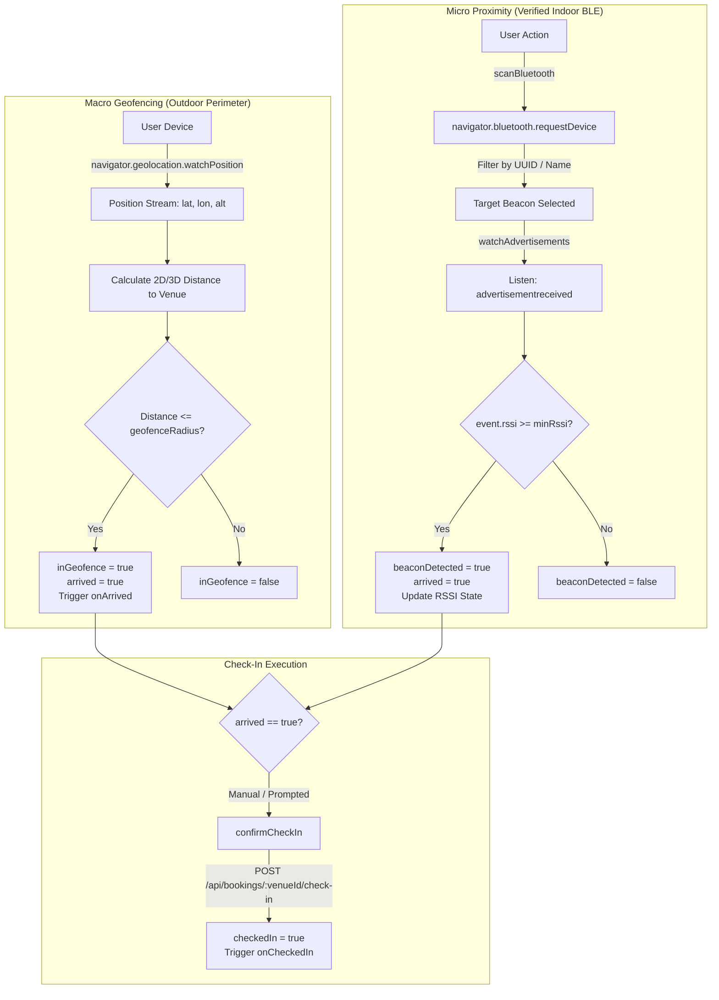

# Arrival Detection & Bluetooth Beacon Integration

Technical documentation for the arrival detection and proximity verification system implemented in [`src/hooks/useArrivalDetection.ts`](file:///c:/Users/kadal/Downloads/worksphere/WorkSphere/src/hooks/useArrivalDetection.ts).

---

## 1. Overview

WorkSphere integrates macro-proximity and micro-proximity verification to streamline member workspace arrivals. The [`useArrivalDetection`](file:///c:/Users/kadal/Downloads/worksphere/WorkSphere/src/hooks/useArrivalDetection.ts) React hook manages this lifecycle by pairing standard browser **Geolocation API** tracking with **Web Bluetooth Low Energy (BLE)** beacon detection.

### Dual Operating Modes

The hook provides two distinct overload signatures to support different layers of the WorkSphere platform:

1. **Geofencing & Bluetooth Mode** (`useArrivalDetection(options: UseArrivalDetectionOptions)`):
   - Used for physical venue check-ins across the web application.
   - Tracks real-time GPS coordinates against target venue coordinates.
   - Performs on-demand Bluetooth Low Energy (BLE) scanning for verified indoor presence.
   - Coordinates check-in requests with the backend API.
2. **Vector Mode** (`useArrivalDetection(currentPosition: Vector3 | null, targetPosition: Vector3 | undefined, threshold?: number)`):
   - Used within Augmented Reality (AR) components such as [`ARDeskNavigator.tsx`](file:///c:/Users/kadal/Downloads/worksphere/WorkSphere/src/app/workspace/ARDeskNavigator.tsx).
   - Computes 3D Euclidean distances between camera position and anchor vectors in AR space.

### Why Dual-Tier Arrival Detection?

| Tier                | Technology               | Radius / Range             | Primary Purpose                                         | Limitations                                                       |
| :------------------ | :----------------------- | :------------------------- | :------------------------------------------------------ | :---------------------------------------------------------------- |
| **Macro / Outdoor** | Browser Geolocation API  | ~30m – 100m (configurable) | Detects approach to venue perimeter; pre-warms bookings | GPS signal degrades indoors; cannot isolate vertical floor levels |
| **Micro / Indoor**  | Web Bluetooth LE Beacons | ~1m – 10m (RSSI-based)     | Verifies physical indoor presence; authorizes check-in  | Requires user gesture; limited to supported Chromium browsers     |

---

## 2. Architecture

The system coordinates location streaming, BLE advertisement listeners, and check-in API interactions:



### State Return Structure

The hook returns an [`ArrivalDetectionResult`](file:///c:/Users/kadal/Downloads/worksphere/WorkSphere/src/hooks/useArrivalDetection.ts#L23) object containing:

```ts
export interface ArrivalDetectionResult {
  arrived: boolean; // true if inGeofence OR beaconDetected
  inGeofence: boolean; // true if distance <= geofenceRadius
  beaconDetected: boolean; // true if beacon RSSI >= minRssi
  checkedIn: boolean; // true once check-in succeeds
  isCheckingIn: boolean; // true during check-in network request
  error: string | null; // error message if geolocation or BLE fails
  confirmCheckIn: () => Promise<void>; // triggers check-in confirmation
  distanceToVenue: number | null; // calculated distance in meters
  rssi: number | null; // current beacon signal strength (dBm)
  scanBluetooth: () => Promise<void>; // initiates Web Bluetooth device request
  currentCoords: { latitude: number; longitude: number } | null;
}
```

---

## 3. Geolocation Geofencing

The outdoor geofencing engine continuously observes user movement relative to target venue coordinates.

### Coordinates and Configuration Options

Target venue coordinates are supplied via [`UseArrivalDetectionOptions`](file:///c:/Users/kadal/Downloads/worksphere/WorkSphere/src/hooks/useArrivalDetection.ts#L11):

```ts
export interface UseArrivalDetectionOptions {
  venueId?: string; // Target venue identifier
  venueName?: string; // Display name for logging/UI
  latitude?: number; // Venue latitude in decimal degrees
  longitude?: number; // Venue longitude in decimal degrees
  altitude?: number; // Optional venue altitude in meters
  geofenceRadius?: number; // Perimeter threshold in meters (default: 50)
  beacon?: VenueBeaconConfig; // Optional BLE beacon parameters
  onArrived?: () => void; // Callback when entering geofence
  onCheckedIn?: () => void; // Callback when check-in completes
}
```

### Distance Calculation (`getDistanceInMeters`)

Coordinates are processed using the Great-Circle Haversine formula with a mean Earth radius of $R = 6,371,000\text{ meters}$:

$$\Delta\phi = (\text{lat}_2 - \text{lat}_1)\frac{\pi}{180}, \quad \Delta\lambda = (\text{lon}_2 - \text{lon}_1)\frac{\pi}{180}$$

$$a = \sin^2\left(\frac{\Delta\phi}{2}\right) + \cos(\phi_1)\cos(\phi_2)\sin^2\left(\frac{\Delta\lambda}{2}\right)$$

$$d_{2D} = 2 R \cdot \operatorname{atan2}\left(\sqrt{a}, \sqrt{1 - a}\right)$$

When both user position and venue position include altitude data, the hook calculates 3D Euclidean distance:

$$d_{3D} = \sqrt{d_{2D}^2 + (\text{alt}_1 - \text{alt}_2)^2}$$

If the user's device does not supply altitude (`coords.altitude` is `null` or `undefined`), the function gracefully falls back to $d_{2D}$.

### Geofence Lifecycle & Practical Example

1. **Watch Subscription**: The hook calls `navigator.geolocation.watchPosition` with `{ enableHighAccuracy: true, timeout: 10000, maximumAge: 0 }`.
2. **Perimeter Entry**:
   - _Example_: A venue is located at `(40.7128, -74.0060)` with `geofenceRadius = 50`.
   - When the user is at `(40.7137, -74.0060)` (~100m away), `dist = 100`, `inGeofence = false`, and `arrived = false`.
   - When the user moves to `(40.71285, -74.0060)` (~5.5m away), `dist = 5.5`, setting `inGeofence = true` and `arrived = true`.
   - The optional `onArrived` callback is triggered exactly once upon crossing the threshold.
3. **Perimeter Departure**: When the user moves to `(40.7150, -74.0060)`, `dist > 50`, resetting `inGeofence = false` and `arrived = false` (unless a beacon remains detected).
4. **Error Handling**: Missing browser support sets `"Geolocation is not supported by this browser."`. Permission denials or timeouts populate `error` (e.g., `"Geolocation error: User denied location authorization"`).

---

## 4. Dwell-Time Threshold & Accidental Check-in Prevention

### Why Dwell Time and Confirmation Guards Matter

In urban centers, users frequently pass near venues without intending to enter (e.g., walking past the storefront, riding on a bus, or experiencing GPS drift/multipath reflection between tall buildings). Instantly executing an automated, irreversible check-in upon perimeter contact leads to:

- False-positive occupancy counts.
- Premature desk and resource allocation.
- Inaccurate attendance records.

### Repository Implementation Architecture

In [`src/hooks/useArrivalDetection.ts`](file:///c:/Users/kadal/Downloads/worksphere/WorkSphere/src/hooks/useArrivalDetection.ts), arrival awareness and check-in confirmation are intentionally decoupled:

1. **Immediate Arrival Notification**: Crossing into `dist <= geofenceRadius` sets `arrived = true` immediately so the UI can adapt (e.g., show an "Arrived at Venue" notification or display a "Check In" button).
2. **Explicit Confirmation Guard**: The hook does not execute an automated check-in network call upon entering the geofence. The actual booking check-in requires calling `confirmCheckIn()`.
3. **One-Tap Check-In Lifecycle**:
   - Sets `isCheckingIn = true`.
   - Dispatches a `POST` request to `/api/bookings/${venueId}/check-in`.
   - If the endpoint returns an error or is unconfigured, completes locally after fallback delay.
   - Sets `checkedIn = true`, invokes `onCheckedIn?.()`, and resets `isCheckingIn = false`.
   - Subsequent calls return early if `checkedIn` is already true.

### Implementing an Automated Dwell Timer in UI Wrappers

If an application feature requires automatic check-in after the user has remained inside the geofence continuously for a period (e.g., 3 minutes), consumers can wrap `inGeofence` with a standard timer:

```tsx
const { inGeofence, confirmCheckIn, checkedIn } = useArrivalDetection(options);

useEffect(() => {
  if (!inGeofence || checkedIn) return;

  const dwellTimeout = setTimeout(() => {
    confirmCheckIn();
  }, 180000); // 3-minute dwell duration

  return () => clearTimeout(dwellTimeout); // Resets if user departs early
}, [inGeofence, checkedIn, confirmCheckIn]);
```

---

## 5. Bluetooth Low Energy (BLE) Integration

For verified indoor check-in, the hook leverages the **Web Bluetooth API** (`navigator.bluetooth`).

### Scanning Flow (`scanBluetooth`)

Scanning is initiated on-demand by calling `scanBluetooth()` from user interaction:

1. **Platform Compatibility Check**: Checks `window` and `navigator.bluetooth`. If missing, sets `error: "Web Bluetooth is not supported by this browser."`.
2. **Device Discovery (`requestDevice`)**:
   Constructs device filter criteria matching the configured beacon:
   ```ts
   const filters: any[] = [];
   if (beacon?.uuid) filters.push({ services: [beacon.uuid.toLowerCase()] });
   if (beacon?.name) filters.push({ name: beacon.name });
   const scanOptions =
     filters.length > 0 ? { filters } : { acceptAllDevices: true };
   const device = await navigator.bluetooth.requestDevice(scanOptions);
   ```
3. **RSSI Monitoring (`watchAdvertisements`)**:
   - Subscribes to the `advertisementreceived` event to inspect incoming signal packets.
   - Compares signal strength (`event.rssi`) against the configured threshold (`beacon?.minRssi ?? -85`):
     ```ts
     const thresholdRssi = beacon?.minRssi ?? -85;
     if (deviceRssi !== null && deviceRssi >= thresholdRssi) {
       setBeaconDetected(true);
     } else {
       setBeaconDetected(false);
     }
     ```
4. **Fallback Mechanism**: For browsers supporting `requestDevice` but lacking `watchAdvertisements`, the hook sets `rssi = -70` and `beaconDetected = true` upon successful device pairing.
5. **Scan Failure Handling**: If the user dismisses the device picker dialog or Bluetooth is disabled, the error is captured in `error: "Bluetooth scan failed: <message>"`.

### Browser & Device Limitations

- **Chromium Only**: Supported in Chrome, Edge, and Opera on Android, macOS, Windows, and ChromeOS.
- **Unsupported Environments**: Safari (iOS/macOS) and Firefox do not implement the Web Bluetooth API.
- **Transient User Gesture Required**: `navigator.bluetooth.requestDevice()` must be triggered directly by user gesture (click/tap) and cannot run autonomously in the background.

---

## 6. BLE Beacon UUID Configuration

### Configuration Schema: `VenueBeaconConfig`

Beacons are associated with venues using [`VenueBeaconConfig`](file:///c:/Users/kadal/Downloads/worksphere/WorkSphere/src/hooks/useArrivalDetection.ts#L5):

```ts
export interface VenueBeaconConfig {
  uuid?: string; // 128-bit service UUID (e.g., "12345678-1234-1234-1234-123456789abc")
  name?: string; // Advertised local name (e.g., "WorkSphere_Beacon")
  minRssi?: number; // RSSI cutoff threshold in dBm (default: -85)
}
```

### Venue Association Example

When registering or updating venue parameters:

```ts
const venueArrivalConfig: UseArrivalDetectionOptions = {
  venueId: "venue_soho_04",
  venueName: "WorkSphere SoHo Studio",
  latitude: 40.7233,
  longitude: -74.003,
  altitude: 12,
  geofenceRadius: 45, // 45-meter outdoor geofence
  beacon: {
    uuid: "12345678-1234-1234-1234-123456789abc",
    name: "WorkSphere_SoHo_Reception",
    minRssi: -80, // Requires member to be within ~2-4 meters of front desk
  },
  onArrived: () => console.log("Member reached outdoor perimeter"),
  onCheckedIn: () => console.log("Indoor check-in confirmed"),
};
```

### Identifier Guidelines for Administrators

1. **UUID Format**: Must be a valid 128-bit UUID string. The hook automatically normalizes UUIDs to lowercase for compatibility with the Web Bluetooth filter standard.
2. **Device Name**: Matches the hardware advertising name programmed on the physical beacon transmitter.
3. **RSSI Threshold Guidelines**:
   - `-65 dBm` to `-75 dBm`: High proximity (within 1–2 meters; desk or turnstile level).
   - `-80 dBm` to `-85 dBm`: Moderate proximity (default; within room or entrance perimeter).
   - `-90 dBm` or lower: Weak signal; prone to false triggers outside room boundaries.

---

## 7. Battery Consumption & Performance

Continuous location monitoring and radio scanning can drain mobile battery reserves. [`useArrivalDetection.ts`](file:///c:/Users/kadal/Downloads/worksphere/WorkSphere/src/hooks/useArrivalDetection.ts) implements several key optimizations:

1. **Native Location Watching**:
   - Uses `navigator.geolocation.watchPosition` instead of high-frequency polling intervals (`setInterval`).
   - Allows the underlying mobile OS to batch GPS, cellular, and Wi-Fi triangulation updates.
2. **On-Demand Bluetooth Activation**:
   - Bluetooth scanning is strictly on-demand via `scanBluetooth()`, preventing background radio drains.
   - Filter criteria are restricted to explicit UUIDs and names rather than wide-band promiscuous scans.
3. **Resource Teardown & Listener Hygiene**:
   - `useEffect` cleanup invokes `navigator.geolocation.clearWatch(watchId)`.
   - Stored device references in `advertisementListenerRef` cleanly detach listeners and call `device.unwatchAdvertisements()` when switching devices or unmounting.
4. **Idempotent Check-in Guard**:
   - Calling `confirmCheckIn()` returns immediately if `checkedIn` is already true, preventing unnecessary network traffic.
