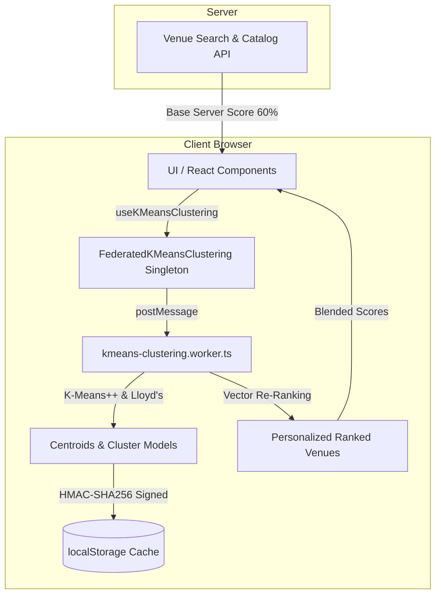

# Federated K-Means Clustering Guide

## Overview

WorkSphere employs client-side **Federated K-Means Clustering** to provide personalized workspace and venue recommendations while upholding strict user data privacy. Rather than transmitting raw user preferences, interaction history, or bookmarks to central servers, WorkSphere executes clustering and vector ranking directly within the user's browser via a dedicated Web Worker ([src/workers/kmeans-clustering.worker.ts](file:///c:/Users/kadal/Downloads/worksphere/WorkSphere/src/workers/kmeans-clustering.worker.ts)).

The core idea is **on-device personalization**:

1. User favorites and saved venues are transformed into high-dimensional amenity vectors.
2. An on-device K-Means clustering algorithm partitions the user's preferences into distinct preference clusters (e.g., quiet study spots vs. lively collaborative cafes).
3. When search results or venue catalogs are loaded, a hybrid ranking engine computes cluster affinity client-side and blends this local signal with server-side relevance rankings.
4. Raw preference vectors remain strictly isolated within the client environment.



---

## Vector Representation

Venues and user preferences are projected into a normalized, 12-dimensional Euclidean feature space ($D = 12$) defined in [src/lib/kmeans/types.ts](file:///c:/Users/kadal/Downloads/worksphere/WorkSphere/src/lib/kmeans/types.ts). Every dimension represents a specific workspace amenity or operational attribute, mapped into a continuous interval $[0, 1]$.

### Amenity Vector Dimensions ($D = 12$)

| Dimension Index $j$ | Dimension Key (`AmenityVectorKey`) | Value Type  | Transformation Rule / Normalization                                      | Range      |
| ------------------- | ---------------------------------- | ----------- | ------------------------------------------------------------------------ | ---------- |
| 1                   | `wifiQuality`                      | Continuous  | $\text{clamp}_{0,1}(\text{wifiQuality} / 10)$                            | $[0, 1]$   |
| 2                   | `hasOutlets`                       | Binary      | $1 \text{ if true else } 0$                                              | $\{0, 1\}$ |
| 3                   | `outletDensity`                    | Categorical | `every_table`: 1.0, `some_tables`: 0.66, `wall_seats`: 0.33, `none`: 0.0 | $[0, 1]$   |
| 4                   | `noiseLevel`                       | Categorical | `quiet`: 1.0, `moderate`: 0.5, `loud`: 0.0                               | $[0, 1]$   |
| 5                   | `hasErgonomic`                     | Binary      | $1 \text{ if true else } 0$                                              | $\{0, 1\}$ |
| 6                   | `hasPhoneBooths`                   | Binary      | $1 \text{ if true else } 0$                                              | $\{0, 1\}$ |
| 7                   | `hasNoMusic`                       | Binary      | $1 \text{ if true else } 0$                                              | $\{0, 1\}$ |
| 8                   | `hasQuietZone`                     | Binary      | $1 \text{ if true else } 0$                                              | $\{0, 1\}$ |
| 9                   | `hasAncHeadsetRental`              | Binary      | $1 \text{ if true else } 0$                                              | $\{0, 1\}$ |
| 10                  | `lighting`                         | Categorical | `bright`: 1.0, `natural`: 0.5, `dim`: 0.0                                | $[0, 1]$   |
| 11                  | `currentOccupancy`                 | Continuous  | $\text{clamp}_{0,1}(\text{currentOccupancy} / 100)$                      | $[0, 1]$   |
| 12                  | `rating`                           | Continuous  | $\text{clamp}_{0,1}(\text{rating} / 5)$                                  | $[0, 1]$   |

Formally, a vector $\mathbf{x}_i \in \mathbb{R}^{12}$ is represented as:

$$\mathbf{x}_i = \left( x_{i,1}, x_{i,2}, \dots, x_{i,D} \right)^T \quad \text{where } x_{i,j} \in [0, 1], \; D = 12$$

In TypeScript, vectors are modeled as typed object records:

```typescript
export type AmenityVector = Record<AmenityVectorKey, number>;
```

All values are constrained to $[0, 1]$ via `clamp01(v) = Math.max(0, Math.min(1, v))` to guarantee that no single feature dominates the distance calculation.

---

## Euclidean Distance

The fundamental metric used to evaluate geometric similarity between amenity vectors is **Euclidean Distance**.

### Mathematical Formulation

Given an input feature vector $\mathbf{x} = (x_1, x_2, \dots, x_D)^T$ and a candidate cluster centroid $\mathbf{c} = (c_1, c_2, \dots, c_D)^T$:

$$d(\mathbf{x}, \mathbf{c}) = \|\mathbf{x} - \mathbf{c}\|_2 = \sqrt{\sum_{j=1}^{D} (x_j - c_j)^2}$$

Where:

- $\mathbf{x}$: The 12-dimensional vector representing a venue or user preference point.
- $\mathbf{c}$: The 12-dimensional vector representing the cluster centroid.
- $D$: Number of dimensions ($D = 12$).
- $x_j$: Feature value of the vector along dimension $j$.
- $c_j$: Coordinate of the centroid along dimension $j$.
- $(x_j - c_j)^2$: Squared coordinate difference along dimension $j$.
- $d(\mathbf{x}, \mathbf{c})$: The straight-line Euclidean distance in $[0, 1]^D$ space.

### Squared Euclidean Distance Optimization

During the cluster assignment and initialization loops, calculating square roots ($\sqrt{\cdot}$) for every pair comparison is computationally expensive. Because $\sqrt{u}$ is a strictly monotonic function for $u \ge 0$:

$$\arg\min_k d(\mathbf{x}, \mathbf{c}_k) \equiv \arg\min_k d^2(\mathbf{x}, \mathbf{c}_k)$$

WorkSphere uses **Squared Euclidean Distance** during iterative assignment:

$$d^2(\mathbf{x}, \mathbf{c}) = \sum_{j=1}^{D} (x_j - c_j)^2$$

```typescript
// src/lib/kmeans/mathUtils.ts
export function squaredEuclideanDistance(
  a: AmenityVector,
  b: AmenityVector,
): number {
  let sum = 0;
  for (const dim of KMEANS_DIMENSIONS) {
    const diff = a[dim] - b[dim];
    sum += diff * diff;
  }
  return sum;
}
```

---

## Lloyd's Algorithm

WorkSphere implements **Lloyd's Algorithm** with **K-Means++ initialization** to partition $N$ user vectors into $K = 5$ clusters.

```
                      +-----------------------------+
                      |   1. Vector Preprocessing   |
                      |   (Pad / Deduplicate input) |
                      +--------------+--------------+
                                     |
                                     v
                      +-----------------------------+
                      |   2. K-Means++ Init         |
                      |   (Distance-weighted seeds) |
                      +--------------+--------------+
                                     |
                       +------------>+
                       |             |
                       |             v
                       |      +---------------+
                       |      | 3. Assignment |
                       |      | (Nearest c_k) |
                       |      +-------+-------+
                       |              |
                       |              v
                       |      +---------------+
                       |      |  4. Update    |
                       |      | (Cluster mean)|
                       |      +-------+-------+
                       |              |
                       |              v
                       |      +---------------+
                       |      | 5. Check Stop |
                       |      | (Shift < 1e-4 |
                       |      |  or Iter = 50)|
                       |      +-------+-------+
                       |              |
                       +--[No]--------+---[Yes]---> Terminate & Persist
```

### 1. Initialization (K-Means++)

Standard random initialization is prone to suboptimal local minima. WorkSphere employs the **K-Means++** seeding procedure ([src/lib/kmeans/mathUtils.ts](file:///c:/Users/kadal/Downloads/worksphere/WorkSphere/src/lib/kmeans/mathUtils.ts)):

1. **First Seed**: Select the first centroid $\mathbf{c}_0$ uniformly at random from the input set $X = \{\mathbf{x}_1, \dots, \mathbf{x}_N\}$.
2. **Subsequent Seeds ($c = 1 \dots K - 1$)**:
   - For every vector $\mathbf{x}_i \in X$, compute its shortest squared distance to any existing centroid:
     $$D(\mathbf{x}_i)^2 = \min_{m < c} d^2(\mathbf{x}_i, \mathbf{c}_m)$$
   - Select the next centroid $\mathbf{c}_c$ from $X$ with probability proportional to $D(\mathbf{x}_i)^2$:
     $$P(\mathbf{x}_i \text{ is chosen}) = \frac{D(\mathbf{x}_i)^2}{\sum_{l=1}^{N} D(\mathbf{x}_l)^2}$$
3. **Degeneracy Fallback**: If $\sum_l D(\mathbf{x}_l)^2 = 0$ (all vectors identical), choose a vector uniformly at random.
4. **Padding**: If $N < K$, vectors are padded using `padWithNeutralVectors()` with slight stochastic jitter ($0.5 \pm 0.05$) to ensure $K$ distinct centroids can always be initialized.

### 2. Cluster Assignment

At iteration $t$, each vector $\mathbf{x}_i$ is assigned to its nearest centroid according to squared Euclidean distance:

$$z_i^{(t)} = \arg\min_{k \in \{0, \dots, K-1\}} d^2\left(\mathbf{x}_i, \mathbf{c}_k^{(t-1)}\right)$$

Where $z_i^{(t)} \in \{0, \dots, K-1\}$ denotes the cluster label assigned to vector $\mathbf{x}_i$.

We define cluster partition $S_k^{(t)}$ as the set of vectors currently assigned to cluster $k$:

$$S_k^{(t)} = \left\{ \mathbf{x}_i \in X \;\middle|\; z_i^{(t)} = k \right\}$$

### 3. Centroid Update

For each cluster $k \in \{0, \dots, K-1\}$, the new centroid $\mathbf{c}_k^{(t)}$ is computed as the arithmetic mean of all vectors assigned to $S_k^{(t)}$:

$$\mathbf{c}_k^{(t)} = \frac{1}{|S_k^{(t)}|} \sum_{\mathbf{x}_i \in S_k^{(t)}} \mathbf{x}_i$$

Component-wise for each dimension $j \in \{1, \dots, D\}$:

$$c_{k,j}^{(t)} = \frac{1}{|S_k^{(t)}|} \sum_{\mathbf{x}_i \in S_k^{(t)}} x_{i,j}$$

#### Handling Empty Clusters ($|S_k^{(t)}| = 0$)

If no vectors are assigned to a cluster $k$ during an iteration ($|S_k^{(t)}| = 0$), calculating the arithmetic mean would produce division by zero ($\frac{0}{0}$). WorkSphere resolves empty clusters using a **farthest-point re-seeding strategy**:

1. Identify the vector in the entire dataset that is farthest from its currently assigned centroid:
   $$\mathbf{x}^* = \arg\max_{\mathbf{x}_i \in X} d^2\left(\mathbf{x}_i, \mathbf{c}_{z_i}^{(t-1)}\right)$$
2. Reassign centroid $\mathbf{c}_k^{(t)}$ directly to $\mathbf{x}^*$:
   $$\mathbf{c}_k^{(t)} \leftarrow \mathbf{x}^*$$

This guarantees all $K$ centroids remain well-distributed and active throughout execution.

### 4. Convergence and Iteration Bounds

The iteration cycle alternates between assignment and update until one of two stopping criteria is met:

#### 1. Convergence Threshold ($\epsilon_{\text{conv}}$)

Convergence occurs when the maximum squared shift among all centroids between successive iterations falls below `CONVERGENCE_THRESHOLD = 1e-4`:

$$\max_{k \in \{0, \dots, K-1\}} d^2\left(\mathbf{c}_k^{(t)}, \mathbf{c}_k^{(t-1)}\right) \le 10^{-4}$$

When this condition is satisfied, the cluster positions have stabilized and further iterations will not meaningfully alter recommendations.

#### 2. Maximum Iteration Bound ($T_{\max}$)

Execution is strictly capped at `MAX_ITERATIONS = 50`:

$$t \le 50$$

#### Why Bounded Iterations Matter

- **Client Resource Protection**: In a client-side environment (laptops, mobile devices), unbounded clustering could induce battery drain or thermal throttling.
- **Predictable Latency**: Bounding iterations guarantees that the Web Worker completes clustering within predictable time windows ($< 50 \text{ ms}$ for standard user history sizes).
- **Graceful Termination**: In non-convex multi-modal vector distributions with minor oscillation, the upper bound ensures immediate return of high-quality centroid approximations.

---

## Federated Vector Ranking

Once centroids are computed, they are used to score and re-rank candidate venues retrieved from search queries or category listings.

### Client-Side Distance Normalization

For each candidate venue vector $\mathbf{v}$, we determine its nearest centroid:

$$k^* = \arg\min_{k \in \{0, \dots, K-1\}} d^2(\mathbf{v}, \mathbf{c}_k)$$

The Euclidean distance to that centroid is:

$$d = d(\mathbf{v}, \mathbf{c}_{k^*}) = \sqrt{\sum_{j=1}^{D} (v_j - c_{k^*,j})^2}$$

Because all coordinates are bounded in $[0, 1]$, the maximum possible Euclidean distance between any two points in $D = 12$ dimensional space is:

$$d_{\max} = \sqrt{\sum_{j=1}^{12} (1 - 0)^2} = \sqrt{12} \approx 3.4641016$$

The distance is normalized to $[0, 1]$ and converted to an affinity score:

$$\tilde{d} = \min\left(\frac{d}{d_{\max}}, 1\right)$$

$$\text{clientScore} = 1 - \tilde{d} \quad \in [0, 1]$$

### Hybrid Score Blending

The local `clientScore` is blended with the global `serverScore` (which reflects textual relevance, popularity, and global rating) using configured weights defined in [src/lib/kmeans/types.ts](file:///c:/Users/kadal/Downloads/worksphere/WorkSphere/src/lib/kmeans/types.ts):

- `SERVER_SCORE_WEIGHT` ($w_{\text{server}}$) = $0.6$
- `CLIENT_SCORE_WEIGHT` ($w_{\text{client}}$) = $0.4$

$$\text{blendedScore} = w_{\text{server}} \cdot \left(\frac{\text{serverScore}}{10}\right) + w_{\text{client}} \cdot \text{clientScore}$$

$$\text{finalScore} = \text{blendedScore} \times 10 \quad \in [0, 10]$$

Candidates are sorted in descending order of $\text{finalScore}$.

---

## WebWorker Vector Serialization

All compute-intensive operations (K-Means++ seeding, distance matrices, centroid iterations, and ranking loops) run inside a dedicated background worker ([src/workers/kmeans-clustering.worker.ts](file:///c:/Users/kadal/Downloads/worksphere/WorkSphere/src/workers/kmeans-clustering.worker.ts)) to prevent main-thread UI stutter.

### Serialization Strategy: Structured Clone

WorkSphere transfers vector collections between the main thread and the worker using the browser's native **Structured Clone Algorithm** via `postMessage`:

```typescript
// Sending vectors to worker
worker.postMessage({
  type: "COMPUTE_CLUSTERS",
  id: "compute_1",
  vectors: [
    { wifiQuality: 0.8, hasOutlets: 1, noiseLevel: 1.0, ... },
    ...
  ]
});
```

### Protocol and Types

Communication conforms to the message envelope specification:

```typescript
// Main thread -> Worker
type WorkerMessage =
  | { type: "INIT"; id: string }
  | { type: "COMPUTE_CLUSTERS"; id: string; vectors: AmenityVector[] }
  | {
      type: "RANK_VENUES";
      id: string;
      venueVectors: Array<{ id: string; vector: AmenityVector }>;
      centroids: AmenityVector[];
    };

// Worker -> Main thread
type WorkerResponse =
  | { type: "INIT_SUCCESS"; id: string }
  | {
      type: "CLUSTERS_COMPUTED";
      id: string;
      centroids: AmenityVector[];
      dataPoints: number;
      inertia: number;
    }
  | {
      type: "RANKED_RESULTS";
      id: string;
      ranked: Array<{
        id: string;
        distance: number;
        cluster: number;
        blendedScore: number;
      }>;
    }
  | { type: "ERROR"; id: string; error: string };
```

### Technical Considerations & Performance

- **Memory Layout**: In the TypeScript codebase, vectors are represented as plain JavaScript objects (`Record<AmenityVectorKey, number>`) rather than typed `Float32Array` buffers. This prioritizes readability and direct JSON compatibility across the React hook layer.
- **Copy-by-Value**: Structured cloning serializes and duplicates the array of objects across memory boundaries.
- **Payload Overhead**: Because each vector contains 12 numeric fields, an array of 100 favorites consumes $\approx 10 \text{ KB}$ of memory. Structured cloning overhead for this size is sub-millisecond ($< 0.2 \text{ ms}$).
- **Large-Scale Scaling**: If vector counts grow to tens of thousands in future iterations, flattening vectors into a contiguous `Float32Array(N * 12)` and using Transferable Objects (`ArrayBuffer`) would allow zero-copy memory detachment across threads.

---

## Privacy Model

### Local Vector Isolation

WorkSphere enforces strict local vector isolation:

1. **Client-Only Raw Data**: A user's bookmarks, saved venues, visited locations, and resulting amenity vectors $\mathbf{x}_i$ exist **only in client-side memory** and local browser storage.
2. **Zero Ingestion of Raw Profiles**: No raw interaction vector is ever dispatched over HTTP to WorkSphere backend services.
3. **Execution Boundary**: All K-Means clustering runs within the local browser process (or Web Worker sandbox).

### Shared Information vs. Unshared Information

| Data Element                         | Shared with Backend? | Storage Location               | Notes                                       |
| ------------------------------------ | -------------------- | ------------------------------ | ------------------------------------------- |
| User Saved Venues / Favorites        | No                   | Client IndexedDB / Local State | Private user bookmarks                      |
| Raw Amenity Vectors ($\mathbf{x}_i$) | No                   | Client Memory / Web Worker     | Reconstructed client-side from saved venues |
| Intermediate Lloyd's Iterations      | No                   | Web Worker transient memory    | Discarded upon convergence                  |
| Centroid Matrices ($\mathbf{c}_k$)   | No (Local-Only Mode) | Client `localStorage`          | Signed with HMAC-SHA256 integrity key       |
| Venue Catalog Search Queries         | Yes                  | Backend APIs                   | Standard keyword/geo queries                |
| Server Base Scores                   | Yes                  | Backend APIs                   | Computed globally by server                 |

### HMAC Integrity for Local Storage

While centroids are stored client-side, WorkSphere protects against tampering or corruption using an **HMAC-SHA256 signature** via the Web Crypto API ([src/lib/kmeans/storage.ts](file:///c:/Users/kadal/Downloads/worksphere/WorkSphere/src/lib/kmeans/storage.ts)):

```typescript
// Computes HMAC signature over centroids payload using a client-side salt
const data = encoder.encode(JSON.stringify(payload));
const signature = await crypto.subtle.sign("HMAC", key, data);
```

On reload, if the HMAC signature does not match the payload, the cached model is discarded and regenerated.

### Privacy Limitations (Important Notice)

To maintain technical accuracy, contributors should note what the current implementation **does and does not** guarantee:

- **Architectural Isolation, Not Differential Privacy**: The core clustering engine in `src/lib/kmeans/` runs locally and does not upload centroids. As such, local execution does not inject Laplace or Gaussian noise into centroids. The system achieves privacy through **data minimization and isolation** (never transmitting raw data) rather than mathematical differential privacy ($\epsilon$-DP).
- **Local Storage Visibility**: Stored centroids in browser `localStorage` can be inspected by anyone with physical or administrative access to the device's developer tools.
- **No Homomorphic Encryption**: Vectors are computed in plain numeric representation within the browser runtime.

---

## Computational Considerations

### Complexity Analysis

For a dataset of $N$ vectors, $K = 5$ clusters, $D = 12$ dimensions, and $I$ iterations ($I \le 50$):

| Operation                     | Time Complexity                          | Space Complexity             | Practical Time ($N = 100$) |
| ----------------------------- | ---------------------------------------- | ---------------------------- | -------------------------- |
| K-Means++ Seeding             | $\mathcal{O}(K \cdot N \cdot D)$         | $\mathcal{O}(N)$             | $< 2 \text{ ms}$           |
| Cluster Assignment (per iter) | $\mathcal{O}(N \cdot K \cdot D)$         | $\mathcal{O}(N)$             | $< 1 \text{ ms}$           |
| Centroid Updates (per iter)   | $\mathcal{O}(N \cdot D + K \cdot D)$     | $\mathcal{O}(K \cdot D)$     | $< 0.5 \text{ ms}$         |
| Full Convergence ($I$ iters)  | $\mathcal{O}(I \cdot N \cdot K \cdot D)$ | $\mathcal{O}(N + K \cdot D)$ | $< 15 \text{ ms}$          |
| Venue Re-ranking ($M$ venues) | $\mathcal{O}(M \cdot K \cdot D)$         | $\mathcal{O}(M)$             | $< 5 \text{ ms}$           |

Because $K = 5$ and $D = 12$ are fixed constants, the runtime is strictly **linear in the number of user points**: $\mathcal{O}(N)$.

---

## Example

The following end-to-end mathematical example illustrates distance calculation, cluster assignment, and centroid recalculation for a simplified 2-dimensional feature space ($D = 2$):

- Dimension 1: `wifiQuality` ($x_1$)
- Dimension 2: `noiseLevel` ($x_2$)

### Step 1: Initial Vectors and Centroids

Suppose a user has $N = 4$ saved venues:

- $\mathbf{x}_1 = (0.2, 0.8)$
- $\mathbf{x}_2 = (0.3, 0.9)$
- $\mathbf{x}_3 = (0.8, 0.2)$
- $\mathbf{x}_4 = (0.9, 0.1)$

Suppose K-Means++ initializes $K = 2$ centroids:

- $\mathbf{c}_0 = (0.1, 0.7)$
- $\mathbf{c}_1 = (0.7, 0.3)$

### Step 2: Distance Calculation and Cluster Assignment

We compute the squared Euclidean distance $d^2(\mathbf{x}_i, \mathbf{c}_k) = (x_{i,1} - c_{k,1})^2 + (x_{i,2} - c_{k,2})^2$ to both centroids:

| Vector                      | $d^2(\mathbf{x}_i, \mathbf{c}_0)$                         | $d^2(\mathbf{x}_i, \mathbf{c}_1)$                         | Nearest Centroid | Assignment $z_i$ |
| --------------------------- | --------------------------------------------------------- | --------------------------------------------------------- | ---------------- | ---------------- |
| $\mathbf{x}_1 = (0.2, 0.8)$ | $(0.2-0.1)^2 + (0.8-0.7)^2 = 0.01 + 0.01 = \mathbf{0.02}$ | $(0.2-0.7)^2 + (0.8-0.3)^2 = 0.25 + 0.25 = 0.50$          | $\mathbf{c}_0$   | Cluster 0        |
| $\mathbf{x}_2 = (0.3, 0.9)$ | $(0.3-0.1)^2 + (0.9-0.7)^2 = 0.04 + 0.04 = \mathbf{0.08}$ | $(0.3-0.7)^2 + (0.9-0.3)^2 = 0.16 + 0.36 = 0.52$          | $\mathbf{c}_0$   | Cluster 0        |
| $\mathbf{x}_3 = (0.8, 0.2)$ | $(0.8-0.1)^2 + (0.2-0.7)^2 = 0.49 + 0.25 = 0.74$          | $(0.8-0.7)^2 + (0.2-0.3)^2 = 0.01 + 0.01 = \mathbf{0.02}$ | $\mathbf{c}_1$   | Cluster 1        |
| $\mathbf{x}_4 = (0.9, 0.1)$ | $(0.9-0.1)^2 + (0.1-0.7)^2 = 0.64 + 0.36 = 1.00$          | $(0.9-0.7)^2 + (0.1-0.3)^2 = 0.04 + 0.04 = \mathbf{0.08}$ | $\mathbf{c}_1$   | Cluster 1        |

Cluster partitions:

- $S_0 = \{\mathbf{x}_1, \mathbf{x}_2\}$ ($|S_0| = 2$)
- $S_1 = \{\mathbf{x}_3, \mathbf{x}_4\}$ ($|S_1| = 2$)

### Step 3: Centroid Update

Recalculate centroids as the arithmetic mean of assigned points:

$$\mathbf{c}_0^{(1)} = \frac{\mathbf{x}_1 + \mathbf{x}_2}{2} = \left(\frac{0.2 + 0.3}{2}, \frac{0.8 + 0.9}{2}\right) = (0.25, 0.85)$$

$$\mathbf{c}_1^{(1)} = \frac{\mathbf{x}_3 + \mathbf{x}_4}{2} = \left(\frac{0.8 + 0.9}{2}, \frac{0.2 + 0.1}{2}\right) = (0.85, 0.15)$$

### Step 4: Convergence Check

Shift for centroid 0:
$$d^2(\mathbf{c}_0^{(0)}, \mathbf{c}_0^{(1)}) = (0.1 - 0.25)^2 + (0.7 - 0.85)^2 = 0.0225 + 0.0225 = 0.0450$$

Because $0.0450 > 10^{-4}$, the algorithm proceeds to the next iteration. On the next iteration, assignments remain identical, yielding shift $= 0 < 10^{-4}$ and triggering convergence.

### Step 5: Venue Ranking

Consider a candidate venue $\mathbf{v} = (0.3, 0.8)$ with server score $8.0$ ($\text{serverScore} = 0.8$):

1. Distance to nearest centroid $\mathbf{c}_0 = (0.25, 0.85)$:
   $$d = \sqrt{(0.3 - 0.25)^2 + (0.8 - 0.85)^2} = \sqrt{0.0025 + 0.0025} = \sqrt{0.0050} \approx 0.07071$$
2. Maximum distance in $D = 2$:
   $$d_{\max} = \sqrt{2} \approx 1.41421$$
3. Normalized client score:
   $$\text{clientScore} = 1 - \frac{0.07071}{1.41421} = 1 - 0.0500 = 0.9500$$
4. Blended final score ($60\%$ server, $40\%$ client):
   $$\text{blendedScore} = 0.6 \times 0.80 + 0.4 \times 0.95 = 0.48 + 0.38 = 0.86$$
   $$\text{finalScore} = 0.86 \times 10 = \mathbf{8.60}$$

The venue receives a strong personalization boost ($8.0 \rightarrow 8.6$) due to its high similarity to the user's Cluster 0 preference profile.
