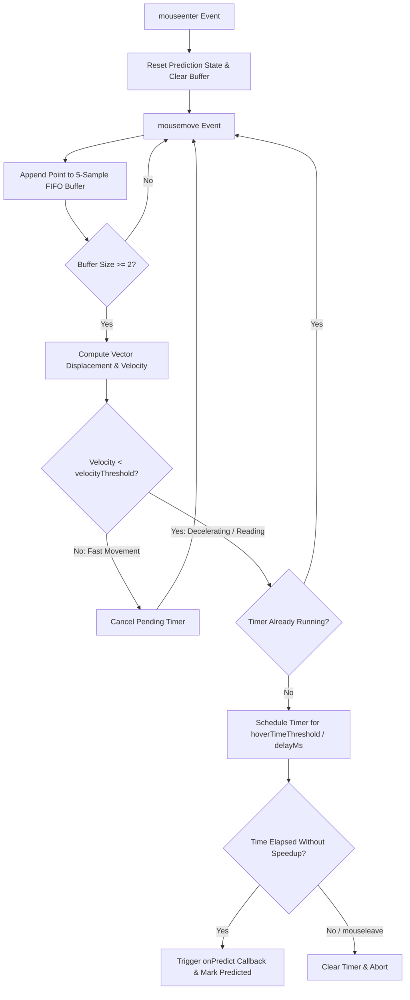

# Mouse Movement Trajectory Prediction & Hover Predictor Guide

## 1. Overview

WorkSphere incorporates an intent-driven hover prediction algorithm implemented in the [`useHoverPredictor`](file:///c:/Users/kadal/Downloads/worksphere/WorkSphere/src/hooks/useHoverPredictor.ts) React hook.

The primary objective of the hover predictor is **anticipatory resource prefetching** (e.g., pre-rendering routes or pre-caching venue details via Next.js `router.prefetch` and Service Worker messaging). Instead of naively triggering expensive network requests whenever the cursor momentarily glances across an interactive element, the algorithm models the cursor's 2D velocity vector and dwell time.



### Key Benefits

- **Zero Thrashing**: Avoids spamming backend servers or Service Workers when users rapidly move their cursor across dense lists or grid layouts (e.g., venue cards, search results).
- **Reduced Latency**: Pre-fetches venue payloads $200\text{–}300\text{ ms}$ before the physical mouse click occurs, delivering near-instantaneous page transitions.
- **Off-Thread Coordination**: Integrates seamlessly with Service Worker background caching pipelines (`PREFETCH_VENUE`).

---

## 2. Algorithm Architecture & Mathematical Formulation

The prediction engine operates on a streaming time-series of 2D mouse coordinate samples captured on the target element.

### 2.1 Coordinate Sampling & Sliding Window

When a user moves their mouse over the monitored DOM element, the browser fires `mousemove` events. Each event is recorded as a discrete kinematic sample point $P_i$:

$$P_i = (x_i, y_i, t_i)$$

Where:

- $x_i \in \mathbb{R}$: Horizontal coordinate in viewport pixel space (`event.clientX`).
- $y_i \in \mathbb{R}$: Vertical coordinate in viewport pixel space (`event.clientY`).
- $t_i \in \mathbb{N}$: Event timestamp in milliseconds (`Date.now()`).

The hook maintains a bounded First-In, First-Out (FIFO) sliding window $\mathcal{W}$ holding at most $M = 5$ points:

$$\mathcal{W} = [P_1, P_2, \dots, P_k] \quad (1 \le k \le 5)$$

When a new point arrives and $|\mathcal{W}| > 5$, the oldest sample is evicted ($\mathcal{W}.\text{shift}()$).

```typescript
// Sample buffer acquisition
const newPoint = { x: e.clientX, y: e.clientY, time: Date.now() };
pointsRef.current.push(newPoint);
if (pointsRef.current.length > 5) {
  pointsRef.current.shift();
}
```

### 2.2 2D Displacement Vector

To filter out high-frequency micro-jitter from optical sensors, displacement is calculated between the oldest point $P_1 = (x_1, y_1, t_1)$ and newest point $P_k = (x_k, y_k, t_k)$ in the sliding window:

$$\Delta x = x_k - x_1$$

$$\Delta y = y_k - y_1$$

$$\Delta \mathbf{r} = (\Delta x, \Delta y)^T$$

The total Euclidean spatial distance traversed across the window is:

$$\|\Delta \mathbf{r}\|_2 = \sqrt{\Delta x^2 + \Delta y^2}$$

### 2.3 Velocity Calculation

The elapsed time interval $\Delta t$ between window extremes is:

$$\Delta t = t_k - t_1 \quad (\text{in milliseconds})$$

The window average cursor velocity $v$ (in $\text{pixels/ms}$) is defined as:

$$ v = \begin{cases}
  \dfrac{\|\Delta \mathbf{r}\|_2}{\Delta t} = \dfrac{\sqrt{\Delta x^2 + \Delta y^2}}{\Delta t} & \text{if } \Delta t > 0 \\
  0 & \text{if } \Delta t = 0
\end{cases}$$

```typescript
// src/hooks/useHoverPredictor.ts
const calculateVelocity = (p1: Point, p2: Point) => {
  const dx = p2.x - p1.x;
  const dy = p2.y - p1.y;
  const dt = p2.time - p1.time;
  if (dt === 0) return 0;
  return Math.sqrt(dx * dx + dy * dy) / dt;
};
```

### 2.4 Movement Direction & Trajectory Vector

The angular direction of cursor motion $\theta$ relative to the viewport axis is:

$$\theta = \operatorname{atan2}(\Delta y, \Delta x) \in [-\pi, \pi]$$

And the normalized trajectory direction unit vector $\hat{\mathbf{u}}$ is:

$$\hat{\mathbf{u}} = \frac{\Delta \mathbf{r}}{\|\Delta \mathbf{r}\|_2} = \left(\frac{\Delta x}{\sqrt{\Delta x^2 + \Delta y^2}}, \frac{\Delta y}{\sqrt{\Delta x^2 + \Delta y^2}}\right)^T$$

### 2.5 Intent Prediction & Threshold Gating

The algorithm relies on the biomechanical observation that users decelerate and stabilize their cursor over a target when they intend to inspect, read, or click it:

1. **Fast Transit Filter ($v \ge v_{\text{threshold}}$)**:
   If the user's cursor sweeps quickly across the element, the cursor is simply in transit toward another part of the screen. Any pending prediction timer is cancelled:
   $$\text{clearTimeout}(\text{hoverTimerRef.current})$$

2. **Dwell / Deceleration Detection ($v < v_{\text{threshold}}$)**:
   If velocity drops below the threshold, the user has paused or slowed down over the item. A timer is scheduled for duration $\tau_{\text{delay}}$ (`hoverTimeThreshold`):
   $$\text{Timer scheduled for } \tau_{\text{delay}} \text{ ms}$$

3. **Prediction Confirmation**:
   If the timer expires without being cancelled by a high-velocity movement ($v \ge v_{\text{threshold}}$) or an element exit (`mouseleave`), the prediction succeeds:
   - `hasPredictedRef.current = true`
   - `onPredict()` is executed exactly once.

---

## 3. Configuration Parameters

The hook accepts an options object conforming to the `PredictorOptions` interface:

| Parameter | Type | Default Value | Unit | Description |
|---|---|---|---|---|
| `onPredict` | `() => void` | _(Required)_ | — | Callback invoked when intent is successfully predicted. |
| `velocityThreshold` | `number` | `0.5` | pixels / ms | Maximum velocity below which the cursor is considered "slow/dwelling". |
| `hoverTimeThreshold` *(delayMs)* | `number` | `300` | milliseconds | Dwell duration the cursor must remain slow before prediction triggers. |

### 3.1 `velocityThreshold` (Velocity Gate)
- **Role**: Differentiates between casual pass-through movements and deliberate engagement.
- **Unit**: Pixels per millisecond ($0.5\text{ px/ms} = 500\text{ px/second}$).
- **Tuning Behavior**:
  - **Lowering ($< 0.3\text{ px/ms}$)**: Requires the cursor to be almost completely stationary. Eliminates false positives, but may delay prefetching for users who move their cursor slowly while skimming.
  - **Increasing ($> 0.8\text{ px/ms}$)**: Triggers more eagerly even during moderate movement. Increases prefetch traffic, which may waste bandwidth on low-end networks.

### 3.2 `hoverTimeThreshold` / `delayMs` (Temporal Delay)
- **Role**: Prevents firing immediately upon cursor entry. Ensures the user actually stops over the element.
- **Unit**: Milliseconds.
- **Tuning Behavior**:
  - **Lowering ($< 150\text{ ms}$)**: Eager prediction. Maximizes network lead time before a click, suitable for desktop users on high-bandwidth connections.
  - **Increasing ($> 400\text{ ms}$)**: Conservative prediction. Minimizes unnecessary network calls in large, dense lists.

---

## 4. Component Integration Guide

The hook exposes a **Callback Ref** (`(node: HTMLElement | null) => void`). This avoids stale closure issues and guarantees event listeners (`mousemove`, `mouseenter`, `mouseleave`) are cleaned up when elements unmount or change.

### 4.1 Basic Integration Example

```tsx
import React from "react";
import { useRouter } from "next/navigation";
import { useHoverPredictor } from "@/hooks/useHoverPredictor";

interface WorkspaceListItemProps {
  workspace: {
    id: string;
    title: string;
    imageUrl: string;
  };
}

export function WorkspaceListItem({ workspace }: WorkspaceListItemProps) {
  const router = useRouter();

  const hoverPredictorRef = useHoverPredictor({
    onPredict: () => {
      // 1. Next.js App Router route prefetching
      router.prefetch(`/venues/${workspace.id}`);

      // 2. Service Worker offline/cache prefetching
      if (
        typeof navigator !== "undefined" &&
        navigator.serviceWorker?.controller
      ) {
        navigator.serviceWorker.controller.postMessage({
          type: "PREFETCH_VENUE",
          payload: { venueId: workspace.id },
        });
      }
    },
    velocityThreshold: 0.5, // 500 px/sec
    hoverTimeThreshold: 300, // 300 ms dwell
  });

  return (
    <article
      ref={hoverPredictorRef}
      className="p-4 rounded-xl border border-zinc-200 dark:border-zinc-800 transition hover:shadow-lg"
    >
      <h3 className="font-semibold">{workspace.title}</h3>
      <a href={`/venues/${workspace.id}`} className="text-violet-500">
        View Workspace Details
      </a>
    </article>
  );
}
```

### 4.2 Production Implementation in WorkSphere

In [src/components/VenueCard.tsx](file:///c:/Users/kadal/Downloads/worksphere/WorkSphere/src/components/VenueCard.tsx), `useHoverPredictor` is attached to each card in the venue exploration grid:

```tsx
// src/components/VenueCard.tsx lines 119-139
const hoverPredictorRef = useHoverPredictor({
  onPredict: () => {
    if (venue.id) {
      router.prefetch(`/venues/${venue.id}`);
    }
    if (
      typeof navigator !== "undefined" &&
      navigator.serviceWorker?.controller
    ) {
      navigator.serviceWorker.controller.postMessage({
        type: "PREFETCH_VENUE",
        payload: {
          venueId: venue.id,
          position: venue.position,
        },
      });
    }
  },
  velocityThreshold: 0.5,
  hoverTimeThreshold: 300,
});
```

---

## 5. Lifecycle & Event Handling

### State Transitions

| Event | Internal Hook Action |
|---|---|
| `mouseenter` | Resets `hasPredictedRef = false`, resets point buffer `pointsRef = []`, and clears any dangling hover timer. |
| `mousemove` (1st event) | Records initial point $P_1$. Velocity cannot yet be evaluated. |
| `mousemove` ($v \ge v_{\text{thresh}}$) | High speed detected: clears `hoverTimerRef` to cancel false predictions. |
| `mousemove` ($v < v_{\text{thresh}}$) | Low speed detected: starts `setTimeout` for `hoverTimeThreshold` if not already running. |
| Timer Expires | Sets `hasPredictedRef = true` and invokes `onPredict()`. |
| `mouseleave` | Clears points buffer `pointsRef = []` and cancels `hoverTimerRef`. |
| DOM Node Unmount | Callback ref detaches all listeners via `removeEventListener`. |

---

## 6. Numerical Walkthrough Example

Consider a user moving their mouse toward a card:

### Scenario A: Fast Cursor Transit (No Prediction)
- Point 1: $P_1 = (100, 200)$ at $t_1 = 1000\text{ ms}$
- Point 2: $P_2 = (190, 240)$ at $t_2 = 1050\text{ ms}$
- Displacement: $\Delta x = 90$, $\Delta y = 40 \implies \|\Delta \mathbf{r}\|_2 = \sqrt{90^2 + 40^2} = \sqrt{8100 + 1600} \approx 98.49\text{ px}$
- Elapsed Time: $\Delta t = 50\text{ ms}$
- Velocity: $v = \frac{98.49}{50} = 1.97\text{ px/ms}$
- Evaluation: $1.97 \ge 0.5 \implies$ **Fast Transit**. No timer is scheduled; prefetch is skipped.

### Scenario B: Intentional Deceleration (Prediction Fires)
- Point 1: $P_1 = (200, 250)$ at $t_1 = 1100\text{ ms}$
- Point 2: $P_2 = (206, 258)$ at $t_2 = 1150\text{ ms}$
- Displacement: $\Delta x = 6$, $\Delta y = 8 \implies \|\Delta \mathbf{r}\|_2 = \sqrt{6^2 + 8^2} = 10\text{ px}$
- Elapsed Time: $\Delta t = 50\text{ ms}$
- Velocity: $v = \frac{10}{50} = 0.20\text{ px/ms}$
- Evaluation: $0.20 < 0.5 \implies$ **Intent Detected**. Timer is set for $300\text{ ms}$. If the user stays slow or pauses until $t = 1450\text{ ms}$, `onPredict()` executes.
$$
