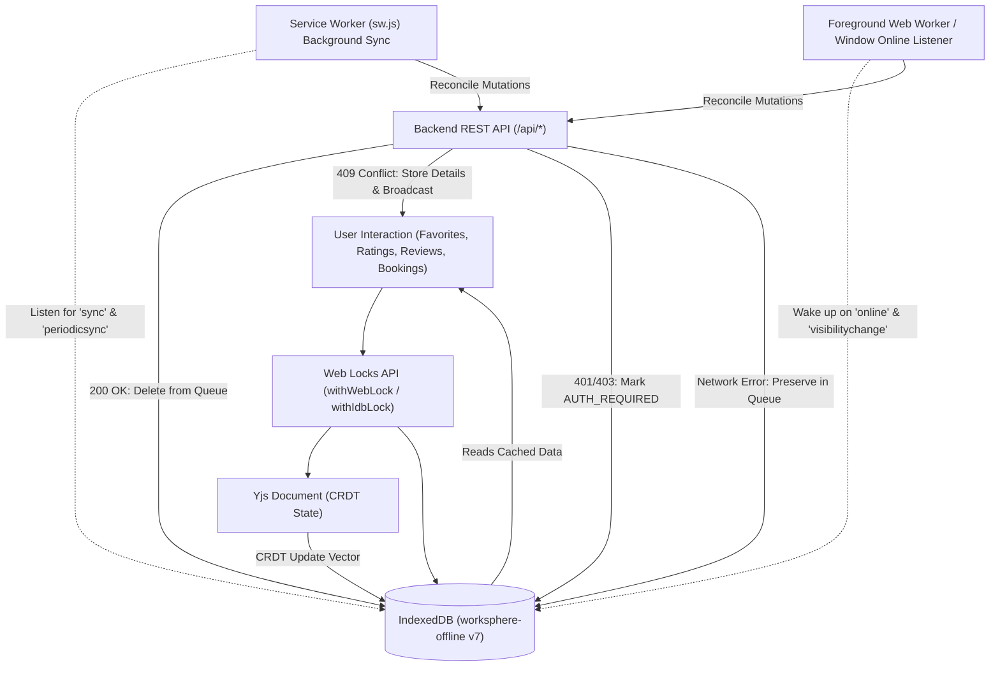
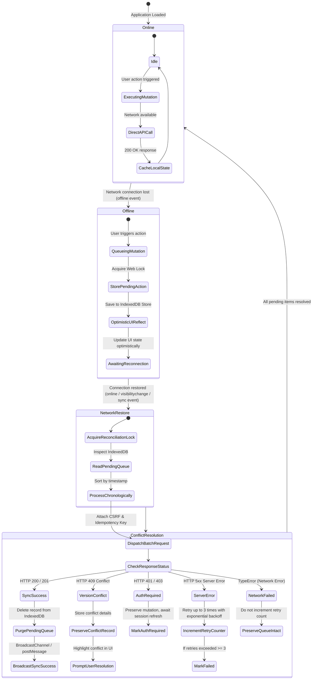

# WorkSphere Offline Synchronization Architecture & State Flow

This document details the offline synchronization architecture in WorkSphere, specifying how client-side state is persisted via IndexedDB, how pending mutations are queued during network disconnection, and how conflict resolution and background reconciliation operate when network connectivity is restored.

---

## 1. High-Level Architecture Overview

WorkSphere employs an **offline-first, optimistic UI mutation** model. Users can seamlessly browse cached venues, manage favorites, record ratings, post offline reviews, and edit conversation history even when entirely disconnected from the network.

All mutations are serialized through the **Web Locks API** (`navigator.locks`) to guarantee transaction isolation across multiple open browser tabs. When online, requests hit backend REST endpoints directly while updating local caches; when offline, mutations are staged into IndexedDB stores (`pendingActions`, `pendingFavorites`, `pendingReviews`) and dispatched asynchronously once connectivity returns.



---

## 2. Synchronization State Flow

The lifecycle of an offline mutation follows five well-defined phases: **Online -> Offline -> Pending Queue -> Network Restore -> Conflict Resolution & Reconciliation**.



---

## 3. IndexedDB Schema Reference (`worksphere-offline`)

WorkSphere stores offline data and synchronization outboxes within a centralized IndexedDB database:
- **Database Name**: `worksphere-offline`
- **Database Version**: `7`

### 3.1. Cached Data Stores

#### `venues`
Caches full venue profiles, amenities, location coordinates, and metadata.
- **Primary Key**: `id` (`string`)
- **Indexes**:
  - `type` (`string`): Workspace category index (`cafe`, `coworking`, `library`)
  - `savedAt` (`number`): Unix epoch timestamp of when the record was cached

#### `favorites`
Stores user-bookmarked workspaces for immediate offline availability.
- **Primary Key**: `id` (`string`)
- **Indexes**:
  - `savedAt` (`number`): Unix epoch timestamp

#### `availabilityDeltas`
Stores workspace seat occupancy and real-time availability deltas synced periodically.
- **Primary Key**: `venueId` (`string`)
- **Indexes**:
  - `timestamp` (`number`): Epoch millisecond timestamp of last availability delta check

#### `searches`
Persists recent search queries and results for offline autocomplete.
- **Primary Key**: `query` (`string`)
- **Indexes**:
  - `timestamp` (`number`): Query execution timestamp

#### `recentlyViewedVenues`
Tracks recently viewed venues with strict LRU ordering.
- **Primary Key**: `id` (`string`)
- **Indexes**:
  - `viewedAt` (`number`): Timestamp of venue page visit

---

### 3.2. Pending Mutation & Outbox Stores

#### `pendingActions`
Generic sequential outbox for queued mutations (CRDT updates, favorites toggle, ratings, conversation edits).
- **Primary Key**: `id` (`number`, `autoIncrement: true`)
- **Structure**:
  ```typescript
  interface PendingAction {
    id: number;
    type: "favorite" | "unfavorite" | "rate" | "crdt-sync" | "conversation-rename" | "conversation-delete";
    venueId?: string;
    conversationId?: string;
    title?: string;
    data?: Record<string, unknown> | Uint8Array;
    timestamp: number;
  }
  ```

#### `pendingFavorites`
Specialized bulk-sync outbox for favorite/unfavorite operations.
- **Primary Key**: `id` (`number`, `autoIncrement: true`)
- **Structure**:
  ```typescript
  interface PendingFavorite {
    id: number;
    venueId: string;
    action: "favorite" | "unfavorite";
    timestamp: number;
  }
  ```

#### `pendingReviews`
Outbox for user reviews and ratings submitted while offline.
- **Primary Key**: `id` (`string` - client-generated UUID / Idempotency Key)
- **Indexes**:
  - `venueId` (`string`): Target venue identifier
  - `status` (`string`): Current synchronization state (`PENDING`, `SYNCING`, `CONFLICT`, `AUTH_REQUIRED`, `FAILED`)
  - `createdAt` (`number`): Timestamp of creation
- **Structure**:
  ```typescript
  interface PendingReviewItem {
    id: string; // Idempotency key
    venueId: string;
    venueName: string;
    reviewId?: string;
    baseVenueUpdatedAt?: string;
    baseReviewUpdatedAt?: string;
    data: {
      rating: number;
      reviewText: string;
      photos?: string[];
    };
    status: "PENDING" | "SYNCING" | "CONFLICT" | "AUTH_REQUIRED" | "FAILED";
    conflictDetails?: Record<string, unknown>;
    retryCount: number;
    createdAt: number;
  }
  ```

#### `receiptExports`
Tracks offline PDF receipt generation and download requests.
- **Primary Key**: `bookingId` (`string`)
- **Indexes**:
  - `status` (`string`): Job state (`pending`, `downloading`, `ready`, `failed`)
  - `createdAt` (`number`): Timestamp of generation request

---

## 4. Conflict Resolution & Re-synchronization Strategy

When offline mutations are submitted to the server upon reconnection, three primary synchronization strategies are applied depending on the domain:

### 4.1. Last-Write-Wins (LWW) via CRDT (Yjs)
- Used for: **Collaborative whiteboard notes, user favorites map, user preference weights**.
- Implemented via Yjs state vectors. Updates are queued as binary chunks (`crdt-sync`) in `pendingActions`.
- Upon reconnection, `yFavorites.observe()` and CRDT update vectors are transmitted to `/api/sync`. Concurrent edits are deterministically merged without data corruption.

### 4.2. Optimistic Concurrency with 409 Conflict Detection
- Used for: **Venue reviews, ratings, reservation notes**.
- Client transmits `baseVenueUpdatedAt` / `baseReviewUpdatedAt` and unique `X-Idempotency-Key`.
- **Server Behavior**: If the target venue or existing review was updated by another client concurrently, the server responds with `HTTP 409 Conflict` containing the server's current state.
- **Client Resolution**:
  - Service worker marks item as `status: "CONFLICT"` in `pendingReviews`.
  - Dispatches `postMessage({ type: "REVIEW_SYNC_CONFLICT" })` to open tabs.
  - The UI presents a non-destructive conflict diff dialog allowing the user to overwrite or discard their offline draft.

### 4.3. Network Failure vs. Server Error Handling
- **Network Error (`TypeError`)**: When `fetch()` throws due to DNS, offline, or TCP drops, items remain untouched in `pendingReviews` / `pendingActions` without incrementing retry counters.
- **Transient Server Error (`5xx`)**: Exponential backoff retry loop (up to 3 attempts with random jitter).
- **Authentication Expiration (`401` / `403`)**: Marked as `AUTH_REQUIRED`. Queued items are preserved until user re-authenticates or session token refreshes.
