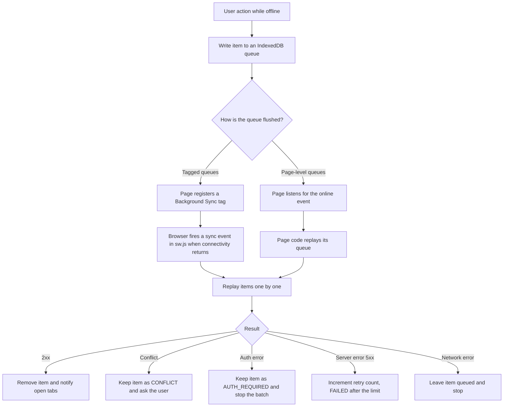

# PWA & Offline Guide

How WorkSphere behaves offline: what the service worker caches and how, which IndexedDB databases hold queued writes, how those writes are replayed when connectivity returns, and how push notifications are subscribed and delivered.

This guide is an end-to-end overview written from the code in `public/sw.js`, `src/hooks/usePWA.tsx`, `src/lib/offline*.ts`, `src/worker/bookingSync/` and the push routes. For deeper dives see:

- [PWA_STRATEGY.md](./PWA_STRATEGY.md) – strategy summary and DevTools testing
- [SERVICE_WORKER_CACHE.md](./SERVICE_WORKER_CACHE.md) – cache versioning and clearing
- [OFFLINE_SYNC.md](./OFFLINE_SYNC.md) – sync state flow and conflict handling
- [OFFLINE_INDEXEDDB_STRATEGY.md](./OFFLINE_INDEXEDDB_STRATEGY.md) – store-by-store reference
- [PUSH_NOTIFICATIONS.md](./PUSH_NOTIFICATIONS.md) – VAPID keys and push setup
- [PWA_SYNC_DEBUG.md](./PWA_SYNC_DEBUG.md), [PWA_PUSH_DEBUG.md](./PWA_PUSH_DEBUG.md), [PWA_TROUBLESHOOTING.md](./PWA_TROUBLESHOOTING.md) – debugging

When a detail here disagrees with an older document, the code is the source of truth (see [Known gaps](#9-known-gaps-and-things-to-verify)).

## Contents

1. [Overview and registration](#1-overview-and-registration)
2. [Cache buckets](#2-cache-buckets)
3. [Fetch strategies](#3-fetch-strategies-cache-first-vs-network-first)
4. [IndexedDB databases](#4-indexeddb-databases)
5. [Offline writes and sync flow](#5-offline-writes-and-sync-flow)
6. [Periodic and background sync](#6-periodic-and-one-shot-background-sync)
7. [Push notifications](#7-push-notifications)
8. [Messages between the page and the service worker](#8-messages-between-the-page-and-the-service-worker)
9. [Known gaps and things to verify](#9-known-gaps-and-things-to-verify)
10. [Testing offline behaviour](#10-testing-offline-behaviour)

---

## 1. Overview and registration

| Piece                                    | File                   |
| ---------------------------------------- | ---------------------- |
| Service worker                           | `public/sw.js`         |
| Registration, update and install prompts | `src/hooks/usePWA.tsx` |
| Web app manifest                         | `public/manifest.json` |
| Offline fallback page                    | `/offline`             |

**Registration happens in production builds only.** `useServiceWorker()` calls `navigator.serviceWorker.register("/sw.js")` when `NODE_ENV === "production"`. In development it does the opposite: it unregisters any existing registrations so stale workers don't interfere with hot reload. To test offline behaviour locally, run `npm run build` followed by `npm start`, not `npm run dev`.

**Install.** The worker precaches `/`, `/offline`, `/icons/icon.svg` and `/manifest.json` into a temporary cache named `worksphere-v3-installing`. It deliberately does **not** call `skipWaiting()` on its own, so a new version waits until the page asks for it.

**Update flow.**

1. On every page load the hook calls `registration.update()`.
2. When a new worker reaches `installed` while an older one controls the page, the hook dispatches a `pwa-update-available` event on `window`.
3. The page posts `{ type: "SKIP_WAITING" }` to the waiting worker, which then calls `skipWaiting()`.
4. On `controllerchange` the hook reloads the page once.

**Activate.** The worker deletes every cache whose name is not one of the five current buckets (below), calls `clients.claim()`, then deletes any leftover `*-installing` cache.

**Web Locks.** Every IndexedDB operation in the worker runs inside `withIdbLock`, which wraps it in a Web Lock named `worksphere-offline-storage-lock` when `navigator.locks` exists. This keeps concurrent sync events from interleaving writes.

---

## 2. Cache buckets

`public/sw.js` defines five CacheStorage buckets. Bumping the version suffix in a name (for example `worksphere-v3` to `worksphere-v4`) is how old caches are discarded: the `activate` handler deletes anything not in this list.

| Bucket                      | Holds                                                                                                                                                                                                                         | Strategy                      | Eviction                                    |
| --------------------------- | ----------------------------------------------------------------------------------------------------------------------------------------------------------------------------------------------------------------------------- | ----------------------------- | ------------------------------------------- |
| `worksphere-v3`             | Responses for `/api/venues*` and `/api/reservations/availability*`, plus any other successful GET handled by the catch-all rule (static assets, pages, other API responses). Also refreshed by the favourites occupancy sync. | Network-First                 | Only by renaming the bucket. No size cap.   |
| `worksphere-images-v4`      | Venue images from `images.unsplash.com`                                                                                                                                                                                       | Cache-First                   | LRU, capped at 20 MB (see below)            |
| `worksphere-maptiles-v1`    | Map tiles from `tile.openstreetmap.org` and `basemaps.cartocdn.com`                                                                                                                                                           | Cache-First                   | No size cap in the fetch handler            |
| `worksphere-video-tours-v1` | Venue video tours, filled on demand by `PREFETCH_VIDEO_TOURS` messages                                                                                                                                                        | Explicit prefetch             | Guarded by storage-quota checks (see below) |
| `worksphere-prefetch-v1`    | Venue enrichment responses and other prefetched data from `PREFETCH_VENUE` messages                                                                                                                                           | Looked up first for every GET | None                                        |

**Image LRU.** Every cached image gets a record in the `imageCacheLRU` IndexedDB store (`url`, `size`, `lastAccessed`). After each write, `enforceImageCacheQuota` sums the recorded sizes and, when the total exceeds `MAX_IMAGE_CACHE_BYTES` (20 MB), deletes the least recently used images from both IndexedDB and the cache. Cache hits "touch" the record so recently used images survive. Opaque cross-origin responses hide `Content-Length`, so they are counted as 400 KB each. If a write throws `QuotaExceededError`, the worker evicts more aggressively (down to 60% of the cap) and retries once. The 20 MB cap exists so the iOS Safari PWA quota (about 50 MB) isn't exhausted.

**Video quota checks.** Before prefetching video tours the worker calls `navigator.storage.estimate()` and skips the batch unless at least 5 MB (or the file size, if larger) is free. A `QuotaExceededError` halts the rest of the batch. If `estimate()` is unavailable or rejects (for example iOS private browsing), the worker assumes there is enough space.

**User profile data.** There is **no dedicated cache bucket for user profile data.** Profile-related API responses are not special-cased; see [Known gaps](#9-known-gaps-and-things-to-verify) for what the catch-all rule means for them.

---

## 3. Fetch strategies: Cache-First vs Network-First

The `fetch` handler (`handleFetch` in `public/sw.js`) applies these rules in order.

| Order | Request                                                        | Strategy                                                                                   | Offline fallback                                                                                                                                                                          |
| ----- | -------------------------------------------------------------- | ------------------------------------------------------------------------------------------ | ----------------------------------------------------------------------------------------------------------------------------------------------------------------------------------------- |
| 0     | Any non-GET request, or a URL containing `/download`           | Not handled by the service worker (goes straight to the network)                           | None                                                                                                                                                                                      |
| 1     | Anything already in `worksphere-prefetch-v1`                   | **Cache-First**                                                                            | n/a                                                                                                                                                                                       |
| 2     | URL contains `/api/venues` or `/api/reservations/availability` | **Network-First**; successful responses are copied into `worksphere-v3`                    | Cached copy, otherwise a synthetic JSON response with status 200: `{ seats: [], offline: true, cached: true }` for availability, `{ venues: [], offline: true, cached: true }` for venues |
| 3     | `tile.openstreetmap.org` or `basemaps.cartocdn.com`            | **Cache-First** in `worksphere-maptiles-v1` (status 200 and opaque 0 responses are cached) | `503 "Map Tile Offline"`                                                                                                                                                                  |
| 4     | `images.unsplash.com`                                          | **Cache-First** in `worksphere-images-v4`, with LRU bookkeeping                            | `503 "Asset Offline"`                                                                                                                                                                     |
| 5     | Everything else                                                | **Network-First**; successful `http(s)` responses are copied into `worksphere-v3`          | Cached copy; for page navigations the `/offline` page; otherwise `503 "Offline"`                                                                                                          |

Notes:

- Matching in rule 2 is a substring test on the full URL, so per-venue endpoints such as `/api/venues/<id>/reviews` also use it.
- Stale data is possible by design: Network-First means a cached copy is served only when the network request fails.
- The `offline: true, cached: true` flags let UI code tell a real empty result from an offline placeholder.

---

## 4. IndexedDB databases

The app uses several separate databases, opened by different modules. Version numbers below are taken from the code.

| Database                          | Version | Opened by                                         | Purpose                                                                |
| --------------------------------- | ------- | ------------------------------------------------- | ---------------------------------------------------------------------- |
| `worksphere-offline`              | 7       | `public/sw.js` and `src/lib/offlineReviewSync.ts` | Main offline store: cached data, review queue, generic pending actions |
| `WorkSphereOfflineDB`             | 3       | `src/lib/offlineStore.ts`                         | Outboxes for favourites, check-ins and favourite tags                  |
| `worksphere-collaborative-notes`  | 1       | `src/lib/offlineNotesSync.ts` (via `idb`)         | Offline collaborative notes                                            |
| `worksphere-offline-amenity-sync` | 1       | `src/lib/offlineSync.ts` (via `idb`)              | Queued amenity votes                                                   |
| `WorkSphereBookingDB`             | 1       | `src/worker/bookingSync/DraftStore.ts`            | Offline booking drafts                                                 |

### `worksphere-offline` (version 7)

| Store                  | Key path              | Indexes                          | Used for                                                                          |
| ---------------------- | --------------------- | -------------------------------- | --------------------------------------------------------------------------------- |
| `venues`               | `id`                  | `type`, `savedAt`                | Saved venue records                                                               |
| `favorites`            | `id`                  | `savedAt`                        | Favourite venues (also updated by the occupancy sync)                             |
| `searches`             | `query`               | `timestamp`                      | Search history                                                                    |
| `pendingActions`       | `id` (auto-increment) | none                             | Generic queued actions: `crdt-sync`, `conversation-rename`, `conversation-delete` |
| `imageCacheLRU`        | `url`                 | `lastAccessed`                   | LRU bookkeeping for the image cache                                               |
| `receiptExports`       | `bookingId`           | `status`, `createdAt`            | Receipt PDF export jobs                                                           |
| `pendingFavorites`     | `id` (auto-increment) | none                             | Queued favourite changes                                                          |
| `availabilityDeltas`   | `venueId`             | `timestamp`                      | Last-known seat availability, used to detect "a seat opened up"                   |
| `recentlyViewedVenues` | `id`                  | `viewedAt`                       | Recently viewed venues                                                            |
| `pendingReviews`       | `id`                  | `venueId`, `status`, `createdAt` | Offline review queue                                                              |

The page-side module `offlineReviewSync.ts` additionally defines `preference_rankings` and `queued_reviews`. The upgrade handler also deletes the legacy `pending-actions` store (renamed to `pendingActions`). See [Known gaps](#9-known-gaps-and-things-to-verify) for why two upgrade handlers matter.

### Other databases

| Database                          | Stores                                                        |
| --------------------------------- | ------------------------------------------------------------- |
| `WorkSphereOfflineDB`             | `favorites-outbox`, `checkins-outbox`, `favorite-tags-outbox` |
| `worksphere-collaborative-notes`  | `pending_notes_queue`, `notes_cache` (key path `folderId`)    |
| `worksphere-offline-amenity-sync` | `pending_amenity_votes`                                       |
| `WorkSphereBookingDB`             | `booking_drafts` (key path `id`)                              |

---

## 5. Offline writes and sync flow

The general pattern: when the user acts while offline (or a request fails), the app writes the action to an IndexedDB queue instead of losing it. When connectivity returns, a flusher replays the queue one item at a time and removes items that succeed.

### Network errors versus server errors

This distinction runs through every queue. `fetch()` rejects with a `TypeError` when the network is unreachable. The service worker's `isNetworkError()` treats that as "the request never reached the server": the item stays queued and **its retry counter is not incremented**, so a flaky connection can't use up the retry budget or cause duplicate writes. HTTP responses (4xx, 5xx) mean the server did receive the request and are handled per queue.

### Service worker queues (Background Sync tags)

The worker registers handlers for these `sync` tags.

| Tag                              | Queue (store)                                                   | What it does                                                                              |
| -------------------------------- | --------------------------------------------------------------- | ----------------------------------------------------------------------------------------- |
| `sync-reviews`                   | `pendingReviews`                                                | Replays offline reviews to `POST /api/venues/<id>/reviews`                                |
| `sync-conversations`             | `pendingActions` (`conversation-rename`, `conversation-delete`) | Replays renames and deletes against `/api/conversations/<id>`                             |
| `receipt-export-sync`            | `receiptExports`                                                | Downloads booking receipt PDFs for offline use                                            |
| `sync-crdt`                      | `pendingActions` (`crdt-sync`)                                  | Posts batched CRDT updates (base64) to `/api/sync`                                        |
| `availability-sync`              | `availabilityDeltas`                                            | One-shot availability refresh (see [section 6](#6-periodic-and-one-shot-background-sync)) |
| `sync-favorites`, `sync-ratings` | Older queues                                                    | Kept as fallbacks for older queued data                                                   |

**Reviews (`sync-reviews`).** Each queued review is sent with its item `id` as an `idempotencyKey`, plus `baseVenueUpdatedAt` and `baseReviewUpdatedAt` for conflict detection, and an `x-csrf-token` header when a token is available. Outcomes:

| Response               | Result                                                                                                               |
| ---------------------- | -------------------------------------------------------------------------------------------------------------------- |
| 2xx                    | Item deleted from `pendingReviews`; open tabs receive `REVIEW_SYNC_SUCCESS`                                          |
| 409                    | Item kept with status `CONFLICT` and the server's conflict details; tabs receive `REVIEW_SYNC_CONFLICT`              |
| 401 / 403              | Item kept with status `AUTH_REQUIRED` (never deleted); the batch stops; tabs receive `REVIEW_SYNC_AUTH_REQUIRED`     |
| 5xx                    | Retry count incremented; status becomes `FAILED` after 3 attempts, otherwise stays `PENDING` for the next sync event |
| Other 4xx (validation) | Item marked `FAILED`; tabs receive `REVIEW_SYNC_FAILED`                                                              |
| Network error          | Item stays `PENDING`; the batch stops                                                                                |

**Conversations (`sync-conversations`).** Actions are replayed in timestamp order. If a delete is queued for a conversation, any earlier rename for the same conversation is dropped. An action is removed once the server responds `ok`; a non-OK response leaves it queued, and a network error keeps it for the next sync event.

**Receipts (`receipt-export-sync`).** Jobs in `pending` or `downloading` state fetch `/api/bookings/<bookingId>/download`. On success the PDF bytes are stored in the job, its status becomes `ready`, a "Receipt ready" notification is shown (tag `receipt-ready-<bookingId>`), and tabs receive `RECEIPT_SYNC_READY`, which the page uses to trigger the download. Other failures increment `retryCount`; after 3 the job is `failed` and tabs receive `RECEIPT_SYNC_FAILED`. Network errors leave the job untouched.

**CRDT (`sync-crdt`).** All `crdt-sync` actions are posted to `/api/sync` as one batch; they are removed only if the response is `ok`.

### Page-level queues

| Queue                 | Store                                                       | Notes                                                                                                                                                                                   |
| --------------------- | ----------------------------------------------------------- | --------------------------------------------------------------------------------------------------------------------------------------------------------------------------------------- |
| Favourites outbox     | `WorkSphereOfflineDB` / `favorites-outbox`                  | `useFavorites` queues here when the request fails. After repeated failed syncs the action is dropped and the page shows the "Couldn't sync your changes" notice (`OFFLINE_SYNC_FAILED`) |
| Check-ins outbox      | `WorkSphereOfflineDB` / `checkins-outbox`                   | `useSeatAvailability` queues a check-in when offline and flushes it when back online                                                                                                    |
| Favourite tags outbox | `WorkSphereOfflineDB` / `favorite-tags-outbox`              | See `src/lib/favoriteTagSync.ts`                                                                                                                                                        |
| Collaborative notes   | `worksphere-collaborative-notes` / `pending_notes_queue`    | See `src/lib/offlineNotesSync.ts`                                                                                                                                                       |
| Amenity votes         | `worksphere-offline-amenity-sync` / `pending_amenity_votes` | See `src/lib/offlineSync.ts`                                                                                                                                                            |

### Generic mutation queue

`src/lib/offlineSyncQueue.ts` exports `OfflineSyncQueueManager` and a shared instance `globalSyncQueue`. It provides deterministic idempotency keys (`generateIdempotencyKey`), exponential backoff with jitter (`calculateBackoff`), a default of 5 retries, permanent-error detection and a dead-letter state. It is exposed to components through `useOfflineSync()` and `enqueueOfflineMutation()`, and `conflictService.ts` reads its conflicted and dead-letter items.

### Offline booking drafts

`src/worker/bookingSync/` (`DraftStore`, `SyncQueue`, `ConflictResolver`) implements an offline booking queue backed by `WorkSphereBookingDB`. When connectivity returns (the `online` event), `SyncQueue.processQueue()` handles drafts one at a time:

1. `GET /api/bookings/<draftId>`.
2. If the server answers **404**, the booking does not exist yet, so it is created with `POST /api/bookings`.
3. Otherwise the draft is merged with the server state by `ConflictResolver`.
4. If the merge needs user input, a `booking_sync_conflict` event is dispatched on `window` and the draft is kept.
5. If not, the merged payload is sent with `PUT /api/bookings/<draftId>` and a `version` one higher than the server's.
6. Drafts that sync successfully are deleted.

**Status:** in the code reviewed for this guide, no application code outside tests imports this queue, so it is not yet connected to the booking UI. See [Known gaps](#9-known-gaps-and-things-to-verify).

---

## 6. Periodic and one-shot background sync

Two jobs keep data fresh while the app is closed or in the background.

| Job                 | Tag                                                                          | Interval           | What it does                                                                                                                                                                        |
| ------------------- | ---------------------------------------------------------------------------- | ------------------ | ----------------------------------------------------------------------------------------------------------------------------------------------------------------------------------- |
| Seat availability   | `workspace-availability` (periodic), `availability-sync` (one-shot fallback) | 30 minutes minimum | Fetches `/api/availability/delta`, compares it with the last values in `availabilityDeltas`, saves the new values and shows a **"Seat Available!"** notification when seats open up |
| Favourite occupancy | `refresh-favorite-venues` (periodic only)                                    | 12 hours minimum   | Refreshes `/api/availability/delta` and `/api/venues/<id>` entries in `worksphere-v3` and updates occupancy fields in IndexedDB                                                     |

**"Seats opened up"** means the occupied count dropped, or the status improved (red to anything else, or yellow to green). The notification uses the tag `venue-availability-<venueId>`, requires interaction, and opens `/venues/<venueId>` when clicked.

**Registration** (`usePeriodicAvailabilitySync`, `usePeriodicFavoriteVenuesSync` in `usePWA.tsx`):

- If `registration.periodicSync` exists **and** the `periodic-background-sync` permission is granted, the page registers the periodic tag with its `minInterval`. The browser decides the real cadence; the interval is a minimum.
- Firefox and Safari have no Periodic Background Sync. For availability the page falls back to registering the one-shot `availability-sync` tag whenever the tab becomes visible while online, and on the `online` event. The favourites job has no fallback.

---

## 7. Push notifications

### Subscribing (client)

`src/hooks/usePushNotifications.ts`:

1. Checks support (`serviceWorker` and `PushManager` in the browser).
2. Requests notification permission. If it is not granted, it stops.
3. Waits for `navigator.serviceWorker.ready` and reuses an existing subscription if one exists.
4. Otherwise fetches the VAPID public key from `GET /api/push/vapid-public-key` and calls `pushManager.subscribe({ userVisibleOnly: true, applicationServerKey })`.
5. Sends `{ endpoint, p256dh, auth }` to `POST /api/push/subscribe` with a bearer token.

**Unsubscribing:** if permission has already been revoked (`denied`), the hook just marks the user as unsubscribed, because calling `subscription.unsubscribe()` would throw. Otherwise it unsubscribes locally and calls `POST /api/push/unsubscribe` with the endpoint.

### Storing the subscription (server)

`src/app/api/push/subscribe/route.ts`:

- Requires a signed-in user (Clerk `auth()`), rate-limited to 10 requests per user.
- Rejects requests missing `endpoint`, `p256dh` or `auth` with `400`.
- If the endpoint is already registered to a **different** user, responds `409`.
- Otherwise upserts a `PushSubscription` row keyed by `endpoint`, storing the user agent and updating `lastUsedAt`.

### Sending

`src/lib/notifications/channels/webPushChannel.ts` (uses the `web-push` library):

- Notifications are **suppressed during the user's quiet hours** (their start, end and timezone preferences) unless the notification is marked critical or forced.
- It loads all of the user's subscriptions and sends to each in parallel with a time-to-live of 24 hours (`TTL: 86400`), `urgency: "high"` for critical notifications, and the content encoding resolved per subscription.
- If a push service answers **404 or 410** (the subscription is gone), that `PushSubscription` row is deleted automatically.

### Receiving (service worker)

- **`push` event:** parses the payload as JSON (falling back to plain text), then shows a notification with defaults: title "WorkSphere", icon and badge `/icons/icon.svg`, tag `worksphere-notification`, `renotify: true`, and "Open" and "Dismiss" actions. Notifications whose tag starts with `venue-availability-` use a longer vibration pattern and `requireInteraction: true`.
- **`notificationclick` event:** closes the notification. The "Dismiss" action does nothing more. Otherwise, if a tab is already open on the target path, the worker posts `NAVIGATE_PUSH` to it and focuses it; if not, it opens a new window at the target URL (`data.url`, default `/`).

---

## 8. Messages between the page and the service worker

**Page to service worker** (`postMessage`):

| Message                                    | Effect                                                                                                                                                        |
| ------------------------------------------ | ------------------------------------------------------------------------------------------------------------------------------------------------------------- |
| `SKIP_WAITING`                             | The waiting worker activates immediately                                                                                                                      |
| `PREFETCH_VENUE` (`{ venueId, position }`) | Fetches `/api/venues/enrich?venueId=<id>` into `worksphere-prefetch-v1` and a 3x3 grid of map tiles at zoom 15 around the venue into `worksphere-maptiles-v1` |
| `PREFETCH_VIDEO_TOURS` / `PREFETCH_VIDEOS` | Prefetches video tour URLs into `worksphere-video-tours-v1`, subject to the quota checks above                                                                |

**Service worker to page:**

| Message                                                                                          | Meaning                                                                        |
| ------------------------------------------------------------------------------------------------ | ------------------------------------------------------------------------------ |
| `REVIEW_SYNC_SUCCESS`, `REVIEW_SYNC_CONFLICT`, `REVIEW_SYNC_AUTH_REQUIRED`, `REVIEW_SYNC_FAILED` | Outcome of an offline review                                                   |
| `RECEIPT_SYNC_READY`, `RECEIPT_SYNC_FAILED`                                                      | Outcome of a receipt export                                                    |
| `OFFLINE_SYNC_FAILED`                                                                            | A queued favourite was dropped after repeated failures                         |
| `NAVIGATE_PUSH`                                                                                  | A notification was clicked while the app was open; the page navigates to `url` |

---

## 9. Known gaps and things to verify

These are observations from reading the code while writing this guide. They are not confirmed bugs; each one is worth a quick check in DevTools or the source.

1. **No user-profile cache bucket.** The issue that prompted this guide expected one, but none exists. Profile data is handled by whichever rule matches its URL.
2. **The catch-all rule caches every successful GET.** Rule 5 in [section 3](#3-fetch-strategies-cache-first-vs-network-first) copies any successful `http(s)` GET into `worksphere-v3`, including authenticated API responses. This guide did not verify whether that cache is cleared on sign-out. Worth reviewing.
3. **Precached assets may not survive activation.** `install` writes the precache list to `worksphere-v3-installing`, and `activate` deletes every `*-installing` cache. No step that copies those entries into `worksphere-v3` was found in `public/sw.js`. If that is right, `/offline` only becomes available after it has been visited online once. Check Application, then Cache Storage after a fresh install.
4. **Two upgrade handlers for one database.** Both `public/sw.js` and `src/lib/offlineReviewSync.ts` open `worksphere-offline` at version 7 with their own `onupgradeneeded` code, and the store lists differ: only the service worker creates `recentlyViewedVenues`, and only the page creates `preference_rankings` and `queued_reviews`. Whichever opens a fresh database first decides which stores exist, since both use the same version number. Keeping the schema in one shared definition would avoid this.
5. **Offline booking queue is not connected.** `src/worker/bookingSync/` is implemented but nothing in the application imports it, so bookings made offline are not queued by it today.
6. **Existing docs lag the code.** `OFFLINE_INDEXEDDB_STRATEGY.md` lists `worksphere-offline` at version 5 and `WorkSphereOfflineDB` at version 2; the code uses 7 and 3.
7. **Review retries have no delay.** The review sync's 5xx branch is commented as exponential backoff, but it only increments a counter; the retry happens on the next sync event.

---

## 10. Testing offline behaviour

1. Build and run a production server: `npm run build` then `npm start`.
2. Open Chrome DevTools, **Application** panel:
   - **Service Workers:** confirm `sw.js` is activated. Tick **Offline** to simulate no connection. The page's own `OfflineIndicator` should appear.
   - **Cache Storage:** inspect the five buckets listed in [section 2](#2-cache-buckets).
   - **IndexedDB:** inspect the databases in [section 4](#4-indexeddb-databases).
3. Trigger a sync without waiting for the browser: in the **Service Workers** section, type a tag such as `sync-reviews`, `sync-conversations` or `receipt-export-sync` into the **Sync** box and press the button. For periodic jobs use the **Periodic Sync** box with `workspace-availability` or `refresh-favorite-venues`.
4. Test push: in the same section use the **Push** box with a JSON payload, for example `{"title":"Test","body":"Hello","url":"/"}`.
5. To start clean: **Application, then Storage, then Clear site data**, then reload.

For deeper sync debugging see [PWA_SYNC_DEBUG.md](./PWA_SYNC_DEBUG.md); for push, [PWA_PUSH_DEBUG.md](./PWA_PUSH_DEBUG.md).
