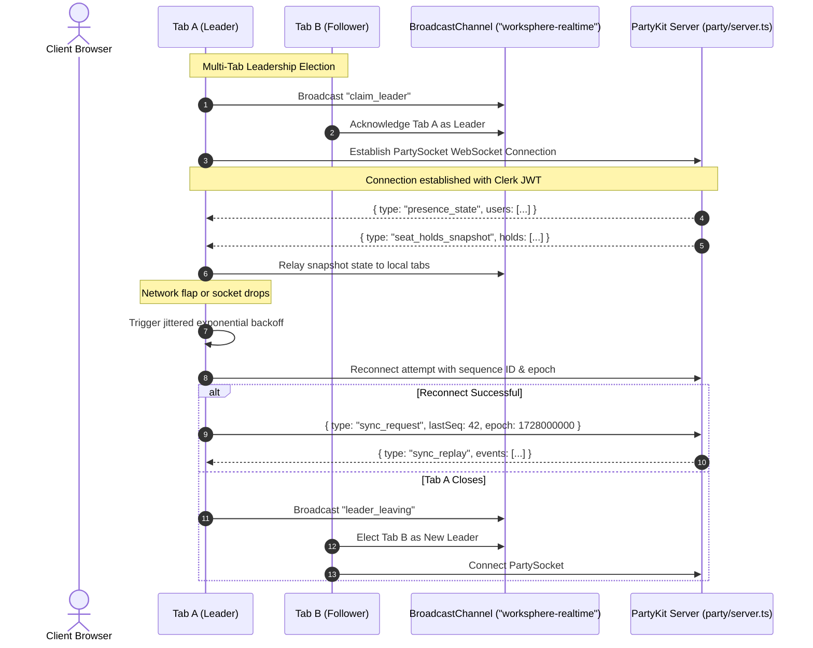

# Real-Time PartyKit Room Lifecycle & WebSocket Message Protocol

This document details the real-time collaboration and presence infrastructure in WorkSphere, covering **PartyKit WebSocket rooms**, multi-tab coordination via **BroadcastChannel**, distributed seat-hold locks, room awareness, and reconnection backoff protocols.

---

## 1. Room Naming Conventions & Scope

PartyKit organizes WebSocket connections into isolated stateful rooms. WorkSphere segments real-time functionality by domain using strict room prefixes:

| Room Prefix / Pattern | Room Scope & Purpose | Authorization / Role Requirements |
| :--- | :--- | :--- |
| `venue-${venueId}` | Live venue seat availability, live occupancy counters, music genre updates, and distributed seat-hold locks. | Public view; Clerk JWT for seat lock mutations. |
| `folder-${folderId}` | Folder-level shared collections, real-time presence indicators, and peer activity feeds. | Folder member validation via `/api/partykit/auth`. |
| `folder-notes-${folderId}` | Yjs collaborative rich-text document editing for shared folder notes. | Strictly authenticated folder members (`OWNER` or `MEMBER`). |
| `canvas-${boardId}` | Real-time infinite whiteboard canvas and multi-user drawing sync. | Authenticated workspace collaborators. |

---

## 2. Real-Time Room Lifecycle & Client Coordination

To eliminate duplicate WebSocket connections when a user opens multiple browser tabs for the same venue or workspace, WorkSphere coordinates tabs via the **BroadcastChannel API** and an elected tab leader.



### 2.1. Reconnection Protocol & Backoff Jitter
When a client experiences network degradation, `usePartySocketReconnect.ts` manages the reconnection loop:
- **Max Retries**: 5 attempts (`PARTY_SOCKET_RECONNECT_OPTIONS.maxRetries = 5`)
- **Backoff Growth**: $t_{\text{wait}} = \min(30000, 1000 \cdot 2^{(\text{retry} - 1)})$
- **Full Jitter**: $\pm 20\%$ jitter factor ($0.8$ to $1.2$) applied to prevent thundering-herd reconnect spikes across multiple concurrent clients.

---

## 3. WebSocket Message Event Protocol Specification

All WebSocket frames transmitted through PartyKit are formatted as structured JSON messages containing a mandatory `type` discriminator.

### 3.1. Distributed Seat Locking Events (#3522)

To prevent double-booking during seat checkout, clients acquire distributed 5-minute TTL locks on candidate seats:

#### 1. `seat_hold_request` (Client -> Server)
Sent by a client attempting to lock a seat during reservation checkout.
```json
{
  "type": "seat_hold_request",
  "seatId": "seat-a1",
  "venueId": "venue-101",
  "userId": "user_2aB...",
  "userName": "Jane Doe",
  "ttlMs": 300000
}
```

#### 2. `seat_hold_acquired` (Server -> Requesting Client)
Acknowledges successful lock acquisition.
```json
{
  "type": "seat_hold_acquired",
  "seatId": "seat-a1",
  "venueId": "venue-101",
  "expiresAt": 1728000300000,
  "ttlMs": 300000,
  "version": 1,
  "sequenceId": 105
}
```

#### 3. `seat_locked` (Server -> Room Broadcast)
Notifies all room participants that a seat is currently held.
```json
{
  "type": "seat_locked",
  "seatId": "seat-a1",
  "venueId": "venue-101",
  "heldBy": "user_2aB...",
  "heldByName": "Jane Doe",
  "expiresAt": 1728000300000,
  "version": 1,
  "sequenceId": 105
}
```

#### 4. `seat_hold_rejected` (Server -> Requesting Client)
Returned when a seat is already locked by another participant.
```json
{
  "type": "seat_hold_rejected",
  "seatId": "seat-a1",
  "venueId": "venue-101",
  "reason": "ALREADY_HELD",
  "heldBy": "user_9xY...",
  "heldByName": "John Smith",
  "expiresAt": 1728000250000,
  "remainingMs": 180000
}
```

#### 5. `seat_release_request` (Client -> Server)
Sent when the user abandons the booking flow or deselects a seat.
```json
{
  "type": "seat_release_request",
  "seatId": "seat-a1",
  "venueId": "venue-101",
  "userId": "user_2aB..."
}
```

#### 6. `seat_unlocked` (Server -> Room Broadcast)
Broadcast when a hold expires or is explicitly released.
```json
{
  "type": "seat_unlocked",
  "seatId": "seat-a1",
  "venueId": "venue-101",
  "reason": "RELEASED",
  "timestamp": 1728000120000,
  "sequenceId": 106
}
```

---

### 3.2. Presence & Awareness Events (#3438)

#### 1. `presence_heartbeat` (Client -> Server)
Dispatched every 5 seconds to maintain active presence and cursor coordinates.
```json
{
  "type": "presence_heartbeat",
  "userId": "user_2aB...",
  "userName": "Jane Doe",
  "avatarUrl": "https://img.clerk.com/...",
  "cursorPosition": 142,
  "isTyping": true
}
```

#### 2. `presence_update` (Server -> Room Broadcast)
Relays updated user awareness to room participants.
```json
{
  "type": "presence_update",
  "userId": "user_2aB...",
  "userName": "Jane Doe",
  "avatarUrl": "https://img.clerk.com/...",
  "cursorPosition": 142,
  "isTyping": true,
  "lastActive": 1728000050000,
  "connId": "conn_xyz789"
}
```

#### 3. `presence_remove` (Server -> Room Broadcast)
Broadcast when a user disconnects or exceeds the 15-second inactivity timeout.
```json
{
  "type": "presence_remove",
  "userId": "user_2aB...",
  "userName": "Jane Doe",
  "connId": "conn_xyz789"
}
```

---

### 3.3. Venue Seat Availability & Environment Updates (#703, #2077)

#### 1. `seat_checkin` (Client -> Server)
Registers active user occupancy at a venue.
```json
{
  "type": "seat_checkin",
  "venueId": "venue-101",
  "capacity": 24
}
```

#### 2. `seat_update` (Server -> Room Broadcast)
Live seat occupancy summary broadcast on check-in or checkout.
```json
{
  "type": "seat_update",
  "venueId": "venue-101",
  "count": 18,
  "capacity": 24,
  "status": "yellow",
  "musicGenre": "Lo-Fi",
  "musicGenreUpdatedAt": 1728000000000,
  "sequenceId": 110,
  "epoch": 1727995000000
}
```

#### 3. `music_genre_update` (Client -> Server)
Submitted by checked-in occupants to report ambient sound style (`Lo-Fi`, `Jazz`, `Pop`, `Classical`, `None`, `Loud`).
```json
{
  "type": "music_genre_update",
  "venueId": "venue-101",
  "genre": "Lo-Fi"
}
```

---

### 3.4. Session Synchronization & Event Replay

When a client reconnects after brief drops, it can replay missed sequential events without refreshing:
- `sync_request`: Client requests missing events from `lastSeq` for current `epoch`.
- `sync_replay`: Server streams missed event payloads in order.
- `sync_fallback`: Dispatched if client sequence is too stale (`history_unavailable`) or server restarted (`epoch_mismatch`).
