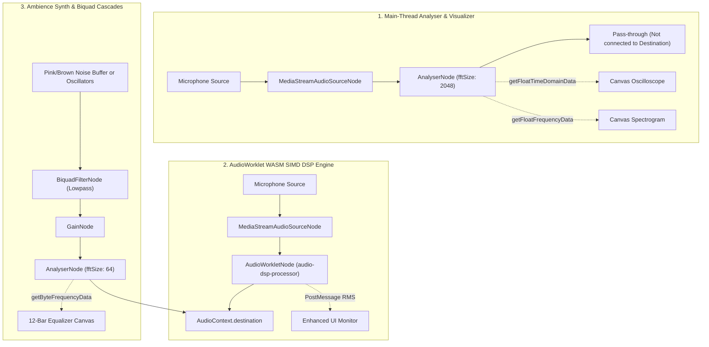
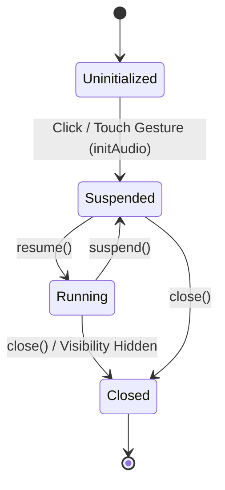
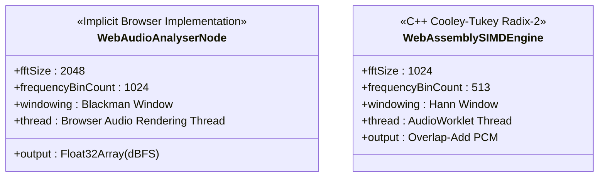
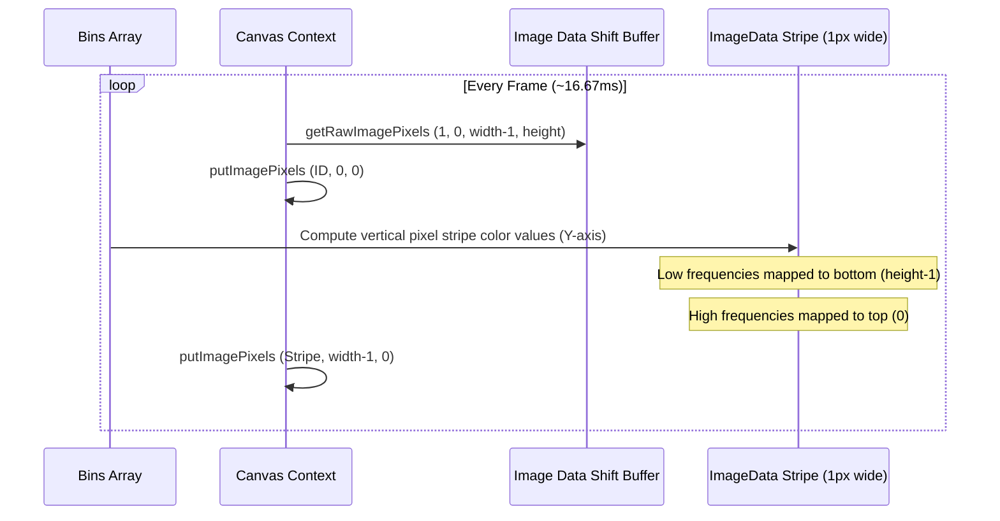

# WebAudio FFT & Spectrogram Reference

This document serves as the technical source of truth for the real-time audio visualization, digital signal processing (DSP), and WebAssembly (WASM) systems implemented within the WorkSphere repository. It is written for frontend developers, DSP engineers, and system architects maintaining the audio infrastructure.

---

## Overview

WorkSphere provides high-performance audio monitoring, digital filtering, and real-time noise analysis capabilities. The architecture is split between:
1. **Web Audio Analyser Subsystem**: Captures microphone input, performs Fast Fourier Transform (FFT) analysis on the main thread, and visualizes waveform and spectrogram data via HTML5 Canvas.
2. **WebAssembly SIMD DSP Subsystem**: Implements a custom low-latency C++ noise-suppression engine inside an `AudioWorkletProcessor` with hardware-accelerated SIMD instructions.
3. **Ambience preview generator**: Synthesizes and filters noise profiles and instruments locally to test workspace acoustics.
4. **WASM-Accelerated 10-Band Biquad IIR Equalizer**: cascading multi-band filtering of audio blocks.

---

## Repository Implementation Summary

The codebase contains the following source files comprising the audio pipeline:

| Source File | Environment | Purpose | Key API & Technology |
| :--- | :--- | :--- | :--- |
| [`NoiseMeter.tsx`](file:///c:/Codes/WorkSphere/src/components/noise/NoiseMeter.tsx) | Browser (Client) | UI component that measures microphone noise for 5 seconds and renders a live oscilloscope waveform. | `AudioContext`, `AnalyserNode`, `getFloatTimeDomainData()`, `CanvasRenderingContext2D`, `Float32Array` |
| [`NoiseSpectrogram.tsx`](file:///c:/Codes/WorkSphere/src/components/noise/NoiseSpectrogram.tsx) | Browser (Client) | UI component displaying a real-time 60fps frequency spectrum bar chart and rolling waterfall spectrogram. | `AnalyserNode`, `getFloatFrequencyData()`, `CanvasRenderingContext2D`, `ImageData` |
| [`EnhancedNoiseMeter.tsx`](file:///c:/Codes/WorkSphere/src/components/noise/EnhancedNoiseMeter.tsx) | Browser (Client) | UI component orchestrating the WebAssembly SIMD real-time noise suppression monitoring. | `audioDSPManager.ts`, `CanvasRenderingContext2D`, `Float32Array` |
| [`AudioEqualizer.tsx`](file:///c:/Codes/WorkSphere/src/components/audio/AudioEqualizer.tsx) | Browser (Client) | Ambience preview component synthesizing Pink Noise, Brown Noise, and Fmaj7/Gmin7/Amin7 chords. | `OscillatorNode`, `AudioBufferSourceNode`, `BiquadFilterNode`, `GainNode`, `AnalyserNode`, `getByteFrequencyData()` |
| [`useAudioEqualizer.ts`](file:///c:/Codes/WorkSphere/src/hooks/useAudioEqualizer.ts) | Browser (Client) | Custom React hook managing the state of the 10-band WASM equalizer. | `EqBand`, `FrequencyResponse`, `initEqualizer`, `processAudioBlock` |
| [`useWebRTCMesh.ts`](file:///c:/Codes/WorkSphere/src/hooks/useWebRTCMesh.ts) | Browser (Client) | Custom React hook managing WebRTC connections and remote peer voice activity level monitoring. | `RTCPeerConnection`, `AnalyserNode`, `getByteFrequencyData()` |
| [`noiseProcessor.ts`](file:///c:/Codes/WorkSphere/src/lib/wasm/noiseProcessor.ts) | JS Bridge | Interface to the `noise-processor.wasm` module for fast root-mean-square (RMS) computations. | `WebAssembly.Memory`, 8-byte aligned `malloc`/`free`, `Float32Array` buffer view offsets |
| [`audioDSPManager.ts`](file:///c:/Codes/WorkSphere/src/lib/wasm/audioDSPManager.ts) | JS Manager | Controls the initialization, audio node routing, and message port commands of the WASM SIMD AudioWorklet. | `AudioContext`, `AudioWorkletNode`, `MediaStreamAudioSourceNode` |
| [`audioDSPWorklet.js`](file:///c:/Codes/WorkSphere/src/lib/wasm/audioDSPWorklet.js) | AudioWorklet Thread | The AudioWorkletProcessor instantiating the WASM DSP engine, executing buffer processing, and reporting live RMS. | `AudioWorkletProcessor`, WebAssembly SIMD support probing, 16-byte memory alignment |
| [`audioEqualizer.ts`](file:///c:/Codes/WorkSphere/src/lib/wasm/audioEqualizer.ts) | JS Bridge | Interface to `audio-equalizer.wasm` for multi-band Biquad IIR filter cascade configuration and response curves. | `peakingCoefficients` computation, log-frequency band response estimation |
| [`audio_dsp.cpp`](file:///c:/Codes/WorkSphere/wasm/audio-dsp/audio_dsp.cpp) | C++ (WASM Target) | Implements a 1024-point FFT with Emscripten SIMD vector operations, Hann windowing, and Wiener spectral gating. | `wasm_simd128.h`, Cooley-Tukey Radix-2 FFT, Overlap-Add (OLA) reconstruction, 16-byte alignments |
| [`noise-processor.wat`](file:///c:/Codes/WorkSphere/wasm/noise-processor.wat) | WAT (WASM Target) | Hand-crafted WebAssembly Text source code that calculates raw RMS metrics using 8-byte aligned heap offsets. | `f32.load`, `f32.sqrt`, 8-byte-aligned `malloc`/`free` implementation |
| [`audio-equalizer.wat`](file:///c:/Codes/WorkSphere/wasm/audio-equalizer.wat) | WAT (WASM Target) | Hand-crafted WebAssembly Text source code that processes cascaded Biquad filtering. | `malloc`, `free`, `processBlock`, Biquad Direct Form II structure |
| [`audio-equalizer-processor.js`](file:///c:/Codes/WorkSphere/public/audio-equalizer-processor.js) | AudioWorklet Thread | AudioWorkletProcessor executing the Biquad cascade WASM on 128-frame blocks. | `AudioWorkletProcessor`, WebAssembly instance, block memory buffer passing |

---

## Audio Architecture

WorkSphere splits audio processes into three structural models:



---

## Audio Graph Pipeline

### 1. Main-Thread Analyser Subsystem
This pipeline is non-audible (it does not connect to `audioContext.destination`) and is solely used to extract diagnostic waveforms and spectrum records.

```text
[ Hardware Microphone ]
           │
           ▼ (getUserMedia)
[ MediaStream (echoCancellation: false, noiseSuppression: false, autoGainControl: false) ]
           │
           ▼ (createMediaStreamSource)
[ MediaStreamAudioSourceNode ]
           │
           ▼ (connect)
[ AnalyserNode (fftSize: 2048, smoothingTimeConstant: 0.25 | 0.7, minDecibels: -100, maxDecibels: -10) ]
```

### 2. AudioWorklet WASM SIMD DSP Pipeline
This pipeline processes microphone inputs in real-time, executing adaptive spectral noise suppression, and routes the denoised stream directly to the local output.

```text
[ Hardware Microphone ]
           │
           ▼ (getUserMedia: 48000Hz, mono channel)
[ MediaStream ]
           │
           ▼ (createMediaStreamSource)
[ MediaStreamAudioSourceNode ]
           │
           ▼ (connect)
[ AudioWorkletNode ("audio-dsp-processor") ]
           │
           ▼ (connect)
[ AudioContext.destination ]
```

### 3. Ambient Synthesizer Subsystem
This pipeline generates pink/brown noise and synthesized musical pad chords, routing them through filters and gain nodes to output speakers.

```text
[ AudioBufferSourceNode ] (Pink/Brown Noise) ─┐
                                               ├──> [ BiquadFilterNode (Lowpass) ] ──> [ GainNode ] ──> [ AnalyserNode (fftSize: 64) ] ──> [ AudioContext.destination ]
[ OscillatorNode ] (Sine chord notes) ────────┘
```

---

## Web Audio Nodes

The specific nodes instantiated across the codebase are analyzed below:

### MediaStreamAudioSourceNode
- **Purpose**: Feeds microphone streams captured via standard web media devices into the audio processing environment.
- **Inputs**: None (interface node wrapped around `MediaStream`).
- **Outputs**: Single audio channel stream.
- **Configuration**: Instantiated via `audioContext.createMediaStreamSource(stream)`.
- **Performance Implications**: Minimum resource usage. Runs in browser native memory.

### AnalyserNode
- **Purpose**: Extracts real-time time-domain waveforms and frequency spectra without modifying the pass-through audio signal.
- **Inputs**: 1 mono or stereo stream.
- **Outputs**: 1 mono or stereo stream (unmodified).
- **Configuration**:
  - `fftSize`: `2048` in `NoiseMeter` / `NoiseSpectrogram`, `256` in `useWebRTCMesh`, `64` in `AudioEqualizer`.
  - `smoothingTimeConstant`: `0.25` (NoiseMeter) or `0.7` (NoiseSpectrogram).
  - `minDecibels` / `maxDecibels`: `-100` / `-10` (NoiseSpectrogram).
- **Performance Implications**: Performing FFT on the main thread carries CPU overhead. Large FFT sizes (e.g., 2048) must be pooled responsibly, and calls to query buffers (`getFloatFrequencyData`, etc.) should be throttled.

### BiquadFilterNode
- **Purpose**: Applies analog-style IIR filtering to noise buffers in the synthesizer.
- **Inputs**: Single audio channel stream.
- **Outputs**: Filtered single audio channel stream.
- **Configuration**: lowpass filter. Frequency set dynamically (e.g., `800 Hz` for Cafe Chatter pink noise, `150 Hz` for HVAC hum brown noise).
- **Performance Implications**: Native C++ filter implementation in the browser audio thread. Negligible CPU load.

### GainNode
- **Purpose**: Adjusts signal amplitude (volume control) and shapes envelopes.
- **Inputs**: Audio stream.
- **Outputs**: Attenuated/amplified audio stream.
- **Configuration**: Gain parameter set dynamically from volume levels or envelopes (e.g. Fmaj7 chords in `AudioEqualizer` use pad envelopes via linear and exponential ramps).
- **Performance Implications**: Extremely lightweight gain multiplication.

### OscillatorNode
- **Purpose**: Synthesizes periodic audio waveforms (sine waves).
- **Inputs**: None.
- **Outputs**: Raw sine wave.
- **Configuration**: Type `sine`. Frequencies mapped dynamically (e.g., chords Fmaj7 `[174.61, 220.00, 261.63, 329.63]` Hz, Gmin7, Amin7).
- **Performance Implications**: Native browser thread oscillator synthesis. Very low overhead.

### AudioBufferSourceNode
- **Purpose**: Plays back pre-allocated audio sample arrays.
- **Inputs**: None (reads from an internal memory buffer).
- **Outputs**: Audio stream.
- **Configuration**: Loops continuously (`loop = true`) with custom pink/brown noise buffers synthesized on initialization.
- **Performance Implications**: Lightweight; buffer memory is allocated once on initialization.

### AudioWorkletNode
- **Purpose**: Runs custom, JavaScript/WebAssembly audio processing scripts inside the audio thread.
- **Inputs**: 1 channel.
- **Outputs**: 1 channel.
- **Configuration**: Loaded with `"audio-dsp-processor"`. Uses a custom WASM binary for processing.
- **Performance Implications**: Extremely high performance with sub-2ms latency. Operates off the main thread, bypassing JS execution bottlenecks.

---

## AudioContext Lifecycle

The initialization and teardown lifecycles of `AudioContext` are strictly managed across components to respect browser restrictions, recover on device state changes, and avoid memory leaks.



### 1. Autoplay and User-Gesture Gating
Browsers restrict programmatic instantiation of `AudioContext` without user interaction.
- In `NoiseMeter.tsx` and `NoiseSpectrogram.tsx`, the `AudioContext` is created inside user-action functions (`measure()` and `start()`) triggered by button clicks.
- In `AudioEqualizer.tsx`, the `initAudio()` helper is gated behind the play button click.

### 2. Device Changes (`devicechange`)
When a hardware device (e.g. plugging/unplugging headphones) causes a state update:
- `NoiseMeter.tsx` registers a listener on `navigator.mediaDevices`:
  ```typescript
  navigator.mediaDevices.addEventListener("devicechange", handleDeviceChange);
  ```
- If the current track is marked as `ended` during a device change, `handleDeviceChange` re-acquires a fresh microphone stream using `getUserMedia`, disconnects the old source node, instantiates a new source node, and connects it to the analyser.

### 3. Visibility Change Handling
To prevent active audio capture and processing while the user is in a background tab:
- Components register a listener on `document.addEventListener("visibilitychange")`.
- If `document.hidden` becomes true, the system terminates the animation frame loop, disconnects audio nodes, calls `audioContext.close()` to close the context, and stops all track devices via `track.stop()`. It also resets WebAssembly buffers by calling `resetNoiseProcessor()`.

### 4. Cleanup and Teardown
To prevent memory leaks and dangling hardware handlers:
- A `cleanupRef` stores the teardown function which:
  - Cancels animation frames (`cancelAnimationFrame`).
  - Disconnects all nodes (e.g. `source.disconnect()`, `analyser.disconnect()`, `workletNode.disconnect()`).
  - Stops all MediaStream tracks:
    ```typescript
    stream.getTracks().forEach((track) => track.stop());
    ```
  - Closes the `AudioContext` instance.

---

## AnalyserNode Configuration

The `AnalyserNode` parameters dictate the spectral density and response profile:

| Parameter | Configuration | Engineering Rationale |
| :--- | :--- | :--- |
| `fftSize` | `2048` | Chosen for the visualizer to provide a detailed 1024-bin spectrum, resolving narrow bands. |
| `smoothingTimeConstant` | `0.25` (waveform), `0.7` (waterfall) | A low value (`0.25`) responds rapidly to transients for live waveforms. A higher value (`0.7`) smooths frequency bins over frames to produce visually readable waterfall tracks. |
| `minDecibels` | `-100` | Extends the noise floor deep enough to visualize whispering and low-intensity background hums. |
| `maxDecibels` | `-10` | Caps the top end of the analyzer slightly below 0 dBFS to prevent clipping calculations from washing out hot colors on the spectrogram. |

---

## FFT Implementation

WorkSphere contains two distinct Fast Fourier Transform implementations:



### 1. Web Audio AnalyserNode FFT
- **FFT Size**: 2048 samples.
- **Frequency Bin Count**: 1024 bins.
- **Windowing**: Implements a Blackman window natively in the browser.
- **Data Access**: Queried via `getFloatFrequencyData` which populates a `Float32Array` with values in dBFS.

### 2. Custom WebAssembly C++ SIMD FFT
- **FFT Size**: 1024 samples (defined as `FFT_SIZE 1024` in `audio_dsp.cpp`).
- **Frequency Bin Count**: 513 bins (`NUM_BINS` is `HALF_FFT + 1`).
- **Hop Size**: 256 samples (`HOP_SIZE 256`, 75% overlap).
- **Windowing**: Explicitly applies a Hann window to input real channels.
- **Algorithm**: In-place Cooley-Tukey Radix-2 FFT with bit-reversal permutation.
- **Acceleration**: Emscripten-compiled 128-bit SIMD (`wasm_simd128.h`) vectorizes butterfly calculations:
  - Probes hardware support by compiling a test binary byte payload (`[0x00, 0x61, 0x73, 0x6d, ...]`).
  - Automatically falls back to scalar calculations if hardware SIMD fails or on ARM32 architectures where 128-bit memory instructions trap.

---

## Frequency Bin Mathematics

The relationship between the discrete FFT bins and physical audio frequencies is governed by the sample rate and the FFT size.

### Core DSP Formulas

$$\text{Frequency Resolution } (\Delta f) = \frac{\text{Sample Rate}}{\text{FFT Size}}$$

$$\text{Nyquist Frequency} = \frac{\text{Sample Rate}}{2}$$

$$\text{Bin Center Frequency } (f_{\text{bin}}) = \text{bin} \times \Delta f$$

### Concrete Bin Frequency Mapping Tables

#### Table 1: Visualizer Subsystem Configuration (FFT Size = 2048)
- Sample Rate: $48000\text{ Hz}$
- $\Delta f = 48000 / 2048 = 23.4375\text{ Hz}$
- Nyquist Frequency: $24000\text{ Hz}$

| Bin Index | Calculation | Center Frequency | Audio Band / Description |
| :--- | :--- | :--- | :--- |
| **0** | $0 \times 23.4375\text{ Hz}$ | $0.0\text{ Hz}$ | DC Offset (Direct Current) |
| **1** | $1 \times 23.4375\text{ Hz}$ | $23.44\text{ Hz}$ | Sub-bass range limit |
| **10** | $10 \times 23.4375\text{ Hz}$ | $234.38\text{ Hz}$ | Low midrange boundary |
| **42** | $42 \times 23.4375\text{ Hz}$ | $984.38\text{ Hz}$ | Midrange frequency ($1\text{ kHz}$) |
| **200** | $200 \times 23.4375\text{ Hz}$ | $4687.50\text{ Hz}$ | Presence band range |
| **1023** | $1023 \times 23.4375\text{ Hz}$ | $23976.56\text{ Hz}$ | Nyquist limit boundary |

#### Table 2: WebAssembly DSP Configuration (FFT Size = 1024)
- Sample Rate: $48000\text{ Hz}$
- $\Delta f = 48000 / 1024 = 46.875\text{ Hz}$
- Nyquist Frequency: $24000\text{ Hz}$

| Bin Index | Calculation | Center Frequency | Audio Band / Description |
| :--- | :--- | :--- | :--- |
| **0** | $0 \times 46.875\text{ Hz}$ | $0.0\text{ Hz}$ | DC Offset |
| **1** | $1 \times 46.875\text{ Hz}$ | $46.88\text{ Hz}$ | Sub-bass |
| **10** | $10 \times 46.875\text{ Hz}$ | $468.75\text{ Hz}$ | Midrange lower boundary |
| **21** | $21 \times 46.875\text{ Hz}$ | $984.38\text{ Hz}$ | Midrange center ($1\text{ kHz}$) |
| **100** | $100 \times 46.875\text{ Hz}$ | $4687.50\text{ Hz}$ | High frequencies / presence |
| **512** | $512 \times 46.875\text{ Hz}$ | $24000.00\text{ Hz}$ | Nyquist limit boundary |

#### Table 3: Equalizer Analysis Subsystem (FFT Size = 64)
- Sample Rate: $44100\text{ Hz}$
- $\Delta f = 44100 / 64 = 689.0625\text{ Hz}$
- Nyquist Frequency: $22050\text{ Hz}$

| Bin Index | Calculation | Center Frequency | Audio Band / Description |
| :--- | :--- | :--- | :--- |
| **0** | $0 \times 689.0625\text{ Hz}$ | $0.0\text{ Hz}$ | DC Offset |
| **1** | $1 \times 689.0625\text{ Hz}$ | $689.06\text{ Hz}$ | Bass-to-mid crossover |
| **2** | $2 \times 689.0625\text{ Hz}$ | $1378.13\text{ Hz}$ | Center Midrange |
| **10** | $10 \times 689.0625\text{ Hz}$ | $6890.63\text{ Hz}$ | High treble |
| **31** | $31 \times 689.0625\text{ Hz}$ | $21360.94\text{ Hz}$ | Upper hearing boundary |

---

## Windowing Strategy

To prevent spectral leakage (artifacts caused by slicing continuous signals into blocks), windowing is applied.

### Hann Window
For the C++ WASM DSP subsystem, the Hann window coefficients are precomputed during setup:

$$w[n] = 0.5 \times \left(1 - \cos\left(\frac{2 \pi n}{N - 1}\right)\right), \quad 0 \le n < N$$

```cpp
for (int i = 0; i < FFT_SIZE; i++) {
    hann_window[i] = 0.5f * (1.0f - cosf(2.0f * M_PI * (float)i / (float)(FFT_SIZE - 1)));
}
```

### Overlap-Add (OLA)
To reconstruct continuous time-domain PCM output without block edge clicks, the WASM DSP engine uses **75% overlap** (1024 FFT size, 256-sample hop size):
1. Raw input buffers are copied into a sliding queue: `input_buffer + buffer_pos`.
2. The Hann window is applied before FFT.
3. Filtering/gating is performed in the frequency domain.
4. Output real numbers are computed via IFFT and multiplied by the Hann window again: `output_buffer[i] += real[i] * hann_window[i]`.
5. The processed hop block is shifted out, and the output buffer is advanced by 256 samples.

---

## Frequency Resolution

There is a fundamental DSP trade-off between **Frequency Resolution** and **Time Resolution (Latency)**:

- **2048 FFT Size**: $\Delta f \approx 23.4\text{ Hz}$. Excellent frequency resolution (high-precision spectrogram visualization), but introduces an inherent block latency of $\approx 42.7\text{ ms}$. This is acceptable for visualization where visual feedback matches auditory perception with a slight buffer delay.
- **1024 FFT Size**: $\Delta f \approx 46.9\text{ Hz}$. Standard balance for real-time DSP, with a block processing time of $\approx 21.3\text{ ms}$.
- **256/64 FFT Size**: $\Delta f \approx 172.3\text{ Hz}$ / $689.1\text{ Hz}$. Poor frequency resolution, but ultra-low block latency ($\approx 5.3\text{ ms}$ / $1.4\text{ ms}$). This is used in WebRTC peer level monitors and the Equalizer preview.

---

## Decibel Mathematics

Real-time audio processing arrays represent raw sound pressure amplitudes. These must be mathematically mapped to logarithmic decibel formats for humans.

### 1. Root Mean Square (RMS) Calculation
The RMS amplitude of a block of $N$ PCM samples is defined as:

$$\text{RMS} = \sqrt{\frac{1}{N} \sum_{i=0}^{N-1} x[i]^2}$$

This calculation is implemented in C++ (WASM DSP) using vectorized SIMD addition:
```cpp
v128_t v = wasm_v128_load(&samples[i]);
vsum = wasm_f32x4_add(vsum, wasm_f32x4_mul(v, v));
```
It is also implemented in WebAssembly Text format for the general noise monitor:
```wat
(f32.sqrt (f32.div (local.get $sum) (f32.convert_i32_u (local.get $length))))
```

### 2. Logarithmic Decibels relative to Full Scale (dBFS)
Since digital audio amplitudes peak at $\pm 1.0$, the logarithmic scale is negative:

$$\text{dB}_{\text{FS}} = 20 \log_{10}(\text{RMS})$$

To avoid mathematical poles (e.g. $\log_{10}(0)$), a lower boundary clamp is enforced:
- If $\text{RMS} \le 0.00001$, the converter returns $20\text{ dB}$.

### 3. Normalized Sound Display Scale
To display decibels on standard UI gauges, negative dBFS bounds ($[-100, 0]$ dBFS) are shifted to standard sound pressure levels ($[20, 120]$ dB):

$$\text{dB}_{\text{display}} = \max\left(20, \min\left(120, \frac{\text{round}((\text{dB}_{\text{FS}} + 100) \times 10)}{10}\right)\right)$$

### 4. Peak and Average Level Calculations (from Frequency Bins)
In the spectrogram subsystem, dB readings are calculated directly from frequency bin magnitudes:
- **Peak Level**: Extracts the maximum value in the bins:
  $$\text{Peak}_{\text{display}} = \max\left(20, \min\left(120, \frac{\text{round}((\text{Peak}_{\text{dBFS}} + 100) \times 10)}{10}\right)\right)$$
- **Average Level**: To avoid erratic readouts from single spikes, the average of the loudest 8 bins is taken:
  $$\text{Average}_{\text{display}} = \max\left(20, \min\left(120, \frac{\text{round}((\text{Avg}_{\text{dBFS}} + 100) \times 10)}{10}\right)\right)$$

---

## Canvas Rendering Pipeline

HTML5 Canvas contexts render the visual representations of active waves and histories.

### 1. Oscilloscope Visualizer (`NoiseMeter.tsx`)
Renders time-domain samples as a continuous wave:
- **Input**: A `Float32Array` containing 2048 sample points.
- **Canvas Dimensions**: $400 \times 80$.
- **X Coordinate**: Linearly increments by step: `sliceWidth = width / samples.length`.
- **Y Coordinate**: Maps value ($[-1.0, 1.0]$) to canvas height:
  $$y = \frac{v \times h}{2} + \frac{h}{2}$$
- **Styling**: Changes stroke color based on current decibels (emerald `< 50`, amber `[50, 70)`, rose `>= 70`).

### 2. Frequency Spectrum Bars (`NoiseSpectrogram.tsx`)
Renders frequency-domain buckets as vertical bars:
- **Input**: Bins array containing 1024 bins.
- **Canvas Dimensions**: $640 \times 120$.
- **Downsampling**: Renders a subset of 96 bins for visual readability: `step = (bins.length - 1) / 96`.
- **Normalization**: Bins are normalized between min/max decibel bounds ($-100$ to $-10$ dBFS):
  $$t = \frac{\text{dbfs} - \text{minDb}}{\text{maxDb} - \text{minDb}}$$
- **Color**: Mapped to an RGB gradient palette.

---

## Spectrogram Waterfall Algorithm

The spectrogram waterfall visualizes a historical rolling heatmap of frequency-domain intensities:



### Waterfall Rendering Step-by-Step
1. **Column Shifting**: The history is shifted left by 1 pixel. This is accomplished by copying the existing image context shifted right by 1 pixel, and writing it back to index 0:
   ```typescript
   const image = ctx.getImageData(1, 0, width - 1, height);
   ctx.putImageData(image, 0, 0);
   ```
2. **Stripe Allocation**: A 1-pixel-wide vertical image buffer is created:
   ```typescript
   const col = ctx.createImageData(1, height);
   ```
3. **Stripe Mapping**: The vertical loop maps pixel coordinates ($y$) to frequency bin indices. Low frequencies are mapped to the bottom of the canvas ($y = \text{height} - 1$), and high frequencies to the top ($y = 0$):
   $$\text{binIndex} = 1 + \left\lfloor \frac{\text{height} - 1 - y}{\text{height}} \times \text{usableBins} \right\rfloor$$
4. **Color Mapping**: The raw value `bins[binIndex]` is normalized to $t \in [0, 1]$ via `normalizeBinDb` and converted to RGB color components using the `spectrogramColor(t)` palette function:
   - **Segment 1** ($t < 0.33$): Cold colors (Deep Blue to Cyan)
     - $R = 10 + 20 \times \frac{t}{0.33}$
     - $G = 20 + 100 \times \frac{t}{0.33}$
     - $B = 80 + 120 \times \frac{t}{0.33}$
   - **Segment 2** ($0.33 \le t < 0.66$): Warm colors (Cyan/Purple to Red)
     - $R = 30 + 220 \times \frac{t - 0.33}{0.33}$
     - $G = 120 + 80 \times \frac{t - 0.33}{0.33}$
     - $B = 200 - 160 \times \frac{t - 0.33}{0.33}$
   - **Segment 3** ($t \ge 0.66$): Hot colors (Orange to White/Yellow)
     - $R = 250$
     - $G = 200 - 160 \times \frac{t - 0.66}{0.34}$
     - $B = 40 - 20 \times \frac{t - 0.66}{0.34}$
5. **Alpha Layer**: Alpha channel bytes are set to 255 (opaque).
6. **Drawing**: The updated vertical stripe is drawn onto the right edge of the canvas:
   ```typescript
   ctx.putImageData(col, width - 1, 0);
   ```

---

## Animation Loop

The rendering loops are implemented in React components using `requestAnimationFrame` (rAF).

### 1. Delta-Time Throttling
To prevent visual distortion, high CPU usage, and audio buffer overruns on high-refresh-rate monitors (120Hz/144Hz ProMotion screens), rAF frame rates are throttled to exactly 60fps (16.67ms interval):
```typescript
const targetFrameInterval = 1000 / 60; // ~16.67ms
const tick = (timestamp) => {
  if (lastTick !== null) {
    const delta = timestamp - lastTick;
    if (delta < targetFrameInterval) {
      raf = requestAnimationFrame(tick);
      return;
    }
    lastTick = timestamp - (delta % targetFrameInterval);
  } else {
    lastTick = timestamp;
  }
  // Execute analysis and render canvas...
  raf = requestAnimationFrame(tick);
};
```

### 2. State Isolation
React state updates are separated from the render loop. State updates (`setLiveDb`) are only triggered during active frame rendering. The canvas context draws using direct reference hooks (`spectrumRef.current`), bypassing React render trees to achieve high rendering performance.

---

## React Integration

Components leverage hooks and refs to bridge the React lifecycle with the imperative Web Audio and Canvas APIs:

- **Refs for Persistent State**: Refs (`canvasRef`, `cleanupRef`, `audioContextRef`, `sourceNodeRef`, `analyserRef`) store native audio instances and callback contexts across renders without triggering React updates.
- **Dynamic Initialization**: Audio graphs are initialized dynamically inside a start/measure action rather than on component mount.
- **Teardown on Unmount**: React cleanup functions are registered inside `useEffect` on mount to call the current `cleanupRef` callback and close any active `AudioContext` instances.
- **Accessibility Integration**: In `AudioEqualizer.tsx`, the system queries the media query for motion configuration:
  ```typescript
  const mediaQuery = window.matchMedia("(prefers-reduced-motion: reduce)");
  ```
  If reduced motion is active, the system skips the high-fps `requestAnimationFrame` loop entirely. Instead, it falls back to a slow polling loop using `setInterval` updating at a 350ms interval.

---

## Memory Management

Because real-time audio applications process thousands of blocks per minute, preventing memory leaks, garbage collection (GC) thrashing, and pointer alignment issues is paramount.

### 1. WASM Memory Alignment (Issue #1039 Fix)
On 32-bit ARM Chrome (such as on older Android devices), creating a `TypedArray` view (e.g. `Float32Array`) on a misaligned WebAssembly heap pointer causes a hardware trap, crashing the browser tab.
- **Universal 8-Byte Alignment**: WebAssembly bump allocators (`malloc` in WAT) round up the requested allocation size to the next multiple of 8:
  $$\text{alignedSize} = (\text{size} + 7) \ \& \ \sim 7$$
- **Byte Offset Construction**: In JavaScript, when instantiating TypedArrays pointing to the WASM memory buffer, passing memory indices is unsafe. The byte-offset constructor must be used:
  ```typescript
  // CORRECT: Passes byte offset directly; the runtime validates alignment.
  const view = new Float32Array(wasm.memory.buffer, cachedBufferPtr, samples.length);
  ```

### 2. WASM 128-bit SIMD Vector Alignment (Issue #1080 Fix)
WASM 128-bit SIMD operations (`wasm_v128_load` / `wasm_v128_store` in the DSP module) require 16-byte alignment. If a pointer is not 16-byte aligned, the instruction traps on 64-bit ARM Android Chrome.
- **Universal 16-Byte Alignment**: The C++ and AudioWorklet allocations enforce 16-byte alignment:
  $$\text{alignedSize} = (\text{size} + 15) \ \& \ \sim 15$$
- **Guard Validation**: In `audioDSPWorklet.js`, the code asserts pointer alignment before execution:
  ```javascript
  if (this.inputBufferPtr % 16 !== 0 || this.outputBufferPtr % 16 !== 0) {
      throw new RangeError("[AudioDSP] WASM malloc returned misaligned pointer");
  }
  ```

### 3. Buffer Allocation Caching
Allocating and freeing memory blocks on every audio frame causes memory fragmentation and triggers heavy GC cycles.
- **Allocation Caching**: `noiseProcessor.ts` uses a persistent cache:
  ```typescript
  let cachedBufferPtr: number | null = null;
  let cachedBufferSize = 0;
  ```
  The pointer is allocated once. A new allocation only occurs if a larger block size is requested.
- **Heap Reset**: During teardown, `resetNoiseProcessor()` frees the pointer and rewinds the allocator bump pointer using `resetHeap()`.

---

## Performance Optimizations

1. **WASM Acceleration**: Intensive calculations (RMS calculations and Biquad filtering) are performed in compiled WebAssembly.
2. **Buffer Caching**: Reuses WASM memory pointers for sequential audio frames, eliminating malloc overhead.
3. **Delta-Time Throttling**: Limits frame updates to 60fps, preventing CPU spikes on high-refresh-rate screens.
4. **Reduced Motion Mode**: Bypasses the 60fps canvas loop on devices with motion restrictions, lowering CPU usage.
5. **No React Rerenders for Canvas**: Canvas drawings are performed directly using DOM references (`canvasRef.current.getContext`) without updating React states.

---

## Known Limitations

- **Synchronous Canvas Scrolling**: The waterfall spectrogram shifts columns using `getImageData` and `putImageData`. Because this executes on the CPU on the main thread, it is a performance bottleneck for large canvases.
- **React State Overheads**: Live dB values are stored in React states (`setLiveDb`), which triggers React components to rerender at 60fps.
- **GC Overhead from Sorting**: To compute averages, `averageDbFromFrequencyBins` creates a new array and sorts it:
  ```typescript
  const sorted = Array.from(bins).filter(v => Number.isFinite(v)).sort((a, b) => b - a);
  ```
  Doing this at 60fps generates 1024-element float arrays that trigger the garbage collector.

---

## Future Improvements

1. **OffscreenCanvas**: Offload canvas rendering to a Web Worker using `transferControlToOffscreen()` to free up the main thread.
2. **WebGL Spectrogram**: Use a WebGL shader to copy columns and color pixels, moving rendering to the GPU.
3. **Pre-allocated Sorting Buffer**: Implement an in-place sorting algorithm or maintain a pre-allocated index buffer to avoid garbage collection overhead during bin averaging.

---

## Appendix: Verified Code Implementations

### WASM RMS Calculator (`noise-processor.wat`)
```wat
(module
  (memory (export "memory") 1)
  (global $heapPtr (mut i32) (i32.const 1024))

  (func (export "malloc") (param $size i32) (result i32)
    (local $ptr i32)
    (local $alignedSize i32)
    (local.set $alignedSize (i32.and (i32.add (local.get $size) (i32.const 7)) (i32.const -8)))
    (local.set $ptr (global.get $heapPtr))
    (global.set $heapPtr (i32.add (global.get $heapPtr) (local.get $alignedSize)))
    (local.get $ptr)
  )

  (func (export "free") (param $ptr i32) (param $size i32)
    (local $alignedSize i32)
    (local.set $alignedSize (i32.and (i32.add (local.get $size) (i32.const 7)) (i32.const -8)))
    (if (i32.eq (i32.add (local.get $ptr) (local.get $alignedSize)) (global.get $heapPtr))
      (then (global.set $heapPtr (local.get $ptr)))
    )
  )

  (func (export "computeRMS") (param $ptr i32) (param $length i32) (result f32)
    (local $sum f32)
    (local $i i32)
    (local $sample f32)
    (local $byteOffset i32)
    (local.set $sum (f32.const 0))
    (local.set $i (i32.const 0))
    (block $end
      (loop $loop
        (br_if $end (i32.ge_u (local.get $i) (local.get $length)))
        (local.set $byteOffset (i32.add (local.get $ptr) (i32.shl (local.get $i) (i32.const 2))))
        (local.set $sample (f32.load (local.get $byteOffset)))
        (local.set $sum (f32.add (local.get $sum) (f32.mul (local.get $sample) (local.get $sample))))
        (local.set $i (i32.add (local.get $i) (i32.const 1)))
        (br $loop)
      )
    )
    (f32.sqrt (f32.div (local.get $sum) (f32.convert_i32_u (local.get $length))))
  )
)
```

### WASM Alignment Helper (`noiseProcessor.ts`)
```typescript
function align8(n: number): number {
  return (n + 7) & ~7;
}

function assertAligned(ptr: number, alignment: number): void {
  if (ptr % alignment !== 0) {
    throw new RangeError(
      `[noiseProcessor] WASM malloc returned a misaligned pointer: ` +
      `0x${ptr.toString(16)} is not ${alignment}-byte aligned.`
    );
  }
}
```

### WASM Vector Alignment and Probing (`audioDSPWorklet.js`)
```javascript
align16(n) {
  return (n + 15) & ~15;
}

static async probeSIMDSupport() {
  try {
    const testBytes = new Uint8Array([
      0x00, 0x61, 0x73, 0x6d, 0x01, 0x00, 0x00, 0x00, 0x01, 0x05, 0x01, 0x60,
      0x00, 0x01, 0x7b, 0x03, 0x02, 0x01, 0x00, 0x07, 0x08, 0x01, 0x04, 0x74,
      0x65, 0x73, 0x74, 0x00, 0x00, 0x0a, 0x16, 0x01, 0x14, 0x00, 0xfd, 0x0c,
      0x00, 0x00, 0x00, 0x00, 0x00, 0x00, 0x00, 0x00, 0x00, 0x00, 0x00, 0x00,
      0x00, 0x00, 0x00, 0x00, 0x0b,
    ]);
    const mod = await WebAssembly.compile(testBytes);
    const inst = await WebAssembly.instantiate(mod);
    inst.exports.test();
    return true;
  } catch {
    return false;
  }
}
```
