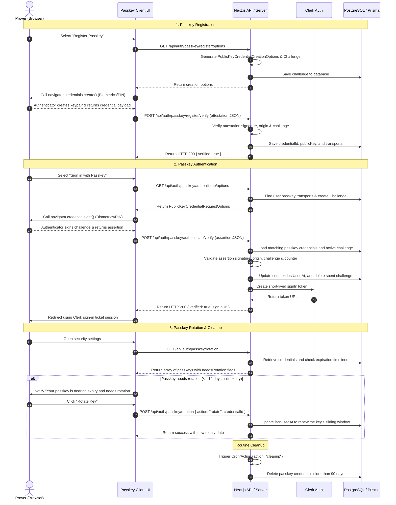
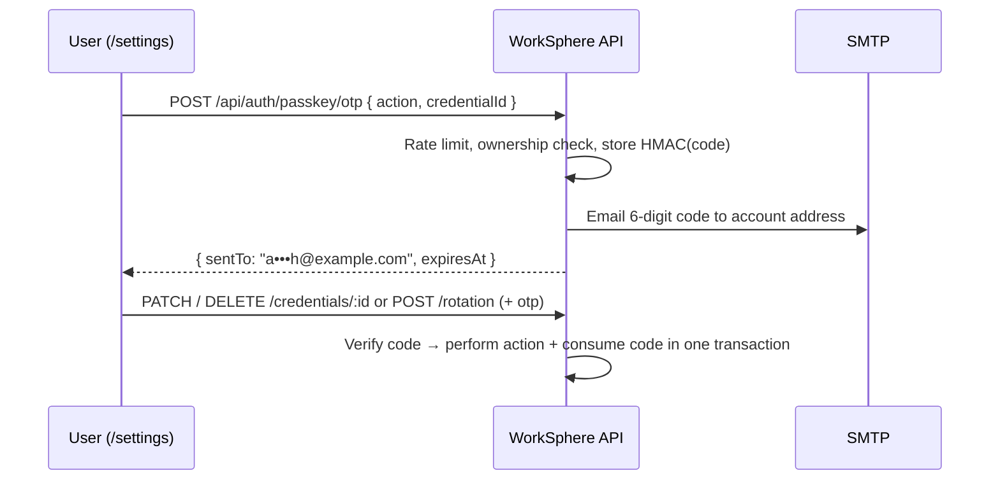

# WebAuthn Passkey Architecture & Rotation Guide

WorkSphere supports passwordless, secure, and biometric authentication using WebAuthn / FIDO2 passkeys. This document describes the protocol flows, backend API endpoints, dynamic key rotation systems, and browser fallback strategies.

---

## 1. Sequence Diagram: Registration, Authentication & Rotation

The following diagram maps the lifecycle of a passkey from registration and authentication to rotation and cleanup:



---

## 2. API Endpoints & Logic Flow

WorkSphere routes all WebAuthn actions through the `/api/auth/passkey` endpoints. Below are the execution patterns for options, verification, and rotation.

### A. Authentication Options Generation

- **Route:** `GET /api/auth/passkey/authenticate/options`
- **Flow:**
  1. Detect the authenticated Clerk user (if signed in) or handle anonymous requests.
  2. If signed in, query `passkeyCredential` table to identify registered passkeys and transports.
  3. Invoke `@simplewebauthn/server`'s `generateAuthenticationOptions`:
     - RP ID is resolved dynamically using the host header (`localhost` or domain name).
     - Transports are parsed from storage to assist the browser in invoking the correct authenticator.
  4. Save the challenge in the `passkeyChallenge` database table with a 2-minute TTL.
  5. Respond with options containing the challenge.

### B. Authentication Verification

- **Route:** `POST /api/auth/passkey/authenticate/verify`
- **Flow:**
  1. Accept the `AuthenticationResponseJSON` assertion payload from the browser client.
  2. Query `passkeyCredential` matching the assertion's `credentialId`.
  3. Load the latest valid challenge from `passkeyChallenge` matching the user.
  4. Execute `verifyAuthenticationResponse` checks:
     - Check signature against stored public key.
     - Match origin against request headers (e.g. localhost, production domain).
     - Ensure the signature counter is greater than the stored counter value (guards against cloned authenticators).
  5. If valid:
     - Save the new counter and update the `lastUsedAt` timestamp.
     - Delete the consumed challenge record.
     - Request a one-time login token from the Clerk SDK using the user's ID.
     - Return `{ verified: true, signInUrl }` to sign the client in.

### C. Passkey Rotation & Expiration

- **Interval:** Keys expire after **90 days**. Credentials are marked as needing rotation starting **14 days** prior to expiration.
- **Route:** `/api/auth/passkey/rotation`
  - **`GET`:**
    - Queries the user's stored passkey credentials.
    - Computes `expiresAt = createdAt + 90 days` and evaluates:
      - `isExpired = now >= expiresAt`
      - `needsRotation = (expiresAt - now) <= 14 days`
    - Returns all credentials with their status payload.
  - **`POST` (action: "rotate"):** body `{ credentialId, otp, registrationResponse, name? }`
    - Authenticates the user and checks ownership of `credentialId` (404 otherwise).
    - Verifies the email OTP issued for `rotate` on that credential (403 otherwise). See §D.
    - Verifies `registrationResponse` for a **new** credential against the latest challenge (400 otherwise). Get options from `GET /api/auth/passkey/register/options?rotate=<credentialId>`, which leaves the old credential out of `excludeCredentials` so the same authenticator can create its successor.
    - In **one transaction**: consumes the OTP, deletes the old credential, inserts the new one (keeping the old name unless `name` is given, with a fresh 90-day expiry), and deletes the spent challenge. A replayed OTP or a credential that has already gone returns 409.
    - Returns `{ success, revokedCredentialId, credential, newExpiresAt }`.
  - **`POST` (action: "cleanup"):**
    - Purges all expired passkey records older than 90 days from the database.

### D. Email OTP Verification for Rotate / Rename / Revoke (#1991)

Sensitive passkey changes in **Settings → Biometric Passkeys** require a one-time code sent to the account's email address. Email verification works even when the user's authenticator is lost, which is when they most need to revoke it.



| Endpoint | Action | OTP `action` |
| --- | --- | --- |
| `POST /api/auth/passkey/otp` | Send a code: `{ action, credentialId }` | — |
| `PATCH /api/auth/passkey/credentials/:id` | Rename: `{ name, otp }` (name ≤ 64 chars) | `rename` |
| `DELETE /api/auth/passkey/credentials/:id` | Revoke: `{ otp }` | `revoke` |
| `POST /api/auth/passkey/rotation` | Rotate: see §C | `rotate` |

**Security properties** (`src/lib/passkey/emailOtp.ts`, table `PasskeyEmailOtp`):

- **Code generation:** 6-digit codes from `crypto.randomInt`. Only an HMAC-SHA256 is stored. The HMAC is keyed with `PASSKEY_OTP_SECRET`, falling back to `CSRF_SECRET` / `CLERK_SECRET_KEY`, and covers `userId:action:credentialId:code`. A code is therefore only valid for the exact action on the exact passkey it was issued for.
- **Lifetime:** codes expire after **10 minutes** and are **single-use**. Consumption is a conditional update inside the same transaction as the change, so replays and double-submits fail.
- **Guess limit:** **5 attempts** per code. The attempt counter is claimed atomically *before* comparing, so concurrent guesses can't exceed the limit. The comparison uses `timingSafeEqual`.
- **Rate limits:** issuing a new code invalidates any outstanding one for the same scope. Sending is limited to one code every **30 s** and **5 per hour** per user.
- **Delivery:** the recipient always comes from the `User` record, never from the request. The passkey name is HTML-escaped in the email.
- **Rotation order:** the OTP is checked *before* the WebAuthn ceremony but consumed only *after* it succeeds. A cancelled browser prompt doesn't cost the user their code.
- **Failed delivery:** if SMTP isn't configured, production returns `503` and voids the code. In development the code is printed to the server console.

---

## 3. Error Handling & Browser Fallbacks

WebAuthn requires specialized browser APIs and hardware support. The application dynamically switches authentication paths based on client conditions.

### A. WebAuthn Support Detection

Before presenting passkey options, the client checks the browser configuration:

```typescript
const isPasskeySupported =
  window.PublicKeyCredential &&
  (await PublicKeyCredential.isUserVerifyingPlatformAuthenticatorAvailable());
```

- **Fallback UI:** If `isPasskeySupported` is false, passkey action buttons are entirely hidden or replaced by a warning message. The UI defaults back to standard password/email OTP forms.

### B. Common Ceremony Error Codes

When calling `navigator.credentials.create()` or `navigator.credentials.get()`, the browser may reject execution with specific exceptions. The frontend intercepts these and adapts:

| Exception               | Cause                                                                                             | Fallback Behavior                                                                                                                               |
| :---------------------- | :------------------------------------------------------------------------------------------------ | :---------------------------------------------------------------------------------------------------------------------------------------------- |
| **`NotAllowedError`**   | User dismissed, timed out, or explicitly cancelled the biometric popup.                           | Display a non-intrusive UI info banner: _"Passkey login cancelled"_. User is allowed to click retry or switch to their password/OTP.            |
| **`NotSupportedError`** | The authenticator doesn't support the requested signature algorithms.                             | Log debug metrics. Present the user with an option to use a physical cross-platform security key (e.g. YubiKey) or standard email verification. |
| **`InvalidStateError`** | The passkey is already registered (during signup) or matches no registered keys (during sign-in). | Notify the user that this key is already registered, or guide them to standard account credentials recovery.                                    |

### C. Permissions Policy & Iframe Restrictions

Because WebAuthn requires a secure origin and cannot be invoked from cross-origin iframes without explicit permission:

- The application enforces standard `public-key-credentials-get` policies.
- Refer to `docs/WEBAUTHN_PASSKEY_SECURITY_SPECIFICATION.md` for detailed frame validation guidelines.
