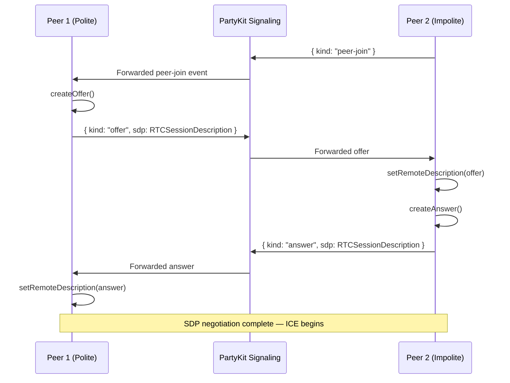
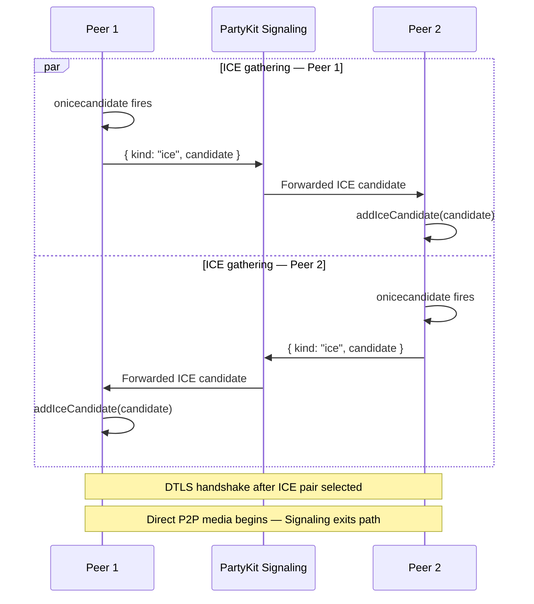
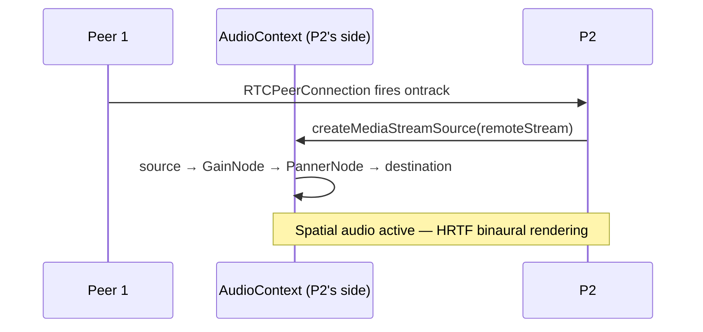
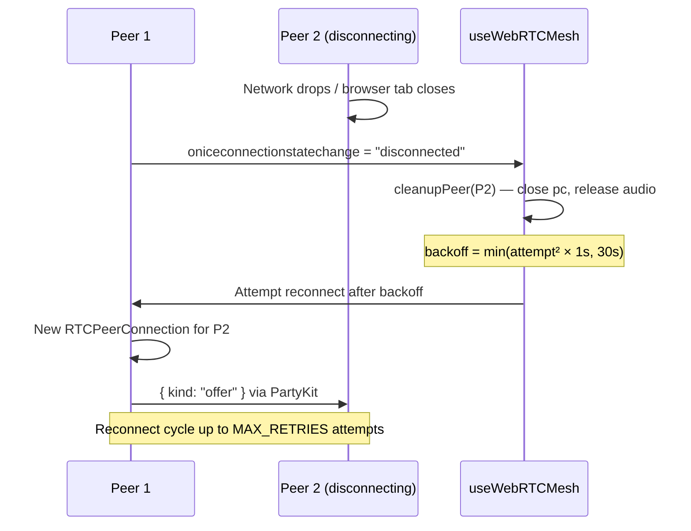

# WebRTC Mesh Connection Lifecycle

> **Source:** `src/hooks/useWebRTCMesh.ts`  
> **Signaling:** `party/server.ts` — PartyKit handles all SDP/ICE relay  
> **See also:** [`WEBRTC_MESH.md`](./WEBRTC_MESH.md) — topology, ICE server config, troubleshooting

---

## 1. Offer/Answer Exchange (SDP Negotiation)

When Peer 2 joins a room already occupied by Peer 1, a Perfect Negotiation handshake begins. WorkSphere uses the **polite/impolite peer** model to resolve simultaneous-offer collisions:

- **Polite peer (established participant):** Yields if both peers generate an offer at the same time — rolls back its own SDP and accepts the remote offer.
- **Impolite peer (new joiner):** Ignores conflicting offers and prioritizes its own state.

---

## 2. ICE Candidate Trickling

ICE candidates are gathered and exchanged in parallel during SDP negotiation. Both peers gather candidates from the STUN server and send them as they are discovered.

---

## 3. Audio Track Attachment

Once the DTLS handshake completes, the remote audio track arrives via the `ontrack` event and is routed through the WebAudio spatial graph.

---

## 4. Peer Disconnect & Reconnect Backoff

`useWebRTCMesh` monitors `oniceconnectionstatechange` on every `RTCPeerConnection`. When a peer's connection state transitions to `"disconnected"` or `"failed"`, a cleanup + exponential backoff reconnect cycle begins.

### Backoff parameters

| Attempt | Delay |
|---------|-------|
| 1 | 1 s |
| 2 | 4 s |
| 3 | 9 s |
| max | 30 s |

---

## 5. Signal Message Types

| Message kind | Direction | Purpose |
|---|---|---|
| `peer-join` | Server → peers | New peer joined the PartyKit room |
| `offer` | Peer → Peer (via server) | SDP offer from polite peer |
| `answer` | Peer → Peer (via server) | SDP answer from impolite peer |
| `ice` | Peer → Peer (via server) | ICE candidate trickle |
| `peer-leave` | Server → peers | Peer disconnected; trigger cleanup |
