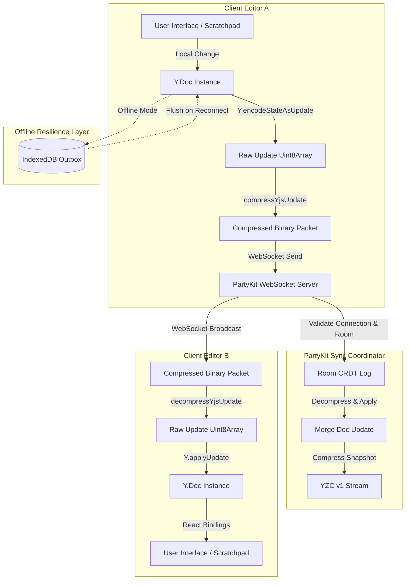

# 🔊 Yjs CRDT Binary Compression & Delta Sync Specification

This document specifies the custom binary compression layer and delta synchronization protocol implemented for collaborative notes scratchpads in WorkSphere. This architecture minimizes latency, bandwidth, and CPU overhead during active concurrent editing sessions.

---

## 1. High-Level Synchronization & Compression Architecture

When users edit collaborative scratchpad notes, changes are captured locally via Yjs, queued for offline resilience, compressed to reduce transport payload sizes, and broadcasted over PartyKit WebSockets.



---

## 2. LZ77-style RLE Binary Compression Protocol

WorkSphere implements a customized, lightweight LZ77 sliding-window compression codec tailored specifically for structured Yjs CRDT binary updates (`src/lib/crdt/yjsCompression.ts`).

### 2.1 Magic Header & Envelope

Every compressed packet is wrapped in a binary envelope starting with a 4-byte signature followed by a 4-byte uncompressed size:

| Byte Offset   | Size (Bytes) | Value                 | Description                 |
| :------------ | :----------- | :-------------------- | :-------------------------- |
| `0x00 - 0x03` | 4            | `0x59 0x5a 0x43 0x01` | Magic Signature (`YZC\x01`) |
| `0x04 - 0x07` | 4            | `Uint32` (Big-Endian) | Uncompressed Size in Bytes  |
| `0x08+`       | Variable     | Byte stream           | Compressed Payload          |

- **Payload Guard Rule**: Payloads smaller than **16 bytes** do not undergo compression. They are transmitted in their original raw form, as the metadata overhead would exceed any compression gains.

### 2.2 Encoding Tokens

The compression engine reads the input array from left to right and maintains a sliding history window of **2048 bytes** (`WINDOW_SIZE = 2048`).

- **Literal Copy**: If no repeating sequence of 3 or more bytes is found within the sliding window, the current byte is written directly to the output stream.
- **Match Tag (`0x80`)**: Represents either a repeating sequence reference (backreference) or an escaped literal:
  1. **Sliding Match**: Encodings match the pattern:
     ```text
     [ 0x80, matchLength (1 byte), offsetHigh (1 byte), offsetLow (1 byte) ]
     ```
     - `matchLength` has a maximum length of `255` bytes.
     - The `matchOffset` is a 16-bit unsigned integer reconstructed as `(offsetHigh << 8) | offsetLow`.
  2. **Escaped Literal**: If a literal `0x80` byte is encountered, it is escaped as `[0x80, 0x00]` in the output stream.

---

## 3. Delta Sync & Conflict-Free Resolution

Yjs updates are structurally commutative, associative, and idempotent. This mathematical guarantee ensures that all participants converge on the exact same state regardless of network routing delays or out-of-order packet delivery.

### 3.1 Two-Way State Vector Handshake

When a client connects to a scratchpad room, a handshake occurs to sync changes:

```
Client                                                  Server
  |                                                       |
  | ------------ 1. State Vector (Client State) --------> |
  |                                                       |
  | <----------- 2. Missing Updates (Delta) ------------- |
  |                                                       |
  | ------------ 3. Missing Client Edits ----------------> |
```

1. **State Vector Handshake**: The client sends its current clock mapping `Y.encodeStateVector(doc)`.
2. **Missing Deltas Calculation**: The server calculates the missing delta updates:
   ```typescript
   const missingDeltas = Y.encodeStateAsUpdate(serverDoc, clientStateVector);
   ```
3. **Synchronization**: The server compresses the missing delta and sends it to the client. The client decompresses and applies it locally using `Y.applyUpdate`.

### 3.2 Offline Durability (Notes Outbox)

If connection is lost, local edits are safely recorded into the `worksphere-crdt-notes` IndexedDB outbox:

- Local updates are saved in the `outbox` object store via `enqueueNotesUpdate()`.
- The fully merged document state is snapshotted to the `documents` store via `saveNotesDocState()`.
- Upon reconnection, `flushNotesOutbox()` applies the pending delta updates back into the live document, ensuring no edits are lost.

---

## 4. Code Examples

### 4.1 Compress and Decompress a Y.Doc Update

```typescript
import * as Y from "yjs";
import {
  compressYjsUpdate,
  decompressYjsUpdate,
} from "@/lib/crdt/yjsCompression";

// 1. Generate a raw Yjs update
const doc = new Y.Doc();
const text = doc.getText("content");
text.insert(0, "Hello, collaborative WorkSphere!");
const rawUpdate = Y.encodeStateAsUpdate(doc);

// 2. Compress payload before WebSocket transmission
const compressedPayload = compressYjsUpdate(rawUpdate);
console.log(
  `Original size: ${rawUpdate.length}B, Compressed: ${compressedPayload.length}B`,
);

// 3. Decompress payload on receiver end
const decompressedPayload = decompressYjsUpdate(compressedPayload);
const receiverDoc = new Y.Doc();
Y.applyUpdate(receiverDoc, decompressedPayload);
```

### 4.2 Decode Magic Header Safely

```typescript
import { COMPRESSION_MAGIC_HEADER } from "@/lib/crdt/yjsCompression";

function isCompressed(payload: Uint8Array): boolean {
  if (payload.length < 8) return false;
  return COMPRESSION_MAGIC_HEADER.every((byte, idx) => payload[idx] === byte);
}
```

---

## 5. Debugging Document Drift & Synchronization Mismatches

State drift occurs when a client fails to receive or apply updates, leading to diverging editor views.

### 5.1 Verification Checklist

1. **Header Check**: Confirm incoming WebSocket frames start with the magic bytes `0x59 0x5a 0x43 0x01` if compressed, or match standard Yjs update sequences.
2. **Payload Size Mismatches**: Log the difference between the 4-byte `Uncompressed Size` prefix and the actual byte count returned by `decompressYjsUpdate`. Mismatches signal packet truncation.
3. **Database Outbox Inspection**: Inspect the `worksphere-crdt-notes` IndexedDB database in the browser console:
   ```javascript
   const dbRequest = indexedDB.open("worksphere-crdt-notes");
   dbRequest.onsuccess = (e) => {
     const db = e.target.result;
     const transaction = db.transaction("outbox", "readonly");
     const store = transaction.objectStore("outbox");
     store.getAll().onsuccess = (ev) =>
       console.log("Pending Outbox:", ev.target.result);
   };
   ```

### 5.2 Resolving Mismatches

If a user's local editor is desynchronized, call `resetNotesCrdtDbCache()` or wipe browser database stores to force a clean server sync and rebuild the state vector from scratch.
