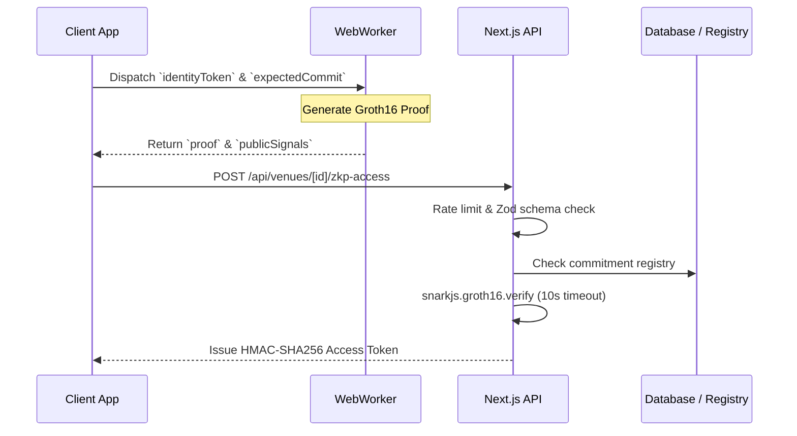

# ZKP Premium Membership Architecture

This document covers the specifications and architecture for the zero-knowledge premium venue access pass. The core requirement is to allow users to prove they hold a valid premium membership without sending their raw identity tokens to our servers, preserving their privacy.

To achieve this, we use the Groth16 proving system via SnarkJS.

## 1. Architecture Flow

The system splits the workload between the client and the server. The client holds the private data and generates the proof, while the server acts only as a verifier.

## 2. Circuit Constraints

The zero-knowledge circuit (`circuits/premium_membership.circom`) defines the mathematical relationship between the user's secret and the public commitment. It is compiled to WASM and a Groth16 proving key (`zkey`) using the `scripts/compile-zkp.sh` script.

**Inputs:**
- `identityToken` (private)
- `expectedCommit` (public)

**Logic:**
The circuit enforces that the commitment matches the polynomial equation:
`commit <== identityToken² + (identityToken * 5) + 17`

Because the `identityToken` is explicitly marked as a private signal in Circom, the final proof payload sent to the server never contains this value. The server only sees the proof string and the resulting `commit`.

## 3. Client-Side WebWorker

Generating a Groth16 proof requires heavy elliptic curve pairings. If we run this on the main browser thread, the UI will freeze. To handle this, the operation is offloaded to a WebWorker (`src/workers/zkpWorker.ts`).

The worker listens for a `prove` message containing the token and commitment. It validates that the inputs are numeric strings, then calls `snarkjs.groth16.fullProve` using the generated WASM and zkey artifacts. 

One specific detail in the worker is the memory management. SnarkJS can leak WASM memory, so the worker ensures `curve_bn128.terminate()` is called in the `finally` block for every run. It also uses an internal generation counter so that if the user cancels the proof, the stale worker response is ignored.

## 4. Server Verification Pipeline

When the client finishes generating the proof, it hits the `POST /api/venues/[venueId]/zkp-access` endpoint. The route in `src/app/api/venues/[venueId]/zkp-access/route.ts` runs the verification logic.

The pipeline performs several checks before granting access:
1. **Rate Limiting:** Enforces a limit of 10 requests per IP to prevent brute-force DoS attacks against the heavy verification function.
2. **Body Validation:** Uses Zod to ensure the incoming payload contains valid `pi_a`, `pi_b`, and `pi_c` string arrays.
3. **Commitment Registry Check:** The server reads `publicSignals[0]` (the `commit`) and checks `isAllowedCommit()` to ensure it belongs to a paid member.
4. **Revocation:** It runs `isCommitmentRevokedDirectly()` to check if the membership was revoked. If a token is compromised, its public commitment is blacklisted here.
5. **Cryptographic Verification:** Finally, it runs `snarkjs.groth16.verify` against `verification_key.json`. This call is wrapped in a `Promise.race` with a 10-second timeout to prevent malicious payloads from hanging the Node.js event loop.

## 5. Token Issuance

If the proof is valid and the commitment isn't revoked, the user needs a way to interact with the venue without submitting a heavy ZK proof on every request.

The `src/lib/zkp/venueAccessToken.ts` file issues a custom short-lived token. The format is a concatenated string: `base64url(payload).timestamp.signature`. The signature is generated using `crypto.createHmac("sha256")` with a secret environment key. The token is hardcoded to expire in one hour and contains only the `venueId` and the public `commitment`, ensuring no identity data is baked into the session.

## 6. Security and Privacy Analysis

- **Zero-Knowledge Privacy:** The user's `identityToken` acts as the private witness and never leaves their device. It is mathematically impossible for the server or an interceptor to reverse-engineer the token from the Groth16 proof or the public commitment.
- **Replay & DoS Protection:** 
  - Verification is CPU intensive. The `zkp-access` route limits to 10 requests per IP.
  - The `snarkjs.groth16.verify` promise will strictly timeout after 10 seconds to prevent event loop blocking.
- **Revocation Safety:** A traditional JWT cannot be easily revoked without tracking session state. In this architecture, if a user is banned, their public commitment is added to the revocation root. Because the server runs `isCommitmentRevokedDirectly()`, all subsequent proofs from that user are instantly rejected.
