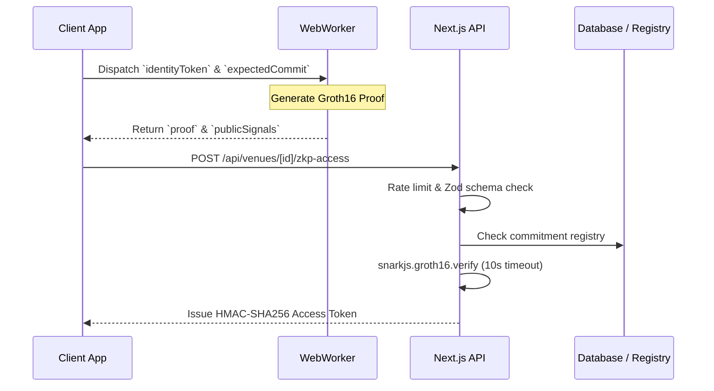

# ZKP Premium Membership Architecture

This document covers the specifications and architecture for the zero-knowledge premium venue access pass. The core requirement is to allow users to prove they hold a valid premium membership without sending their raw identity tokens to our servers, preserving their privacy.

To achieve this, we use the Groth16 proving system via SnarkJS.

## 1. Architecture Flow

The system splits the workload between the client and the server. The client holds the private data and generates the proof, while the server acts only as a verifier.


```mermaid
sequenceDiagram
    participant App as Client App
    participant Worker as WebWorker
    participant API as Next.js API
    participant DB as Database / Registry

    App->>Worker: Dispatch `identityToken` & `expectedCommit`
    Note over Worker: Generate Groth16 Proof
    Worker-->>App: Return `proof` & `publicSignals`
    App->>API: POST /api/venues/[id]/zkp-access
    API->>API: Rate limit & Zod schema check
    API->>DB: Check commitment registry
    API->>API: snarkjs.groth16.verify (10s timeout)
    API-->>App: Issue HMAC-SHA256 Access Token
```

## 2. Circuit Constraints

The zero-knowledge circuit (`circuits/premium_membership.circom`) defines the mathematical relationship between the user's secret and the public commitment. It is compiled to WASM and a Groth16 proving key (`zkey`) using the `scripts/compile-zkp.sh` script.

**Inputs:**
- `identityToken` (private)
- `expectedCommit` (public)

**Logic:**
The circuit enforces that the public commitment is the Poseidon hash of the private token:
`expectedCommit === Poseidon(1)(identityToken)` (circomlib's `Poseidon` template over the BN254 scalar field).

`src/lib/zkp/commitment.ts` computes the same hash in TypeScript (via `src/lib/zkp/poseidon.ts`), so the client, the server allow-list, and the revocation list all agree with the circuit. If you change the circuit, regenerate the artifacts with `scripts/compile-zkp.sh` and update `commitment.ts` in the same change.

The script also writes `public/zkp/artifacts.manifest.json` (a hash of the circuit source the artifacts were built from). `src/__tests__/lib/zkpArtifactFreshness.test.ts` fails CI if the circuit is edited without rebuilding, or if the committed zkey is not a Poseidon circuit. Always commit `public/zkp/*` together with any circuit change.

Because the `identityToken` is explicitly marked as a private signal in Circom, the final proof payload sent to the server never contains this value. The server only sees the proof string and the resulting `commit`.

## 3. Client-Side WebWorker

Generating a Groth16 proof requires heavy elliptic curve pairings. If we run this on the main browser thread, the UI will freeze. To handle this, the operation is offloaded to a WebWorker (`src/workers/zkpWorker.ts`).

The worker listens for a `prove` message containing the token and commitment. It validates that the inputs are numeric strings, then calls `snarkjs.groth16.fullProve` using the generated WASM and zkey artifacts. 

One specific detail in the worker is the memory management. SnarkJS can leak WASM memory, so the worker ensures `curve_bn128.terminate()` is called in the `finally` block for every run. It also uses an internal generation counter so that if the user cancels the proof, the stale worker response is ignored.

## 4. Server Verification Pipeline

When the client finishes generating the proof, it hits the `POST /api/venues/[venueId]/zkp-access` endpoint. The route in `src/app/api/venues/[venueId]/zkp-access/route.ts` runs the verification logic.

The pipeline performs several checks before granting access:
1. **Rate Limiting:** Enforces a limit of 10 requests per IP to prevent brute-force DoS attacks against the heavy verification function.
2. **Body Validation:** Uses Zod to ensure the incoming payload contains valid `pi_a`, `pi_b`, and `pi_c` string arrays.
3. **Commitment Registry Check:** The server reads `publicSignals[0]` (the `commit`) and checks `isAllowedCommit()` to ensure it belongs to a paid member.
4. **Revocation:** It runs `isCommitmentRevokedDirectly()` to check if the membership was revoked. If a token is compromised, its public commitment is blacklisted here.
5. **Cryptographic Verification:** Finally, it runs `snarkjs.groth16.verify` against `verification_key.json`. This call is wrapped in a `Promise.race` with a 10-second timeout to prevent malicious payloads from hanging the Node.js event loop.

## 5. Token Issuance

If the proof is valid and the commitment isn't revoked, the user needs a way to interact with the venue without submitting a heavy ZK proof on every request.

The `src/lib/zkp/venueAccessToken.ts` file issues a custom short-lived token. The format is a concatenated string: `base64url(payload).timestamp.signature`. The signature is generated using `crypto.createHmac("sha256")` with a secret environment key. The token is hardcoded to expire in one hour and contains only the `venueId` and the public `commitment`, ensuring no identity data is baked into the session.

## 6. Security and Privacy Analysis

- **Zero-Knowledge Privacy:** The user's `identityToken` acts as the private witness and never leaves their device. It is mathematically impossible for the server or an interceptor to reverse-engineer the token from the Groth16 proof or the public commitment.
- **Replay & DoS Protection:** 
  - Verification is CPU intensive. The `zkp-access` route limits to 10 requests per IP.
  - The `snarkjs.groth16.verify` promise will strictly timeout after 10 seconds to prevent event loop blocking.
- **Revocation Safety:** A traditional JWT cannot be easily revoked without tracking session state. In this architecture, if a user is banned, their public commitment is added to the revocation root. Because the server runs `isCommitmentRevokedDirectly()`, all subsequent proofs from that user are instantly rejected.

## 7. Client-Side Proof Cache (#3358)

Groth16 proving in the browser takes 1–3 s. The circuit's only public signal
is the Poseidon commitment, so a proof stays valid for the same credential
until the circuit keys change. `src/lib/zkp/proofCache.ts` stores proofs in
IndexedDB, so repeat checks skip proving.

```ts
import { getOrCreateProof, clearProofCache } from "@/lib/zkp/proofCache";

const { proof, publicSignals, source } = await getOrCreateProof({
  scope: "premium-membership",
  commit,                                  // Poseidon commitment (public)
  generate: () => generateMembershipProof({ identityToken, expectedCommit: commit }),
});
// source: "cache" | "stale-cache" | "generated"

await clearProofCache(); // on sign-out / account switch
```

`provePremiumAccess()` (premium venues) and `StudentDiscountVerification`
(student discount) both use it.

### Lifecycle

| Entry state | Default | Behaviour |
| --- | --- | --- |
| Fresh | < 12 h (`freshMs`) | Served straight from IndexedDB |
| Stale | 12–24 h | Served immediately; a replacement is proved in the background |
| Expired | ≥ 24 h (`maxAgeMs`) | Deleted; proved in the foreground |

Concurrent requests for the same credential share a single proving run.

### Keys, epoch and invalidation

- **Key:** `${scope}:${commitment}`. The raw `identityToken` is never stored;
  the commitment is already public (it is the proof's public signal).
- **Epoch:** the first 32 hex characters of SHA-256 over
  `/zkp/verification_key.json`. Rebuilding the circuit or re-running the
  trusted setup changes the verification key, so every cached proof is
  invalidated automatically. If the key can't be fetched, nothing is cached.
- **Credential change:** storing a proof for a new commitment deletes the
  previous one in the same scope (one active identity per scope).
- **Server rejection:** a 400/403 from the verifier deletes the cached proof.
  If the rejected proof came from the cache, the client re-proves once, which
  covers key rotations the epoch didn't catch.
- **Integrity:** an entry is only served if `publicSignals[0]` equals the
  requested commitment and its epoch and expiry check out.

### Security notes

- The verifier binds proofs only to the commitment (no nonce), so a proof
  was already reusable server-side. Caching does not widen that. It does put
  a reusable proof at rest in IndexedDB, which is why entries have a hard
  24-hour expiry and `clearProofCache()` should run on sign-out.
- The proof reveals nothing beyond the public commitment.

Measured: a repeat check served from the cache takes a few milliseconds of
IndexedDB time (median well under the 50 ms target in
`src/__tests__/lib/zkpProofCache.test.ts`), versus 1–3 s to prove.
