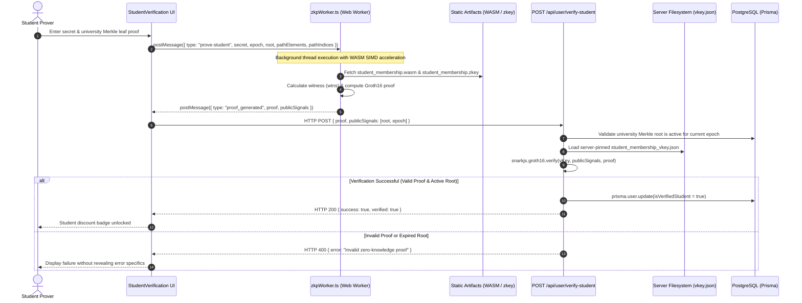

# Groth16 Zero-Knowledge Proof (ZKP) Generation & Verification Pipeline

This document provides a comprehensive technical reference for the zero-knowledge proof architecture used in WorkSphere for anonymous student verifications and premium workspace access passes. It details the Circom circuit structure, signal visibility models, browser Web Worker execution with WebAssembly (WASM) SIMD acceleration, and server-side cryptographic key verification.

---

## 1. High-Level Architecture Overview

WorkSphere employs **zk-SNARKs (Zero-Knowledge Succinct Non-Interactive Arguments of Knowledge)** utilizing the **Groth16 proving system** over the **BN128 (alt_bn128)** elliptic pairing-friendly curve.

This allows students to prove membership in university discount registries without revealing:
- Their real legal name
- Numeric student ID or matriculation roll number
- University email address or issuing department



---

## 2. Circom Circuit Structure & Signals

WorkSphere utilizes two primary zero-knowledge circuits compiled using Circom 2.0:
1. **`StudentMembership` (`circuits/student_membership.circom`)**: Multi-campus Merkle tree inclusion proof with epoch validity.
2. **`PremiumMembership` (`circuits/premium_membership.circom`)**: Direct Poseidon hash identity commitment proof.

### 2.1. Signal Visibility Model

Under Groth16, signals in Circom are partitioned into **Private (Witness)** and **Public (Statement)** inputs.

| Circuit | Signal Name | Type | Visibility | Description |
| :--- | :--- | :--- | :--- | :--- |
| `StudentMembership` | `secret` | `signal input` | **Private** | The student's private entropy / secret identifier |
| `StudentMembership` | `pathElements[16]` | `signal input` | **Private** | Sibling hashes along the Merkle membership branch |
| `StudentMembership` | `pathIndices[16]` | `signal input` | **Private** | Binary left/right path routing bits along the tree |
| `StudentMembership` | `root` | `signal input` | **Public** | Current active university Merkle accumulator root |
| `StudentMembership` | `epoch` | `signal input` | **Public** | Verification validity epoch (e.g., current academic year `2026`) |
| `PremiumMembership` | `identityToken` | `signal input` | **Private** | Numeric membership token known strictly to user |
| `PremiumMembership` | `expectedCommit` | `signal input` | **Public** | $\text{Poseidon}(\text{identityToken})$ published commitment |

### 2.2. Circom Circuit Implementation Reference

```circom
pragma circom 2.0.0;

include "circomlib/circuits/poseidon.circom";
include "circomlib/circuits/mux1.circom";

/**
 * StudentMembership Circuit
 * Proves that the prover knows a private secret leaf included in an active
 * university Merkle root without revealing the leaf or tree index.
 */
template StudentMembership(levels) {
    // Private witness signals
    signal input secret;
    signal input pathElements[levels];
    signal input pathIndices[levels];

    // Public statement signals
    signal input root;
    signal input epoch;

    // 1. Compute leaf commitment = Poseidon(secret, epoch)
    component leafHasher = Poseidon(2);
    leafHasher.inputs[0] <== secret;
    leafHasher.inputs[1] <== epoch;

    signal currentHash[levels + 1];
    currentHash[0] <== leafHasher.out;

    // 2. Ascend Merkle path verifying tree inclusion
    component hashers[levels];
    component muxL[levels];
    component muxR[levels];

    for (var i = 0; i < levels; i++) {
        // Enforce binary path selector: pathIndices[i] * (pathIndices[i] - 1) == 0
        pathIndices[i] * (pathIndices[i] - 1) === 0;

        muxL[i] = Mux1();
        muxL[i].c[0] <== currentHash[i];
        muxL[i].c[1] <== pathElements[i];
        muxL[i].s <== pathIndices[i];

        muxR[i] = Mux1();
        muxR[i].c[0] <== pathElements[i];
        muxR[i].c[1] <== currentHash[i];
        muxR[i].s <== pathIndices[i];

        hashers[i] = Poseidon(2);
        hashers[i].inputs[0] <== muxL[i].out;
        hashers[i].inputs[1] <== muxR[i].out;

        currentHash[i + 1] <== hashers[i].out;
    }

    // 3. Enforce calculated root matches the public Merkle root
    root === currentHash[levels];
}

component main {public [root, epoch]} = StudentMembership(16);
```

---

## 3. Client-Side Proving via Web Workers (`zkpWorker.ts`)

Generating zero-knowledge proofs requires heavy multi-scalar multiplications (MSM) and number theoretic transforms (NTT). Executing this on the main JavaScript thread causes noticeable UI stuttering.

WorkSphere offloads proving entirely to a dedicated Web Worker: `src/workers/zkpWorker.ts`.

### 3.1. Web Worker Lifecycle & Memory Management
1. **Isolated Context**: Instantiated on demand via `new Worker(new URL("../../workers/zkpWorker.ts", import.meta.url))`.
2. **SIMD Acceleration**: Dynamically detects 128-bit WebAssembly Fixed-width SIMD vectors (`wasmSimd.ts`) to accelerate matrix operations.
3. **Explicit Memory De-allocation**:
   - Drops `wtns` (in-memory witness reference) immediately upon proof output.
   - Invokes `globalThis.curve_bn128?.terminate()` to free BN128 point multiplication tables and avoid browser out-of-memory (OOM) tab crashes.
4. **Cancellation Generation Guard**: Uses an incrementing generation counter (`generation++`) to drop stale proving jobs if the user navigates away.

```typescript
// zkpWorker.ts proof generation snippet
const { proof, publicSignals } = await snarkjs.groth16.fullProve(
  {
    secret: String(secret),
    epoch: String(epoch),
    root: String(root),
    pathElements: pathElements.map(String),
    pathIndices: pathIndices.map(String),
  },
  "/zkp/student_membership.wasm",
  "/zkp/student_membership.zkey",
);
```

---

## 4. Server-Side Verification Pipeline & Cryptographic Key Management

The verification endpoint (`POST /api/user/verify-student`) verifies proofs in constant time $O(1)$ and is completely stateless with respect to the user's private credentials.

### 4.1. Step-by-Step Server Verification Flow
1. **Authentication Check**: Authenticates caller session via Clerk JWT.
2. **Merkle Root Validation**:
   - Extracts `root` and `epoch` from `publicSignals`.
   - Queries `prisma.universityMerkleRoot` via `isUniversityMerkleRootActive(root, epoch)` to verify the credential was issued by an accredited institution within the active calendar window.
3. **Verification Key Pinning**:
   - The verification key (`student_membership_vkey.json`) is pinned to the server filesystem at `public/zkp/student_membership_vkey.json`.
   - The server **never** accepts verification keys supplied in the HTTP request payload.
4. **Groth16 Verification**:
   - Invokes `snarkjs.groth16.verify(vKey, publicSignals, proof)`.
   - Evaluates elliptic curve pairing equality:
     $$e(A, B) = e(\alpha, \beta) \cdot e\left(\sum_{i=0}^l x_i \frac{\beta u_i(x) + \alpha v_i(x) + w_i(x)}{\gamma}, \gamma\right) \cdot e(C, \delta)$$
5. **State Transition**:
   - Upon successful pairing check, updates the database: `prisma.user.update({ where: { id: userId }, data: { isVerifiedStudent: true } })`.

---

## 5. Security & Threat Model

### 5.1. Sybil Attacks & Replay Resistance
- Public signals require an active `epoch` parameter. Old proofs cannot be reused across academic years once the Merkle root expires.
- Each student leaf is combined with the epoch: $\text{leaf} = \text{Poseidon}(\text{secret}, \text{epoch})$.

### 5.2. Hiding vs. Binding Guarantees
- The commitment uses Poseidon hash over the BN128 scalar field $r \approx 2^{254}$, ensuring pre-image resistance and collision resistance.
- No polynomial root decomposition or factorization attacks can extract the private student ID.

### 5.3. Out-of-Memory (OOM) Protection
- Low-end mobile devices (< 2GB RAM) may struggle to allocate WASM memory for Groth16 zkey expansion.
- `zkpWorker.ts` classifies OOM exceptions and enables a fallback server-assisted flow (`serverSideFallback`) with user consent.
