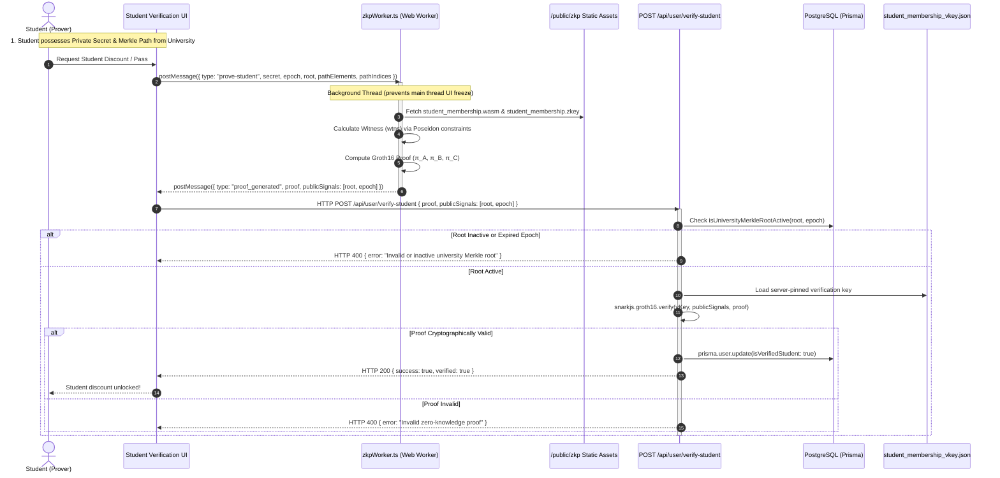

# Zero-Knowledge Student Verification Architecture (ZKP Student Membership)

This document provides a comprehensive technical breakdown of the zero-knowledge student verification system in WorkSphere. It details the mathematical foundations, Circom circuit design, Groth16 proving system, client-side Web Worker proof generation via SnarkJS, and server-side verification pipeline.

---

## 1. Executive Summary & Privacy Model

Traditional student verification mechanisms require students to upload government-issued IDs, matriculation transcripts, or university email tokens (`.edu` SSO/OAuth) to central servers or third-party identity brokers. This exposes sensitive Personally Identifiable Information (PII), creates honey-pots for identity theft, and leaves permanent audit trails linking real identities to physical workspace check-ins.

WorkSphere solves this with **Zero-Knowledge Succinct Non-Interactive Arguments of Knowledge (zk-SNARKs)**:

- **Zero Credential Leakage:** The student proves possession of a valid university membership record without revealing their name, student number, email, date of birth, or campus affiliation.
- **Client-Side Proof Generation:** Cryptographic proofs are computed entirely within the user's browser using WebAssembly (WASM) and SnarkJS, ensuring raw private keys and identity secrets never cross the network.
- **Cryptographic Ephemerality & Revocation:** Memberships are bound to academic year epochs (e.g., `2026`) and verified against active university Merkle tree roots stored in the database.
- **Double-Claim Prevention:** Anonymized Poseidon nullifier hashes ($\text{Poseidon}(\text{secret}, \text{nullifierKey}, \text{epoch})$) prevent duplicate pass claims while preserving unlinkability.

---

## 2. Architecture & Data Flow



---

## 3. Cryptographic Primitives

### 3.1. Elliptic Curve & Proving System: Groth16 over BN254

WorkSphere utilizes **Groth16**, a pairing-based zk-SNARK proving system that produces the smallest proof size (3 group elements) and fastest verification time in practical zero-knowledge applications.

The circuit operates over the **BN254 (alt_bn128)** elliptic curve:
- **Base Field Size ($q$):**
  $$q = 21888242871839275222246405745257275088696311157297823662689037894645226208583$$
- **Scalar Field Order ($r$):**
  $$r = 21888242871839275222246405745257275088548364400416034343698204186575808495617$$

A Groth16 proof $\pi$ consists of:
1. $\pi_A \in \mathbb{G}_1$ (2 coordinate field elements)
2. $\pi_B \in \mathbb{G}_2$ (4 coordinate field elements over $\mathbb{F}_{q^2}$)
3. $\pi_C \in \mathbb{G}_1$ (2 coordinate field elements)

Verification evaluates the pairing equation on public statement vector $\vec{x} = [\text{root}, \text{epoch}]$:
$$e(\pi_A, \pi_B) = e(\alpha, \beta) + e\left(\sum_{i=0}^{l} x_i \cdot \frac{\beta A_i(t) + \alpha B_i(t) + C_i(t)}{\gamma}, \gamma\right) + e(\pi_C, \delta)$$

### 3.2. SNARK-Friendly Hashing: Poseidon Hash

Traditional cryptographic hash functions like SHA-256 or Keccak-256 require thousands of bit-decomposition and boolean operations in arithmetic circuits ($~25,000$ constraints per block).

WorkSphere uses the **Poseidon hash function**, designed for algebraic efficiency over $\mathbb{F}_r$:
- **S-Box:** $x^5 \pmod r$
- **Hades Design Strategy:** Full rounds ($R_F = 8$) and partial rounds ($R_P = 57$) for maximum non-linear diffusion with minimal constraints ($~240$ constraints per 2-to-1 compression).
- **Leaf Commitment:**
  $$\text{Leaf} = \text{Poseidon}(\text{secret}, \text{epoch})$$
- **Branch Node Compression:**
  $$\text{Parent} = \text{Poseidon}(\text{LeftChild}, \text{RightChild})$$

---

## 4. Circom Circuit Design (`student_membership.circom`)

The complete circuit is implemented in `circuits/student_membership.circom`:

```mermaid
graph TD
    subgraph Private Witness Inputs
        Secret[signal input secret]
        PathElem["signal input pathElements[16]"]
        PathIdx["signal input pathIndices[16]"]
    end

    subgraph Public Statement Inputs
        Epoch[signal input epoch]
        Root[signal input root]
    end

    subgraph Circuit Constraints
        LeafHasher["Poseidon(2)<br/>Leaf = Poseidon(secret, epoch)"]
        Secret --> LeafHasher
        Epoch --> LeafHasher

        Mux0["DualMux[0]"]
        LeafHasher --> Mux0
        PathElem -->|pathElements[0]| Mux0
        PathIdx -->|pathIndices[0]| Mux0

        Hasher0["Poseidon(2)<br/>Level 0 Hash"]
        Mux0 --> Hasher0

        MuxN["DualMux[1..15]"]
        HasherN["Poseidon(2)<br/>Levels 1..15"]
        Hasher0 --> MuxN
        MuxN --> HasherN

        RootConstraint["root === currentHash[16]"]
        HasherN --> RootConstraint
        Root --> RootConstraint
    end
```

### 4.1. DualMux Multiplexer Component

To route node order along the Merkle path without branching or conditional jumps, the circuit employs a `DualMux` template:

```circom
template DualMux() {
    signal input in[2];
    signal input s;
    signal output out[2];

    // Constrain s to be binary: s * (1 - s) === 0
    s * (1 - s) === 0;

    // When s = 0: out[0] = in[0], out[1] = in[1] (current node is left child)
    // When s = 1: out[0] = in[1], out[1] = in[0] (current node is right child)
    out[0] <== (in[1] - in[0]) * s + in[0];
    out[1] <== (in[0] - in[1]) * s + in[1];
}
```

### 4.2. StudentMembership Circuit Definition

```circom
pragma circom 2.0.0;

include "circomlib/circuits/poseidon.circom";

template StudentMembership(levels) {
    // ── Public Inputs ──
    signal input root;   // Active University Merkle Root
    signal input epoch;  // Academic Year epoch (e.g., 2026)

    // ── Private Inputs ──
    signal input secret;                 // Student Identity Secret
    signal input pathElements[levels];   // Sibling hashes along Merkle path
    signal input pathIndices[levels];    // 0 = left child, 1 = right child

    // 1. Calculate leaf commitment: Poseidon(secret, epoch)
    component leafHasher = Poseidon(2);
    leafHasher.inputs[0] <== secret;
    leafHasher.inputs[1] <== epoch;

    signal currentHash[levels + 1];
    currentHash[0] <== leafHasher.out;

    // 2. Climb the depth-16 Merkle tree
    component mux[levels];
    component hashers[levels];

    for (var i = 0; i < levels; i++) {
        mux[i] = DualMux();
        mux[i].in[0] <== currentHash[i];
        mux[i].in[1] <== pathElements[i];
        mux[i].s <== pathIndices[i];

        hashers[i] = Poseidon(2);
        hashers[i].inputs[0] <== mux[i].out[0];
        hashers[i].inputs[1] <== mux[i].out[1];

        currentHash[i + 1] <== hashers[i].out;
    }

    // 3. Enforce calculated root matches the public Merkle root
    root === currentHash[levels];
}

component main {public [root, epoch]} = StudentMembership(16);
```

---

## 5. Signal Visibility & Security Model

| Signal Name | Visibility | Purpose | Leaked to Verifier? |
| :--- | :--- | :--- | :--- |
| `secret` | **Private** | The student's private identity entropy | **No** (Zero Knowledge) |
| `pathElements[16]` | **Private** | Sibling hashes in university Merkle tree | **No** (Zero Knowledge) |
| `pathIndices[16]` | **Private** | Tree index routing bits (0 = left, 1 = right) | **No** (Zero Knowledge) |
| `root` | **Public** | Active University Merkle Root | **Yes** (Validated against DB) |
| `epoch` | **Public** | Academic Year (e.g., `2026`) | **Yes** (Guarantees epoch validity) |

### 5.1. Cryptographic Properties

1. **Zero-Knowledge (Confidentiality):**
   The distribution of valid Groth16 proofs $\pi = (\pi_A, \pi_B, \pi_C)$ can be perfectly simulated without access to `secret` or `pathElements` given the trapdoor, ensuring the verifier learns nothing beyond statement truth.
2. **Computational Soundness:**
   Under the Knowledge-of-Exponent Assumption (KEA) in the generic group model, no polynomial-time adversary can forge a valid proof for a leaf not in the committed Merkle root.
3. **Epoch Binding:**
   Because `epoch` is committed inside the leaf calculation $\text{Poseidon}(\text{secret}, \text{epoch})$, a proof generated for academic year $2026$ cannot be reused for academic year $2027$.

---

## 6. Client-Side Proving via Web Worker (`zkpWorker.ts`)

Witness generation and Groth16 proving involve substantial polynomial operations and multi-scalar multiplications (MSMs). To maintain smooth 60 FPS UI rendering, proving is delegated to a dedicated Web Worker (`src/workers/zkpWorker.ts`):

```typescript
// Web Worker Proof Execution
const { proof, publicSignals } = await snarkjs.groth16.fullProve(
  {
    secret: e.data.secret,
    epoch: e.data.epoch,
    root: e.data.root,
    pathElements: e.data.pathElements,
    pathIndices: e.data.pathIndices,
  },
  "/zkp/student_membership.wasm",
  "/zkp/student_membership.zkey"
);

self.postMessage({
  type: "proof_generated",
  proof,
  publicSignals,
  circuit: "student_membership",
});
```

### 6.1. Memory Lifecycle & Curve Termination

SnarkJS allocates WebAssembly linear memory and thread pools on `globalThis.curve_bn128`. The worker implements explicit cleanup after each proving run to prevent memory leaks on mobile devices:

```typescript
export async function terminateCurveBn128(): Promise<void> {
  const g = globalThis as typeof globalThis & {
    curve_bn128?: { terminate: () => Promise<void> };
  };
  if (g.curve_bn128 && typeof g.curve_bn128.terminate === "function") {
    await g.curve_bn128.terminate();
    delete g.curve_bn128;
  }
}
```

---

## 7. Server-Side Verification (`/api/user/verify-student`)

When the browser submits the generated proof to `POST /api/user/verify-student`, the server performs three distinct checks:

1. **Active Merkle Root Validation:**
   Verifies that `publicSignals[0]` matches a registered university root for the current epoch in the database.
2. **Key Pinning:**
   Loads `public/zkp/student_membership_vkey.json` directly from the secure server filesystem (never accepting client-supplied verification keys).
3. **Cryptographic Verification:**
   Calls `snarkjs.groth16.verify(vKey, publicSignals, proof)` to mathematically verify the proof against the public inputs.

```typescript
// Extract statement signals
const root = String(publicSignals[0]);
const epoch = Number(publicSignals[1]) || 2026;

// 1. Root & Epoch Validation
const isRootActive = await isUniversityMerkleRootActive(root, epoch);
if (!isRootActive) {
  return NextResponse.json({ error: "Invalid or inactive university Merkle root" }, { status: 400 });
}

// 2. Load Server-Pinned Verification Key
const vKeyPath = path.join(process.cwd(), "public", "zkp", "student_membership_vkey.json");
const vKey = JSON.parse(fs.readFileSync(vKeyPath, "utf-8"));

// 3. Groth16 Proof Verification
const isValid = await snarkjs.groth16.verify(vKey, publicSignals, proof);
if (!isValid) {
  return NextResponse.json({ error: "Invalid zero-knowledge proof" }, { status: 400 });
}

// 4. Update Verified Status
await prisma.user.update({
  where: { id: userId },
  data: { isVerifiedStudent: true },
});
```

---

## 8. Summary of Benefits

- **Identity Privacy:** Zero PII or matriculation credentials stored on WorkSphere servers.
- **Audit Resilience:** University registrar only publishes Merkle roots of enrolled batches; individual students generate independent proofs on demand.
- **Edge Efficiency:** Proving runs entirely in the browser via WASM in $< 1.5\text{s}$; server verification executes in $< 10\text{ms}$.
- **Unforgeable Access:** Mathematically sound against identity forgery, credential spoofing, and expired memberships.
