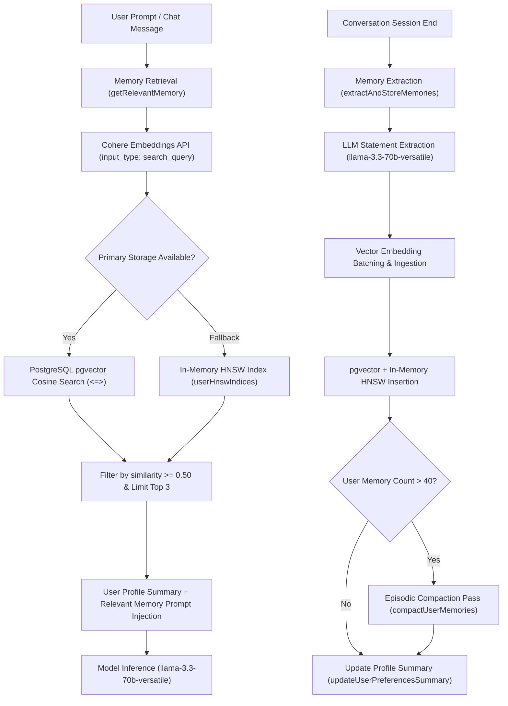
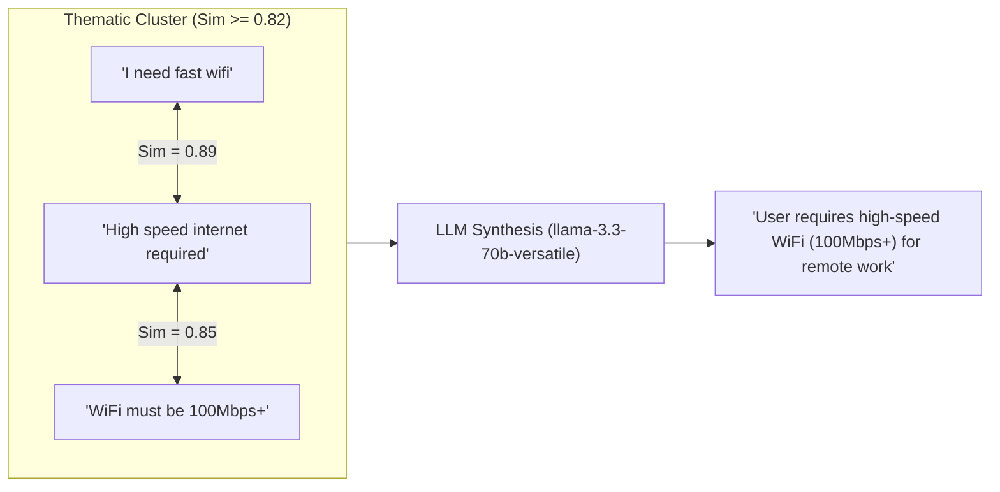
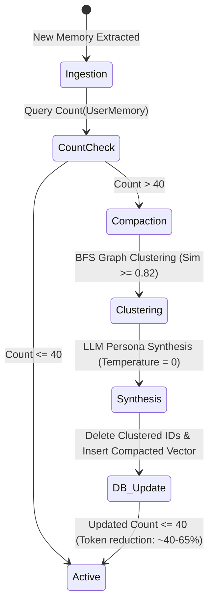

# MemoryAgent Context Compression, Vector Embedding Batching & HNSW Indexing Guide

This document details the architectural design, vector embedding batching mechanisms, Hierarchical Navigable Small World (HNSW) indexing parameters and thresholds, semantic deduplication heuristics, and memory compaction lifecycle of **MemoryAgent** ([`src/lib/agents/MemoryAgent.ts`](file:///c:/Users/Rushabh%20Mahajan/Documents/GitHub/WorkSphere/src/lib/agents/MemoryAgent.ts)) and the vector memory subsystem ([`src/lib/memory.ts`](file:///c:/Users/Rushabh%20Mahajan/Documents/GitHub/WorkSphere/src/lib/memory.ts)) within WorkSphere's AI architecture.

---

## 1. Overview & System Architecture

WorkSphere features an autonomous **MemoryAgent** that acts as the long-term preference engine for personalized workspace recommendations. As users interact with the assistant, leave venue reviews, or save favorites, the MemoryAgent continuously extracts explicit user preferences, batches and generates vector embeddings, indexes them via PostgreSQL `pgvector` and an in-memory client HNSW graph, and dynamically injects relevant context into LLM prompt windows.



---

## 2. Vector Embedding Generation & Batching Pipeline

### 2.1 Model Specifications & Asymmetric Retrieval

WorkSphere utilizes Cohere's `embed-english-v3.0` embedding model, generating **1024-dimensional floating-point vectors** normalized to unit length ($L_2$ norm $\approx 1.0$).

To maximize vector search accuracy, asymmetric embedding roles are enforced via Cohere's `input_type` parameter:
- **`input_type: "search_document"`**: Applied when embedding long-term user preferences, profile statements, and stored venue attributes. Embeds the document in the target semantic space for persistent storage.
- **`input_type: "search_query"`**: Applied during runtime search when vectorizing the incoming user prompt or chat query in `getRelevantMemory()`.

```typescript
// Embedding document statements for storage
const res = await fetch("https://api.cohere.ai/v1/embed", {
  method: "POST",
  headers: {
    Authorization: `Bearer ${cohereApiKey}`,
    "Content-Type": "application/json",
  },
  body: JSON.stringify({
    texts: batchOfStatements, // Array of strings (batch payload)
    model: "embed-english-v3.0",
    input_type: "search_document",
  }),
});
```

### 2.2 Vector Embedding Batching & Throughput Optimization

When extracting multiple preference statements from a single conversation or during episodic compaction passes, statements are batched rather than dispatched in sequential per-item HTTP requests:

1. **Batch Ingestion Payloads**: Multiple extracted statements (up to 96 statements per batch call) are bundled into the `texts: string[]` payload sent to the embedding endpoint.
2. **Rate Limit & Latency Mitigation**: Batching reduces API round-trips from $O(N)$ HTTP handshakes to a single atomic request, avoiding rate-limiting (HTTP 429) on high-volume user sessions.
3. **Deterministic Fallback Engine**: If `COHERE_API_KEY` is not configured or an external provider outage occurs, WorkSphere falls back to a deterministic 1024-dimensional pseudo-semantic hashing generator (`generateDeterministicEmbedding`), applying hash distribution with $L_2$ vector normalization:
   $$\mathbf{v}_{\text{norm}} = \frac{\mathbf{v}}{\|\mathbf{v}\|_2} = \frac{\mathbf{v}}{\sqrt{\sum_{i=1}^{1024} v_i^2}}$$

---

## 3. HNSW Indexing Architecture & Operational Thresholds

WorkSphere employs a dual-tiered vector indexing strategy: a persistent database index in PostgreSQL (`pgvector`) combined with a per-user in-memory Hierarchical Navigable Small World (HNSW) graph for ultra-low latency inference.

```
Layer 2 (Expressway):    [Node A] ─────────────────────────── [Node Z]
                             │                                      │
Layer 1 (Sub-highways):  [Node A] ───── [Node G] ───── [Node N] ───── [Node Z]
                             │             │              │             │
Layer 0 (Base layer):    [A]─[B]─[C]─[D]─[E]─[F]─[G]─[H]─...─[X]─[Y]─[Z]
                         (All user memory nodes linked bidirectionally)
```

### 3.1 HNSW Graph Hyperparameters

The in-memory HNSW index ([`src/lib/hnsw/hnsw.ts`](file:///c:/Users/Rushabh%20Mahajan/Documents/GitHub/WorkSphere/src/lib/hnsw/hnsw.ts)) and PostgreSQL `pgvector` extension are parameterized with aligned configurations:

| Parameter | Value | Scope | Description |
| :--- | :--- | :--- | :--- |
| **`dim`** | `1024` | Global | Dimensionality of all embedding vectors. |
| **`metric`** | `cosine` | Global | Distance metric ($1 - \text{cosine\_similarity}$). |
| **`M`** | `16` | Layers $> 0$ | Maximum bi-directional neighbor connections per node. |
| **`M_max0`** | `32` ($2 \times M$) | Layer $0$ | Maximum connections permitted at the ground layer. |
| **`efConstruction`**| `100` | Insert / Index Build | Dynamic candidate beam width evaluated during graph insertion. |
| **`efSearch`** | `32` (or `50`) | Query Runtime | Priority queue exploration depth at Layer 0 during nearest-neighbor queries. |
| **`ml`** | `1 / ln(16)` $\approx 0.361$ | Graph Generation | Normalization factor governing geometric random layer distribution. |

### 3.2 Key Operational & Indexing Thresholds

The table below summarizes the critical thresholds governing memory extraction, retrieval, deduplication, and compaction in [`MemoryAgent.ts`](file:///c:/Users/Rushabh%20Mahajan/Documents/GitHub/WorkSphere/src/lib/agents/MemoryAgent.ts):

| Threshold Constant | Value | Purpose & Operational Impact |
| :--- | :--- | :--- |
| **`MEMORY_COMPACTION_THRESHOLD`** | `40` | **Compaction Trigger:** When a user's total active memory records exceed 40 statements, an automated compaction pass (`compactUserMemories`) is scheduled. |
| **`MEMORY_SIMILARITY_THRESHOLD`** | `0.82` | **Graph Clustering Cutoff:** Pairwise cosine similarity threshold for clustering redundant memories into connected components. |
| **Search Relevance Cutoff** | `0.50` (or `0.70`) | **Retrieval Filter:** Memory records returning cosine similarity $< 0.50$ (distance $> 0.50$) are filtered out of prompt context injection. |
| **Max Statement Length** | `500` chars | **Input Sanitization:** Guardrail against prompt pollution or excessively long single-memory inputs. |
| **Token Estimation Multiplier** | `1.3` $\times$ words | **Prompt Budgeting:** Conservative token estimation heuristic ($\lceil \text{word\_count} \times 1.3 \rceil$) used to evaluate context savings. |
| **Profile Summary Cap** | `50` words | **Persona Compression:** The synthesized `User.preferencesSummary` is constrained to a single first-person sentence under 50 words. |

---

## 4. Distance Metrics & Similarity Calculation

### 4.1 Cosine Similarity Mathematical Definition

For query embedding vector $\mathbf{u} \in \mathbb{R}^{1024}$ and memory vector $\mathbf{v} \in \mathbb{R}^{1024}$:

$$\text{CosineSimilarity}(\mathbf{u}, \mathbf{v}) = \frac{\mathbf{u} \cdot \mathbf{v}}{\|\mathbf{u}\|_2 \|\mathbf{v}\|_2} = \frac{\sum_{i=1}^{1024} u_i v_i}{\sqrt{\sum_{i=1}^{1024} u_i^2} \sqrt{\sum_{i=1}^{1024} v_i^2}}$$

Given unit-normalized vectors ($\|\mathbf{u}\|_2 = 1, \|\mathbf{v}\|_2 = 1$), this simplifies directly to the dot product:

$$\text{CosineSimilarity}(\mathbf{u}, \mathbf{v}) = \mathbf{u} \cdot \mathbf{v}$$

### 4.2 Database `pgvector` Cosine Operator

In PostgreSQL, the `<=>` operator computes cosine distance ($1 - \text{CosineSimilarity}$):

```sql
SELECT id, content, "createdAt",
       1 - ("embedding" <=> $1::vector) AS similarity
FROM "UserMemory"
WHERE "userId" = $2
ORDER BY "embedding" <=> $1::vector
LIMIT 3;
```

---

## 5. Semantic Clustering & Connected Components Deduplication

Users frequently express synonymous or overlapping preferences across multiple sessions (e.g., *"I need high-speed internet"*, *"Fast WiFi is essential"*, *"WiFi must be at least 100 Mbps"*).



### 5.1 Connected Components Graph Clustering Algorithm

The function `clusterMemoryStatements(statements, similarityThreshold = 0.82)` executes:
1. **Adjacency Construction**: Calculates all-pairs cosine similarity across statements. An undirected edge is established between node $i$ and node $j$ if:
   $$\text{cosineSimilarity}(\mathbf{e}_i, \mathbf{e}_j) \ge 0.82$$
2. **BFS Traversal**: Identifies connected subgraphs using Breadth-First Search queue traversal.
3. **Thematic Classification**: Inspects statements within each cluster against keyword heuristics:
   - **Acoustic Preferences**: `noise`, `quiet`, `sound`, `loud`, `acoustic`, `music`, `silent`
   - **Amenities & Ergonomics**: `desk`, `chair`, `ergonomic`, `outlet`, `wifi`, `monitor`, `power`
   - **Nutrition & Beverages**: `coffee`, `tea`, `food`, `vegan`, `vegetarian`, `milk`, `oat`, `cafe`
   - **Lighting & Environment**: `lighting`, `sunlight`, `window`, `dark`, `bright`, `dim`
   - **Workspace Habits**: Default fallback theme

---

## 6. Compaction Lifecycle & Database Retention

When a user accumulates $> 40$ active memory items, `compactUserMemories()` performs an atomic lifecycle consolidation:



1. **Granular Memory Archival**: Statement IDs belonging to multi-item clusters are collected in `archivedIds`.
2. **Transactional Pruning**:
   ```sql
   DELETE FROM "UserMemory" WHERE "id" IN (...archivedIds);
   ```
3. **Synthesized Re-Embedding**: Synthesized summaries are re-vectorized using Cohere `embed-english-v3.0` (`input_type: search_document`) and inserted with fresh timestamp metadata.
4. **Context Reduction**: Typically achieves **40% – 65% token footprint reduction**, maintaining strict prompt context budgets.

---

## 7. In-Memory Caching, Serialization & Scalar Quantization

For low-latency mobile and edge query routing, WorkSphere supports in-memory HNSW cache serialization and SQ8 scalar quantization:

- **Per-User Memory Cache**: `userHnswIndices = new Map<string, HNSWIndex>()` stores user-scoped graph instances.
- **Binary Serialization**: [`src/lib/hnsw/hnswSerializer.ts`](file:///c:/Users/Rushabh%20Mahajan/Documents/GitHub/WorkSphere/src/lib/hnsw/hnswSerializer.ts) serializes HNSW graphs into compact `ArrayBuffer` payloads for Redis or IndexedDB caching.
- **Scalar Quantization (SQ8)**: Quantizes 32-bit floats into 8-bit unsigned integers (`uint8`), reducing memory footprint by **75%** with negligible recall loss ($< 1\%$).

---

## 8. Summary Reference of Related Modules

- **Core Agent**: [`src/lib/agents/MemoryAgent.ts`](file:///c:/Users/Rushabh%20Mahajan/Documents/GitHub/WorkSphere/src/lib/agents/MemoryAgent.ts)
- **Vector Operations & Store**: [`src/lib/memory.ts`](file:///c:/Users/Rushabh%20Mahajan/Documents/GitHub/WorkSphere/src/lib/memory.ts)
- **HNSW Graph Implementation**: [`src/lib/hnsw/hnsw.ts`](file:///c:/Users/Rushabh%20Mahajan/Documents/GitHub/WorkSphere/src/lib/hnsw/hnsw.ts)
- **HNSW Type Definitions**: [`src/lib/hnsw/types.ts`](file:///c:/Users/Rushabh%20Mahajan/Documents/GitHub/WorkSphere/src/lib/hnsw/types.ts)
- **HNSW Comprehensive Guide**: [`docs/HNSW_VECTOR_SEARCH.md`](file:///c:/Users/Rushabh%20Mahajan/Documents/GitHub/WorkSphere/docs/HNSW_VECTOR_SEARCH.md)
