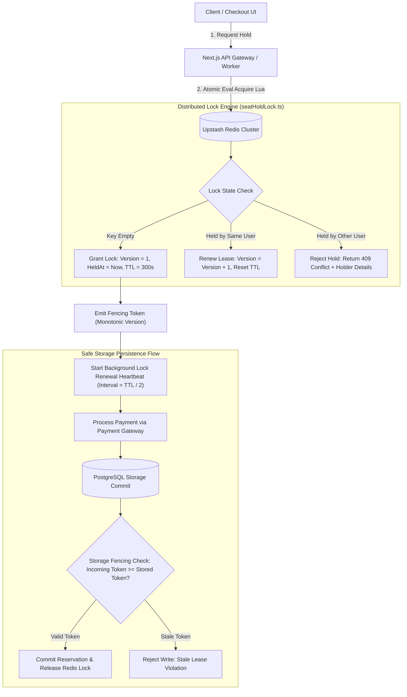
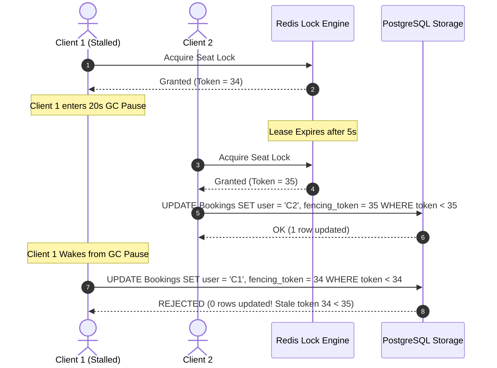
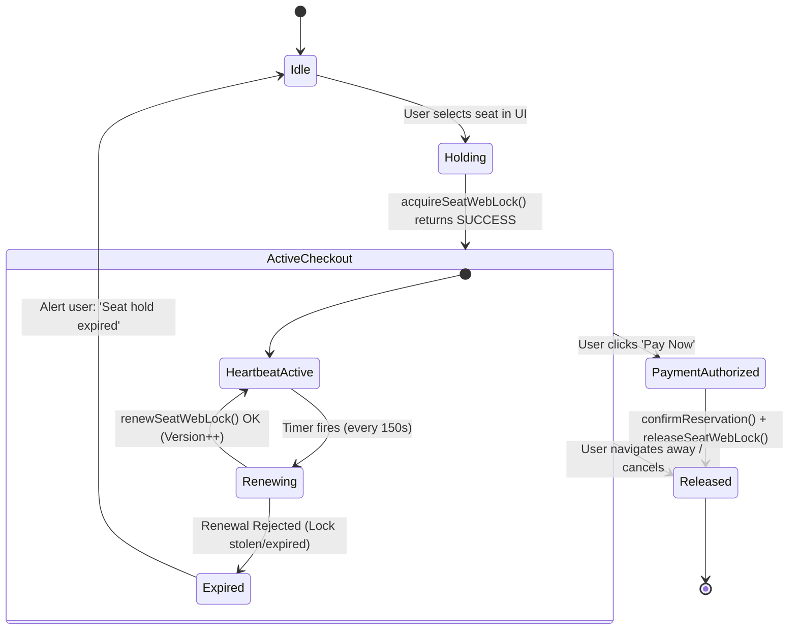

# Distributed Locks, Redlock Consensus, and Monotonic Fencing Tokens

## 1. Executive Summary & Problem Space

In high-concurrency shared workspace and seat reservation systems like WorkSphere, multiple users frequently attempt to book identical physical assets (hot desks, private booths, conference suites) at the exact same moment. During morning rush check-ins, flash seat drops, or corporate cohort allocations, hundreds of concurrent requests contend for identical inventory records within single-digit millisecond windows.

Without deterministic, distributed concurrency controls, naive locking mechanisms in multi-instance web tiers succumb to severe failure modes:

1. **Double-Booking Race Conditions:** Two distinct web workers read inventory status as `AVAILABLE` concurrently, dispatch payment authorization to Stripe, and both commit `CONFIRMED` records to PostgreSQL.
2. **Abandoned Checkout Deadlocks:** A user holds a seat and abandons their cart, closes their mobile browser, or enters an airplane tunnel. If the lock is held indefinitely without a TTL lease, inventory becomes permanently starved.
3. **Stale Lock Overwrites & Accidental Releases:** User A's 5-minute lease expires while filling credit card details. User B immediately acquires the seat. If User A's client subsequently cancels or finishes, User A must never accidentally delete or overwrite User B's active hold.
4. **The Distributed Lease Split-Brain Dilemma:** A worker process holding a time-bounded distributed lock suffers an unexpected stop-the-world Garbage Collection (GC) pause, I/O stall, or network blip. While the worker is suspended, its lock lease expires in Redis, and another worker acquires the lock. When the first worker resumes, it mistakenly assumes it still holds the lock and writes to storage, corrupting database integrity.

To eliminate these concurrency vulnerabilities, WorkSphere deploys an enterprise-grade distributed concurrency architecture centered in [`src/lib/locks/seatHoldLock.ts`](file:///c:/Users/admin/Desktop/workfere/src/lib/locks/seatHoldLock.ts). This system unifies **Redis Atomic Lua Scripts**, **Redlock Multi-Node Consensus**, **Monotonic Fencing Tokens**, and **Client-Side Background Lease Heartbeats**.



---

## 2. Redis Redlock Consensus & Clock Drift Mitigation

While single-instance Redis provides blazing-fast atomic operations, production systems with multi-zone high availability must guard against single-point-of-failure (SPOF) risks and asynchronous replication lag. If a Redis primary node crashes immediately after granting a lock but before replicating the key to its replica, the promoted replica will grant the same lock to a second client.

### 2.1 The Redlock Algorithm Mechanics

To guarantee fault-tolerant mutual exclusion across independent failure domains, WorkSphere builds on the **Redlock Consensus Protocol** formulated by Salvatore Sanfilippo:

1. **Independent Master Nodes:** Redlock deploys $N$ fully independent Redis master instances (typically $N = 5$) hosted in distinct availability zones or cloud regions, with zero asynchronous cross-master replication.
2. **Current Timestamp Acquisition:** The client captures local monotonic time $T_1$ with millisecond precision before contacting any node.
3. **Sequential Lock Attempts:** The client attempts to acquire the lock across all $N$ instances sequentially using identical keys and random unique identifiers, applying a small network timeout per node ($5\text{--}50\text{ms}$) to prevent hung connections.
4. **Quorum Verification:** The client considers the lock successfully acquired if and only if:
   $$\text{Nodes Acquired} \ge \left\lfloor \frac{N}{2} \right\rfloor + 1 \quad (\text{Majority Quorum, e.g. } 3 \text{ of } 5)$$
5. **Validity Time Computation ($T_{\text{valid}}$):** The client measures completion time $T_2$. The effective validity time remaining for the lease is computed as:
   $$T_{\text{valid}} = \text{TTL} - (T_2 - T_1) - \text{Drift}$$

If quorum cannot be established within the time budget, or if $T_{\text{valid}} \le 0$, the client initiates immediate **compensating unlock routines** across all $N$ instances.

### 2.2 Mathematical Clock Drift Mitigation

In distributed systems, physical hardware clocks on independent servers drift due to thermal variance, oscillator imperfections, and asymmetric NTP synchronization jumps. If Node A's clock runs 2% faster than Node B's clock, a time-to-live key on Node A will expire prematurely.

WorkSphere calculates safety drift margins according to:

$$\text{Drift} = (\text{TTL} \times \text{ClockDriftFactor}) + \text{NTPDeltaLeeway}$$

Where:
*   $\text{TTL} = 300\text{ seconds}$ ($300,000\text{ms}$).
*   $\text{ClockDriftFactor} = 0.002$ ($0.2\%$ maximum expected physical oscillator drift).
*   $\text{NTPDeltaLeeway} = 2\text{ms}$ (buffer for asymmetric NTP step corrections).

```typescript
// Clock Drift and Validity Window Calculation
function calculateEffectiveValidity(
  ttlMs: number,
  elapsedAcquisitionMs: number,
  driftFactor = 0.002,
  ntpLeewayMs = 2
): number {
  const clockDrift = Math.ceil(ttlMs * driftFactor) + ntpLeewayMs;
  const validityMs = ttlMs - elapsedAcquisitionMs - clockDrift;
  return Math.max(0, validityMs);
}
```

If $T_{\text{valid}}$ falls below the threshold required to process checkout, the client automatically aborts, releases all node locks, and declines the reservation attempt.

---

## 3. Monotonic Fencing Tokens & Split-Brain Storage Writes

Distributed locks that rely purely on time intervals cannot guarantee correctness on asynchronous networks. In his seminal critique of distributed lock systems, distributed systems researcher Martin Kleppmann identified the fundamental vulnerability of pure lease locks:

```
Client 1                   Redis Lock Master              Storage (DB)
   |                              |                            |
   |--- Acquire Lock ----------->|                            |
   |<-- Lock Granted (TTL=10s)---|                            |
   |                              |                            |
   | [STALL: Long GC Pause / I/O] |                            |
   | (10 seconds pass...)         |                            |
   |                              |-- Lock Expires ----------->|
   |                              |                            |
   |                              |<-- Client 2 Acquires Lock -|
   |                              |--- Lock Granted (TTL=10s)->|
   |                              |                            |
   |                              |               Client 2 Writes to DB
   |                              |               [SEAT RESERVED: CLIENT 2]
   |                              |                            |
   | [Client 1 Wakes Up]          |                            |
   | Writes to DB thinking lock   |                            |
   | is still valid!              |                            |
   |=============================>|===========================>|
   | OVERWRITES & CORRUPTS CLIENT 2 RESERVATION!                |
```

### 3.1 The Fencing Token Solution

A distributed lock cannot prevent a paused or partitioned client from believing it is still the legitimate owner. Therefore, **the final resource / storage layer must participate in mutual exclusion**.

A **Fencing Token** is a strictly monotonically increasing integer issued by the lock service upon every lock acquisition or lease renewal. Storage engines reject any write request bearing a token lower than the highest token previously committed:



### 3.2 Fencing Token Generation in `seatHoldLock.ts`

WorkSphere embeds monotonic versioning directly into the atomic lock representation:

```typescript
export interface SeatLockData {
  venueId: string;
  seatId: string;
  userId: string;
  userName?: string;
  heldAt: number;
  expiresAt: number;
  version: number; // Monotonic fencing token
}
```

In the atomic acquire Lua script ([`SEAT_LOCK_ACQUIRE_LUA`](file:///c:/Users/admin/Desktop/workfere/src/lib/locks/seatHoldLock.ts#L51-L67)), every renewal or re-acquisition monotonically increments this version number:

```lua
local ok, decoded = pcall(cjson.decode, current)
if ok and type(decoded) == 'table' and decoded.userId == ARGV[1] then
  local renewed = cjson.decode(ARGV[2])
  renewed.version = (tonumber(decoded.version) or 1) + 1
  if decoded.heldAt then renewed.heldAt = decoded.heldAt end
  local encoded = cjson.encode(renewed)
  redis.call('SET', KEYS[1], encoded, 'EX', tonumber(ARGV[3]))
  return { 1, encoded }
end
```

### 3.3 Storage Layer Enforcement in PostgreSQL

When final booking confirmation is executed in Prisma/PostgreSQL, the write is executed with a conditional guard on the fencing token:

```typescript
// Atomic reservation confirmation with fencing token verification
export async function confirmSeatReservation(
  seatId: string,
  userId: string,
  fencingToken: number
) {
  return await prisma.$transaction(async (tx) => {
    // 1. Fetch current seat record and latest applied fencing token
    const seat = await tx.seat.findUnique({
      where: { id: seatId },
      select: { id: true, status: true, lastFencingToken: true },
    });

    if (!seat) throw new Error("Seat not found");

    // 2. Reject stale write if a higher or equal token has already been committed
    if (seat.lastFencingToken && seat.lastFencingToken >= fencingToken) {
      throw new Error(
        `Concurrency Violation: Stale fencing token ${fencingToken}. Storage token is ${seat.lastFencingToken}.`
      );
    }

    // 3. Atomically update seat status and record monotonic fencing token
    return await tx.seat.update({
      where: { id: seatId },
      data: {
        status: "OCCUPIED",
        currentUserId: userId,
        lastFencingToken: fencingToken,
      },
    });
  });
}
```

---

## 4. Background Lock Renewal Heartbeats During Active Checkout

User checkouts frequently involve multi-step user interactions: reviewing booking terms, entering discount promo codes, selecting optional amenities (monitors, ergonomic chairs), and completing 3D-Secure credit card biometric challenges. While the baseline lock TTL is 5 minutes (`DEFAULT_LOCK_TTL_SECONDS = 300`), a deliberate user may take 6–8 minutes to finalize their transaction.

Rather than configuring an excessively large static TTL (which would lock out inventory for 15+ minutes on cart abandonment), WorkSphere employs an **Autonomous Background Lock Renewal Heartbeat** lease model.

### 4.1 Lease Half-Life Renewal Scheduling

Heartbeat renewals are initiated through [`startSeatLockRenewalHeartbeat`](file:///c:/Users/admin/Desktop/workfere/src/lib/locks/seatHoldLock.ts#L333-L391). To ensure network resiliency against temporary packet loss, heartbeats fire at **half the TTL interval** ($\frac{\text{TTL}}{2}$):

$$\text{HeartbeatInterval} = \max\left(5000\text{ms}, \left\lfloor \frac{\text{TTL} \times 1000}{2} \right\rfloor\right)$$

For a 300-second lock, the background timer fires every **150 seconds**. This guarantees that the client has at least two full retry windows before the key can expire in Redis.

```typescript
export function startSeatLockRenewalHeartbeat(
  options: SeatLockHeartbeatOptions,
): () => void {
  const {
    venueId,
    seatId,
    userId,
    userName,
    ttlSeconds = DEFAULT_LOCK_TTL_SECONDS,
    intervalMs = Math.max(5000, Math.floor((ttlSeconds * 1000) / 2)),
    onRenewSuccess,
    onRenewFailed,
  } = options;

  const key = getHeartbeatKey(venueId, seatId, userId);

  // Stop any existing heartbeat for this seat & user to prevent timer leaks
  stopSeatLockRenewalHeartbeat(venueId, seatId, userId);

  const heartbeatFn = async () => {
    try {
      const result = await renewSeatWebLock(
        venueId,
        seatId,
        userId,
        userName,
        ttlSeconds,
      );

      if (result.success && result.lock) {
        const entry = activeHeartbeats.get(key);
        if (entry) {
          entry.lastRenewedAt = Date.now();
        }
        onRenewSuccess?.(result.lock);
      } else {
        // Renewal failed - stop timer immediately and notify checkout UI
        stopSeatLockRenewalHeartbeat(venueId, seatId, userId);
        onRenewFailed?.(result.reason || "RENEWAL_REJECTED");
      }
    } catch (err: any) {
      console.warn(`[SeatLock Heartbeat] Renewal failed for ${venueId}:${seatId}:`, err);
      stopSeatLockRenewalHeartbeat(venueId, seatId, userId);
      onRenewFailed?.(err?.message || "HEARTBEAT_ERROR");
    }
  };

  const timer = setInterval(heartbeatFn, intervalMs);

  activeHeartbeats.set(key, {
    timer,
    options,
    startedAt: Date.now(),
  });

  return () => {
    stopSeatLockRenewalHeartbeat(venueId, seatId, userId);
  };
}
```

### 4.2 Lifecycle Integration with Checkout UI



1. **Mount:** When the checkout modal renders, the client acquires the seat lock and registers the heartbeat timer via `SeatHoldHeartbeatService.start()`.
2. **Heartbeat Loop:** While the user stays on the page, the timer transparently renews the Redis TTL, keeping the seat reserved.
3. **Unmount / Cancellation:** If the user closes the modal or navigates away, the cleanup function invokes `stopSeatLockRenewalHeartbeat()` and dispatches `releaseSeatWebLock()` to immediately restore venue availability.
4. **Heartbeat Rejection:** If network connectivity was lost and the seat was acquired by someone else before reconnecting, `onRenewFailed()` triggers a modal alert warning the user that their hold was forfeited.

---

## 5. Atomic Lua Scripting Mechanics

Performing distributed lock operations using sequential Redis commands (`GET`, followed by `SET`, or `SET NX` followed by `EXPIRE`) introduces fatal race condition windows:

*   **The Expiration Gap:** If `SET NX` succeeds but the process crashes before `EXPIRE` is executed, the key persists indefinitely with no TTL, permanently deadlocking the seat.
*   **The Compare-and-Set Race:** If a renewing client reads `GET`, validates ownership, and prepares `SET`, another client might acquire the key in the microseconds between the `GET` and `SET` calls.

To ensure strict ACID linearizability within Redis, WorkSphere packages all state transitions into deterministic **Redis Lua Scripts**.

### 5.1 Atomic Acquire / Renew Lua Script

[`SEAT_LOCK_ACQUIRE_LUA`](file:///c:/Users/admin/Desktop/workfere/src/lib/locks/seatHoldLock.ts#L51-L67) executes atomic test, acquire, or ownership-preserving extension:

```lua
local current = redis.call('GET', KEYS[1])
if not current then
  -- Seat is completely free. Acquire new lock.
  redis.call('SET', KEYS[1], ARGV[2], 'EX', tonumber(ARGV[3]))
  return { 1, ARGV[2] }
end

local ok, decoded = pcall(cjson.decode, current)
if ok and type(decoded) == 'table' and decoded.userId == ARGV[1] then
  -- Lock is currently held by the requesting user. Renew lease atomically.
  local renewed = cjson.decode(ARGV[2])
  renewed.version = (tonumber(decoded.version) or 1) + 1
  if decoded.heldAt then renewed.heldAt = decoded.heldAt end
  local encoded = cjson.encode(renewed)
  redis.call('SET', KEYS[1], encoded, 'EX', tonumber(ARGV[3]))
  return { 1, encoded }
end

-- Lock is held by another user. Reject acquisition.
return { 0, current }
```

### 5.2 Atomic Compare-and-Delete (CAD) Release Script

[`SEAT_LOCK_RELEASE_LUA`](file:///c:/Users/admin/Desktop/workfere/src/lib/locks/seatHoldLock.ts#L76-L85) ensures that a releasing user only deletes their own lock:

```lua
local current = redis.call('GET', KEYS[1])
if not current then return 0 end

local ok, decoded = pcall(cjson.decode, current)
if ok and type(decoded) == 'table' and decoded.userId == ARGV[1] then
  redis.call('DEL', KEYS[1])
  return 1
end

return 0
```

If User A's lock expired 2 seconds ago and User B acquired the key, User A calling `releaseSeatWebLock()` executes this Lua script. The script checks `decoded.userId == ARGV[1]`, detects the mismatch (`"user_B" != "user_A"`), leaves User B's lock completely untouched, and returns `0`.

---

## 6. In-Memory Fallback Engine & Graceful Degradation

During local offline development, automated CI unit testing, or intermittent Upstash Redis outages, the system must degrade gracefully without crashing the application.

`seatHoldLock.ts` maintains an synchronized **In-Memory Concurrency Map**:

```typescript
const memoryLocks = new Map<string, SeatLockData>();

function pruneMemoryLocks(now: number = Date.now()) {
  for (const [key, lock] of memoryLocks.entries()) {
    if (now >= lock.expiresAt) {
      memoryLocks.delete(key);
    }
  }
}
```

*   **Active Pruning:** Before any acquire or inspection operation, expired entries are actively purged.
*   **Version Tracking:** The in-memory fallback maintains monotonic versioning identical to the Redis Lua script (`version: (existing?.version ?? 0) + 1`), ensuring fencing token semantics remain intact.
*   **Seamless Failover:** If `getRedis()` returns null or throws network errors, the engine logs a warning and routes lock requests through the memory simulator.

---

## 7. Comparative Concurrency Matrix

| Strategy | Speed / Latency | Fault Tolerance | Split-Brain Resistance | Complexity | Recommended Use Case |
| :--- | :--- | :--- | :--- | :--- | :--- |
| **Pessimistic DB Locks (`SELECT FOR UPDATE`)** | Slow ($20\text{--}80\text{ms}$) | High (ACID) | High | Low | Final payment commit transaction |
| **Naive Redis Lock (`SET NX EX`)** | Ultra-Fast ($< 2\text{ms}$) | Low (No Redlock/Fencing) | None (Vulnerable to GC/I/O) | Minimal | Non-critical rate limits, cache warming |
| **Atomic Lua + Heartbeats (`seatHoldLock.ts`)** | Ultra-Fast ($< 2\text{ms}$) | High (Self-healing lease) | Moderate (Without DB check) | Moderate | Active user seat holds & cart reservations |
| **Redlock + Fencing Tokens + DB Guard** | Fast ($5\text{--}15\text{ms}$) | Maximum (Multi-node quorum) | Maximum (Mathematically sound) | High | High-value payments, seat double-booking prevention |

---

## 8. Verification & Operational Testing Guide

Unit tests in `src/__tests__/lib/locks/seatHoldLock.test.ts` validate all distributed locking invariants:

```typescript
import {
  acquireSeatWebLock,
  releaseSeatWebLock,
  renewSeatWebLock,
  startSeatLockRenewalHeartbeat,
  resetMemorySeatLocks,
} from "@/lib/locks/seatHoldLock";

describe("Distributed Seat Hold Locks & Concurrency (#5053)", () => {
  beforeEach(() => {
    resetMemorySeatLocks();
  });

  it("prevents concurrent users from acquiring the same seat", async () => {
    const resA = await acquireSeatWebLock("venue_1", "seat_A", "user_1");
    expect(resA.success).toBe(true);

    const resB = await acquireSeatWebLock("venue_1", "seat_A", "user_2");
    expect(resB.success).toBe(false);
    expect(resB.reason).toBe("ALREADY_HELD");
    expect(resB.heldBy).toBe("user_1");
  });

  it("monotonically increments fencing token versions on renewal", async () => {
    const first = await acquireSeatWebLock("venue_1", "seat_A", "user_1");
    expect(first.lock?.version).toBe(1);

    const second = await renewSeatWebLock("venue_1", "seat_A", "user_1");
    expect(second.lock?.version).toBe(2);

    const third = await renewSeatWebLock("venue_1", "seat_A", "user_1");
    expect(third.lock?.version).toBe(3);
  });

  it("prevents expired users from releasing locks acquired by others", async () => {
    // User 1 acquires lock with 1 second TTL
    await acquireSeatWebLock("venue_1", "seat_A", "user_1", "User 1", 1);
    
    // Simulate time pass
    await new Promise((r) => setTimeout(r, 1100));

    // User 2 acquires free seat
    const resB = await acquireSeatWebLock("venue_1", "seat_A", "user_2");
    expect(resB.success).toBe(true);

    // User 1 attempts delayed release
    const released = await releaseSeatWebLock("venue_1", "seat_A", "user_1");
    expect(released).toBe(false); // Refused!

    // Verify User 2 still holds the lock
    const resC = await acquireSeatWebLock("venue_1", "seat_A", "user_3");
    expect(resC.success).toBe(false);
    expect(resC.heldBy).toBe("user_2");
  });
});
```
