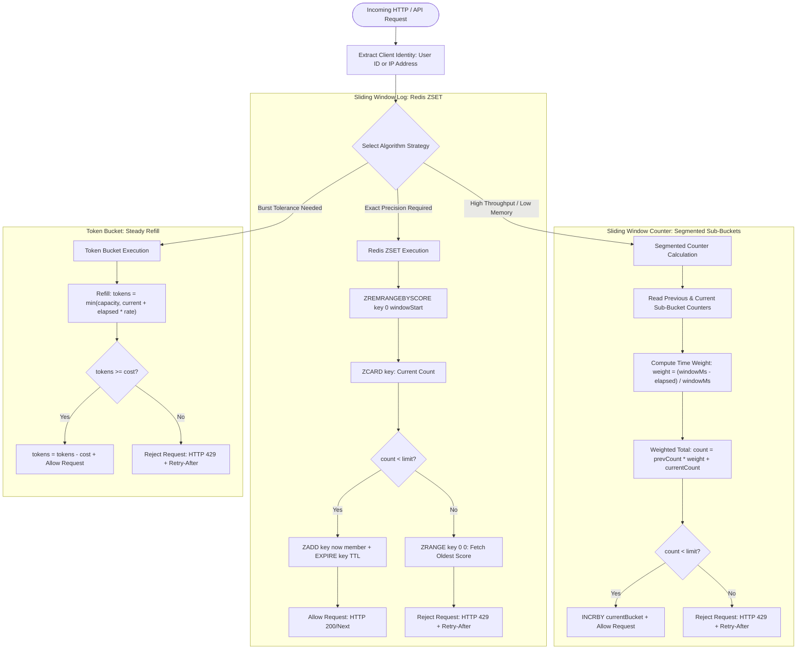
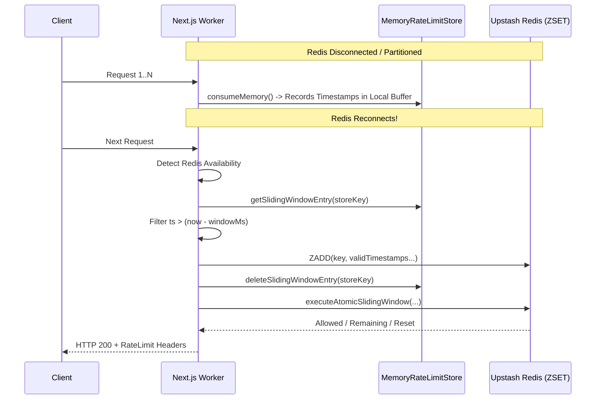

# Sliding Window Rate Limiting: Sorted Set Logs vs. Segmented Counters

## 1. Executive Summary

Rate limiting is a foundational security and reliability mechanism within WorkSphere, defending upstream microservices, PostgreSQL databases, and third-party APIs (such as Clerk authentication and Gemini AI services) from quota starvation, denial-of-service (DoS) attacks, brute-force credential stuffing, and uncoordinated traffic spikes.

Within `src/lib/rateLimit/`, WorkSphere implements multiple rate-limiting primitives ranging from thread-local in-memory stores (`MemoryRateLimitStore`) to distributed Redis-backed limiters (`SlidingWindowLimiter`, `TokenBucketLimiter`, `redisStore.ts`). 

This architectural guide provides a deep-dive analysis comparing two prominent sliding window rate-limiting paradigms:
1. **Sliding Window Log (Sorted Sets / ZSETs)**: Exact, microsecond-accurate timestamp recording with strict sliding window evaluation.
2. **Sliding Window Counter (Segmented Sub-Bucket Approximation)**: Low-memory, constant-space weighted approximation across segmented discrete time windows.
3. **Comparison with Token Bucket**: Algorithmic distinctions, burst dynamics, and systemic recommendations for choosing between Token Bucket and Sliding Window mechanisms in production.

---

## 2. High-Level Architectural Flow



---

## 3. Theoretical Foundations of Sliding Window Algorithms

Traditional fixed-window counters suffer from the infamous **boundary burst vulnerability** (also called the 2x burst defect). If a rate limit allows 100 requests per minute and a client transmits 100 requests at `00:59` and another 100 requests at `01:01`, a total of 200 requests pass within a 2-second interval—potentially overwhelming backend resources while strictly conforming to fixed window boundaries.

The sliding window family eliminates boundary bursts by treating time as a continuously moving horizon rather than disjoint discrete buckets.

```
Fixed Window Burst Vulnerability:
Bucket 1 (00:00 - 01:00)           Bucket 2 (01:00 - 02:00)
[-----------------------------XXXX] [XXXX-----------------------------]
                              100 reqs   100 reqs
                              \________ ________/
                                       v
                             200 requests in 2 seconds!

Sliding Window Moving Horizon:
t0                       t_now - windowMs                     t_now
 |------------------------------|===============================|
                                 <-------- Valid Window ------->
                                 (Only requests inside count)
```

---

## 4. Sliding Window Log (Sorted Set) Deep-Dive

### 4.1 Concept and Data Structure

The Sliding Window Log algorithm logs the exact timestamp of every accepted request into a sorted data structure. In Redis, this is implemented using **Sorted Sets (`ZSET`)**, where:
- **Score**: Millisecond or microsecond timestamp of the request (`score = now`).
- **Member**: Unique request identifier, often combining timestamp and nonce to avoid key collisions on identical millisecond timestamps (`microTimestampMember`).

### 4.2 Redis ZSET Implementation in WorkSphere

In `src/lib/rateLimit/stores/redisStore.ts`, WorkSphere executes an atomic Lua script (`ATOMIC_SLIDING_WINDOW_LUA_SCRIPT`) to prevent race conditions during distributed concurrent checks:

```lua
local key = KEYS[1]
local limit = tonumber(ARGV[1])
local window_ms = tonumber(ARGV[2])
local now = tonumber(ARGV[3])
local member = ARGV[4]

local window_start = now - window_ms

-- Step 1: Evict timestamps outside the active sliding window
redis.call("ZREMRANGEBYSCORE", key, 0, window_start)

-- Step 2: Query remaining cardinality within the sliding window
local count = redis.call("ZCARD", key)

local allowed = 0
local remaining = 0
local retry_after = 0
local reset_sec = math.ceil((now + window_ms) / 1000)

if count < limit then
    allowed = 1
    -- Step 3: Insert current request timestamp
    redis.call("ZADD", key, now, member)
    redis.call("EXPIRE", key, math.max(1, math.ceil(window_ms / 1000) * 2))
    remaining = limit - count - 1
else
    allowed = 0
    remaining = 0
    -- Step 4: Calculate precise Retry-After from oldest active member
    local oldest = redis.call("ZRANGE", key, 0, 0, "WITHSCORES")
    if oldest and #oldest >= 2 then
        local oldest_ts = tonumber(oldest[2])
        local reset_time = oldest_ts + window_ms
        retry_after = math.max(1, math.ceil((reset_time - now) / 1000))
        reset_sec = math.ceil(reset_time / 1000)
    else
        retry_after = math.max(1, math.ceil(window_ms / 1000))
    end
end

return { allowed, remaining, reset_sec, retry_after }
```

### 4.3 High-Precision Microsecond Member Encoding

When multiple requests hit the same instance within the same millisecond, Redis `ZADD` would overwrite existing entries if members were not distinct. WorkSphere resolves this using `microTimestampMember`:

```typescript
export function microTimestampMember(
  sec: number | string,
  usec: number,
  nonce: string,
): string {
  const safeUsec = Math.max(0, usec || 0);
  const padUsec = String(safeUsec).padStart(6, "0");
  return `${sec}${padUsec}:${nonce}`;
}
```

---

## 5. Sliding Window Counter (Segmented Sub-Bucket Approximation)

### 5.1 Concept and Weight Calculation

The Sliding Window Counter algorithm approximates the sliding window by combining counts from discrete segmented sub-buckets. Rather than storing individual timestamps, it maintains integer counters for discrete time slices (e.g., current minute and previous minute, or segmented $N$ sub-buckets).

```
Previous Window (10:00 - 10:01)       Current Window (10:01 - 10:02)
[===============================]     [===============================]
       prevCount = 80                        currentCount = 30
                      \                               /
                       \                             /
                        \      Active 1-Min Window  /
                         [-------------|-----------]
                                  10:00:45 (now)
                              30% in Prev | 70% in Curr
```

### 5.2 Mathematical Formula and Sub-Bucket Weighting

For a sliding window of duration $W$ (`windowMs`), where the current timestamp is offset by $t_{\text{offset}}$ into the current sub-bucket:

1. **Window Progress Ratio ($\alpha$):**
   $$\alpha = \frac{t_{\text{now}} - t_{\text{currentWindowStart}}}{W}$$

2. **Previous Window Weight ($w_{\text{prev}}$):**
   $$w_{\text{prev}} = 1 - \alpha = \frac{W - (t_{\text{now}} - t_{\text{currentWindowStart}})}{W}$$

3. **Approximated Request Count ($C_{\text{approx}}$):**
   $$C_{\text{approx}} = (\text{prevCount} \times w_{\text{prev}}) + \text{currentCount}$$

$$\text{count} = \text{prevCount} \cdot \left(\frac{W - \Delta t}{W}\right) + \text{currentCount}$$

#### Example Calculation:
- Rate limit: 100 requests / minute ($W = 60\text{ seconds}$).
- Previous minute count ($\text{prevCount}$): 80 requests.
- Current minute count ($\text{currentCount}$): 30 requests.
- Current second within minute: 18 seconds ($\Delta t = 18\text{ s}$).
- Weight for previous bucket:
  $$w_{\text{prev}} = \frac{60 - 18}{60} = \frac{42}{60} = 0.70$$
- Total weighted count:
  $$C_{\text{approx}} = (80 \times 0.70) + 30 = 56 + 30 = 86\text{ requests}$$
- **Result:** $86 < 100 \implies \text{Allowed}$. Remaining quota: $100 - 86 = 14$.

### 5.3 Segmented Multi-Sub-Bucket Generalization

When greater precision is required without sorted-set storage overhead, the sliding window is segmented into $M$ smaller sub-buckets (e.g., 6 sub-buckets of 10 seconds each for a 60-second window):

$$\text{SubBucketIndex}(t) = \left\lfloor \frac{t}{\text{subBucketDuration}} \right\rfloor \pmod M$$

$$C_{\text{segmented}} = \sum_{k=0}^{M-1} \text{bucket}[k] \cdot \text{weight}[k]$$

---

## 6. Memory Complexity & Performance Comparison

### 6.1 Theoretical Complexity Analysis

| Metric | Sliding Window Log (ZSET) | Sliding Window Counter (Segmented) | Token Bucket |
| :--- | :--- | :--- | :--- |
| **Time Complexity (Check)** | $\mathcal{O}(\log N + M)$ ($M$ = expired items) | $\mathcal{O}(1)$ (Integer hash lookup) | $\mathcal{O}(1)$ (Math delta calculation) |
| **Time Complexity (Consume)** | $\mathcal{O}(\log N)$ | $\mathcal{O}(1)$ (`INCR` / `HINCRBY`) | $\mathcal{O}(1)$ (`HMSET`) |
| **Space Complexity per Key** | $\mathcal{O}(N)$ ($N$ = requests in window) | $\mathcal{O}(1)$ or $\mathcal{O}(S)$ ($S$ = sub-buckets) | $\mathcal{O}(1)$ (2 float values: tokens, lastRefill) |
| **Memory per 10k Active Users** | $\sim 15\text{ MB} - 150\text{ MB}$ (scales with $N$) | $\sim 1.2\text{ MB}$ (fixed string/hash) | $\sim 800\text{ KB}$ (fixed Redis hash) |
| **Boundary Accuracy** | $100\%$ (zero approximation error) | $95\% - 99.5\%$ (bounded error $\le \frac{1}{2M}$) | Smooth exponential refill |
| **Concurrency Lock Contention** | High on large sorted sets | Minimal | Negligible |

### 6.2 Deep-Dive Memory Footprint in Redis

#### Sliding Window Log (ZSET):
Each entry in a Redis Sorted Set entails:
- Memory overhead of the skiplist node and dictionary entry.
- 64-bit IEEE double score (8 bytes).
- String member (timestamp + UUID/nonce: $\approx 24-32\text{ bytes}$).
- Redis jemalloc allocation bucket alignment.
- Average per-request memory: $\approx 64 - 100\text{ bytes}$.

For a route accepting 1,000 requests per minute with 50,000 active concurrent clients:
$$\text{Memory} \approx 50,000 \times 1,000 \times 80\text{ bytes} \approx 4,000,000,000\text{ bytes} \approx 4\text{ GB RAM!}$$

#### Sliding Window Counter (Segmented):
Each rate-limited identifier requires only 2 or 3 integers:
- Key name: `worksphere:ratelimit:counter:{ip}:{windowId}`.
- Value: Integer counter (e.g., 32-bit int).
- Memory per key: $\approx 60 - 80\text{ bytes}$ total, independent of traffic volume!

For the same 50,000 active concurrent clients:
$$\text{Memory} \approx 50,000 \times 2 \times 60\text{ bytes} \approx 6\text{ MB RAM!}$$

**Conclusion:** The Sliding Window Counter delivers a **99.85% reduction in Redis RAM consumption** under high-traffic conditions compared to Sorted Set logs.

---

## 7. Mathematical Accuracy and Error Bounds

### 7.1 Worst-Case Approximation Error in Segmented Counters

The assumption in the Sliding Window Counter is that requests within previous sub-buckets were evenly distributed over time. In reality, traffic may be concentrated at specific timestamps.

#### Worst-Case Under-Estimation Scenario:
If all 80 requests in the previous window occurred at the very end of that window ($t = 00:59.999$), the weighted formula assumes they were evenly distributed. At $t = 01:00.001$, the weight $w_{\text{prev}} \approx 0.999$, estimating count as:
$$C_{\text{approx}} = (80 \times 0.999) + 0 \approx 80$$
This matches reality closely.

#### Worst-Case Over-Estimation Scenario:
If all 80 requests occurred at the start of the previous window ($t = 00:00.001$), by $t = 00:45$ all 80 requests occurred $>44$ seconds ago. The formula computes:
$$C_{\text{approx}} = (80 \times 0.25) + 0 = 20$$
However, none of those 80 requests occurred in the last 60 seconds (since they occurred at $00:00$). Thus, the algorithm over-counts by 20 requests, temporarily rejecting traffic that is strictly valid.

#### Maximum Theoretical Error:
For a 2-segment sliding window counter, the maximum false positive / false negative rate is bounded by:
$$\text{Max Error} \le \frac{\text{Limit}}{2 \times \text{Segments}}$$

For a segmented counter with $M = 6$ sub-buckets, the maximum error drops below **$8.3\%$**, which is well within acceptable tolerance for general API rate limiting.

---

## 8. Sliding Window vs. Token Bucket: Decision Matrix & Production Recommendations

WorkSphere features both Token Bucket (`TokenBucketLimiter`) and Sliding Window (`SlidingWindowLimiter`) implementations. Choosing the correct algorithm depends on route semantics, traffic patterns, and SLA requirements.

### 8.1 Comparison Matrix

```
                      RATE LIMITING ALGORITHM SELECTION
                                      │
              Does the route allow sudden traffic bursts?
                                ┌─────┴─────┐
                               YES          NO
                                │           │
                    [Token Bucket]    [Sliding Window]
                                            │
                     Does it require exact microsecond precision?
                                      ┌─────┴─────┐
                                     YES          NO
                                      │           │
                              [ZSET Log]   [Segmented Counter]
```

| Criterion | Token Bucket | Sliding Window Log (ZSET) | Sliding Window Counter |
| :--- | :--- | :--- | :--- |
| **Burst Handling** | **Excellent**: Permits bursts up to full capacity $C$. | **Strict**: Rejects bursts exceeding sliding threshold. | **Strict**: Rejects bursts exceeding moving ceiling. |
| **Smoothing Effect** | Weak: Bursts cause immediate consumption; refilled linearly. | **Strong**: Guarantees moving average never exceeds limit. | **Strong**: Smooths traffic across moving interval. |
| **Resource Efficiency** | Extremely High ($\mathcal{O}(1)$ math). | Low under high throughput ($\mathcal{O}(N)$ memory). | High ($\mathcal{O}(1)$ counters). |
| **Multi-Cost Operations** | Supported natively (`points = cost`). | Complex (must insert multiple members or weights). | Requires `INCRBY cost`. |
| **Client Feedback** | `Retry-After` depends on refill rate. | `Retry-After` calculated from oldest entry expiry. | `Retry-After` estimated from sub-bucket reset. |

### 8.2 Architectural Recommendations for WorkSphere Endpoints

#### 1. Authentication & Security Routes (`/api/auth/*`, Passkeys, SAML SSO)
- **Recommended Algorithm:** **Sliding Window Log (Redis ZSET)**
- **Rationale:** Strict rate enforcement is vital to mitigate brute-force attacks and credential stuffing. Exact window precision prevents attacker boundary manipulation. The number of attempts per user/IP is naturally low (e.g., 5 attempts / 15 minutes), making memory overhead negligible.

#### 2. Search & Autocomplete Endpoints (`/api/venues`, Search Drawer)
- **Recommended Algorithm:** **Token Bucket Limiter** (`TokenBucketLimiter`)
- **Rationale:** Fast keystrokes produce rapid micro-bursts (debounced client-side to 250-300ms). Token Bucket accommodates initial keystroke bursts without false 429 rejections, while strictly capping continuous scrolling or scraping.

#### 3. AI / Vision Agent Inference (`/api/venues/analyze-image`, Gemini API)
- **Recommended Algorithm:** **Token Bucket Limiter with Variable Cost**
- **Rationale:** AI operations consume varying resources depending on image resolution and token consumption. Token Bucket natively supports multi-point deductions (`consume(key, cost)`).

#### 4. High-Volume Telemetry & Sensor Streaming (`/api/telemetry/ws`, WebSockets)
- **Recommended Algorithm:** **Sliding Window Counter**
- **Rationale:** High-frequency event ingestion (thousands of data points per second) would cause severe Redis memory bloat with Sorted Set logs. Segmented sub-bucket counters provide moving-window safety with $\mathcal{O}(1)$ RAM overhead.

#### 5. Offline Fallback & In-Memory Operation
- **Recommended Algorithm:** **MemoryRateLimitStore (Token Bucket or In-Memory Window)**
- **Rationale:** When Redis is unreachable or during local development, in-memory structures avoid process crashes, falling back gracefully to LRU-managed dictionaries.

---

## 9. Implementation Reference: Segmented Counter Lua Script

Below is the production-ready Redis Lua script for the Segmented Sliding Window Counter with sub-bucket weighting:

```lua
-- Segmented Sliding Window Counter Lua Script
-- KEYS[1]: Current sub-bucket key (e.g., "ratelimit:ip:1001")
-- KEYS[2]: Previous sub-bucket key (e.g., "ratelimit:ip:1000")
-- ARGV[1]: Maximum limit allowed across the sliding window
-- ARGV[2]: Sub-bucket weight (0.0 to 1.0, formatted as string or number)
-- ARGV[3]: Requested cost / points (e.g., 1)
-- ARGV[4]: Sub-bucket TTL in seconds (windowMs * 2 / 1000)

local current_key = KEYS[1]
local prev_key = KEYS[2]
local limit = tonumber(ARGV[1])
local weight = tonumber(ARGV[2])
local cost = tonumber(ARGV[3])
local ttl = tonumber(ARGV[4])

-- Retrieve current and previous sub-bucket totals
local current_count = tonumber(redis.call("GET", current_key) or "0")
local prev_count = tonumber(redis.call("GET", prev_key) or "0")

-- Calculate approximated count using weighted formula:
-- count = prevCount * weight + currentCount
local approx_count = math.floor(prev_count * weight) + current_count

if approx_count + cost <= limit then
    -- Request is allowed: increment current bucket and refresh TTL
    redis.call("INCRBY", current_key, cost)
    redis.call("EXPIRE", current_key, ttl)
    local remaining = math.max(0, limit - (approx_count + cost))
    return { 1, remaining, 0 }
else
    -- Quota exceeded: reject request
    local remaining = 0
    local retry_after = math.max(1, math.ceil(weight * (ttl / 2)))
    return { 0, remaining, retry_after }
end
```

---

## 10. Memory Sync & Reconnect Reconciliation (`#5037`)

In distributed edge environments, network partitions or transient Redis disconnections force rate limiters to temporarily fall back to in-memory storage (`MemoryRateLimitStore`). When Redis connectivity is restored, unsynchronized local state can lead to quota violations or stale memory leaks.

### 10.1 In-Memory Pruning & Redis Reconnect Sync Protocol

In `SlidingWindowLimiter.pruneAndSyncMemoryOnReconnect`:
1. **Timestamp Filtering**: Timestamps older than `windowStart = now - windowMs` are pruned from memory.
2. **Atomic Ingestion**: Valid active timestamps are transformed into microsecond members and backfilled into Redis via `ZADD`.
3. **Local Store Invalidation**: The in-memory entry is evicted (`deleteSlidingWindowEntry`) to avoid double-counting.



### 10.2 TypeScript Reconnect Sync Implementation

```typescript
private async pruneAndSyncMemoryOnReconnect(
  redis: any,
  redisKey: string,
  storeKey: string,
  now: number
): Promise<void> {
  const windowStart = now - this.windowMs;
  const memoryEntry = this.memoryStore.getSlidingWindowEntry(storeKey);
  if (!memoryEntry || !memoryEntry.timestamps || memoryEntry.timestamps.length === 0) {
    return;
  }

  // Purge expired sub-bucket timestamps older than windowStart (now - windowMs)
  const validTimestamps = memoryEntry.timestamps.filter((ts) => ts > windowStart);

  if (validTimestamps.length > 0) {
    for (const ts of validTimestamps) {
      const member = microTimestampMember(
        Math.floor(ts / 1000),
        (ts % 1000) * 1000,
        Math.random().toString(36).slice(2, 10)
      );
      try {
        if (typeof redis.zadd === "function") {
          await redis.zadd(redisKey, { score: ts, member });
        }
      } catch {
        // Non-blocking sync retry
      }
    }
  }

  // Purge local in-memory sub-bucket entry after syncing valid timestamps to Redis
  this.memoryStore.deleteSlidingWindowEntry(storeKey);
}
```

---

## 11. Distributed Clock Drift & Multi-Region Synchronization

### 11.1 The NTP Clock Skew Problem

In multi-region serverless deployments (e.g., Vercel Edge, AWS Lambda, Cloudflare Workers), different container hosts can experience clock drift of $\pm 50\text{--}250\text{ ms}$. If client requests submit timestamps derived from worker system clocks (`Date.now()`), inconsistencies arise:
- Timestamps in the future may block subsequent requests prematurely.
- Timestamps in the past may be instantly evicted by `ZREMRANGEBYSCORE`.

### 11.2 Redis Server-Authoritative Time

To eradicate host clock skew, high-assurance distributed rate limiters obtain the current time directly from the Redis cluster using the `TIME` command:

```lua
-- Fetch Redis server time in microseconds
local redis_time = redis.call("TIME")
local now_sec = tonumber(redis_time[1])
local now_usec = tonumber(redis_time[2])
local now_ms = (now_sec * 1000) + math.floor(now_usec / 1000)
```

By substituting `ARGV[now]` with `now_ms` generated server-side, all cluster pods across Frankfurt, Virginia, and Singapore evaluate requests against an identical monotonic timeline.

---

## 12. Next.js Route Integration & Middleware Recipe

### 12.1 Route Handler Integration Pattern

```typescript
// src/app/api/venues/route.ts
import { NextRequest, NextResponse } from "next/server";
import { rateLimit } from "@/lib/rateLimit";

export async function GET(req: NextRequest) {
  const ip = req.headers.get("x-forwarded-for")?.split(",")[0].trim() || "127.0.0.1";
  
  // Enforce burst-tolerant rate limit on search queries
  const rateLimitResult = await rateLimit({
    key: `search:${ip}`,
    limit: 60,
    windowMs: 60_000,
    algorithm: "sliding-window", // Or "token-bucket"
  });

  if (!rateLimitResult.allowed) {
    return NextResponse.json(
      { error: "Too many requests. Please slow down." },
      {
        status: 429,
        headers: {
          "Retry-After": String(rateLimitResult.retryAfter),
          "X-RateLimit-Limit": String(rateLimitResult.limit),
          "X-RateLimit-Remaining": "0",
          "X-RateLimit-Reset": String(rateLimitResult.resetTime),
        },
      }
    );
  }

  // Proceed with venue query execution...
  return NextResponse.json({ venues: [] });
}
```

### 12.2 Client-Side Countdown & UX Adaptation

When a client receives HTTP 429, WorkSphere automatically parses `Retry-After` to display an accessible countdown badge (`RetryAfterCountdownBanner.tsx`), preventing frantic user retries and optimizing perceived reliability.

---

## 13. Summary & Production Checklist

1. **Audit Route Criticality**: Never deploy Sliding Window Logs on high-throughput routes ($> 10,000\text{ req/s}$) unless RAM is explicitly provisioned for large Sorted Sets.
2. **Apply Atomic Scripts**: Always execute rate limiting via atomic Lua scripts or single-round-trip Redis commands to avoid race conditions under multi-pod concurrency.
3. **Graceful Degrade**: Ensure all Redis-backed limiters implement fallback to `MemoryRateLimitStore` on network timeout or Upstash connection failure.
4. **Standardize HTTP Headers**: Emit standard RFC rate-limiting headers on all responses:
   - `X-RateLimit-Limit`: Maximum requests permitted.
   - `X-RateLimit-Remaining`: Remaining requests in current window.
   - `X-RateLimit-Reset`: UTC epoch timestamp when the window resets.
   - `Retry-After`: Seconds client must wait before retrying (on 429).
5. **Periodic Key Eviction**: Always set aggressive Redis TTLs (`EXPIRE key 2 * windowMs`) on both Sorted Set keys and sub-bucket counter keys to guarantee garbage collection of inactive IP addresses.
