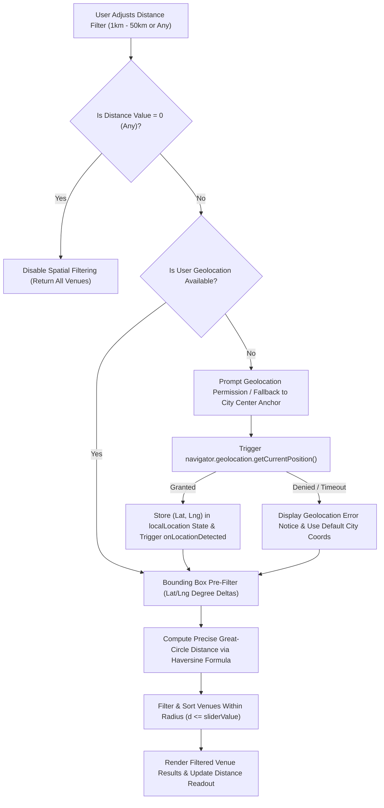
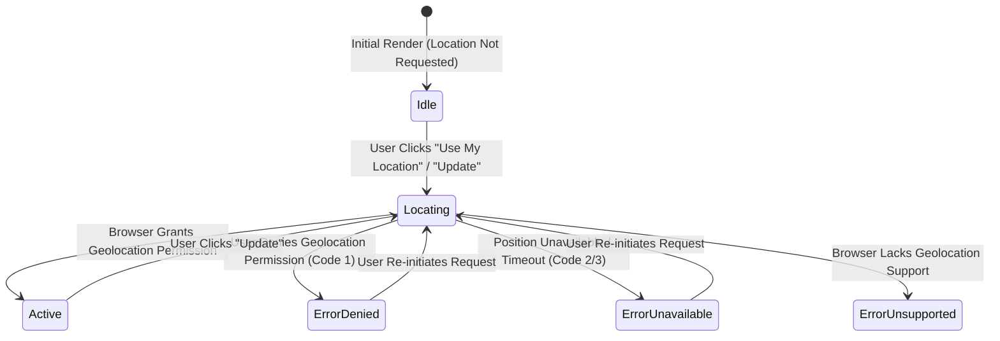

# DistanceFilterSlider Reference Guide & Geolocation Spatial Architecture

This document specifies the technical architecture, mathematical foundations, range boundaries, and geolocation permission handling for the `DistanceFilterSlider` component located in `src/components/venues/DistanceFilterSlider.tsx`.

---

## 1. Architectural Overview

The `DistanceFilterSlider` component provides an interactive UI control allowing users to filter workspace venues within a dynamic radial distance from their current GPS coordinates or a selected city center anchor.

### 1.1 Spatial Filtering Flow



---

## 2. Mathematical Specification: Haversine Distance Formula

Spatial distance between the user's current GPS location and target venue coordinates is computed using the **Haversine Formula** implemented in `src/lib/distance.ts` and `src/lib/utils.ts`.

### 2.1 Great-Circle Distance Equations

The Haversine formula calculates the shortest distance over the Earth's surface (the great-circle distance) between two points given their latitudes ($\phi_1, \phi_2$) and longitudes ($\lambda_1, \lambda_2$):

$$\Delta \phi = \frac{\pi}{180} \cdot (\phi_2 - \phi_1)$$

$$\Delta \lambda = \frac{\pi}{180} \cdot (\lambda_2 - \lambda_1)$$

$$a = \sin^2\left(\frac{\Delta \phi}{2}\right) + \cos\left(\frac{\pi}{180} \cdot \phi_1\right) \cdot \cos\left(\frac{\pi}{180} \cdot \phi_2\right) \cdot \sin^2\left(\frac{\Delta \lambda}{2}\right)$$

$$c = 2 \cdot \text{atan2}\left(\sqrt{a}, \sqrt{1 - a}\right)$$

$$d = R \cdot c$$

Where:
- $R = 6371\text{ km}$ (the mean spherical radius of Earth).
- $d$ is the calculated great-circle distance in kilometers.

### 2.2 TypeScript Reference Implementation (`src/lib/utils.ts`)

```typescript
export function calculateHaversineDistance(
  lat1: number,
  lon1: number,
  lat2: number,
  lon2: number,
): number {
  if (
    isNaN(lat1) ||
    isNaN(lon1) ||
    isNaN(lat2) ||
    isNaN(lon2)
  ) {
    return NaN;
  }

  // Clamp latitude to [-90, 90] and longitude to [-180, 180] for numerical stability
  const cLat1 = Math.max(-90, Math.min(90, lat1));
  const cLon1 = Math.max(-180, Math.min(180, lon1));
  const cLat2 = Math.max(-90, Math.min(90, lat2));
  const cLon2 = Math.max(-180, Math.min(180, lon2));

  const R = 6371; // Earth's mean radius in km
  const dLat = ((cLat2 - cLat1) * Math.PI) / 180;
  const dLon = ((cLon2 - cLon1) * Math.PI) / 180;

  const a =
    Math.sin(dLat / 2) * Math.sin(dLat / 2) +
    Math.cos((cLat1 * Math.PI) / 180) *
      Math.cos((cLat2 * Math.PI) / 180) *
      Math.sin(dLon / 2) *
      Math.sin(dLon / 2);

  const c = 2 * Math.atan2(Math.sqrt(a), Math.sqrt(1 - a));
  return R * c;
}
```

### 2.3 Bounding Box Optimization

To optimize distance calculations over large datasets, WorkSphere executes a $O(1)$ bounding box pre-filter prior to executing trigonometric Haversine calculations:

$$\Delta \phi_{\text{max}} = \frac{d_{\text{radius}}}{111.12\text{ km/degree}}$$

$$\Delta \lambda_{\text{max}} = \frac{d_{\text{radius}}}{111.12 \cdot \cos(\phi_{\text{user}})}$$

Only venues within $[\phi_{\text{user}} \pm \Delta \phi_{\text{max}}, \lambda_{\text{user}} \pm \Delta \lambda_{\text{max}}]$ are evaluated against full Haversine equations.

---

## 3. Component API & Props Specification

The `DistanceFilterSlider` component accepts the following props:

### 3.1 Interface Definition (`DistanceFilterSliderProps`)

```typescript
export interface DistanceFilterSliderProps {
  /** Selected distance in km (0 represents "Any Distance", or 1-50 in km) */
  value: number;
  /** Callback fired when slider value or preset chip changes */
  onChange: (distance: number) => void;
  /** Minimum slider value in km (default: 1) */
  min?: number;
  /** Maximum slider value in km (default: 50) */
  max?: number;
  /** Slider step increment in km (default: 1) */
  step?: number;
  /** Array of quick radius preset buttons (default: [5, 10, 25, 50]) */
  presets?: number[];
  /** Optional active user GPS coordinates */
  userLocation?: { lat: number; lng: number } | null;
  /** Callback fired when geolocation is successfully detected */
  onLocationDetected?: (loc: { lat: number; lng: number }) => void;
  /** Additional Tailwind styling classes */
  className?: string;
  /** Whether to render the location detection status prompt footer (default: true) */
  showLocationPrompt?: boolean;
}
```

### 3.2 Range Bounds & Preset Increments

| Parameter | Default Value | Bounds / Range | Description |
| :--- | :--- | :--- | :--- |
| `min` | `1` km | $1 \le \text{min} < \text{max}$ | Lower boundary for radius slider |
| `max` | `50` km | $\text{max} > \text{min}$ | Upper boundary for radius slider |
| `step` | `1` km | $\text{step} \ge 1$ | Slider granularity per tick |
| `presets` | `[5, 10, 25, 50]` | Sub-array of $[1, 50]$ | Quick-select radius chip buttons |
| `0` (Special Value) | N/A | `0` | Disables radius limit ("Any Distance") |

---

## 4. Geolocation Permission States & Error Handling

The component integrates directly with the W3C Web Geolocation API (`navigator.geolocation`) to acquire real-time positioning metrics.

### 4.1 Geolocation Configuration

Positioning requests pass strict accuracy and timeout configurations:

```typescript
navigator.geolocation.getCurrentPosition(
  onSuccessCallback,
  onErrorCallback,
  {
    enableHighAccuracy: true, // Uses GPS hardware if available
    timeout: 8000,            // 8-second request deadline
    maximumAge: 60000,        // Accept cached positions up to 60s old
  }
);
```

### 4.2 Permission Lifecycle Matrix



### 4.3 Error Handling & Fallback Messages

| Scenario / Code | Trigger Condition | UI State & User Notice | Fallback Behavior |
| :--- | :--- | :--- | :--- |
| `PERMISSION_DENIED` (Code 1) | User denies location dialog or blocks site permissions | Displays amber notice: `"Location permission denied. Distances may use city center."` | Distance calculation falls back to selected city center coordinates |
| `POSITION_UNAVAILABLE` (Code 2) | GPS hardware/network location service unreachable | Displays notice: `"Unable to retrieve your current location."` | Retains previous location or defaults to city anchor |
| `TIMEOUT` (Code 3) | Position fetch exceeds `8000ms` deadline | Displays notice: `"Unable to retrieve your current location."` | Disables loading spinner; permits retry click |
| Unsupported Browser / HTTP | `!("geolocation" in navigator)` or insecure HTTP | Displays notice: `"Geolocation is not supported by your browser"` | Disables location trigger button |

---

## 5. UI Integration & Usage Examples

### 5.1 Venue Search Drawer Integration (`src/components/venues/VenueSearchDrawer.tsx`)

```tsx
import React, { useState } from "react";
import { DistanceFilterSlider } from "@/components/venues/DistanceFilterSlider";
import { haversineKm } from "@/lib/distance";

export function VenueSearchDrawer({ venues }) {
  const [maxDistance, setMaxDistance] = useState<number>(10); // 10km default
  const [userCoords, setUserCoords] = useState<{ lat: number; lng: number } | null>(null);

  const filteredVenues = venues.filter((venue) => {
    if (maxDistance === 0 || !userCoords) return true;
    const distance = haversineKm(userCoords.lat, userCoords.lng, venue.lat, venue.lng);
    return distance <= maxDistance;
  });

  return (
    <div className="p-4 space-y-4">
      <DistanceFilterSlider
        value={maxDistance}
        onChange={setMaxDistance}
        min={1}
        max={50}
        presets={[5, 10, 25, 50]}
        userLocation={userCoords}
        onLocationDetected={setUserCoords}
      />
      
      <p className="text-sm font-medium">
        Showing {filteredVenues.length} venues within {maxDistance === 0 ? "any distance" : `${maxDistance} km`}
      </p>
    </div>
  );
}
```

---

## 6. Accessibility (a11y) & Testing

### 6.1 ARIA Attributes
- `role="slider"` automatically provided by native `<input type="range" />`.
- `aria-valuemin={1}`, `aria-valuemax={50}`, `aria-valuenow={value}` ensure screen reader accessibility.
- `aria-label="Distance filter slider (1km to 50km)"` describes the interactive element.

### 6.2 Test IDs (`data-testid`)
- `distance-filter-slider-container`: Root component container.
- `distance-slider`: Native range input element.
- `distance-readout`: Formatted distance badge (`10 km` or `Any Distance`).
- `reset-distance-btn`: Reset button to clear distance limit back to `0`.
- `preset-distance-[N]`: Preset chip buttons (`preset-distance-any`, `preset-distance-5`, etc.).
- `get-current-location-btn`: Geolocation trigger button.
