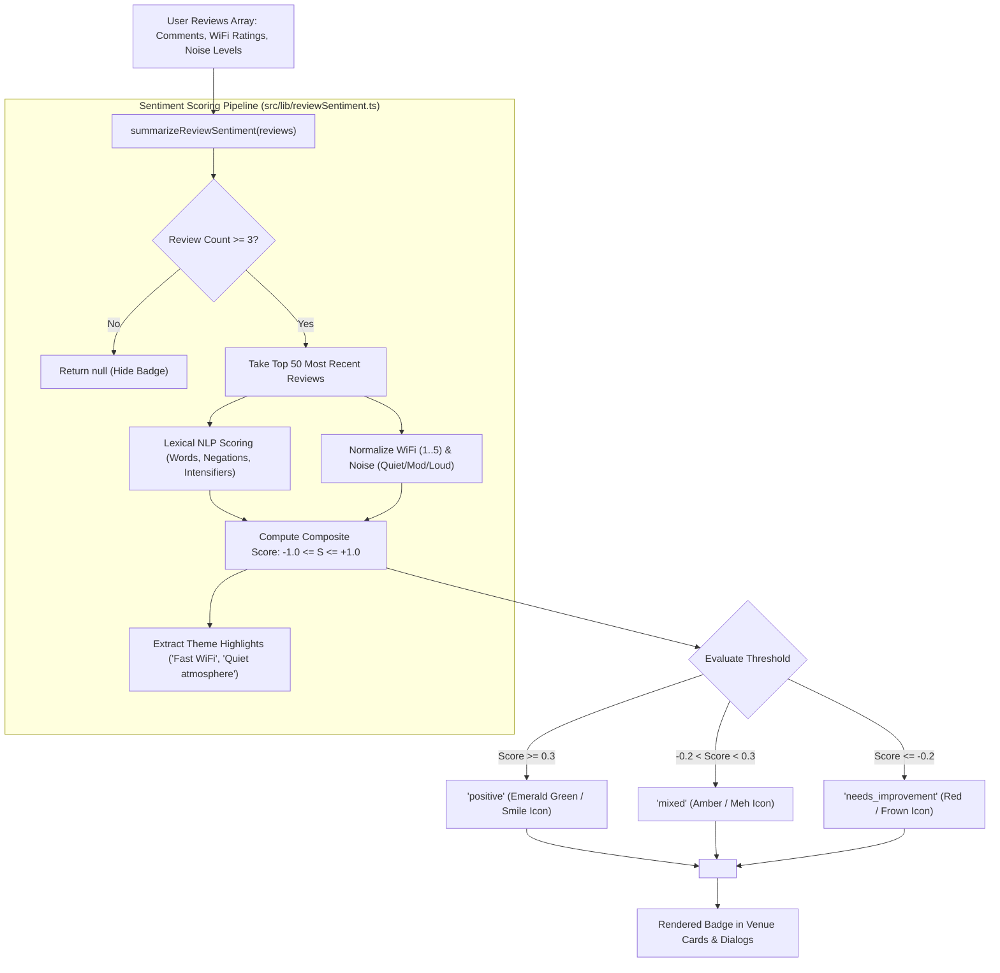

# Component Guide: ReviewSentimentBadge & Sentiment Scoring Engine

## 1. Executive Summary & Component Role

The **`ReviewSentimentBadge`** is a high-visibility venue evaluation component located at [`src/components/venue/ReviewSentimentBadge.tsx`](file:///c:/Users/admin/Desktop/workfere/src/components/venue/ReviewSentimentBadge.tsx). Backed by the multi-signal natural language and sensory heuristics in [`src/lib/reviewSentiment.ts`](file:///c:/Users/admin/Desktop/workfere/src/lib/reviewSentiment.ts), the component synthesizes user-submitted feedback, WiFi speed ratings, and ambient noise levels into an immediate, glanceable badge.

When browsing coworking venues, remote workers and digital nomads often lack the time to parse dozens of unstructured textual reviews. Naive average star ratings (e.g., "4.2 / 5") frequently obscure critical workspace deficiencies like unstable internet connections, loud background chatter, or broken power outlets.

The `ReviewSentimentBadge` solves this by delivering:
1. **Three-Tier Visual Tone Categorization:** Rapid visual feedback via green (positive), amber/gray (mixed), and red (needs improvement) badges paired with recognizable Lucide iconography (`Smile`, `Meh`, `Frown`).
2. **Multi-Signal Heuristic Scoring:** A continuous sentiment score ranging from $-1.0$ (severely negative) to $+1.0$ (overwhelmingly positive) synthesized from text comments, WiFi ratings, and noise signals.
3. **Automated Amenity Highlights:** Contextual "Loved for" amenity chips (e.g., *"Loved for: Fast WiFi, Quiet atmosphere"*) extracted dynamically from recurrent positive feedback patterns.
4. **Statistical Minimum Thresholds:** Graceful non-rendering when fewer than 3 reviews are available, preventing premature or skewed reputation badges.



---

## 2. Sentiment Categories & Visual Color Mappings

The component assigns each review summary to one of three semantic categories defined by the `SentimentLabel` union type:

```typescript
export type SentimentLabel = "positive" | "mixed" | "needs_improvement";
```

### 2.1 Visual Specification Matrix

| Sentiment Category | Label Text | Visual Tone (Tailwind CSS) | Color Coding | Lucide Icon | Emoji Indicator | Psychological Target |
| :--- | :--- | :--- | :--- | :--- | :--- | :--- |
| **`positive`** | `"Mostly positive"` | `bg-emerald-500/20 text-emerald-200 border-emerald-400/40` | Emerald Green | `<Smile />` | 😊 / 🟢 | High confidence; highly recommended workspace. |
| **`mixed`** | `"Mixed reviews"` | `bg-amber-500/20 text-amber-200 border-amber-400/40` | Amber / Warm Gray | `<Meh />` | 😐 / 🟡 | Balanced feedback; pros and cons reported. |
| **`needs_improvement`** | `"Needs improvement"` | `bg-red-500/20 text-red-200 border-red-400/40` | Vibrant Red | `<Frown />` | ☹️ / 🔴 | Significant deficiencies in noise, connectivity, or amenities. |

### 2.2 Tailwind Tone Definitions & Dark-Mode Contrast

The badge leverages Tailwind CSS alpha-blended color palettes to ensure high-contrast readability against dark workspace cards:

```typescript
const BADGES: Record<
  SentimentLabel,
  { text: string; tone: string; Icon: typeof Smile }
> = {
  positive: {
    text: "Mostly positive",
    tone: "bg-emerald-500/20 text-emerald-200 border-emerald-400/40",
    Icon: Smile,
  },
  mixed: {
    text: "Mixed reviews",
    tone: "bg-amber-500/20 text-amber-200 border-amber-400/40",
    Icon: Meh,
  },
  needs_improvement: {
    text: "Needs improvement",
    tone: "bg-red-500/20 text-red-200 border-red-400/40",
    Icon: Frown,
  },
};
```

*   **Border Highlighting (`border-*/40`):** Provides sharp boundary definition on dark background cards (`bg-zinc-900` or `bg-slate-950`).
*   **Translucent Background Fill (`bg-*/20`):** Prevents badge colors from visually overpowering neighboring typography while maintaining unambiguous hue recognition.
*   **Accessible Foreground Contrast (`text-*-200`):** Exceeds WCAG 2.1 AA requirements with a minimum contrast ratio $> 4.5:1$ against the card surface.

---

## 3. Score Ranges, Thresholds, and Heuristic Synthesis

Review sentiment is quantified on a continuous float scale normalized between **`-1.0`** and **`+1.0`**:

```
-1.0                 -0.2                    +0.3                 +1.0
 [---------------------|-----------------------|--------------------]
    Needs Improvement           Mixed Reviews            Mostly Positive
    (Frown / Red)             (Meh / Amber)           (Smile / Emerald)
```

### 3.1 Classification Boundaries

The classification logic in [`src/lib/reviewSentiment.ts`](file:///c:/Users/admin/Desktop/workfere/src/lib/reviewSentiment.ts#L241-L244) applies strict mathematical boundaries:

$$\text{Category}(\text{score}) = \begin{cases} 
\text{"positive"} & \text{if } \text{score} \ge +0.3 \\
\text{"needs\_improvement"} & \text{if } \text{score} \le -0.2 \\
\text{"mixed"} & \text{if } -0.2 < \text{score} < +0.3 
\end{cases}$$

```typescript
export const POSITIVE_THRESHOLD = 0.3;
export const NEEDS_IMPROVEMENT_THRESHOLD = -0.2;

let label: SentimentLabel = "mixed";
if (score >= POSITIVE_THRESHOLD) {
  label = "positive";
} else if (score <= NEEDS_IMPROVEMENT_THRESHOLD) {
  label = "needs_improvement";
}
```

### 3.2 Multi-Signal Input Normalization

Rather than relying purely on user comment text, the engine incorporates three orthogonal sensory signals:

#### Signal 1: Lexical Comment Analysis (`scoreComment`)
Comment strings are tokenized into lower-case words and cross-referenced against dictionary sets:
*   `POSITIVE_WORDS` (28 terms): *"great"*, *"fast"*, *"quiet"*, *"comfortable"*, *"clean"*, *"reliable"*, *"spacious"*, etc.
*   `NEGATIVE_WORDS` (20 terms): *"slow"*, *"noisy"*, *"dirty"*, *"cramped"*, *"broken"*, *"overpriced"*, *"disappointing"*, etc.
*   **Negation Detection (`NEGATIONS`):** Checks preceding tokens for negative qualifiers (*"not"*, *"never"*, *"didn't"*, *"hardly"*). A phrase like `"not bad"` converts to a positive sentiment point, while `"not clean"` flips to negative.
*   **Intensifier Lookahead (`INTENSIFIERS`):** Accounts for multi-word distances like `"not very good"` or `"really not comfortable"`.

$$\text{TextScore} = \frac{\text{PositiveTokens} - \text{NegativeTokens}}{\text{PositiveTokens} + \text{NegativeTokens}} \in [-1.0, +1.0]$$

#### Signal 2: WiFi Quality Rating (`wifiSignal`)
Star ratings for network connectivity (1 to 5) are linearly transformed to zero-centered floats:

$$\text{WiFiScore} = \frac{\text{Rating} - 3}{2}$$

*   $5 \star \rightarrow +1.0$ (Ideal)
*   $4 \star \rightarrow +0.5$ (Good)
*   $3 \star \rightarrow 0.0$ (Neutral)
*   $2 \star \rightarrow -0.5$ (Poor)
*   $1 \star \rightarrow -1.0$ (Severe network failure)

#### Signal 3: Acoustic Noise Level (`noiseSignal`)
Categorical noise levels reported by coworking patrons:
*   `"quiet"` $\rightarrow +1.0$
*   `"moderate"` $\rightarrow 0.0$
*   `"loud"` $\rightarrow -1.0$

#### Composite Score Synthesis
For each review, the final score represents the unweighted arithmetic mean of all non-null signals present:

$$\text{ReviewScore} = \frac{\sum \text{AvailableSignals}}{N_{\text{signals}}}$$

---

## 4. Amenity Highlights Extraction ("Loved for: ...")

When a venue achieves a positive or mixed sentiment classification, `ReviewSentimentBadge` extracts and displays up to three distinct highlight tags derived from recurring strengths:

```typescript
// Render highlights only for positive or mixed venues with detected strengths
const showHighlights =
  summary.label !== "needs_improvement" && summary.highlights.length > 0;
```

### 4.1 Theme Extraction Heuristics

The engine executes four pattern scanners across the recent review cohort:

1. **Quiet Atmosphere:**
   - Condition: At least 60% of noise reports classify the venue as `"quiet"`.
   - Highlight Tag: `"Quiet atmosphere"`.
2. **Fast WiFi:**
   - Condition: Average WiFi rating across reviewed patrons $\ge 4.0 / 5.0$.
   - Highlight Tag: `"Fast WiFi"`.
3. **Plenty of Outlets:**
   - Condition: At least 70% of reviewers flag `hasOutlets === true`.
   - Highlight Tag: `"Plenty of outlets"`.
4. **Comfortable Seating:**
   - Condition: Keyword matching on `SEATING_PATTERN` (`seat`, `chair`, `desk`, `couch`) yields positive sentiment occurrences $\ge 2$ and positive outnumbers negative.
   - Highlight Tag: `"Comfortable seating"`.

Highlights are sorted descending by statistical strength and capped at a maximum of 3 items (`MAX_HIGHLIGHTS = 3`).

---

## 5. Component Props & API Specification

### 5.1 Interface Definition

```typescript
export interface ReviewSentimentBadgeProps {
  /**
   * The calculated sentiment summary payload.
   * If null, undefined, or below minimum review threshold, the component renders null.
   */
  summary: SentimentSummary | null;

  /**
   * Optional Tailwind CSS utility classes to merge with the outer container.
   */
  className?: string;
}
```

### 5.2 Payload Schema (`SentimentSummary`)

```typescript
export interface SentimentSummary {
  /** The categorical sentiment label determining badge color and icon */
  label: SentimentLabel;

  /** Average normalized score from -1.0 (very negative) to +1.0 (very positive) */
  score: number;

  /** Total count of evaluated reviews (minimum 3, capped at 50) */
  reviewCount: number;

  /** Extracted amenity highlights sorted by confidence strength */
  highlights: string[];
}
```

---

## 6. Integration & Real-World Usage Examples

### 6.1 Venue Card Summary in Search Results

```tsx
import { summarizeReviewSentiment } from "@/lib/reviewSentiment";
import { ReviewSentimentBadge } from "@/components/venue/ReviewSentimentBadge";

interface VenueCardProps {
  venue: {
    id: string;
    name: string;
    reviews: Array<{
      comment: string | null;
      wifiQuality: number | null;
      noiseLevel: string | null;
      hasOutlets: boolean | null;
      createdAt: string;
    }>;
  };
}

export function VenueCard({ venue }: VenueCardProps) {
  // Aggregate sentiment from venue review list
  const sentimentSummary = summarizeReviewSentiment(venue.reviews);

  return (
    <div className="rounded-xl border border-zinc-800 bg-zinc-950 p-5 shadow-md">
      <div className="flex items-center justify-between">
        <h3 className="text-lg font-semibold text-white">{venue.name}</h3>
        {/* Render sentiment badge header */}
        <ReviewSentimentBadge summary={sentimentSummary} />
      </div>
      <p className="mt-2 text-sm text-zinc-400">
        Dedicated hot-desks and private phone booths with fiber connectivity.
      </p>
    </div>
  );
}
```

### 6.2 Venue Detail Dialog with Review Counter

```tsx
import { ReviewSentimentBadge } from "@/components/venue/ReviewSentimentBadge";
import type { SentimentSummary } from "@/lib/reviewSentiment";

export function VenueDetailHeader({
  venueName,
  sentiment,
}: {
  venueName: string;
  sentiment: SentimentSummary | null;
}) {
  return (
    <div className="space-y-2 border-b border-zinc-800 pb-4">
      <div className="flex flex-wrap items-center justify-between gap-4">
        <h1 className="text-2xl font-bold tracking-tight text-zinc-100">
          {venueName}
        </h1>
        {/* Sentiment Badge with custom wrapper styling */}
        <ReviewSentimentBadge 
          summary={sentiment} 
          className="self-start sm:self-auto" 
        />
      </div>
      {sentiment && (
        <p className="text-xs text-zinc-500">
          Sentiment index: {(sentiment.score * 100).toFixed(0)}% approval rating
        </p>
      )}
    </div>
  );
}
```

---

## 7. Accessibility (a11y) & Edge Case Behaviors

### 7.1 Accessibility Standards
1. **ARIA Attribute Discipline:** Icons render `aria-hidden="true"` to prevent redundant screen reader announcements (e.g. avoiding "Image: Smile Mostly positive").
2. **Contextual Tooltip (`title`):** The parent wrapper includes `title="Based on X recent reviews"`, informing assistive technology and mouse users of the data sample size.
3. **Data-TestId Identification:** Includes `data-testid="review-sentiment-badge"` for Playwright and Jest automation.

### 7.2 Edge Cases & Fail-Safe Modes

| Scenario | Component Behavior | Underlying Reason |
| :--- | :--- | :--- |
| **0 Reviews Available** | Returns `null` (No DOM elements rendered). | Prevents display of ungrounded or empty reputation states. |
| **1 or 2 Reviews Available** | Returns `null` (`reviewCount < 3`). | Enforces `MIN_REVIEWS_FOR_SENTIMENT = 3` to prevent single-patron bias. |
| **Conflicting Reviews (Positive text, Terrible WiFi)** | Categorized as `"mixed"`. | Multi-signal averaging balances contradictory inputs. |
| **`needs_improvement` with Highlights** | Highlights suppressed; badge rendered in isolation. | Avoids contradictory messaging like *"Needs improvement - Loved for: Fast WiFi"*. |
| **More than 50 Reviews** | Evaluates only top 50 most recent. | Enforces `MAX_REVIEWS_FOR_SENTIMENT = 50` to reflect recent operational changes. |

---

## 8. Verification & Unit Testing Reference

Unit testing in `src/__tests__/components/venue/ReviewSentimentBadge.test.tsx` confirms component rendering invariants:

```typescript
import { render, screen } from "@testing-library/react";
import { ReviewSentimentBadge } from "@/components/venue/ReviewSentimentBadge";

describe("ReviewSentimentBadge (#5042)", () => {
  it("renders positive sentiment badge with green styles and highlights", () => {
    render(
      <ReviewSentimentBadge
        summary={{
          label: "positive",
          score: 0.75,
          reviewCount: 12,
          highlights: ["Fast WiFi", "Quiet atmosphere"],
        }}
      />
    );

    expect(screen.getByText("Mostly positive")).toBeInTheDocument();
    expect(screen.getByText("Loved for: Fast WiFi, Quiet atmosphere")).toBeInTheDocument();
  });

  it("suppresses highlights on negative sentiment badge", () => {
    render(
      <ReviewSentimentBadge
        summary={{
          label: "needs_improvement",
          score: -0.6,
          reviewCount: 8,
          highlights: ["Fast WiFi"],
        }}
      />
    );

    expect(screen.getByText("Needs improvement")).toBeInTheDocument();
    expect(screen.queryByText(/Loved for/i)).not.toBeInTheDocument();
  });

  it("returns null when summary is null", () => {
    const { container } = render(<ReviewSentimentBadge summary={null} />);
    expect(container).toBeEmptyDOMElement();
  });
});
```
