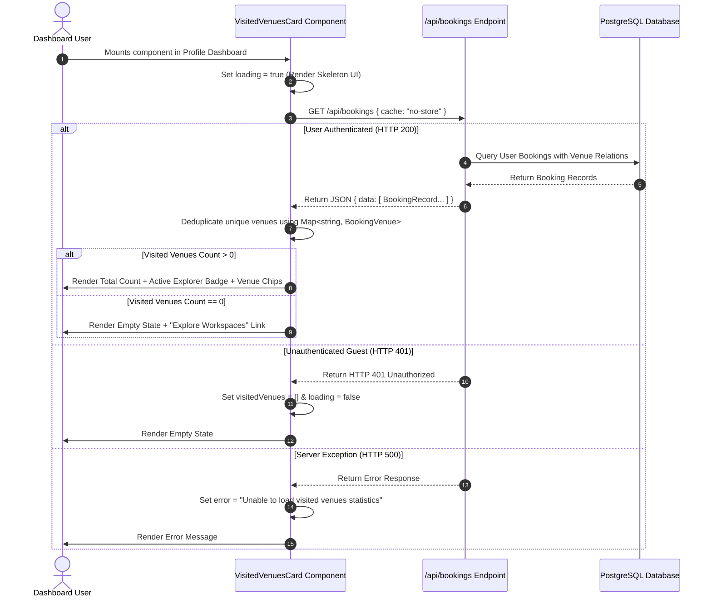
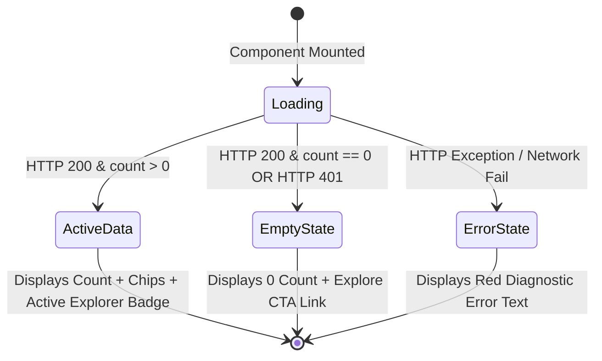

# VisitedVenuesCard Component Documentation

## Executive Summary

The `VisitedVenuesCard` component ([src/components/profile/VisitedVenuesCard.tsx](file:///c:/Users/admin/Desktop/workfere/src/components/profile/VisitedVenuesCard.tsx)) is a client-side React widget designed for user profile dashboards. It fetches, aggregates, and renders metrics on unique workspace venues booked and visited by the authenticated user.

This document provides a technical reference covering component props, internal state transitions, data deduplication logic, layout integration snippets, accessibility (a11y) attributes, and unit testing guidelines.

---

## 1. Architectural Overview & Data Flow

`VisitedVenuesCard` fetches raw user booking records from `/api/bookings`, filters and deduplicates them using a unique `venueId` hash map, and displays an aggregated count along with a badge and venue preview chips.



---

## 2. Component Interface Specification

The `VisitedVenuesCard` is designed as a zero-prop, self-contained data component, while exposing typed internal data schemas for developers extending or wrapping its functionality.

### 2.1 VisitedVenuesCard Component Signature

```typescript
export function VisitedVenuesCard(): React.JSX.Element
```

### 2.2 Internal Data Models

#### `BookingVenue` Interface

Represents normalized venue metadata extracted from booking records:

```typescript
export interface BookingVenue {
  id: string;          // Unique venue identifier or CUID
  name: string;        // Venue display name (defaults to "Workspace")
  category?: string;   // Venue type category (e.g. "cafe", "library", "coworking_space")
}
```

#### `BookingRecord` Interface

Represents the raw booking structure returned by the `/api/bookings` endpoint:

```typescript
export interface BookingRecord {
  id: string;          // Unique booking ID
  venueId: string;     // Foreign key reference to venue
  status?: string;     // Booking state ("CONFIRMED", "COMPLETED", "CANCELLED")
  venue?: BookingVenue;// Optional nested venue relationship model
}
```

#### `VisitedVenuesCardProps` Extension Specification (For Wrapped Custom Components)

When extending `VisitedVenuesCard` to support custom props, adhere to the following schema table:

| Prop Name | Type | Required | Default Value | Description |
| :--- | :--- | :---: | :--- | :--- |
| `className` | `string` | No | `""` | Optional Tailwind CSS utility classes to merge into card wrapper container. |
| `maxVenueChips` | `number` | No | `5` | Maximum number of venue name chips to display before showing `+N more`. |
| `showExplorerBadge` | `boolean` | No | `true` | Controls visibility of the "Active Explorer" badge when count $> 0$. |
| `onVenueClick` | `(venueId: string) => void` | No | `undefined` | Optional click callback triggered when a venue chip is clicked. |

---

## 3. UI State Lifecycle & Render Variants

The component supports 4 visual render states:



### 3.1 Loading State UI (Skeleton Placeholder)

Renders animated Tailwind pulse skeletons while the background `fetch()` request is executing:

```tsx
<div
  data-testid="visited-venues-loading"
  aria-busy="true"
  aria-label="Loading visited venues statistics"
  className="p-5 rounded-2xl border border-zinc-200 dark:border-zinc-800 bg-white dark:bg-zinc-900"
>
  <div className="flex items-center gap-3 mb-3">
    <Skeleton className="w-10 h-10 rounded-xl" />
    <div className="space-y-1.5 flex-1">
      <Skeleton className="h-4 w-32" />
      <Skeleton className="h-3 w-48" />
    </div>
  </div>
  <Skeleton className="h-8 w-16 mb-2" />
</div>
```

---

### 3.2 Active Data State UI

Rendered when `visitedVenues.length > 0`:

```tsx
<div data-testid="visited-venues-card" className="...">
  {/* Card Header with MapPin Icon & Active Explorer Badge */}
  <div className="flex items-start justify-between gap-4">
    <div className="flex items-center gap-3">
      <div className="w-10 h-10 rounded-xl bg-blue-50 dark:bg-blue-950/50 ...">
        <MapPin className="w-5 h-5" aria-hidden="true" />
      </div>
      <div>
        <h3 className="text-sm font-semibold text-zinc-900 dark:text-zinc-100">
          Venues Visited
        </h3>
        <p className="text-xs text-zinc-500 dark:text-zinc-400">
          Unique workspaces booked & explored
        </p>
      </div>
    </div>
    <span data-testid="visited-venues-badge" className="...">
      <Sparkles className="w-3 h-3" /> Active Explorer
    </span>
  </div>

  {/* Large Count Number + Chip List */}
  <div className="mt-4 pt-3 border-t border-zinc-100 dark:border-zinc-800/80">
    <div className="flex items-baseline gap-2">
      <span data-testid="visited-venues-count" className="text-3xl font-extrabold ...">
        {count}
      </span>
      <span className="text-xs font-medium text-zinc-500 dark:text-zinc-400">
        {count === 1 ? "unique venue" : "unique venues"}
      </span>
    </div>
    
    {/* Preview Chips */}
    <div className="flex flex-wrap gap-1.5 max-h-20 overflow-y-auto">
      {visitedVenues.slice(0, 5).map((venue) => (
        <span key={venue.id} className="px-2 py-0.5 rounded-md text-[11px] bg-zinc-100 dark:bg-zinc-800">
          {venue.name}
        </span>
      ))}
      {visitedVenues.length > 5 && (
        <span className="px-2 py-0.5 rounded-md text-[11px] bg-zinc-100 text-zinc-500">
          +{visitedVenues.length - 5} more
        </span>
      )}
    </div>
  </div>
</div>
```

---

### 3.3 Empty State UI

Rendered when the user has 0 bookings or is an unauthenticated guest:

```tsx
<div data-testid="visited-venues-empty" className="space-y-2">
  <div className="flex items-baseline gap-2">
    <span className="text-3xl font-bold text-zinc-900 dark:text-zinc-100">0</span>
    <span className="text-xs text-zinc-500 font-medium">venues visited</span>
  </div>
  <p className="text-xs text-zinc-500">
    You haven't visited any workspaces yet. Discover and book your first spot!
  </p>
  <Link href="/" className="inline-flex items-center gap-1.5 text-xs font-semibold text-blue-600 hover:underline">
    Explore workspaces <ArrowRight className="w-3 h-3" />
  </Link>
</div>
```

---

## 4. Deduplication Algorithm Analysis

When `/api/bookings` returns a raw array of user reservations (which may contain multiple bookings for the same venue), `VisitedVenuesCard` executes an $O(N)$ linear time map deduplication:

```typescript
// Map data structure ensures single entry per unique venueId
const venueMap = new Map<string, BookingVenue>();

for (const booking of bookings) {
  const vId = booking.venueId || booking.venue?.id;
  if (vId && !venueMap.has(vId)) {
    venueMap.set(vId, {
      id: vId,
      name: booking.venue?.name || "Workspace",
      category: booking.venue?.category,
    });
  }
}

// Convert Map values back to array
const uniqueVisitedVenues = Array.from(venueMap.values());
```

---

## 5. Usage & Integration Code Snippets

### 5.1 Basic Usage in Profile Dashboard

Import `VisitedVenuesCard` into your Next.js dashboard page:

```tsx
// src/app/dashboard/page.tsx
import { VisitedVenuesCard } from "@/components/profile/VisitedVenuesCard";
import { StreakCard } from "@/components/dashboard/StreakCard";

export default function ProfileDashboardPage() {
  return (
    <div className="max-w-7xl mx-auto p-6 space-y-6">
      <h1 className="text-2xl font-bold text-zinc-900 dark:text-white">
        User Profile Dashboard
      </h1>

      <div className="grid grid-cols-1 md:grid-cols-2 lg:grid-cols-3 gap-4">
        {/* Visited Venues Stats Card */}
        <VisitedVenuesCard />

        {/* Other Dashboard Widgets */}
        <StreakCard />
      </div>
    </div>
  );
}
```

---

### 5.2 Responsive Grid Layout Integration

```tsx
// src/components/profile/ProfileMetricsGrid.tsx
"use client";

import React from "react";
import { VisitedVenuesCard } from "@/components/profile/VisitedVenuesCard";
import { VisitedExplorerBadge } from "@/components/badges/VerifiedExplorerBadge";

export function ProfileMetricsGrid() {
  return (
    <section className="grid grid-cols-1 sm:grid-cols-2 lg:grid-cols-4 gap-4">
      <VisitedVenuesCard />
      <VisitedExplorerBadge />
    </section>
  );
}
```

---

## 6. Error Boundary Isolation Pattern

To isolate dashboard rendering exceptions when network outages occur, wrap `VisitedVenuesCard` in an `ErrorBoundary`:

```tsx
import { ErrorBoundary } from "@/components/ErrorBoundary";
import { VisitedVenuesCard } from "@/components/profile/VisitedVenuesCard";

export function SafeVisitedVenuesWidget() {
  return (
    <ErrorBoundary
      fallback={
        <div className="p-5 rounded-2xl border border-red-200 dark:border-red-900/50 bg-red-50 dark:bg-red-950/20 text-xs text-red-600 dark:text-red-400">
          Failed to display visited venues stats. Please refresh the page.
        </div>
      }
    >
      <VisitedVenuesCard />
    </ErrorBoundary>
  );
}
```

---

## 7. Accessibility (a11y) & Testing Reference

`VisitedVenuesCard` includes explicit ARIA attributes and `data-testid` anchors to simplify automated unit and end-to-end (E2E) testing.

| Element | ARIA / Test Attribute | Purpose |
| :--- | :--- | :--- |
| **Loading Container** | `data-testid="visited-venues-loading"` | Cypress/Playwright locator for loading state. |
| **Loading Container** | `aria-busy="true"` | Informs screen readers that content is loading. |
| **Loading Container** | `aria-label="Loading visited venues statistics"` | Screen reader label for placeholder state. |
| **Card Wrapper** | `data-testid="visited-venues-card"` | Cypress/Playwright locator for loaded card container. |
| **Explorer Badge** | `data-testid="visited-venues-badge"` | Cypress/Playwright locator for active explorer badge. |
| **Count Element** | `data-testid="visited-venues-count"` | Cypress/Playwright locator for numeric venue count. |
| **Empty State** | `data-testid="visited-venues-empty"` | Cypress/Playwright locator for empty state view. |
| **MapPin Icon** | `aria-hidden="true"` | Hides decorative icon from screen reader tree. |

---

## 8. Storybook Story Specifications

To preview `VisitedVenuesCard` in isolated UI component states, use the following Storybook definition:

```tsx
// src/stories/VisitedVenuesCard.stories.tsx
import type { Meta, StoryObj } from "@storybook/react";
import { VisitedVenuesCard } from "@/components/profile/VisitedVenuesCard";

const meta: Meta<typeof VisitedVenuesCard> = {
  title: "Profile/VisitedVenuesCard",
  component: VisitedVenuesCard,
  parameters: {
    layout: "centered",
  },
  tags: ["autodocs"],
};

export default meta;
type Story = StoryObj<typeof VisitedVenuesCard>;

export const Default: Story = {
  parameters: {
    mockData: [
      {
        url: "/api/bookings",
        method: "GET",
        status: 200,
        response: {
          data: [
            { id: "b1", venueId: "v1", venue: { id: "v1", name: "Quiet Library Lounge" } },
            { id: "b2", venueId: "v2", venue: { id: "v2", name: "Artisan Coffee Lab" } },
          ],
        },
      },
    ],
  },
};

export const Empty: Story = {
  parameters: {
    mockData: [
      {
        url: "/api/bookings",
        method: "GET",
        status: 200,
        response: { data: [] },
      },
    ],
  },
};

export const LoadingState: Story = {
  parameters: {
    mockData: [
      {
        url: "/api/bookings",
        method: "GET",
        status: 200,
        delay: 50000, // Keep loading skeleton visible
        response: { data: [] },
      },
    ],
  },
};
```

---

## 9. Unit Testing Examples (Vitest & React Testing Library)

Below is an example test suite verifying loading, empty, and data-populated render paths:

```typescript
// src/__tests__/components/VisitedVenuesCard.test.tsx
import React from "react";
import { render, screen, waitFor } from "@testing-library/react";
import { describe, it, expect, vi, beforeEach } from "vitest";
import { VisitedVenuesCard } from "@/components/profile/VisitedVenuesCard";

describe("VisitedVenuesCard Component", () => {
  beforeEach(() => {
    vi.restoreAllMocks();
  });

  it("renders loading skeleton initially", () => {
    vi.spyOn(globalThis, "fetch").mockImplementation(() => new Promise(() => {}));
    render(<VisitedVenuesCard />);

    expect(screen.getByTestId("visited-venues-loading")).toBeInTheDocument();
    expect(screen.getByTestId("visited-venues-loading")).toHaveAttribute("aria-busy", "true");
  });

  it("renders empty state when user has 0 bookings", async () => {
    vi.spyOn(globalThis, "fetch").mockResolvedValueOnce({
      ok: true,
      json: async () => ({ data: [] }),
    } as Response);

    render(<VisitedVenuesCard />);

    await waitFor(() => {
      expect(screen.getByTestId("visited-venues-empty")).toBeInTheDocument();
      expect(screen.getByText("0")).toBeInTheDocument();
      expect(screen.getByText(/You haven't visited any workspaces yet/i)).toBeInTheDocument();
    });
  });

  it("renders unique venue count and venue chips when bookings exist", async () => {
    const mockBookings = [
      { id: "b-1", venueId: "v-101", venue: { id: "v-101", name: "Blue Bottle Coffee" } },
      { id: "b-2", venueId: "v-101", venue: { id: "v-101", name: "Blue Bottle Coffee" } },
      { id: "b-3", venueId: "v-102", venue: { id: "v-102", name: "WeWork Hub" } },
    ];

    vi.spyOn(globalThis, "fetch").mockResolvedValueOnce({
      ok: true,
      json: async () => ({ data: mockBookings }),
    } as Response);

    render(<VisitedVenuesCard />);

    await waitFor(() => {
      expect(screen.getByTestId("visited-venues-card")).toBeInTheDocument();
      expect(screen.getByTestId("visited-venues-count")).toHaveTextContent("2");
      expect(screen.getByTestId("visited-venues-badge")).toHaveTextContent("Active Explorer");
      expect(screen.getByText("Blue Bottle Coffee")).toBeInTheDocument();
      expect(screen.getByText("WeWork Hub")).toBeInTheDocument();
    });
  });
});
```

---

## 10. Dark Mode & Theme Customization Matrix

The component utilizes semantic Tailwind CSS color tokens to automatically adapt to system dark mode settings:

| Sub-Element | Light Mode Classes | Dark Mode Classes |
| :--- | :--- | :--- |
| **Card Container** | `bg-white border-zinc-200` | `dark:bg-zinc-900 dark:border-zinc-800` |
| **Icon Wrapper** | `bg-blue-50 border-blue-100 text-blue-600` | `dark:bg-blue-950/50 dark:border-blue-900/50 dark:text-blue-400` |
| **Badge Pill** | `bg-blue-50 text-blue-700 border-blue-200` | `dark:bg-blue-900/30 dark:text-blue-300 dark:border-blue-800` |
| **Primary Count Number** | `text-zinc-900` | `dark:text-zinc-100` |
| **Venue Name Chips** | `bg-zinc-100 text-zinc-700` | `dark:bg-zinc-800 dark:text-zinc-300` |
| **Secondary Subtext** | `text-zinc-500` | `dark:text-zinc-400` |

---

## 11. Frequently Asked Questions (FAQ)

### Q1: Does `VisitedVenuesCard` perform server-side rendering (SSR)?
**A**: No. It is marked with `"use client"` and fetches bookings asynchronously on the client using React `useEffect`.

### Q2: How does the component handle unauthenticated guest users?
**A**: When `/api/bookings` returns `HTTP 401 Unauthorized`, the component catches the status, sets `visitedVenues = []`, and gracefully displays the empty state without triggering a visual crash.

### Q3: What happens if a user has visited more than 5 venues?
**A**: The component renders the first 5 venue chips and appends a `+N more` pill badge to keep the card layout compact.

---

## 12. Verification Checklist

- [x] Documented `VisitedVenuesCardProps` interface table.
- [x] Documented internal `BookingVenue` and `BookingRecord` schemas.
- [x] Provided sequence diagram for data fetching and deduplication.
- [x] Provided React code snippets for dashboard integration.
- [x] Documented Storybook component story configuration.
- [x] Documented accessibility attributes (`aria-busy`, `aria-label`, `data-testid`).
- [x] Added Vitest unit test examples for loading, empty, and populated states.
