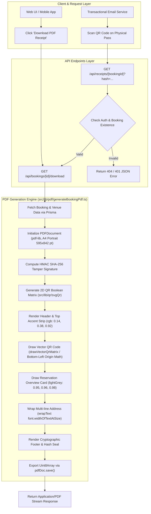
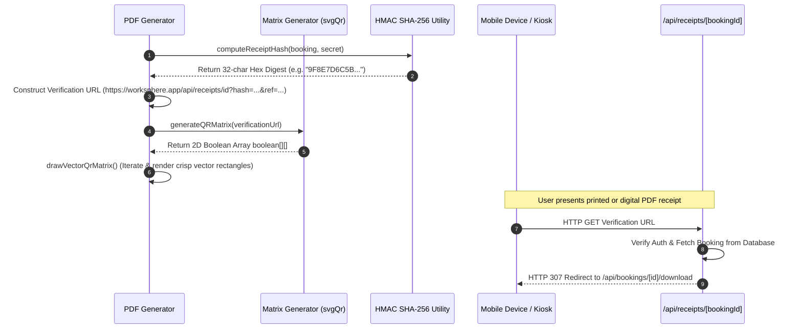

# Engineering Specification: Booking Itinerary & PDF Verification System

## 1. Executive Summary & Architectural Overview

The WorkSphere Booking Itinerary and PDF Generation System provides publication-ready, tamper-evident digital receipts and access passes for workspace reservations. Operating at the intersection of PDF rendering, vector graphics matrix math, and cryptographic authentication, this subsystem allows digital nomads, enterprise teams, and venue operators to generate, download, and verify physical or digital booking documentation.

Core functionality is implemented across three primary modules in the codebase:
1. **Primary PDF Generator (`src/lib/pdf/generateBookingPdf.ts`):** Constructs official booking confirmation receipts with top accent styling, venue overview cards, guest metadata, dynamic multi-line address text wrapping, and an embedded 2D vector QR verification code.
2. **Itinerary & Access Pass Exporter (`src/lib/export/domain/itineraryExporter.ts`):** Produces publication-ready venue access passes equipped with status badges, amenity icons, check-in arrival protocols, and anti-forgery SHA-256 digital seals.
3. **Bridge & Guest List Exporter (`src/lib/pdfGenerator.ts`):** Provides fallback receipt rendering, multi-part address parsing (`formatUserAddress`), PDF document builder abstractions, and printable guest roster exports for event managers.



---

## 2. PDF Coordinate Grid, Margins & Page Layout Geometry

PDF rendering via `pdf-lib` uses a Cartesian coordinate system where the origin **$(0, 0)$** is positioned at the **bottom-left corner** of the page. This differs from web DOM pixel space where $(0,0)$ resides at the top-left corner. Vertical coordinates ($Y$-axis values) decrease as elements move down the page.

### 2.1 Standard Page Dimensions & Geometry

All generated documents target the international standard **ISO A4 Portrait** page specification.

| Dimension | Points (pt) | Inches (in) | Millimeters (mm) | Pixels (72 DPI) |
| :--- | :--- | :--- | :--- | :--- |
| **Page Width** | `595.28 pt` (rounded to `595 pt`) | `8.27 in` | `210 mm` | `595 px` |
| **Page Height** | `841.89 pt` (rounded to `842 pt`) | `11.69 in` | `297 mm` | `842 px` |
| **Left / Right Margins** | `45 pt` | `0.625 in` | `15.87 mm` | `45 px` |
| **Printable Content Width** | `505 pt` (`595 - 45*2`) | `7.02 in` | `178.26 mm` | `505 px` |
| **Top Margin** | `42 pt` (Y = `800 pt`) | `0.58 in` | `14.81 mm` | `42 px` |
| **Bottom Margin** | `32 pt` (Y = `32 pt`) | `0.44 in` | `11.29 mm` | `32 px` |

### 2.2 Coordinate Grid Diagram

```
 (0, 842) Top-Left Corner                                                (595, 842) Top-Right Corner
    +-----------------------------------------------------------------------------------+ Y = 842
    |======================= TOP ACCENT BAR (Height: 8-10pt) ========================| Y = 834
    |                                                                                   |
    |  (Margin X: 45)                                            (QR Box X: 456)        |
    |  WORKSPHERE                                              +-----------------+      | Y = 800
    |  BOOKING CONFIRMATION & RECEIPT                          |  QR CODE MATRIX |      | Y = 785
    |  Ref: WS-10029384                                        |  (84x84 pt)     |      | Y = 771
    |                                                          +-----------------+      |
    |                                                          Scan to verify           | Y = 710
    |-----------------------------------------------------------------------------------| Y = 692
    |                                                                                   |
    |  +-----------------------------------------------------------------------------+  | Y = 667
    |  | RESERVATION OVERVIEW                                    Status: CONFIRMED   |  |
    |  | Date: 2026-10-12                        Time: 09:00                       |  |
    |  | Duration: 480 mins                      Seat / Desk: #DESK-42             |  |
    |  | Total Paid: $45.00                                                          |  |
    |  +-----------------------------------------------------------------------------+  | Y = 572
    |                                                                                   |
    |  VENUE INFORMATION                                                                | Y = 527
    |  -------------------------------------------------------------------------------  |
    |  Urban WorkHub · (COWORKING SPACE)                                                | Y = 493
    |  Address: 100 Innovation Boulevard, Suite 400, Tech District, San Francisco, CA    | Y = 477
    |                                                                                   |
    |  GUEST DETAILS                                                                    | Y = 449
    |  -------------------------------------------------------------------------------  |
    |  Guest Name: Alex Rivera                                                          | Y = 415
    |  Email: alex.rivera@example.com                                                   | Y = 399
    |                                                                                   |
    |  +-----------------------------------------------------------------------------+  | Y = 364
    |  | CRYPTOGRAPHIC TAMPER-PROOF VERIFICATION                                      |  |
    |  | Verification Hash: 9F8E7D6C5B4A3210FEDCBA9876543210                         |  |
    |  | Verify Online: https://worksphere.app/api/receipts/booking_123              |  |
    |  +-----------------------------------------------------------------------------+  | Y = 312
    |                                                                                   |
    |-----------------------------------------------------------------------------------| Y = 44
    |  WorkSphere Inc. · Generated automatically. Present QR code upon arrival.          | Y = 32
    +-----------------------------------------------------------------------------------+
 (0, 0) Bottom-Left Origin                                               (595, 0) Bottom-Right Origin
```

---

## 3. Typography Hierarchy & Styling Specifications

To guarantee consistent document compilation without external network asset fetches, the PDF generators use standard PostScript Type 1 fonts embedded via `pdfDoc.embedFont()`.

### 3.1 Embedded Font Definitions

```typescript
import { StandardFonts } from "pdf-lib";

const font = await pdfDoc.embedFont(StandardFonts.Helvetica);
const boldFont = await pdfDoc.embedFont(StandardFonts.HelveticaBold);
const obliqueFont = await pdfDoc.embedFont(StandardFonts.HelveticaOblique);
```

### 3.2 Typography Hierarchy Matrix

| Element Role | Font Family | Size (pt) | Weight / Style | Color Target | Leading / Y-Offset | Purpose |
| :--- | :--- | :--- | :--- | :--- | :--- | :--- |
| **Brand Logo** | Helvetica | `16 pt` | Bold | `primaryBlue` (`#2461EB`) | `N/A` (Header Base) | Primary corporate brand identity text. |
| **Document Title** | Helvetica | `10 pt` | Bold | `slateGrey` (`#667387`) | `-15 pt` | Identifies document type (e.g., RECEIPT / PASS). |
| **Reference Tag** | Helvetica | `8.5 pt` | Regular | `slateGrey` (`#667387`) | `-14 pt` | Displays unique booking reference ID. |
| **Card Header** | Helvetica | `10 pt` | Bold | `darkNavy` (`#0F1729`) | `N/A` (Card Padding) | Section titles inside container boxes. |
| **Section Title** | Helvetica | `10 pt` - `11 pt` | Bold | `darkNavy` (`#0F1729`) | `-25 pt` | Main structural section headers. |
| **Body Label** | Helvetica | `9 pt` | Regular | `slateGrey` (`#667387`) | `-16 pt` | Field descriptive keys (e.g., "Date:", "Email:"). |
| **Body Value** | Helvetica | `9.5 pt` | Bold / Regular | `darkNavy` (`#0F1729`) | Horizontal inline | Primary data values associated with labels. |
| **Highlight Value** | Helvetica | `9.5 pt` - `10 pt` | Bold | `primaryBlue` / `successGreen` | Horizontal inline | Critical indicators (e.g., Seat #, Total Paid). |
| **QR Caption** | Helvetica | `7.5 pt` | Bold | `primaryBlue` (`#2461EB`) | `-12 pt` below QR | Actionable scanning instruction text. |
| **Hash String** | Helvetica | `7.5 pt` | Oblique (Italic) | `slateGrey` (`#667387`) | `-12 pt` | Monospace-style cryptographic hash display. |
| **Footer Text** | Helvetica | `7.5 pt` | Regular | `slateGrey` (`#667387`) | `Y = 32 pt` | Automated generation disclaimer and legal footer. |

---

## 4. Theme Color Palette & Color Math

Color constants are instantiated using `pdf-lib`'s `rgb(red, green, blue)` function, where channels are normalized floating-point numbers between `0.0` and `1.0`.

### 4.1 Color System Reference Table

| Palette Identifier | RGB Fractional Values | Equivalent Hex Code | Color Preview | System Application |
| :--- | :--- | :--- | :--- | :--- |
| **`primaryBlue`** | `rgb(0.14, 0.38, 0.92)` | `#2461EB` | 🟦 Blue | Brand logo, top header accent, highlight badges, QR caption. |
| **`darkNavy`** | `rgb(0.06, 0.09, 0.16)` | `#0F1729` | ⬛ Navy | Primary body text, high-contrast headings, QR code foreground. |
| **`slateGrey`** | `rgb(0.40, 0.45, 0.53)` | `#667387` | 🔘 Slate | Subtitles, field labels, hash strings, dividers, footer text. |
| **`lightGrey`** | `rgb(0.95, 0.96, 0.98)` | `#F2F5FA` | ⬜ Off-White | Container card backgrounds, table row alternate fills. |
| **`cardBorder`** | `rgb(0.86, 0.89, 0.93)` | `#DCE3ED` | 🔲 Border | Structural card outlines, horizontal rule dividers. |
| **`successGreen`** | `rgb(0.09, 0.63, 0.41)` | `#17A169` | 🟩 Green | Confirmed reservation status text & badge borders. |
| **`cancelRed`** | `rgb(0.88, 0.22, 0.22)` | `#E03838` | 🟥 Red | Cancelled status text & alert badge fills. |

---

## 5. Dynamic Text Wrapping & Multi-Line Layout Engine

Because standard PostScript fonts in `pdf-lib` do not automatically wrap text within containers, long strings—such as multi-line venue addresses or international customer locations—can overflow the page boundaries if not calculated dynamically.

### 5.1 The `wrapText` Algorithmic Engine

Located in [`src/lib/pdf/generateBookingPdf.ts`](file:///c:/Users/admin/Desktop/workfere/src/lib/pdf/generateBookingPdf.ts#L118-L191), the `wrapText` function inspects string character widths using standard font metrics and breaks strings into discrete lines fitting within a designated `maxWidth`.

```typescript
export function wrapText(
  text: string,
  font: PDFFont,
  fontSize: number,
  maxWidth: number,
): string[] {
  if (!text) return [];
  const lines: string[] = [];
  const paragraphs = String(text).split(/\r?\n/);

  const getWidth = (t: string) => {
    try {
      return font.widthOfTextAtSize(t.replace(/[^\x20-\x7E]/g, "?"), fontSize);
    } catch {
      return t.length * fontSize * 0.6;
    }
  };

  for (const paragraph of paragraphs) {
    const words = paragraph.split(/\s+/).filter(Boolean);
    if (words.length === 0) continue;

    let currentLine = "";

    for (const word of words) {
      if (!currentLine) {
        if (getWidth(word) <= maxWidth) {
          currentLine = word;
        } else {
          // Token itself exceeds maxWidth; split by characters
          let chunk = "";
          for (const char of word) {
            if (getWidth(chunk + char) <= maxWidth) {
              chunk += char;
            } else {
              if (chunk) lines.push(chunk);
              chunk = char;
            }
          }
          currentLine = chunk;
        }
      } else {
        const testLine = `${currentLine} ${word}`;
        if (getWidth(testLine) <= maxWidth) {
          currentLine = testLine;
        } else {
          lines.push(currentLine);
          if (getWidth(word) <= maxWidth) {
            currentLine = word;
          } else {
            let chunk = "";
            for (const char of word) {
              if (getWidth(chunk + char) <= maxWidth) {
                chunk += char;
              } else {
                if (chunk) lines.push(chunk);
                chunk = char;
              }
            }
            currentLine = chunk;
          }
        }
      }
    }

    if (currentLine) {
      lines.push(currentLine);
    }
  }

  return lines;
}
```

### 5.2 Dynamic Y-Coordinate Shift Math

When rendering wrapped address lines, the layout engine shifts the vertical $Y$-cursor down by `addressLineHeight` (13 pt) per rendered line:

```typescript
const addressLabel = "Address: ";
const addressFontSize = 9;
const addressLineHeight = 13;
const addressLabelWidth = font.widthOfTextAtSize(addressLabel, addressFontSize);
const maxAddressWidth = contentWidth - addressLabelWidth;
const addressLines = wrapText(venueAddress, font, addressFontSize, maxAddressWidth);

if (addressLines.length === 0) {
  drawSafeText(`${addressLabel}Address provided upon arrival`, margin, y, addressFontSize, font, slateGrey);
  y -= 16;
} else {
  for (let i = 0; i < addressLines.length; i++) {
    if (i === 0) {
      drawSafeText(addressLabel, margin, y, addressFontSize, font, slateGrey);
      drawSafeText(addressLines[0], margin + addressLabelWidth, y, addressFontSize, font, slateGrey);
    } else {
      drawSafeText(addressLines[i], margin + addressLabelWidth, y, addressFontSize, font, slateGrey);
    }
    y -= addressLineHeight;
  }
}
```

---

## 6. Cryptographic QR Code Verification & Vector Rendering

Every generated PDF includes a vector-rendered 2D QR Code. Scanning the QR code directs staff or kiosks to an online verification endpoint that authenticates the reservation against database records using a cryptographic signature.



### 6.1 Cryptographic Hash Generation (`computeReceiptHash`)

The anti-tamper signature is computed using SHA-256 HMAC over normalized key booking fields:

$$\text{Payload} = \text{booking.id} \mathbin{\Vert} \text{confirmationId} \mathbin{\Vert} \text{date} \mathbin{\Vert} \text{time} \mathbin{\Vert} \text{totalAmount}$$

```typescript
export function computeReceiptHash(
  booking: Pick<BookingPdfData, "id" | "confirmationId" | "date" | "time" | "totalAmount">,
  secret = process.env.RECEIPT_VERIFICATION_SECRET || "worksphere-receipt-tamper-key",
): string {
  const payload = `${booking.id}:${booking.confirmationId || ""}:${booking.date || ""}:${booking.time || ""}:${booking.totalAmount || ""}`;
  return crypto.createHmac("sha256", secret).update(payload).digest("hex").slice(0, 32);
}
```

### 6.2 Vector QR Matrix Drawing Algorithm (`drawVectorQrMatrix`)

Rather than rasterizing QR codes into lossy PNG or JPEG images (which blur when printed or zoomed), `drawVectorQrMatrix` maps each matrix module directly to a sharp vector rectangle in PDF space.

> [!IMPORTANT]
> Because PDF coordinate space has its Y-axis origin at the bottom of the page while 2D matrix arrays store row 0 at the top, the rendering loop flips the row axis: `y = startY + (moduleCount - 1 - r) * moduleSize`.

```typescript
export function drawVectorQrMatrix(
  page: PDFPage,
  matrix: boolean[][],
  startX: number,
  startY: number,
  size: number,
  fgColor = rgb(0.06, 0.09, 0.16),
  bgColor = rgb(1, 1, 1),
): void {
  const moduleCount = matrix.length;
  if (moduleCount === 0) return;
  const moduleSize = size / moduleCount;

  // Background rect
  if (bgColor) {
    page.drawRectangle({
      x: startX,
      y: startY,
      width: size,
      height: size,
      color: bgColor,
    });
  }

  // Draw QR modules (PDF origin is bottom-left)
  for (let r = 0; r < moduleCount; r++) {
    for (let c = 0; c < moduleCount; c++) {
      if (matrix[r][c]) {
        const x = startX + c * moduleSize;
        const y = startY + (moduleCount - 1 - r) * moduleSize;
        page.drawRectangle({
          x,
          y,
          width: moduleSize,
          height: moduleSize,
          color: fgColor,
        });
      }
    }
  }
}
```

---

## 7. Printable Invoice Table & Roster Specifications

For event managers and workspace administrators, WorkSphere provides specialized table layouts for multi-seat bookings and guest list exports in [`src/lib/pdfGenerator.ts`](file:///c:/Users/admin/Desktop/workfere/src/lib/pdfGenerator.ts#L353-L418).

### 7.1 Guest List Roster Layout Structure

The `generateGuestListPdf` exporter builds an official guest check-in roster with defined column widths and automatic row pagination limits.

```
+-----------------------------------------------------------------------------------+
| GUEST LIST                                           Urban WorkHub                |
|-----------------------------------------------------------------------------------|
| Name                       Email                                  Status          |
|===================================================================================|
| Jane Doe                   jane.doe@acme.corp                     CONFIRMED       |
| John Smith                 john.smith@acme.corp                   PENDING         |
| Alice Johnson              alice.j@acme.corp                      CHECKED_IN      |
+-----------------------------------------------------------------------------------+
```

### 7.2 Roster Column Geometry

| Column Field | Start X Offset | Width Limit | Font Weight | Truncation / Fallback Rule |
| :--- | :--- | :--- | :--- | :--- |
| **Guest Name** | `X = 50 pt` | `140 pt` | Regular (9pt) | Defaults to `"N/A"` if missing. |
| **Email Address** | `X = 200 pt` | `210 pt` | Regular (9pt) | Truncated to 22 chars + `"..."` if length > 25. |
| **Attendance Status** | `X = 420 pt` | `125 pt` | Bold (9pt) | Defaults to `"PENDING"` if unassigned. |

---

## 8. Data Schema Interfaces & Data Flow

To preserve type safety across server-side rendering pipelines, all booking PDF functions consume strictly typed data models defined in [`src/lib/pdf/generateBookingPdf.ts`](file:///c:/Users/admin/Desktop/workfere/src/lib/pdf/generateBookingPdf.ts#L12-L43).

### 8.1 TypeScript Interface Schema

```typescript
export interface BookingPdfData {
  id: string;
  confirmationId?: string | null;
  date: string; // YYYY-MM-DD
  time: string; // HH:MM
  duration?: number | null; // minutes
  seatNumber?: string | null;
  status?: string | null;
  totalAmount?: number | string | null;
  currency?: string | null;
  createdAt?: string | Date | null;
  venue?: {
    id?: string;
    name?: string | null;
    category?: string | null;
    address?: string | null;
  } | null;
  user?: {
    id?: string;
    firstName?: string | null;
    lastName?: string | null;
    email?: string | null;
    address?: unknown;
  } | null;
  customerEmail?: string | null;
  [key: string]: unknown;
}

export interface BookingPdfOptions {
  baseUrl?: string;
  verificationSecret?: string;
}
```

---

## 9. API Endpoints & Delivery Architecture

The PDF generation engine is exposed to authenticated web clients and mobile applications through RESTful API endpoints.

### 9.1 API Route Specifications

#### 1. Stable Receipt Verification Route (`GET /api/receipts/[bookingId]`)
- **File Path:** [`src/app/api/receipts/[bookingId]/route.ts`](file:///c:/Users/admin/Desktop/workfere/src/app/api/receipts/%5BbookingId%5D/route.ts)
- **Access Control:** Requires valid Clerk authentication session (`auth()`).
- **Behavior:** Accepts either internal booking UUID `id` or public `confirmationId`. Validates user ownership and performs an HTTP 307 temporary redirect to the binary download endpoint.

#### 2. Binary PDF Download Stream Route (`GET /api/bookings/[id]/download`)
- **Headers Returned:**
  - `Content-Type: application/pdf`
  - `Content-Disposition: attachment; filename="WorkSphere-Receipt-[confirmationId].pdf"`
  - `Cache-Control: private, no-transform, max-age=3600`
- **Error Codes:**
  - `401 Unauthorized`: Missing or invalid Clerk authentication token.
  - `404 Not Found`: Booking ID does not exist or belong to authenticated user.
  - `500 Internal Error`: Database read failure or PDF compilation exception.

---

## 10. Verification, Unit Testing & Code Quality Guidelines

When modifying or extending the PDF generation subsystem, engineers must adhere to the following strict principles:

1. **Non-ASCII Text Safety:** Always sanitize text passed to standard PDF fonts using `.replace(/[^\x20-\x7E]/g, "?")` or [`drawSafeText`](file:///c:/Users/admin/Desktop/workfere/src/lib/pdf/generateBookingPdf.ts#L220-L234) guards to prevent PostScript character rendering crashes.
2. **Deterministic Hash Signatures:** Preserving signature compatibility requires keeping key payload ordering unchanged in `computeReceiptHash`: `${booking.id}:${booking.confirmationId}:${booking.date}:${booking.time}:${booking.totalAmount}`.
3. **Pure Vector Rendering:** Never substitute rasterized images for vector QR matrices unless explicitly requested for legacy printer driver support.
4. **Unit Test Verification (`src/__tests__/lib/pdfAddressWrapping.test.ts`):** Verify multi-line line wrapping with 200+ character venue addresses to prevent visual layout regressions.
