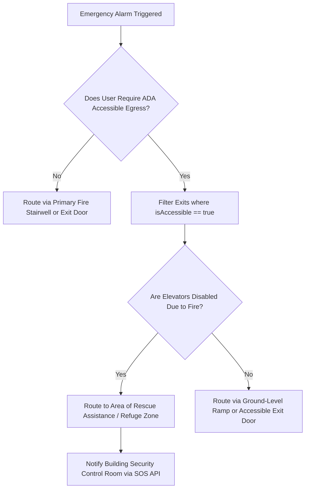

# EmergencyEvacuationRouter: Floor Plan SVG Mapping & Exit Wayfinding

## 1. Executive Summary & Overview

WorkSphere provides a real-time, life-safety emergency egress wayfinding engine (`EmergencyEvacuationRouter.tsx`, `evacuationRouter.ts`). When an emergency alarm (fire alarm, earthquake, power outage, severe weather, medical emergency) is triggered, the router computes the shortest unobstructed evacuation trajectory from a user's exact seat location to the nearest verified ground-level fire exit, on-site AED defibrillator, and outdoor safety assembly muster point.

```
+-----------------------------------------------------------------------------------+
|                           EMERGENCY TRIGGER & USER SEAT                           |
|                       (User Location: Desk A-14, 2nd Floor)                       |
+-----------------------------------------+-----------------------------------------+
                                          |
                      POST /api/venue/evacuation { emergencyType }
                                          |
                                          v
+-----------------------------------------------------------------------------------+
|                        EGRESS PATHFINDING ENGINE (evacuationRouter.ts)            |
|  - Spatial Euclidean Distance: d = sqrt(Δx² + Δy² + Δz²)                          |
|  - Unobstructed Exit Node Ranking & Status Validation                             |
|  - Step-by-Step Waypoint Trajectory Generation                                    |
|  - Safety Resource Proximity Sorting (AED, First Aid, Fire Extinguisher)         |
+-----------------------------------------+-----------------------------------------+
                                          |
                                          v  [EvacuationPlan Payload]
+-----------------------------------------------------------------------------------+
|                         INTERACTIVE EMERGENCY ROUTER UI                           |
|                       (EmergencyEvacuationRouter.tsx)                             |
|  - High-Contrast Rose Emergency Banner                                            |
|  - Nearest Verified Exit & Walking Time (~1.2 m/s)                                |
|  - Outdoor Assembly Muster Area Coordinates & SOS Contacts                        |
|  - Interactive Step-by-Step Waypoint Trajectory Progress                          |
+-----------------------------------------------------------------------------------+
```

Key objectives:
- **Sub-Second Egress Pathfinding:** Instant evaluation of exit distance and obstacle avoidance.
- **ADA Accessible Egress Guidance:** Filtering for wheelchair-accessible doors, ground-level ramps, and area of rescue refuge zones.
- **SVG Floor Plan Alignment:** 2D/3D spatial coordinate mapping $(x, y, z)$ to interactive SVG viewports.
- **On-Site Safety Resource Locator:** Nearest Automated External Defibrillator (AED), trauma first aid kit, and CO2 fire extinguisher locator.

---

## 2. Spatial Mapping & Coordinate Normalization

The evacuation engine operates on spatial coordinate vectors $(x, y, z)$ defined on a normalized 2D/3D venue floorplan matrix.

### 2.1 Spatial Distance Formula

The distance $d(p_1, p_2)$ between user position $p_1 = (x_1, y_1, z_1)$ and exit node $p_2 = (x_2, y_2, z_2)$ is computed using 3D Euclidean distance:

$$d(p_1, p_2) = \sqrt{(x_2 - x_1)^2 + (y_2 - y_1)^2 + (z_2 - z_1)^2}$$

In 2D floorplan layouts where floor elevation $z$ is uniform ($z_1 = z_2$), the formula simplifies to:

$$d_{2D}(p_1, p_2) = \sqrt{(x_2 - x_1)^2 + (y_2 - y_1)^2}$$

### 2.2 Evacuation Time Estimation

Evacuation walking duration $T_{\text{evac}}$ (in seconds) is derived assuming an average stress-adjusted walking velocity $v_{\text{walk}} = 1.2\text{ m/s}$:

$$T_{\text{evac}} = \max\left(15, \text{round}\left(\frac{d_{\text{total}}}{v_{\text{walk}}}\right)\right) \quad \text{where } v_{\text{walk}} = 1.2\text{ m/s}$$

---

## 3. Emergency Data Schemas & Types (`evacuationRouter.ts`)

### 3.1 Spatial Point & Exit Node Schema

```typescript
export interface SpatialPoint {
  x: number;
  y: number;
  z?: number;
}

export type EmergencyType =
  | "FIRE_ALARM"
  | "EARTHQUAKE"
  | "POWER_OUTAGE"
  | "SEVERE_WEATHER"
  | "MEDICAL_EMERGENCY";

export interface EmergencyExit {
  id: string;
  name: string;
  type: "PRIMARY_STAIRWELL" | "FIRE_EXIT_DOOR" | "OUTDOOR_GROUND_EXIT";
  position: SpatialPoint;
  floor: number;
  isAccessible: boolean; // ADA Wheelchair / Ramp compliance
  status: "CLEAR" | "CONGESTED" | "BLOCKED";
  distanceMeters: number;
}
```

### 3.2 Safety Resource & Waypoint Schemas

```typescript
export interface SafetyResource {
  id: string;
  name: string;
  type: "AED_DEFIBRILLATOR" | "FIRST_AID_KIT" | "FIRE_EXTINGUISHER";
  locationDescription: string;
  position: SpatialPoint;
  distanceMeters: number;
}

export interface EgressWaypoint {
  stepIndex: number;
  instruction: string;
  position: SpatialPoint;
  distanceToNextMeters: number;
  action: "WALK_STRAIGHT" | "TURN_LEFT" | "TURN_RIGHT" | "TAKE_STAIRS_DOWN" | "EXIT_BUILDING";
}

export interface EvacuationPlan {
  emergencyType: EmergencyType;
  severity: "CRITICAL_EVACUATION" | "WARNING_PRECAUTION" | "SHELTER_IN_PLACE";
  venueName: string;
  userSeatNumber: string;
  nearestExit: EmergencyExit;
  totalDistanceMeters: number;
  estimatedEvacuationSeconds: number;
  waypoints: EgressWaypoint[];
  assemblyMusterPoint: {
    name: string;
    description: string;
    coordinates: string;
  };
  nearbySafetyResources: SafetyResource[];
  emergencyContacts: Array<{ label: string; number: string }>;
}
```

---

## 4. ADA Accessible Egress Guidelines & Safety Protocol

WorkSphere enforces strict accessibility standards for occupants with mobility impairments or disabilities:



### 4.1 ADA Egress Principles
1. **Elevator Prohibition During Fire Alarms:** Automatic routing instructs occupants never to use passenger elevators during fire events, directing mobility-impaired users to designated **Areas of Rescue Assistance (Refuge Areas)** near stairwell landings.
2. **Accessible Exit Filtering (`isAccessible: true`):** Exits are tagged with accessibility compliance flags. Ramps, automatic doors, and zero-threshold ground-level exits are prioritized for accessible routes.
3. **High-Contrast Emergency UI:** The `EmergencyEvacuationRouter.tsx` interface employs high-contrast rose/emerald styling, large touch targets, and clear ARIA roles for screen reader accessibility.

---

## 5. UI Component & API Integration

### 5.1 Evacuation API Endpoint (`POST /api/venue/evacuation`)

- **Request Body:**
```json
{
  "venueId": "venue-sf-01",
  "userSeatNumber": "Desk A-14 (2nd Floor West)",
  "emergencyType": "FIRE_ALARM"
}
```

- **Response Payload:**
```json
{
  "success": true,
  "evacuationPlan": {
    "emergencyType": "FIRE_ALARM",
    "severity": "CRITICAL_EVACUATION",
    "venueName": "Mission Focus Coworking & Cafe",
    "userSeatNumber": "Desk A-14 (2nd Floor West)",
    "nearestExit": {
      "id": "exit-north-stairwell",
      "name": "North Fire Stairwell A (Exit to Street)",
      "type": "PRIMARY_STAIRWELL",
      "position": { "x": 5, "y": 35 },
      "floor": 2,
      "isAccessible": true,
      "status": "CLEAR",
      "distanceMeters": 28.5
    },
    "totalDistanceMeters": 28.5,
    "estimatedEvacuationSeconds": 24,
    "waypoints": [
      {
        "stepIndex": 1,
        "instruction": "Immediately stand and exit Desk A-14. Leave heavy luggage behind.",
        "position": { "x": 20, "y": 20 },
        "distanceToNextMeters": 4.5,
        "action": "WALK_STRAIGHT"
      }
    ],
    "assemblyMusterPoint": {
      "name": "Muster Area Alpha (City Park Square)",
      "description": "Across main street, 50m clear of building facade and glass falling zones.",
      "coordinates": "37.7752° N, 122.4188° W"
    }
  }
}
```

---

## 6. Summary Reference Matrix

| Feature / Property | Identifier | Default Value / Range | Description |
| :--- | :--- | :--- | :--- |
| **Walking Velocity** | $v_{\text{walk}}$ | $1.2\text{ m/s}$ | Average walking speed under emergency egress conditions |
| **Minimum Evacuation Time**| $T_{\text{min}}$ | $15\text{ seconds}$ | Floor limit for evacuation time estimation |
| **Exit Status Types** | `status` | `CLEAR`, `CONGESTED`, `BLOCKED` | Real-time exit availability status |
| **Resource Types** | `SafetyResource` | `AED_DEFIBRILLATOR`, `FIRST_AID_KIT`, `FIRE_EXTINGUISHER` | Emergency safety equipment classifications |
| **Muster Area Distance** | `MusterPoint` | $\ge 50\text{m}$ clear of facade | Minimum safety distance from building structural hazard zones |
