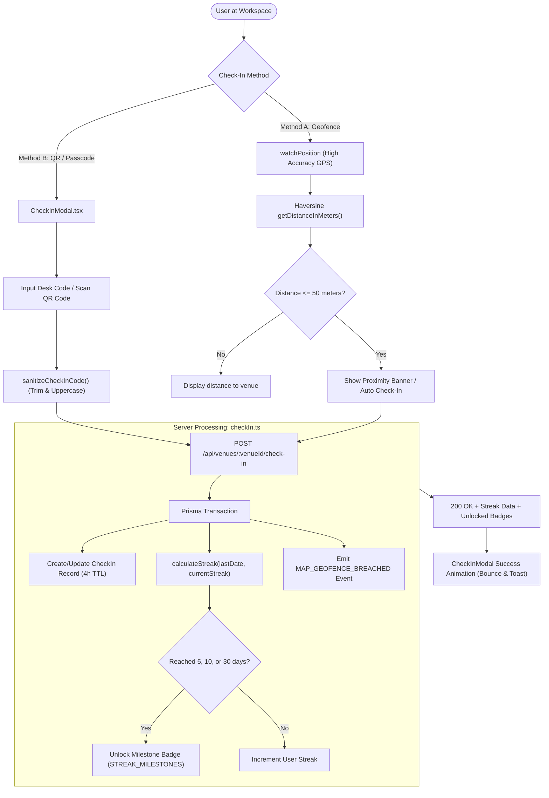

# Feature Documentation: Venue Check-In, QR Code Verification, Geofence Proximity & Streak Rewards

## 1. Executive Summary & Check-In Architecture Overview

The venue check-in subsystem verifies physical attendance of remote workers, freelancers, and hybrid teams at WorkSphere partner spaces, desks, private booths, and meeting rooms. Accurate arrival verification enables three critical product capabilities:

1. **Physical Presence Verification:** Ensures reservations are only marked active when the user has physically entered the workspace or presented a valid access pass.
2. **Real-Time Venue Headcount & Capacity Management:** Drives live occupancy tracking, crowd density heatmaps, and differential privacy headcount feeds.
3. **Daily Habit Gamification & Streak Rewards:** Rewards users who work consistently from partner spaces with consecutive day activity streaks, milestone badges (5, 10, 30 days), and loyalty discounts.

The check-in subsystem is implemented across:
- **Interactive UI Modal:** [`src/components/CheckInModal.tsx`](file:///c:/Users/admin/Desktop/workfere/src/components/CheckInModal.tsx)
- **Geolocation Proximity Hooks:** [`src/hooks/useGeoProximityCheckIn.ts`](file:///c:/Users/admin/Desktop/workfere/src/hooks/useGeoProximityCheckIn.ts) and [`src/hooks/useArrivalDetection.ts`](file:///c:/Users/admin/Desktop/workfere/src/hooks/useArrivalDetection.ts)
- **Domain & Streak Engine:** [`src/lib/checkIn.ts`](file:///c:/Users/admin/Desktop/workfere/src/lib/checkIn.ts) and [`src/lib/streak.ts`](file:///c:/Users/admin/Desktop/workfere/src/lib/streak.ts)
- **HTTP Backend Endpoints:** [`src/app/api/venues/[venueId]/check-in/route.ts`](file:///c:/Users/admin/Desktop/workfere/src/app/api/venues/[venueId]/check-in/route.ts)



---

## 2. GPS Proximity Threshold Verification (50-Meter Radius)

### 2.1 The 50-Meter Geofence Boundary

To prevent fraudulent remote check-ins while accommodating standard GPS accuracy jitter in urban canyons (skyscrapers, indoor atriums), WorkSphere enforces a **strict 50-meter radius proximity threshold** (`geofenceRadius = 50`):

$$\text{isInsideVenue} \iff d(\text{user}, \text{venue}) \le 50.0\text{ meters}$$

Users standing further than 50 meters cannot trigger automated or geofenced arrival check-in and must enter the physical venue or scan the on-site terminal QR code.

### 2.2 Geodesic Distance Calculation: Haversine with Altitude

In [`src/hooks/useArrivalDetection.ts`](file:///c:/Users/admin/Desktop/workfere/src/hooks/useArrivalDetection.ts), the distance between the device's WGS84 coordinates and the venue's registered coordinates is computed using the spherical Haversine formula, augmented by 3D vertical displacement when barometric altitude is available:

```typescript
export function getDistanceInMeters(
  lat1: number,
  lon1: number,
  lat2: number,
  lon2: number,
  alt1?: number | null,
  alt2?: number,
): number {
  const R = 6371e3; // Earth mean radius in meters
  const phi1 = (lat1 * Math.PI) / 180;
  const phi2 = (lat2 * Math.PI) / 180;
  const deltaPhi = ((lat2 - lat1) * Math.PI) / 180;
  const deltaLambda = ((lon2 - lon1) * Math.PI) / 180;

  const a =
    Math.sin(deltaPhi / 2) * Math.sin(deltaPhi / 2) +
    Math.cos(phi1) *
      Math.cos(phi2) *
      Math.sin(deltaLambda / 2) *
      Math.sin(deltaLambda / 2);
  const c = 2 * Math.atan2(Math.sqrt(a), Math.sqrt(1 - a));

  const d2d = R * c; // 2D Great-circle surface distance

  // Optional 3D Euclidean altitude correction (multi-story buildings)
  if (
    alt1 !== undefined &&
    alt1 !== null &&
    alt2 !== undefined &&
    alt2 !== null
  ) {
    const deltaAlt = alt1 - alt2;
    return Math.sqrt(d2d * d2d + deltaAlt * deltaAlt);
  }

  return d2d;
}
```

### 2.3 Continuous Positioning & Low-Battery Optimization

The geolocation watch in [`src/hooks/useGeoProximityCheckIn.ts`](file:///c:/Users/admin/Desktop/workfere/src/hooks/useGeoProximityCheckIn.ts) and [`src/hooks/useArrivalDetection.ts`](file:///c:/Users/admin/Desktop/workfere/src/hooks/useArrivalDetection.ts):

1. **High-Accuracy Sensor Activation:** Configures `enableHighAccuracy: true` to trigger GPS/GLONASS receivers rather than coarse IP/cellular triangulation.
2. **Time Window Gating:** Geolocation polling only activates during the active reservation eligibility window (from 45 minutes prior to booking start time until the reservation ends), preventing unnecessary background battery drain.
3. **Haptic Vibration Feedback:** Upon successful proximity confirmation, triggers a haptic pattern on supported mobile devices (`navigator.vibrate([100, 50, 100])`).
4. **Native System Notifications:** If notification permissions are granted, fires a system notification (`📍 Arrived at Venue`) with one-tap check-in action.

---

## 3. QR Code Scan Check-In & Access Pass Validation

For venues located in underground basements, Faraday-shielded conference rooms, or multi-story towers where GPS signals degrade, WorkSphere provides physical QR code verification through [`src/components/CheckInModal.tsx`](file:///c:/Users/admin/Desktop/workfere/src/components/CheckInModal.tsx).

### 3.1 QR Code Scan Workflow

1. **Physical Venue Terminal / Desk Plate:** Each workspace desk or entry turnstile displays a dynamically or statically generated QR code containing the venue access string (e.g. `WS-PASS-SF104` or `https://worksphere.app/checkin?code=WS-PASS-SF104`).
2. **Scanner Optical Decoding:** The user taps the QR Code action button (`QrCode` icon in `CheckInModal`), which decodes the pass code directly into the check-in input field.
3. **Automatic Input Scrubbing & Formatting:**
   - Leading and trailing whitespace are automatically stripped.
   - Text is forced to uppercase for uniform matching.
   - Pure-whitespace inputs trigger immediate client-side validation warnings.

```typescript
export function sanitizeCheckInCode(code: string): string {
  return typeof code === "string" ? code.trim().toUpperCase() : "";
}

export function sanitizeCouponCode(coupon: string): string {
  return typeof coupon === "string" ? coupon.trim().toUpperCase() : "";
}
```

### 3.2 Real-Time Validation Feedback

To prevent accidental empty form submissions or confusing network errors, `CheckInModal` implements real-time validation:

```typescript
const handleCodeChange = (e: React.ChangeEvent<HTMLInputElement>) => {
  const rawVal = e.target.value;
  // Real-time pure-whitespace validation warning
  if (rawVal.length > 0 && rawVal.trim().length === 0) {
    setValidationError("Code cannot consist purely of spaces.");
  } else {
    setValidationError(null);
  }
  setCheckInCode(rawVal);
};
```

### 3.3 Optional Promo & Loyalty Coupon Codes

Users can simultaneously attach discount or promotional vouchers (e.g. `WORK50` or `FREEDAY`) during check-in. The coupon code is scrubbed via `sanitizeCouponCode` and passed alongside the check-in payload.

---

## 4. User Streak Reward Calculation & Badge Triggers

Consistency is rewarded through a daily activity streak engine isolated in [`src/lib/streak.ts`](file:///c:/Users/admin/Desktop/workfere/src/lib/streak.ts) and executed inside an atomic PostgreSQL transaction in [`src/lib/checkIn.ts`](file:///c:/Users/admin/Desktop/workfere/src/lib/checkIn.ts).

### 4.1 Timezone-Aware Calendar Arithmetic

A common flaw in streak tracking is calculating "24 hours since last check-in", which erroneously breaks streaks when daylight saving time (DST) shifts or when users check in at 8 PM on Day 1 and 9 AM on Day 2 (13 hours apart) vs 9 AM on Day 1 and 8 PM on Day 2 (35 hours apart).

WorkSphere resolves streaks using the **local calendar date** (`YYYY-MM-DD`) in the user's registered timezone:

```typescript
export function dateInTimeZone(date: Date, timeZone: string = "UTC"): string {
  const formatter = new Intl.DateTimeFormat("en-CA", {
    timeZone,
    year: "numeric",
    month: "2-digit",
    day: "2-digit",
  });
  const parts = formatter.formatToParts(date);
  const map = Object.fromEntries(
    parts.filter((p) => p.type !== "literal").map((p) => [p.type, p.value]),
  );
  return `${map.year}-${map.month}-${map.day}`;
}
```

### 4.2 Streak Increment Rules

```typescript
export function calculateStreak(
  lastCheckInDate: string | null,
  currentStreak: number,
  longestStreak: number,
  timeZone: string = "UTC",
  now: Date = new Date(),
): StreakResult {
  const today = todayUTC(timeZone, now);
  const yesterday = yesterdayUTC(timeZone, now);

  // 1. Same-Day Duplicate: No-op
  if (lastCheckInDate === today) {
    return {
      currentStreak,
      longestStreak,
      lastCheckInDate: today,
      incremented: false,
      newMilestones: [],
    };
  }

  // 2. Consecutive Day: Streak increases by 1
  const newStreak =
    lastCheckInDate === yesterday
      ? currentStreak + 1
      : 1; // 3. Gap > 1 day: Streak resets to 1

  const newLongest = Math.max(longestStreak, newStreak);

  // 4. Milestone Detection
  const newMilestones = STREAK_MILESTONES.filter(
    (m) => newStreak >= m && longestStreak < m,
  );

  return {
    currentStreak: newStreak,
    longestStreak: newLongest,
    lastCheckInDate: today,
    incremented: true,
    newMilestones,
  };
}
```

| Previous Check-In Date | Current Check-In Date | Outcome | Streak Value |
| :--- | :--- | :--- | :--- |
| `2026-10-08` | `2026-10-08` (Same day) | `incremented: false` | Unchanged (No duplicate reward) |
| `2026-10-07` | `2026-10-08` (Consecutive day) | `incremented: true` | `currentStreak + 1` |
| `2026-10-05` | `2026-10-08` (Gap $\ge 2$ days) | `incremented: true` | Reset to `1` |
| `null` (First time) | `2026-10-08` | `incremented: true` | Initialized to `1` |

### 4.3 Badge Milestone Unlocks (`STREAK_MILESTONES = [5, 10, 30]`)

WorkSphere defines three official gamification tiers:

```typescript
export const STREAK_MILESTONES = [5, 10, 30] as const;
export type StreakMilestone = (typeof STREAK_MILESTONES)[number];
```

1. **Bronze Hustler (5 Days):** Awarded after checking into workspaces for 5 consecutive calendar days. Unlocks a 5% discount on meeting room bookings.
2. **Silver Nomad (10 Days):** Awarded after 10 consecutive active days. Unlocks complimentary ANC headset rentals and priority booking windows.
3. **Gold Resident (30 Days):** Awarded for a full 30-day streak. Unlocks dedicated desk privileges, guest passes, and the verified community profile badge.

A milestone is considered **newly unlocked** (`newMilestones`) only if the user's all-time `longestStreak` has not previously reached that threshold, ensuring badges are earned once and permanently showcased on the user profile.

---

## 5. Live Venue Occupancy Leases & Webhook Integration

### 5.1 Occupancy TTL Leases (4-Hour Window)

A check-in represents active physical occupancy for **4 hours** (`CHECK_IN_TTL_MS = 14,400,000 ms`), unless renewed:

```typescript
export const CHECK_IN_TTL_MS = 4 * 60 * 60 * 1000;
const expiresAt = new Date(now.getTime() + CHECK_IN_TTL_MS);
```

When checking out (`DELETE /api/venues/:venueId/check-in`), the record is immediately removed. When queries retrieve live occupancy for venues, records past `expiresAt` are automatically excluded from active headcounts.

### 5.2 Differential Privacy for Public Occupancy

To protect user anonymity when venue occupancy is low ($N < 10$), the GET endpoint applies Laplace differential privacy noise filtering via `applyPrivacyFilter(activeCount, maxCapacity, 1.0, 10)`.

### 5.3 Webhook Event Dispatch (`MAP_GEOFENCE_BREACHED`)

Whenever a user checks into a venue, WorkSphere dispatches an outbound webhook event (`MAP_GEOFENCE_BREACHED`) with GPS coordinates, timestamps, and venue identification for corporate Slack/Teams presence updates.

---

## 6. UI Component Specification: `CheckInModal.tsx`

### 6.1 Props Interface

```typescript
export interface CheckInModalProps {
  isOpen: boolean;
  onClose: () => void;
  venueName?: string;
  venueId?: string;
  onCheckIn?: (data: { code: string; couponCode?: string }) => Promise<void> | void;
}
```

### 6.2 State Lifecycle & Animations

1. **Initial Mount:** Dialog renders with backdrop blur (`backdrop-blur-sm`). Check-in code and coupon state are empty.
2. **Input Interaction:** Real-time feedback triggers if the user enters only whitespace characters (`data-testid="checkin-validation-error"`).
3. **Submission & Verification:** Submit button disables and renders a spinner (`Loader2`, "Verifying...").
4. **Success State:** Upon confirmation, modal switches to success state displaying an animated checkmark (`CheckCircle2`, `animate-bounce`) and closes automatically after 1200ms.

---

## 7. Testing & Verification Guide

Automated unit tests are maintained in:
- [`src/__tests__/components/CheckInModal.test.tsx`](file:///c:/Users/admin/Desktop/workfere/src/__tests__/components/CheckInModal.test.tsx): Tests whitespace trimming, uppercase conversion, and error feedback.
- [`src/__tests__/lib/venueBookingCheckinProcess.test.ts`](file:///c:/Users/admin/Desktop/workfere/src/__tests__/lib/venueBookingCheckinProcess.test.ts): Tests proximity verification and API integration.
- `src/__tests__/lib/streak.test.ts`: Tests consecutive day streak calculations, timezone boundaries, and milestone badge triggers.
