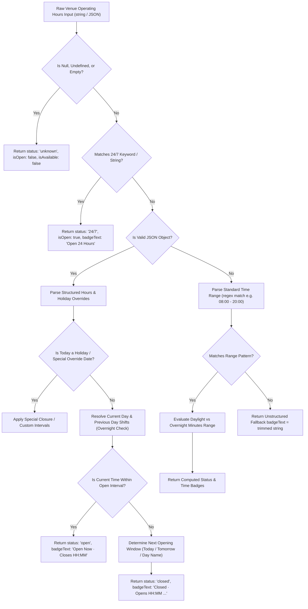

# Venue Operating Hours & Multi-Interval Schedule Architecture

This document specifies the architecture, data schemas, multi-interval (split shift) evaluation rules, holiday overrides, and time badge formatting logic implemented in `src/lib/venueHours.ts` for **WorkSphere**.

---

## 1. Architectural Overview

WorkSphere provides flexible, time-zone-aware operating hours management across venues. Venues can operate under various schedules:
- **Standard Single-Interval Shifts:** e.g., 08:00 to 20:00.
- **Cross-Midnight / Late-Night Shifts:** e.g., 18:00 to 02:00 (overnight into the next calendar day).
- **24/7 Continuous Operations:** e.g., "Open 24 Hours", "24/7", or matching `00:00 - 24:00`.
- **Multi-Interval / Split Shifts:** e.g., morning shift (08:00–12:00) and afternoon shift (14:00–20:00).
- **Holiday & Special Event Overrides:** Temporarily overriding standard weekly schedules for specific calendar dates.
- **Unstructured / Custom Text Fallbacks:** e.g., "By appointment only".

### 1.1 Status Resolution Pipeline



---

## 2. Data Models & JSON Schemas

### 2.1 Standard Day Period Schema

A standard day period represents opening and closing boundaries for a specific day of the week (`sunday` through `saturday`).

#### TypeScript Interface (`src/lib/venueHours.ts`)

```typescript
export interface DayPeriod {
  /** 24-hour time format "HH:MM" e.g., "08:00" */
  open: string;
  /** 24-hour time format "HH:MM" e.g., "20:00" */
  close: string;
  /** Indicates whether the venue is explicitly closed for the entire day */
  closed?: boolean;
}

export interface DayShiftInterval {
  /** Interval start time in 24h "HH:MM" format */
  openTime: string;
  /** Interval end time in 24h "HH:MM" format */
  closeTime: string;
  /** Label for split shift segment (e.g., "Lunch", "Dinner", "Morning Shift") */
  label?: string;
}
```

### 2.2 Structured Weekly Operating Hours Schema

```json
{
  "$schema": "https://json-schema.org/draft/2020-12/schema",
  "title": "StructuredVenueHours",
  "type": "object",
  "properties": {
    "timezone": {
      "type": "string",
      "description": "IANA timezone identifier (e.g. 'America/New_York', 'Asia/Kolkata')",
      "example": "America/New_York"
    },
    "periods": {
      "type": "object",
      "description": "Map of day names to single or multi-interval operating periods",
      "properties": {
        "sunday": { "$ref": "#/$defs/DaySchedule" },
        "monday": { "$ref": "#/$defs/DaySchedule" },
        "tuesday": { "$ref": "#/$defs/DaySchedule" },
        "wednesday": { "$ref": "#/$defs/DaySchedule" },
        "thursday": { "$ref": "#/$defs/DaySchedule" },
        "friday": { "$ref": "#/$defs/DaySchedule" },
        "saturday": { "$ref": "#/$defs/DaySchedule" }
      },
      "additionalProperties": false
    },
    "specialHours": {
      "type": "array",
      "description": "Date-specific holiday overrides or unexpected maintenance closures",
      "items": { "$ref": "#/$defs/SpecialClosureOverride" }
    }
  },
  "$defs": {
    "DaySchedule": {
      "type": "object",
      "properties": {
        "open": { "type": "string", "pattern": "^([01]\\d|2[0-3]):[0-5]\\d$" },
        "close": { "type": "string", "pattern": "^([01]\\d|2[0-3]):[0-5]\\d$" },
        "closed": { "type": "boolean" },
        "intervals": {
          "type": "array",
          "description": "List of multi-interval split shifts for split operations",
          "items": {
            "type": "object",
            "properties": {
              "openTime": { "type": "string", "pattern": "^([01]\\d|2[0-3]):[0-5]\\d$" },
              "closeTime": { "type": "string", "pattern": "^([01]\\d|2[0-3]):[0-5]\\d$" },
              "label": { "type": "string" }
            },
            "required": ["openTime", "closeTime"]
          }
        }
      }
    },
    "SpecialClosureOverride": {
      "type": "object",
      "properties": {
        "date": { "type": "string", "format": "date", "example": "2026-12-25" },
        "isClosed": { "type": "boolean" },
        "reason": { "type": "string", "example": "Christmas Day Holiday" },
        "intervals": {
          "type": "array",
          "items": {
            "type": "object",
            "properties": {
              "openTime": { "type": "string" },
              "closeTime": { "type": "string" }
            },
            "required": ["openTime", "closeTime"]
          }
        }
      },
      "required": ["date", "isClosed"]
    }
  }
}
```

---

## 3. Multi-Interval & Split Shift Rules

Venues often operate under split shifts, such as cafes or restaurants closing between lunch and dinner service.

### 3.1 Split Shift Representation

When a day contains multiple open intervals, the `intervals` array takes precedence over legacy single `open`/`close` fields:

```json
{
  "periods": {
    "monday": {
      "closed": false,
      "intervals": [
        { "openTime": "08:00", "closeTime": "12:00", "label": "Morning Shift" },
        { "openTime": "14:00", "closeTime": "22:00", "label": "Evening Shift" }
      ]
    }
  }
}
```

### 3.2 Evaluation Math & Interval Matching Algorithm

Let $t_{\text{current}}$ be the current time represented in minutes past midnight ($0 \le t_{\text{current}} < 1440$):

$$\text{Minutes}(H, M) = H \times 60 + M$$

For any interval $i$ with start minutes $t_{\text{open}, i}$ and end minutes $t_{\text{close}, i}$:

1. **Standard Daylight Interval ($t_{\text{open}, i} < t_{\text{close}, i}$):**
   The venue is open during interval $i$ if:
   $$t_{\text{open}, i} \le t_{\text{current}} < t_{\text{close}, i}$$

2. **Cross-Midnight / Overnight Interval ($t_{\text{close}, i} < t_{\text{open}, i}$):**
   The venue is open during interval $i$ if:
   $$t_{\text{current}} \ge t_{\text{open}, i} \quad \text{OR} \quad t_{\text{current}} < t_{\text{close}, i}$$

3. **Inter-Shift Break (Between Split Shifts):**
   If $t_{\text{current}}$ falls between interval $i$ and interval $i+1$ (e.g., 13:00 when intervals are `08:00-12:00` and `14:00-22:00`):
   - `isOpen` evaluates to `false`.
   - `badgeText` displays: `"Closed · Opens 2 PM today"`.
   - `opensAt` returns `"2 PM"`.

---

## 4. Holiday & Special Closure Overrides

Holiday overrides allow managers to specify single-day exceptions without altering the recurring weekly template.

### 4.1 Special Hours Override Schema

```json
{
  "specialHours": [
    {
      "date": "2026-12-25",
      "isClosed": true,
      "reason": "Christmas Day"
    },
    {
      "date": "2026-12-31",
      "isClosed": false,
      "reason": "New Year's Eve Special Hours",
      "intervals": [
        { "openTime": "10:00", "closeTime": "16:00" },
        { "openTime": "20:00", "closeTime": "03:00" }
      ]
    }
  ]
}
```

### 4.2 Dynamic Evaluation Precedence Hierarchy

1. **Date-Specific Override:** Check if `nowInput` matches a `specialHours` entry for the local date string (`YYYY-MM-DD`).
   - If `isClosed: true`, return status `closed` with reason badge (e.g. `"Closed for Christmas Day"`).
   - If custom `intervals` are supplied, evaluate time against the special intervals.
2. **Day-of-Week Split Intervals:** If no holiday override exists, evaluate `periods[dayName].intervals`.
3. **Legacy Single Period:** Fallback to `periods[dayName].open` and `periods[dayName].close`.
4. **Regex String Fallback:** Evaluate regex patterns for plain text time ranges (e.g. `"08:00 - 20:00"`).

---

## 5. API Reference & Utility Functions

The module `src/lib/venueHours.ts` exposes core functions for evaluating venue status and formatting UI badges.

### 5.1 `getVenueHoursStatus(hoursStr, nowInput?, timezone?)`

Evaluates the raw operating hours string against a given date/time and optional IANA timezone.

```typescript
export function getVenueHoursStatus(
  hoursStr: string | null | undefined,
  nowInput?: Date,
  timezone?: string,
): VenueHoursStatus;
```

#### Return Value (`VenueHoursStatus`)

| Field | Type | Description |
| :--- | :--- | :--- |
| `isOpen` | `boolean` | `true` if the venue is currently open |
| `badgeText` | `string` | Human-friendly display string (e.g., `"Open Now · Closes 8 PM"`, `"Closed · Opens 8 AM tomorrow"`) |
| `status` | `"open" \| "closed" \| "24/7" \| "unknown"` | Categorical status identifier |
| `closesAt` | `string \| null` | Formatted closing time (e.g., `"8 PM"`) if currently open |
| `opensAt` | `string \| null` | Formatted opening time (e.g., `"8 AM"`) if currently closed |
| `opensNext` | `string \| null` | Full next opening description (e.g., `"8 AM Monday"`) |
| `is24Hours` | `boolean` | `true` if the venue operates 24/7 |
| `isAvailable` | `boolean` | `true` if operating hours metadata is present |

### 5.2 `formatTimeBadge(time24)`

Converts a 24-hour time string into a compact 12-hour display badge.

```typescript
export function formatTimeBadge(time24: string): string;
```

#### Conversion Rules:
- `"08:00"` $\rightarrow$ `"8 AM"`
- `"12:00"` $\rightarrow$ `"12 PM"`
- `"17:45"` $\rightarrow$ `"5:45 PM"`
- `"00:00"` / `"24:00"` $\rightarrow$ `"12 AM"`

### 5.3 `is24HoursString(hoursStr)`

Checks if a string represents a 24/7 venue operation using normalized lower-case pattern matching.

---

## 6. Integration & UI Usage

### 6.1 React Component Integration (`src/components/VenueCard.tsx`)

```tsx
import { getVenueHoursStatus } from "@/lib/venueHours";

interface VenueCardProps {
  name: string;
  hours: string;
  timezone?: string;
}

export function VenueCard({ name, hours, timezone }: VenueCardProps) {
  const operatingStatus = getVenueHoursStatus(hours, new Date(), timezone);

  return (
    <div className="rounded-lg border p-4 shadow-sm">
      <h3 className="text-lg font-bold">{name}</h3>
      {operatingStatus.badgeText && (
        <span
          className={`inline-block rounded-full px-2.5 py-0.5 text-xs font-semibold ${
            operatingStatus.isOpen
              ? "bg-green-100 text-green-800"
              : operatingStatus.status === "24/7"
              ? "bg-blue-100 text-blue-800"
              : "bg-gray-100 text-gray-800"
          }`}
        >
          {operatingStatus.badgeText}
        </span>
      )}
    </div>
  );
}
```

---

## 7. Unit Verification & Testing

Unit tests for operating hours logic are maintained in `src/__tests__/lib/venueHours.test.ts`.

Run tests locally:
```bash
npm test src/__tests__/lib/venueHours.test.ts
```
