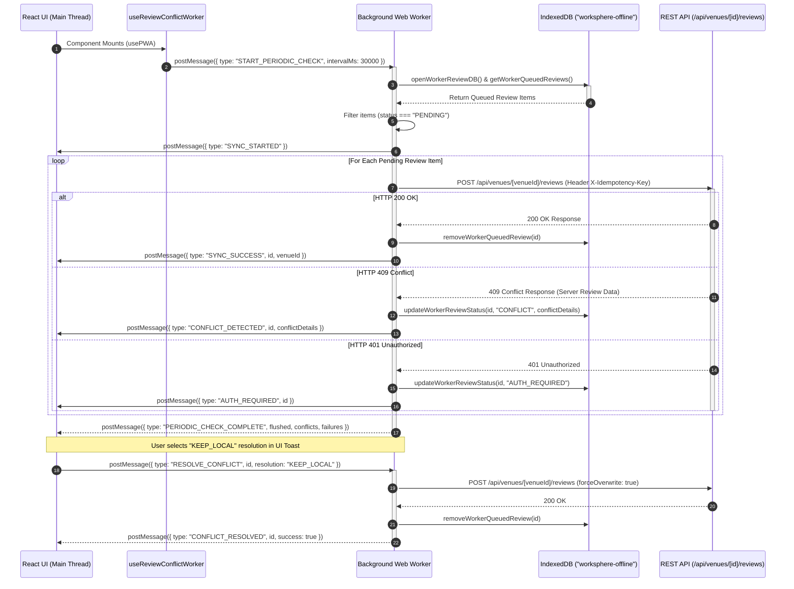

# Engineering Guide: Background Web Worker Architecture for Multi-Device Review Conflict Resolution

This technical specification details WorkSphere's background Web Worker sync engine for offline venue reviews, multi-device edit conflict detection, three-way merge resolution algorithms, error handling state transitions, and main-thread fallback mechanisms ([src/workers/reviewConflictSync.worker.ts](file:///c:/Users/admin/Desktop/workfere/src/workers/reviewConflictSync.worker.ts), [src/hooks/useReviewConflictWorker.ts](file:///c:/Users/admin/Desktop/workfere/src/hooks/useReviewConflictWorker.ts), and [src/lib/offlineReviewSync.ts](file:///c:/Users/admin/Desktop/workfere/src/lib/offlineReviewSync.ts)).

---

## Table of Contents

1. [Executive Summary & Architectural Overview](#1-executive-summary--architectural-overview)
2. [Web Worker Message Protocol Specification](#2-web-worker-message-protocol-specification)
   - [Inbound Messages (Main Thread $\rightarrow$ Worker)](#inbound-messages-main-thread-%E2%86%92-worker)
   - [Outbound Messages (Worker $\rightarrow$ Main Thread)](#outbound-messages-worker-%E2%86%92-main-thread)
   - [Message Flow Sequence Diagram](#message-flow-sequence-diagram)
3. [Three-Way Merge Resolution Algorithm](#3-three-way-merge-resolution-algorithm)
   - [Mathematical Conflict Model ($O$, $L$, $S$)](#mathematical-conflict-model-o-l-s)
   - [Property-Level Differential Analysis](#property-level-differential-analysis)
   - [Resolution Strategies (`KEEP_LOCAL`, `USE_REMOTE`, `AUTO_MERGE`)](#resolution-strategies-keep_local-use_remote-auto_merge)
4. [Error Handling & Lifecycle State Transitions](#4-error-handling--lifecycle-state-transitions)
   - [IndexedDB Queue Persistence](#indexeddb-queue-persistence)
   - [HTTP Status Code Handling & Exponential Retries](#http-status-code-handling--exponential-retries)
   - [Idempotency Guarantees](#idempotency-guarantees)
5. [Main-Thread Fallback & Resilience Strategy](#5-main-thread-fallback--resilience-strategy)
   - [Browser Feature Detection](#browser-feature-detection)
   - [Synchronous Main-Thread Sync Engine](#synchronous-main-thread-sync-engine)
   - [Event-Driven Network & Visibility Wakeup](#event-driven-network--visibility-wakeup)
6. [Repository Code Reference Map](#6-repository-code-reference-map)

---

## 1. Executive Summary & Architectural Overview

WorkSphere allows mobile and desktop users to write, update, and rate venue attributes (such as Wi-Fi latency, noise decibels, outlet density, and seating availability) while offline or in environments with spotty network connectivity. When devices regain connectivity or perform periodic background checks, queued offline edits must be synchronized with the central database.

If a user edits a venue review on a mobile device while offline, and simultaneously updates or receives edits for the same review on another device or from another user, a **409 Conflict** occurs upon synchronization.

To deliver zero UI lag and prevent blocking the main V8 rendering thread during heavy IndexedDB transactions, cryptographic payload hashing, and network polling, WorkSphere executes synchronization inside a dedicated **Web Worker** ([src/workers/reviewConflictSync.worker.ts](file:///c:/Users/admin/Desktop/workfere/src/workers/reviewConflictSync.worker.ts)).

```
┌──────────────────────────────────────────────────────────────────────────┐
│                             MAIN V8 THREAD                               │
│  React UI Component ──> useReviewConflictWorker ──> User Notification Toast │
└────────────────────────────────────▲─────────────────────────────────────┘
                                     │ postMessage (Structured Clone)
                                     ▼
┌──────────────────────────────────────────────────────────────────────────┐
│                         DEDICATED WEB WORKER                             │
│                  (src/workers/reviewConflictSync.worker.ts)              │
│                                                                          │
│  ┌──────────────────────┐  ┌─────────────────────┐  ┌─────────────────┐ │
│  │ IndexedDB Reader     │  │ Conflict Engine     │  │ REST Sync       │ │
│  │ ("worksphere-off")  │  │ (Three-Way Merge)   │  │ (Fetch API)     │ │
│  └──────────────────────┘  └─────────────────────┘  └─────────────────┘ │
└──────────────────────────────────────────────────────────────────────────┘
```

---

## 2. Web Worker Message Protocol Specification

Communication between the main React application thread and the background worker operates over a strongly typed `postMessage` protocol defined in [src/workers/reviewConflictSync.worker.ts](file:///c:/Users/admin/Desktop/workfere/src/workers/reviewConflictSync.worker.ts#L55-L71).

### Inbound Messages (Main Thread $\rightarrow$ Worker)

Defined by `ReviewConflictWorkerInboundMessage`:

| Message Type | Payload Fields | Purpose & System Action |
| :--- | :--- | :--- |
| `START_PERIODIC_CHECK` | `intervalMs?: number`, `token?: string`, `csrfToken?: string` | Initializes background polling (default `30,000 ms`), stores auth credentials, and runs an immediate initial check. |
| `STOP_PERIODIC_CHECK` | *None* | Clears active `setInterval` timer and halts background checking loops. |
| `TRIGGER_SYNC` | `token?: string`, `csrfToken?: string` | Triggers an immediate out-of-band sync pass (e.g. on network reconnection). |
| `RESOLVE_CONFLICT` | `id: string`, `resolution: ConflictResolutionStrategy`, `token?: string`, `csrfToken?: string` | Dispatches user or automated resolution (`KEEP_LOCAL`, `USE_REMOTE`, `AUTO_MERGE`) for a specific review ID. |
| `SET_AUTH_TOKEN` | `token: string \| null` | Updates active Clerk Bearer JWT inside worker memory scope. |
| `SET_CSRF_TOKEN` | `csrfToken: string \| null` | Updates anti-CSRF request header token inside worker memory scope. |

```typescript
export type ReviewConflictWorkerInboundMessage =
  | { type: "START_PERIODIC_CHECK"; intervalMs?: number; token?: string; csrfToken?: string }
  | { type: "STOP_PERIODIC_CHECK" }
  | { type: "TRIGGER_SYNC"; token?: string; csrfToken?: string }
  | { type: "RESOLVE_CONFLICT"; id: string; resolution: ConflictResolutionStrategy; token?: string; csrfToken?: string }
  | { type: "SET_AUTH_TOKEN"; token: string | null }
  | { type: "SET_CSRF_TOKEN"; csrfToken: string | null };
```

---

### Outbound Messages (Worker $\rightarrow$ Main Thread)

Defined by `ReviewConflictWorkerOutboundMessage`:

| Message Type | Payload Fields | Main-Thread Reaction (`useReviewConflictWorker`) |
| :--- | :--- | :--- |
| `SYNC_STARTED` | *None* | Sets `isSyncing: true` state in React UI to display background sync spinner. |
| `SYNC_SUCCESS` | `id: string`, `venueId: string`, `venueName?: string` | Removes item from conflict state, displays success toast notification. |
| `CONFLICT_DETECTED` | `id: string`, `venueId: string`, `venueName?: string`, `conflictDetails` | Prompts user with interactive resolution toast ("Keep Local" vs "Use Remote"). |
| `CONFLICT_RESOLVED` | `id: string`, `resolution`, `success: boolean` | Updates pending conflict queue and displays resolution status toast. |
| `PERIODIC_CHECK_COMPLETE` | `flushed`, `conflicts`, `failures`, `timestamp` | Sets `isSyncing: false` and records `lastChecked` Unix timestamp. |
| `AUTH_REQUIRED` | `id?: string` | Flags authorization failure; prompts UI to request fresh auth token. |
| `SYNC_ERROR` | `error: string` | Logged to console and resets syncing indicator state. |

```typescript
export type ReviewConflictWorkerOutboundMessage =
  | { type: "SYNC_STARTED" }
  | { type: "SYNC_SUCCESS"; id: string; venueId: string; venueName?: string }
  | { type: "CONFLICT_DETECTED"; id: string; venueId: string; venueName?: string; conflictDetails: QueuedReviewItem["conflictDetails"] }
  | { type: "CONFLICT_RESOLVED"; id: string; resolution: ConflictResolutionStrategy; success: boolean }
  | { type: "PERIODIC_CHECK_COMPLETE"; flushed: number; conflicts: number; failures: number; timestamp: number }
  | { type: "AUTH_REQUIRED"; id?: string }
  | { type: "SYNC_ERROR"; error: string };
```

---

### Message Flow Sequence Diagram



---

## 3. Three-Way Merge Resolution Algorithm

File: [src/lib/offlineReviewSync.ts](file:///c:/Users/admin/Desktop/workfere/src/lib/offlineReviewSync.ts#L653-L743)

When two devices modify the same venue review offline, a basic "last-write-wins" strategy risks overwriting unrelated fields edited on another device (e.g. Device A updates `wifiSpeed`, while Device B updates `noiseLevel`). WorkSphere resolves these conflicts using a **Three-Way Merge Algorithm**.

### Mathematical Conflict Model ($O$, $L$, $S$)

The merge engine evaluates three distinct snapshots of the review data structure:

- **Original Base Ancestor ($O$):** The snapshot state when the local edit was initiated (`baseData`, `baseVenueUpdatedAt`).
- **Local Client State ($L$):** The local modifications queued in IndexedDB (`localData`).
- **Server Remote State ($S$):** The current live server state returned in the HTTP 409 payload (`serverReview`).

$$L_{\Delta} = L \setminus O \quad \text{(Fields modified locally)}$$

$$S_{\Delta} = S \setminus O \quad \text{(Fields modified remotely)}$$

---

### Property-Level Differential Analysis

For each field $k \in (L \cup S \cup O)$:

$$\text{MergedValue}(k) = \begin{cases}
L[k] & \text{if } L[k] \neq O[k] \text{ and } S[k] = O[k] \quad \text{(Only Local Changed)} \\
S[k] & \text{if } S[k] \neq O[k] \text{ and } L[k] = O[k] \quad \text{(Only Server Changed)} \\
L[k] & \text{if } L[k] = S[k] \quad \text{(Identical Modification)} \\
\text{ConflictResolution}(k, L, S) & \text{if } L[k] \neq O[k] \text{ and } S[k] \neq O[k] \text{ and } L[k] \neq S[k] \quad \text{(Concurrent Conflict)}
\end{cases}$$

```typescript
export function applyThreeWayMerge(
  localData: QueuedVenueReview["data"],
  serverReview: Record<string, unknown>,
  options: ThreeWayMergeOptions = {},
): QueuedVenueReview["data"] {
  const merged: QueuedVenueReview["data"] = { ...localData };
  const baseData = options.baseData;
  const isServerNewer =
    options.preferNewer !== false &&
    detectConcurrentUpdate(
      options.baseVersionTimestamp,
      options.serverUpdatedAt || (serverReview.updatedAt as string),
    );

  const allKeys = Array.from(
    new Set([
      ...Object.keys(localData),
      ...Object.keys(serverReview),
      ...(baseData ? Object.keys(baseData) : []),
    ]),
  ) as (keyof QueuedVenueReview["data"])[];

  for (const key of allKeys) {
    // Skip metadata keys
    if (key === "id" || key === "createdAt" || key === "updatedAt" || key === "venueId") continue;

    const localVal = localData[key];
    const serverVal = serverReview[key as string];
    const baseVal = baseData ? baseData[key] : undefined;

    if (baseData && baseVal !== undefined) {
      const localChanged = JSON.stringify(localVal) !== JSON.stringify(baseVal);
      const serverChanged = JSON.stringify(serverVal) !== JSON.stringify(baseVal);

      if (serverChanged && !localChanged) {
        merged[key] = serverVal as any;
      } else if (!serverChanged && localChanged) {
        merged[key] = localVal as any;
      } else if (serverChanged && localChanged) {
        // Both changed concurrently:
        if (key === "comment" && typeof localVal === "string" && typeof serverVal === "string") {
          merged[key] = localVal === serverVal ? localVal : `${localVal} (Server update: ${serverVal})`;
        } else {
          merged[key] = isServerNewer ? (serverVal as any) : localVal;
        }
      }
    } else {
      // Fallback without base data: preserve server update if newer
      merged[key] = isServerNewer ? (serverVal as any) : (localVal ?? serverVal);
    }
  }

  return merged;
}
```

### Resolution Strategies (`KEEP_LOCAL`, `USE_REMOTE`, `AUTO_MERGE`)

```
┌──────────────────────────────────────────────────────────────────────────┐
│                         CONFLICT RESOLUTION MATRIX                       │
├──────────────────┬───────────────────────────────────────────────────────┤
│ STRATEGY         │ BEHAVIOR & OVERWRITE MECHANICS                        │
├──────────────────┼───────────────────────────────────────────────────────┤
│ KEEP_LOCAL       │ Dispatches POST with forceOverwrite: true. Overwrites  │
│                  │ server fields with local client data.                 │
├──────────────────┼───────────────────────────────────────────────────────┤
│ USE_REMOTE       │ Deletes local queued item from IndexedDB. Preserves   │
│                  │ unmodified server state.                              │
├──────────────────┼───────────────────────────────────────────────────────┤
│ AUTO_MERGE /     │ Executes applyThreeWayMerge(). Merges non-overlapping  │
│ THREE_WAY_MERGE  │ property edits and forces overwrite with merged model.│
└──────────────────┴───────────────────────────────────────────────────────┘
```

---

## 4. Error Handling & Lifecycle State Transitions

File: [src/workers/reviewConflictSync.worker.ts](file:///c:/Users/admin/Desktop/workfere/src/workers/reviewConflictSync.worker.ts#L203-L290)

### IndexedDB Queue Persistence

Each review item stored in the `pendingReviews` store of `worksphere-offline` follows a strict state transition lifecycle:

```
                  ┌───────────┐
                  │  PENDING  │
                  └─────┬─────┘
                        │ Start Sync Pass
                        ▼
                  ┌───────────┐
                  │  SYNCING  │
                  └─┬───┬───┬─┘
       HTTP 200 OK  │   │   │  HTTP 409 Conflict
   ┌────────────────┘   │   └────────────────┐
   ▼                    │ HTTP 401           ▼
[Deleted from IDB]      │ Unauthorized   ┌──────────┐
                        ▼                │ CONFLICT │
                 ┌───────────────┐       └──────────┘
                 │ AUTH_REQUIRED │
                 └───────────────┘
                        │
                        │ HTTP 5xx / Retry >= 3
                        ▼
                   ┌──────────┐
                   │  FAILED  │
                   └──────────┘
```

### HTTP Status Code Handling & Exponential Retries

```typescript
if (res.ok) {
  await removeWorkerQueuedReview(item.id);
  flushed++;
  // ...
} else if (res.status === 409) {
  conflicts++;
  const conflictJson = await res.json().catch(() => ({}));
  await updateWorkerReviewStatus(item.id, "CONFLICT", conflictJson);
  // ...
} else if (res.status === 401 || res.status === 403) {
  await updateWorkerReviewStatus(item.id, "AUTH_REQUIRED");
  // ...
} else {
  failures++;
  const nextRetry = (item.retryCount || 0) + 1;
  const newStatus = nextRetry >= 3 ? "FAILED" : "PENDING";
  await updateWorkerReviewStatus(item.id, newStatus);
}
```

### Idempotency Guarantees

To prevent duplicate review creation when network dropouts occur mid-response:
1. Every review item carries a unique UUID `item.id`.
2. The worker transmits `X-Idempotency-Key: ${item.id}` in request headers and `idempotencyKey: item.id` in the JSON request body.
3. The server API verifies idempotency headers to ensure repeated submissions are safely ignored.

---

## 5. Main-Thread Fallback & Resilience Strategy

Files:
- [src/hooks/useReviewConflictWorker.ts](file:///c:/Users/admin/Desktop/workfere/src/hooks/useReviewConflictWorker.ts#L73-L80)
- [src/lib/offlineReviewSync.ts](file:///c:/Users/admin/Desktop/workfere/src/lib/offlineReviewSync.ts#L748-L820)

### Browser Feature Detection

Before instantiating the worker, `useReviewConflictWorker` performs Web Worker environment feature detection:

```typescript
if (typeof window === "undefined" || !window.Worker) {
  // Web Workers unavailable; fallback engine takes over
  return;
}
```

### Synchronous Main-Thread Sync Engine

If Web Workers are disabled by policy, unsupported, or restricted by custom browser extensions:
- The application transparently falls back to `offlineReviewSync.ts` on the main V8 thread.
- `reviewsRepository` handles reading and writing queued items in IndexedDB.
- `resolveReviewConflict` executes resolution logic directly on the main thread without throwing errors.

### Event-Driven Network & Visibility Wakeup

To conserve mobile battery life, the worker does not run continuously in an unthrottled loop. Instead, `useReviewConflictWorker` registers browser event listeners to trigger instant synchronization upon network recovery or tab activation:

```typescript
const handleOnline = () => {
  void triggerSync();
};

const handleVisibilityChange = () => {
  if (document.visibilityState === "visible") {
    void triggerSync();
  }
};

window.addEventListener("online", handleOnline);
document.addEventListener("visibilitychange", handleVisibilityChange);
```

---

## 6. Repository Code Reference Map

- [src/workers/reviewConflictSync.worker.ts](file:///c:/Users/admin/Desktop/workfere/src/workers/reviewConflictSync.worker.ts) — Background Web Worker implementation, message protocol types, and IndexedDB sync handlers.
- [src/hooks/useReviewConflictWorker.ts](file:///c:/Users/admin/Desktop/workfere/src/hooks/useReviewConflictWorker.ts) — React Client Hook instantiating worker, postMessage listeners, and UI toast triggers.
- [src/lib/offlineReviewSync.ts](file:///c:/Users/admin/Desktop/workfere/src/lib/offlineReviewSync.ts) — Core Three-Way Merge algorithm (`applyThreeWayMerge`) and main-thread fallback resolution.
- [src/lib/offline/repositories/reviewsRepository.ts](file:///c:/Users/admin/Desktop/workfere/src/lib/offline/repositories/reviewsRepository.ts) — Typed IndexedDB repository for queued offline reviews.
