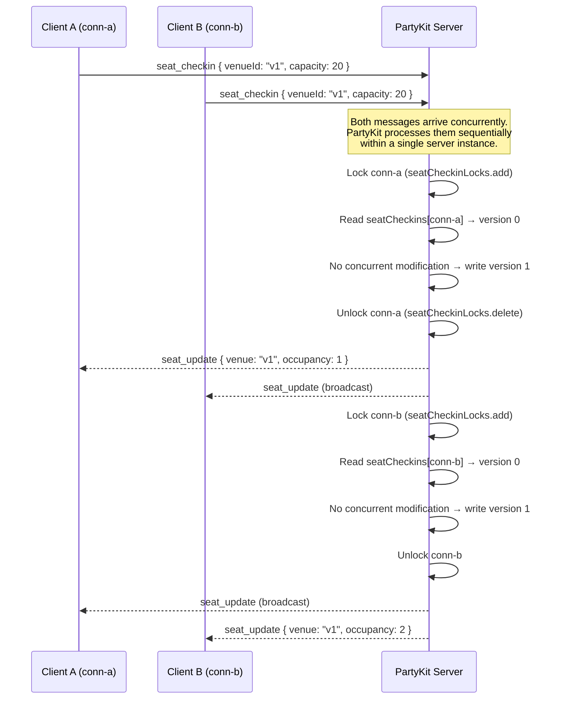
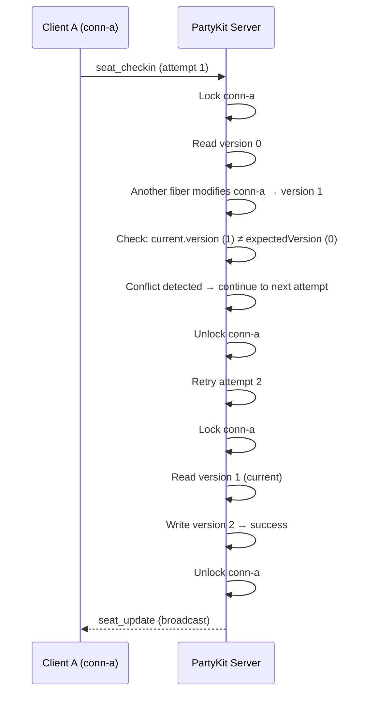
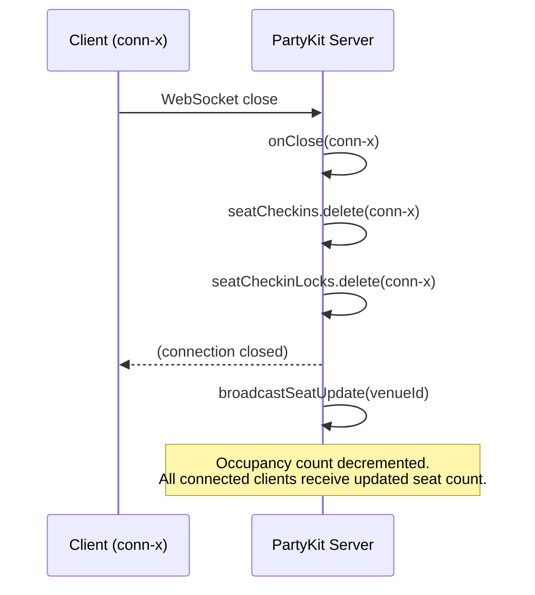

# PartyKit Seat Reservation Concurrency Protocol

This document describes how WorkSphere resolves race conditions when multiple users attempt to check in to the same venue seat simultaneously on a PartyKit server.

---

## Overview

Each PartyKit server instance maintains two in-memory data structures for a venue's seat state:

| Structure | Purpose |
|-----------|---------|
| `seatCheckins: Map<connId, SeatCheckin>` | Records which connection is checked in to which venue, along with a monotone `version` counter |
| `seatCheckinLocks: Set<connId>` | Per-connection mutex — prevents interleaved operations on the same connection |

The concurrency model combines:
1. **Per-connection locking** — prevents a second check-in operation on the same connection while one is already in flight
2. **Optimistic concurrency control** — a `version` counter on each `SeatCheckin` document detects concurrent modifications; the operation retries up to 3 times on conflict

---

## Sequence Diagram — Successful Check-in

---

## Sequence Diagram — Optimistic Lock Conflict and Retry

---

## Sequence Diagram — Check-out on Disconnect

---

## Key Properties

| Property | Value |
|----------|-------|
| Max retries per check-in | 3 |
| Default seat capacity (no client value) | `DEFAULT_SEAT_CAPACITY` |
| Version counter | Per-connection monotone integer, starts at 0 |
| Lock scope | Per-connection (not per-venue) |
| Broadcast trigger | After every successful check-in or check-out |

---

## Source Reference

`party/server.ts` — `handleSeatCheckin()` method starting at line ~314.
