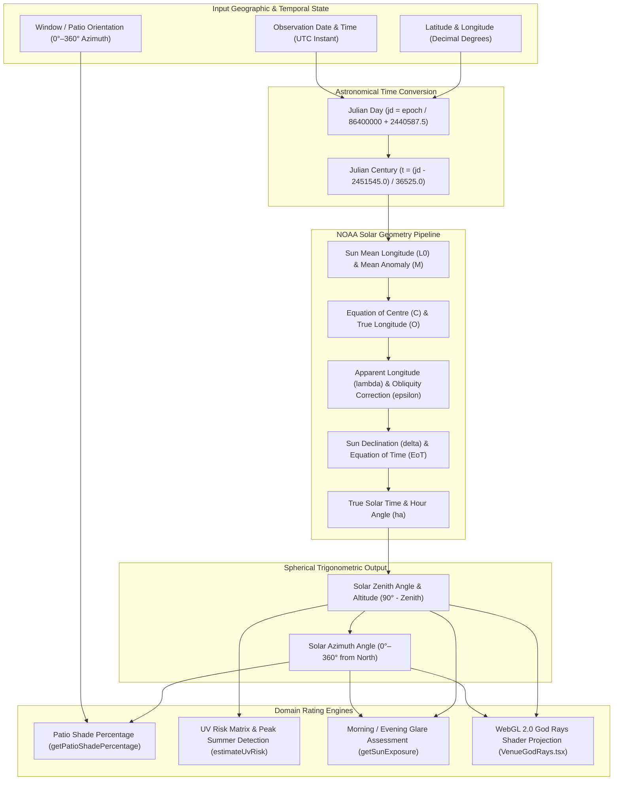

# Engineering Specification: Solar Desk Illumination & Spatial Natural Light Calculator

## 1. Executive Summary & Engine Architecture

The WorkSphere Solar Desk Illumination Engine ([`src/lib/sunPosition.ts`](file:///c:/Users/admin/Desktop/workfere/src/lib/sunPosition.ts)) calculates real-time solar coordinates, window orientation vectors, and ambient glare risks for indoor workstations and outdoor coworking patios. Remote workers and digital nomads require optimal natural lighting conditions without direct monitor glare, excessive thermal radiation, or UV eye strain.

By implementing the NOAA Solar Calculator algorithms directly in pure TypeScript without external runtime dependencies, the engine runs efficiently across client browsers, WebGL shaders ([`src/components/VenueGodRays.tsx`](file:///c:/Users/admin/Desktop/workfere/src/components/VenueGodRays.tsx)), and edge serverless API routes.



---

## 2. Astronomical Solar Position Mathematics

Solar calculation in [`src/lib/sunPosition.ts`](file:///c:/Users/admin/Desktop/workfere/src/lib/sunPosition.ts) converts standard UTC timestamps into astronomical coordinates relative to a venue's latitude $\phi$ and longitude $\lambda$.

### 2.1 Julian Day & Century Conversions

The calculation epoch begins by deriving the Julian Day Number ($JD$) from standard Unix millisecond timestamps:

$$JD = \frac{\text{time}_{\text{ms}}}{86400000} + 2440587.5$$

Julian centuries ($T$) elapsed since the $J2000.0$ standard epoch ($2451545.0$ $JD$) are calculated as:

$$T = \frac{JD - 2451545.0}{36525.0}$$

```typescript
function julianDay(date: Date): number {
  return date.getTime() / 86400000 + 2440587.5;
}

function julianCentury(jd: number): number {
  return (jd - 2451545.0) / 36525.0;
}
```

---

### 2.2 Solar Orbital Mechanics & Ecliptic Coordinates

1. **Geometric Mean Longitude ($L_0$):**

   $$L_0 = (280.46646 + 36000.76983 T + 0.0003032 T^2) \pmod{360^\circ}$$

2. **Geometric Mean Anomaly ($M$):**

   $$M = 357.52911 + 35999.05029 T - 0.0001537 T^2$$

3. **Eccentricity of Earth's Orbit ($e$):**

   $$e = 0.016708634 - T (0.000042037 + 0.0000001267 T)$$

4. **Sun Equation of Centre ($C$):**

   $$C = \sin(M)(1.9146 - 0.004817 T) + \sin(2M)(0.019993 - 0.000101 T) + \sin(3M)(0.00029)$$

5. **Sun Apparent Longitude ($\lambda_{\text{sun}}$):**

   $$\Omega = 125.04 - 1934.136 T$$

   $$\lambda_{\text{sun}} = L_0 + C - 0.00569^\circ - 0.00478^\circ \sin(\Omega)$$

6. **Corrected Obliquity of the Ecliptic ($\epsilon$):**

   $$\epsilon_0 = 23^\circ + \frac{26' + (21.448'' - T(46.815'' + T(0.00059'' - 0.001813'' T)))}{60}$$

   $$\epsilon = \epsilon_0 + 0.00256^\circ \cos(\Omega)$$

7. **Solar Declination ($\delta$):**

   $$\delta = \arcsin(\sin(\epsilon) \cdot \sin(\lambda_{\text{sun}}))$$

```typescript
function sunDeclinationDeg(t: number): number {
  const e = toRad(obliquityCorrection(t));
  const lambda = toRad(sunApparentLongDeg(t));
  return toDeg(Math.asin(Math.sin(e) * Math.sin(lambda)));
}
```

---

### 2.3 Equation of Time & Local Hour Angle

The Equation of Time ($EoT$) accounts for variations in solar time caused by Earth's elliptical orbit and axial tilt:

$$y = \tan^2\left(\frac{\epsilon}{2}\right)$$

$$EoT = 4 \cdot \text{toDeg}\left(y \sin(2L_0) - 2e \sin(M) + 4ey \sin(M)\cos(2L_0) - \frac{1}{2}y^2 \sin(4L_0) - 1.25 e^2 \sin(2M)\right)$$

Using $EoT$, True Solar Time ($TST$) in minutes is:

$$TST = (UTC_{\text{minutes}} + EoT + 4\lambda) \pmod{1440}$$

The Local Hour Angle ($H$) converted to radians is:

$$H = \begin{cases} 
\frac{TST}{4} + 180^\circ & \text{if } \frac{TST}{4} < 0 \\
\frac{TST}{4} - 180^\circ & \text{otherwise}
\end{cases}$$

---

### 2.4 Zenith, Elevation (Altitude) & Azimuth Coordinates

1. **Solar Zenith Angle ($\theta_z$):**

   $$\cos(\theta_z) = \sin(\phi) \sin(\delta) + \cos(\phi) \cos(\delta) \cos(H)$$

   $$\text{Altitude } \alpha = 90^\circ - \theta_z$$

2. **Solar Azimuth Angle ($\gamma_s$):**

   $$\cos(\gamma) = \frac{\sin(\phi) \cos(\theta_z) - \sin(\delta)}{\cos(\phi) \sin(\theta_z)}$$

   $$\gamma_s = \begin{cases} 
   (180^\circ + \gamma) \pmod{360^\circ} & \text{if } H > 0 \\
   (540^\circ - \gamma) \pmod{360^\circ} & \text{otherwise}
   \end{cases}$$

```typescript
export function calculateSunPosition(
  latitude: number,
  longitude: number,
  date: Date = new Date(),
): SunPosition {
  const jd = julianDay(date);
  const t = julianCentury(jd);

  const utcMinutes =
    date.getUTCHours() * 60 +
    date.getUTCMinutes() +
    date.getUTCSeconds() / 60 +
    date.getUTCMilliseconds() / 60000;
  const eot = equationOfTimeMinutes(t);
  const trueSolarTime = (((utcMinutes + eot + 4 * longitude) % 1440) + 1440) % 1440;

  const hourAngleDeg = trueSolarTime / 4 < 0 ? trueSolarTime / 4 + 180 : trueSolarTime / 4 - 180;
  const ha = toRad(hourAngleDeg);
  const latRad = toRad(latitude);
  const decl = toRad(sunDeclinationDeg(t));

  const cosZenith = Math.sin(latRad) * Math.sin(decl) + Math.cos(latRad) * Math.cos(decl) * Math.cos(ha);
  const zenithRad = Math.acos(Math.min(1, Math.max(-1, cosZenith)));
  const altitude = 90 - toDeg(zenithRad);

  const sinZenith = Math.sin(zenithRad);
  let azimuth: number;

  if (sinZenith === 0) {
    azimuth = latitude < 0 ? 0 : 180;
  } else {
    const cosAz = (Math.sin(latRad) * Math.cos(zenithRad) - Math.sin(decl)) / (Math.cos(latRad) * sinZenith);
    const gamma = toDeg(Math.acos(Math.min(1, Math.max(-1, cosAz))));
    azimuth = hourAngleDeg > 0 ? (gamma + 180) % 360 : (540 - gamma) % 360;
  }

  azimuth = ((azimuth % 360) + 360) % 360;

  return {
    altitude,
    azimuth,
    isAboveHorizon: altitude > 0,
    normalizedAltitude: Math.max(0, Math.min(1, altitude / 90)),
  };
}
```

---

## 3. Window Orientation Vectors & Patio Shade Calculations

Window natural light and patio shade ratings evaluate the geometric alignment between the sun's azimuth $\gamma_s$ and the surface vector $\vec{V}_{\text{patio}}$ of the venue window or patio.

### 3.1 Orientation Vector Alignment Factor

Given a patio facing direction $\Phi_{\text{patio}}$ (azimuth degrees $0^\circ$ to $360^\circ$):

$$\Delta \theta = |((\gamma_s - \Phi_{\text{patio}} + 180^\circ) \pmod{360^\circ}) - 180^\circ|$$

The **Orientation Alignment Factor** $F_{\text{align}} \in [0, 1]$ is:

$$F_{\text{align}} = \frac{1 + \cos(\Delta \theta)}{2}$$

When the window faces the sun head-on ($\Delta \theta = 0^\circ$), $F_{\text{align}} = 1.0$. When facing directly away ($\Delta \theta = 180^\circ$), $F_{\text{align}} = 0.0$.

### 3.2 Patio Shade Percentage (`getPatioShadePercentage`)

$$S_{\text{shade}} = \max\left(0, \min\left(100, 100 - F_{\text{align}} \cdot \alpha_{\text{norm}} \cdot 100\right)\right)$$

Where $\alpha_{\text{norm}} = \text{clamp}\left(0, 1, \frac{\text{Altitude}}{90^\circ}\right)$.

```typescript
export function getPatioShadePercentage(
  latitude: number,
  longitude: number,
  date: Date = new Date(),
  patioAzimuth: number = 0,
): PatioShadeResult {
  const { altitude, azimuth, isAboveHorizon, normalizedAltitude } =
    calculateSunPosition(latitude, longitude, date);

  if (!isAboveHorizon) {
    return { shadePercentage: 100, sunAltitude: altitude, sunAzimuth: azimuth };
  }

  const angleDiff = Math.abs(((((azimuth - patioAzimuth + 180) % 360) + 360) % 360) - 180);
  const orientationFactor = (1 + Math.cos(toRad(angleDiff))) / 2;
  const shadePercentage = Math.max(0, Math.min(100, 100 - orientationFactor * normalizedAltitude * 100));

  return { shadePercentage, sunAltitude: altitude, sunAzimuth: azimuth };
}
```

---

## 4. Seasonal Sun Arc Angles & Glare Risk Classification

Solar trajectories vary across seasons due to Earth's $23.44^\circ$ axial tilt. The diagram below illustrates seasonal solar elevation bounds for mid-latitude venues ($40^\circ \text{ N}$, e.g. New York or San Francisco).

```
   [ZENITH: 90° Altitude]
             |
             |        Summer Solstice Peak (June 21): Altitude ~ 73.4°
             |               * * *
             |           *           *
             |         *   Equinox Peak (Mar 21 / Sep 23): Altitude ~ 50.0°
             |       *     . . . . .
             |     *     .           .
             |   *     .   Winter Solstice Peak (Dec 21): Altitude ~ 26.6°
             | *     .   - - - - -
             |*    .   -           -
   [HORIZON] +----+-----+-----------+--------------------> [AZIMUTH]
            East (90°)  South (180°) West (270°)
```

### 4.1 UV Risk & Glare Threshold Matrix

The engine maps solar elevation $\alpha$ to risk classifications using NOAA atmospheric pathlength models:

| Solar Elevation ($\alpha$) | Exposure Category | UV Risk Level | Lighting & Glare Characteristics | Workstation Ergonomics |
| :--- | :--- | :--- | :--- | :--- |
| $\alpha \le 0^\circ$ | **`Night`** | `none` | Sun below horizon; 100% artificial lighting required. | No window glare. |
| $0^\circ < \alpha < 10^\circ$ | **`Partial Sun`** | `low` | Dappled horizon light, long low-angle shadows. | High potential horizontal eye-level glare. |
| $10^\circ \le \alpha < 35^\circ$ | **`Partial Sun`** | `moderate` | Soft ambient morning/evening light. | Moderate glare; ideal for window-facing desks. |
| $35^\circ \le \alpha < 55^\circ$ | **`Direct Sun`** | `high` | Bright natural light; increasing thermal load. | Monitor glare potential; blinds suggested. |
| $\alpha \ge 55^\circ$ | **`Direct Sun`** | `very-high` | High intensity zenith solar radiation. | Full shade / umbrellas recommended for patios. |

```typescript
export function estimateUvRisk(
  altitude: number,
): "none" | "low" | "moderate" | "high" | "very-high" {
  if (altitude <= 0) return "none";
  if (altitude < 15) return "low";
  if (altitude < 35) return "moderate";
  if (altitude < 55) return "high";
  return "very-high";
}
```

---

## 5. Indoor Natural Light Penetration & Desk Rating Model

In addition to outdoor patio shade ratings, WorkSphere models indoor natural light penetration and screen glare risks for individual desks based on window distance $d_{\text{window}}$ and glass orientation vector $\vec{N}_{\text{glass}}$.

### 5.1 Indoor Illuminance Decay Model

Indoor daylight illuminance $E_{\text{desk}}$ (in Lux) at a desk located distance $d$ meters from an unshaded window of area $A_{\text{window}}$ ($m^2$) is modeled using the daylight factor formulation:

$$E_{\text{desk}} = E_{\text{outdoor}} \cdot \tau_{\text{glass}} \cdot \frac{A_{\text{window}} \cdot \sin(\alpha) \cdot \cos(\Delta \theta)}{2 \pi d^2 + A_{\text{window}}}$$

Where:
- $E_{\text{outdoor}}$ is outdoor horizontal illuminance ($\approx 10,000 \text{ to } 100,000 \text{ Lux}$).
- $\tau_{\text{glass}}$ is window glass visual light transmittance ($\approx 0.70$).
- $\alpha$ is current sun altitude angle.
- $\Delta \theta$ is azimuth difference angle to window normal.

### 5.2 Screen Glare Risk Assessment

Screen glare occurs when direct sunlight strikes the monitor display surface at an incidence angle $\theta_{\text{inc}} < 45^\circ$, or when high-luminance window surfaces fall directly within the worker's field of view ($\pm 30^\circ$ of line-of-sight).

| Glare Score Index | Glare Category | Desk Recommendation | Mitigation Action |
| :--- | :--- | :--- | :--- |
| `0.0 - 0.2` | **Minimal Glare** | Excellent for coding and color-critical work. | None needed. |
| `0.2 - 0.5` | **Soft Glare** | Good ambient daylighting. | Adjust monitor brightness slightly. |
| `0.5 - 0.8` | **Direct Glare** | Eye strain risk during morning/evening hours. | Lower window blinds / reorient monitor. |
| `0.8 - 1.0` | **Severe Glare** | Direct sun path across desk surface. | Relocate desk or use anti-glare screen filter. |

---

## 6. WebGL 2.0 God Rays Shader Projection

In addition to numerical spatial ratings, WorkSphere renders real-time volumetric light shafts in venue detail views via WebGL 2.0 ([`src/components/VenueGodRays.tsx`](file:///c:/Users/admin/Desktop/workfere/src/components/VenueGodRays.tsx)).

### 6.1 Screen Space Coordinates Mapping

To position the light emitter in 2D WebGL screen space:

$$X_{\text{screen}} = \text{clamp}\left(0.05, 0.95, \cos\left(\frac{\gamma_s \cdot \pi}{180}\right) \cdot 0.4 + 0.5\right)$$

$$Y_{\text{screen}} = \text{clamp}\left(0.05, 0.95, \sin\left(\frac{\alpha \cdot \pi}{180}\right) \cdot 0.4 + 0.6\right)$$

```typescript
const pos = calculateSunPosition(lat, lng);
const sunX = Math.cos((pos.azimuth * Math.PI) / 180) * 0.4 + 0.5;
const sunY = Math.sin((pos.altitude * Math.PI) / 180) * 0.4 + 0.6;
```

---

## 7. Verification & Edge-Runtime Guidelines

1. **Zero External Dependencies:** Keep [`src/lib/sunPosition.ts`](file:///c:/Users/admin/Desktop/workfere/src/lib/sunPosition.ts) free of external libraries (`moment`, `suncalc`, `mathjs`) to ensure zero-overhead edge routing compatibility.
2. **Angle Clamping:** Always apply `Math.min(1, Math.max(-1, cosVal))` before invoking `Math.acos()` to prevent `NaN` returns caused by floating-point precision loss near horizon boundaries ($0^\circ$ and $90^\circ$).
3. **Southern Hemisphere Verification:** Verify that summer peak UV heuristics account for inverted southern hemisphere seasonality (November–March).
