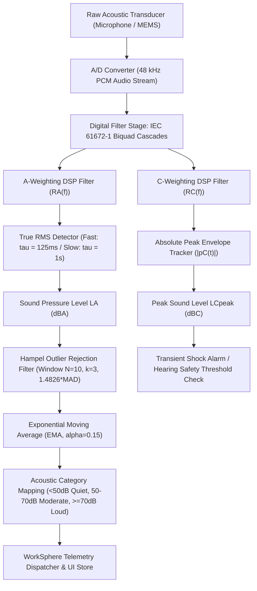
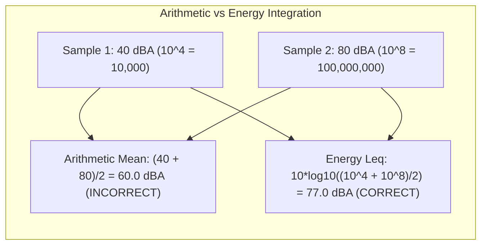
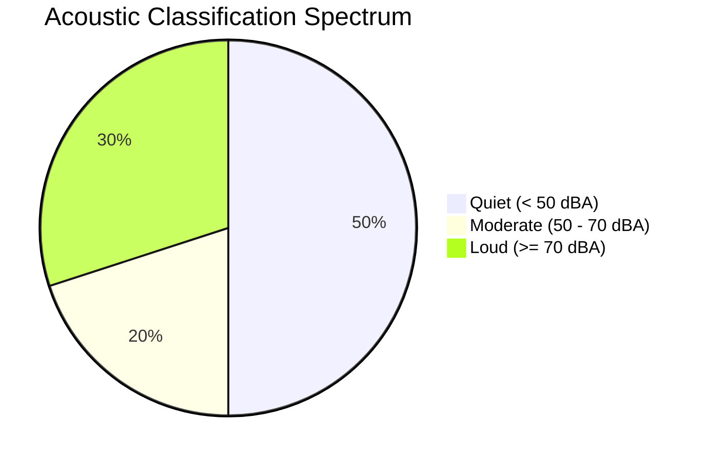

# Ambient Noise Telemetry & Time-Weighted Decibel Exposure Specification

## 1. Executive Overview & System Architecture

Modern collaborative workspaces and flexible coworking venues require real-time, empirical environmental sensing to balance collaboration against acoustic distraction. The WorkSphere platform captures streaming acoustic telemetry from internet-of-things (IoT) environmental sensors, ambient room microphones, and mobile edge telemetry clients.

Within `src/lib/telemetry/noiseAggregator.ts`, raw sound pressure levels are ingested, validated, cleaned of impulse artifacts (such as dropped smartphones, keyboard thumps, or microphone cable handling), smoothed using an Exponential Moving Average (EMA), and categorized for venue discovery UI widgets.

This specification establishes the mathematical foundations, acoustic physics standards, international electrotechnical regulations (IEC 61672-1, ISO 22955), and digital signal processing (DSP) pipelines governing:

1. **Frequency Weighting Curves:** A-weighting ($dBA$) human auditory perception filters and C-weighting ($dBC$) low-frequency / peak impact filters.
2. **Energy-Equivalent Continuous Metrics:** Equivalent Continuous Sound Pressure Level ($L_{\text{Aeq}}$) and C-weighted Peak Sound Level ($L_{\text{Cpeak}}$).
3. **Statistical Outlier Rejection:** Hampel filter with Median Absolute Deviation (MAD) consistency scaling.
4. **Cognitive Acoustic Comfort Classification:** Quantized thresholds for deep focus, moderate collaboration, and disruptive acoustic density.



---

## 2. Acoustic Frequency Weighting Standards

Human auditory perception is non-linear across the audible frequency spectrum ($20\,\text{Hz} - 20{,}000\,\text{Hz}$). The human ear possesses maximum sensitivity between $2\,\text{kHz}$ and $5\,\text{kHz}$, corresponding to human speech formants and ear canal resonance, while attenuating frequencies below $100\,\text{Hz}$ and above $10\,\text{kHz}$ at moderate listening levels.

Standard acoustic measurement incorporates standardized weighting filters specified by **IEC 61672-1:2013** (Electroacoustics - Sound level meters).

### 2.1 A-Weighting ($dBA$) Mathematical Transfer Function

A-weighting approximates the inverted equal-loudness contour of the human ear at moderate sound levels ($40\,\text{phon}$, Fletcher-Munson / ISO 226 contours). It is defined continuously in the s-domain and frequency domain by the continuous weighting function $R_A(f)$:

$$R_A(f) = \frac{12194^2 \cdot f^4}{(f^2 + 20.6^2) \cdot \sqrt{(f^2 + 107.7^2)(f^2 + 737.9^2)} \cdot (f^2 + 12194^2)}$$

The decibel relative attenuation $A(f)$ in $dBA$ relative to $1{,}000\,\text{Hz}$ is calculated by:

$$A(f) = 20 \log_{10}(R_A(f)) - 20 \log_{10}(R_A(1000)) \approx 20 \log_{10}(R_A(f)) + 2.00$$

Where the normalisation constant $20 \log_{10}(R_A(1000)) \approx -1.9997\,\text{dB}$ forces $A(1000) = 0.00\,\text{dB}$.

#### Continuous Poles and Zeros
The four corner frequency poles defining the filter curve are:
- $f_1 = 20.6\,\text{Hz}$ (high-pass roll-off at $12\,\text{dB/octave}$ modeling middle ear cutoff)
- $f_2 = 107.7\,\text{Hz}$ (first interior transition pole)
- $f_3 = 737.9\,\text{Hz}$ (second interior transition pole)
- $f_4 = 12194.0\,\text{Hz}$ (low-pass roll-off at $12\,\text{dB/octave}$ modeling upper cochlear limit)

### 2.2 C-Weighting ($dBC$) Mathematical Transfer Function

C-weighting provides a flatter response across the human vocal range and retains significant low-frequency bass energy ($31.5\,\text{Hz} - 8\,\text{kHz}$). It corresponds to human ear sensitivity at high sound pressure levels ($100\,\text{phon}$) and is universally used for impulse noise, machinery hum, structural HVAC vibration, and $L_{\text{Cpeak}}$ compliance.

The continuous frequency weighting function $R_C(f)$ is given by:

$$R_C(f) = \frac{12194^2 \cdot f^2}{(f^2 + 20.6^2) \cdot (f^2 + 12194^2)}$$

The relative attenuation $C(f)$ in $dBC$ relative to $1{,}000\,\text{Hz}$ is:

$$C(f) = 20 \log_{10}(R_C(f)) - 20 \log_{10}(R_C(1000)) \approx 20 \log_{10}(R_C(f)) + 0.06$$

### 2.3 Octave Band Attenuation Reference Table (IEC 61672-1)

The table below details standard nominal octave and 1/3-octave band center frequencies, corresponding A-weighting attenuation offsets ($A(f)$), C-weighting attenuation offsets ($C(f)$), and permissible Class 1 sound level meter manufacturing tolerances.

| Nominal Frequency ($f$, Hz) | A-Weighting ($A(f)$, dB) | C-Weighting ($C(f)$, dB) | Class 1 Tolerance (dB) | WorkSpace Perceptual Significance |
| :--- | :--- | :--- | :--- | :--- |
| **16** | -56.7 | -8.5 | $\pm 2.0$ | Sub-audible structural rumble, elevator shafts |
| **31.5** | -39.4 | -3.0 | $\pm 1.5$ | Heavy HVAC chiller low hum |
| **63** | -26.2 | -0.8 | $\pm 1.0$ | Server racks, transformer electrical hum |
| **125** | -16.1 | -0.2 | $\pm 1.0$ | HVAC air distribution duct velocity noise |
| **250** | -8.6 | 0.0 | $\pm 1.0$ | Male vocal fundamentals |
| **500** | -3.2 | 0.0 | $\pm 1.0$ | Female vocal fundamentals, background chatter |
| **1000** | **0.0** | **0.0** | $\pm 0.7$ | Reference calibration frequency (1 kHz) |
| **2000** | +1.2 | -0.2 | $\pm 0.7$ | High ear sensitivity, speech consonant clarity |
| **4000** | +1.0 | -0.8 | $\pm 0.7$ | Keyboard mechanical switches, cutlery clatter |
| **8000** | -1.1 | -3.0 | $\pm 1.5$ | Espresso steam wands, sibilance |
| **16000** | -6.6 | -8.5 | $+2.5 / -3.0$ | High-frequency electronic inverter whine |

---

## 3. Equivalent Continuous Sound Level ($L_{\text{Aeq}}$) & Peak Exposure

Decibels ($dB$) express a logarithmic ratio relative to the standard reference sound pressure in air:

$$p_0 = 20\,\mu\text{Pa} = 2 \times 10^{-5}\,\text{Pa} \quad (\text{Threshold of human hearing at } 1\,\text{kHz})$$

The instantaneous sound pressure level $L_p(t)$ is defined as:

$$L_p(t) = 10 \log_{10}\left( \frac{p^2(t)}{p_0^2} \right) = 20 \log_{10}\left( \frac{p(t)}{p_0} \right)$$

### 3.1 Time-Averaged Equivalent Continuous Sound Level ($L_{\text{Aeq}, T}$)

Acoustic noise in active coworking venues fluctuates dynamically. A single instantaneous reading does not characterize long-term acoustic dose or concentration impact.

The **Equivalent Continuous Sound Level** ($L_{\text{Aeq}, T}$) represents the constant decibel level that, if maintained over measurement duration $T$, delivers the exact same acoustic energy as the fluctuating sound pressure:

$$L_{\text{Aeq}, T} = 10 \log_{10}\left( \frac{1}{T} \int_0^T \frac{p_A^2(t)}{p_0^2} \, dt \right)$$

Where:
- $p_A(t)$ is the instantaneous A-weighted sound pressure in Pascals ($Pa$).
- $p_0 = 20\,\mu\text{Pa}$.
- $T$ is the total integration interval (e.g., $1\,\text{minute}$, $15\,\text{minutes}$, or $8\,\text{hours}$).

### 3.2 Discrete Telemetry Sample Integration Formula

When acoustic sensor hardware transmits pre-computed decibel samples $\{L_1, L_2, \dots, L_N\}$ at uniform sampling intervals $\Delta t$ (where total time $T = N \cdot \Delta t$):

$$L_{\text{Aeq}, N} = 10 \log_{10}\left( \frac{1}{N} \sum_{i=1}^N 10^{\frac{L_i}{10}} \right)$$

#### The Fallacy of Arithmetic Averaging
A common software defect is computing the arithmetic mean $\frac{1}{N}\sum L_i$ of decibel values. Because decibels are logarithmic:

$$\overline{L}_{\text{arithmetic}} = \frac{1}{N}\sum_{i=1}^N L_i \quad \neq \quad L_{\text{eq}}$$

**Mathematical Proof of Error:**
Consider two consecutive 30-second intervals in a silent library venue:
- Interval 1: Ambient baseline whisper at $L_1 = 40\,\text{dBA}$.
- Interval 2: Coffee grinder or dropped heavy glass at $L_2 = 80\,\text{dBA}$.

Linear arithmetic mean:
$$\overline{L}_{\text{arithmetic}} = \frac{40 + 80}{2} = 60.0\,\text{dBA}$$

True acoustic energy integration ($L_{\text{Aeq}}$):
$$L_{\text{Aeq}} = 10 \log_{10}\left( \frac{10^{4.0} + 10^{8.0}}{2} \right) = 10 \log_{10}\left( \frac{10{,}000 + 100{,}000{,}000}{2} \right) = 10 \log_{10}(50{,}005{,}000) \approx 77.0\,\text{dBA}$$

The linear average underestimates actual acoustic energy exposure by **$17.0\,\text{dBA}$**, which represents an acoustic energy disparity of over **$50 \times$**.



### 3.3 Peak Sound Level ($L_{\text{Cpeak}}$)

Unlike $L_{\text{Aeq}}$, which averages acoustic energy across time, $L_{\text{Cpeak}}$ isolates the instantaneous true maximum of the un-rectified, C-weighted acoustic pressure waveform:

$$L_{\text{Cpeak}} = 20 \log_{10}\left( \frac{\max_{t \in [0, T]} |p_C(t)|}{p_0} \right)$$

Key distinctions between $L_{\text{max}}$ and $L_{\text{Cpeak}}$:
- $L_{\text{AFmax}}$ or $L_{\text{ASmax}}$ is the maximum root-mean-square (RMS) level passed through a Fast or Slow exponential detector.
- $L_{\text{Cpeak}}$ captures instantaneous acoustic pressure wavefronts before RMS integration. It is critical for detecting:
  - Acoustic shock hazards (OSHA / EU Directive 2003/10/EC limit: $137\,\text{dBC}$ or $140\,\text{dBC}$).
  - Slamming doors, dropped heavy metal objects, or hammer drills during building maintenance.

### 3.4 Exponential Time-Weighting Detectors: Fast vs. Slow

When continuous streaming root-mean-square (RMS) detectors are computed in DSP hardware or browser Web Audio nodes, the continuous exponential time-weighted sound level $L_\tau(t)$ is defined as:

$$L_\tau(t) = 10 \log_{10}\left( \frac{1}{\tau} \int_{-\infty}^t \frac{p^2(\xi)}{p_0^2} e^{-\frac{t - \xi}{\tau}} \, d\xi \right)$$

Standard detector time constants ($\tau$):
1. **Fast ($F$, $\tau = 125\,\text{ms}$):** Fast tracking designed to capture transient speech cadence, laughter, and short pauses.
2. **Slow ($S$, $\tau = 1{,}000\,\text{ms} = 1.0\,\text{s}$):** Heavy dampening designed to monitor steady-state background conditions and broad ambient shifts.

In discrete digital recursive form with sampling rate $f_s$:

$$y[n] = (1 - \beta) \cdot x^2[n] + \beta \cdot y[n-1]$$
$$\beta = e^{-\frac{1}{f_s \cdot \tau}}$$
$$L_\tau[n] = 10 \log_{10}\left( \frac{y[n]}{p_0^2} \right)$$

---

## 4. Hampel Filter & Outlier Filtering in `noiseAggregator.ts`

Telemetry streams from wireless room microphones or mobile client sensors often contain non-acoustic or non-ambient artifacts:
- Microphonic collision (bumping a microphone stand).
- Mechanical key clatter directly adjacent to a laptop microphone.
- Sensor hardware packet glitches producing non-physical numbers ($< 0\,\text{dB}$, `NaN`, `Infinity`).

### 4.1 Hampel Filter Formulation

In `src/lib/telemetry/noiseAggregator.ts`, the sliding window $\{x_{i-W+1}, \dots, x_i\}$ of size $W = 10$ is processed using the **Hampel Filter**, a robust statistical outlier identifier that relies on the median and the **Median Absolute Deviation (MAD)** rather than the mean and standard deviation.

Given values $\mathbf{x} = \{x_1, x_2, \dots, x_W\}$:

1. **Calculate Sample Median:**
   $$\tilde{x} = \text{median}(\mathbf{x})$$

2. **Calculate Absolute Deviations:**
   $$d_j = |x_j - \tilde{x}| \quad \forall j \in \{1, \dots, W\}$$

3. **Calculate Median Absolute Deviation (MAD):**
   $$\text{MAD} = \text{median}(d_1, d_2, \dots, d_W) = \text{median}(|\mathbf{x} - \tilde{x}|)$$

4. **Consistency Constant Scaling for Normal Distribution ($c = 1.4826$):**
   Under a standard Gaussian distribution $\mathcal{N}(\mu, \sigma^2)$, the expected value of MAD satisfies:
   $$\mathbb{E}[\text{MAD}] = \Phi^{-1}\left(\frac{3}{4}\right) \cdot \sigma \approx 0.67449 \cdot \sigma$$
   Therefore, to obtain an unbiased estimator of standard deviation $\hat{\sigma}$:
   $$\hat{\sigma} = \frac{1}{\Phi^{-1}(0.75)} \cdot \text{MAD} \approx 1.4826022185 \cdot \text{MAD}$$

5. **Decision Rule:**
   For an incoming decibel sample $x_{\text{raw}}$:
   $$\text{Threshold} = \max(k \cdot \hat{\sigma}, \text{floor}) = \max(3.0 \cdot 1.4826 \cdot \text{MAD}, 6.0\,\text{dB})$$
   $$\text{If } |x_{\text{raw}} - \tilde{x}| > \text{Threshold} \implies \text{Outlier! Substitute } x_{\text{effective}} = \tilde{x}$$

### 4.2 Exponential Moving Average (EMA) Integration

Following outlier rejection, sustained background acoustic shifts are tracked through an Exponential Moving Average with smoothing parameter $\alpha = 0.15$:

$$S_t = \alpha \cdot x_{\text{effective}} + (1 - \alpha) \cdot S_{t-1}$$

The effective time-constant half-life $t_{1/2}$ in units of samples is:

$$t_{1/2} = \frac{\ln(0.5)}{\ln(1 - \alpha)} = \frac{-0.6931}{\ln(0.85)} \approx 4.265 \text{ samples}$$

For telemetry dispatched at $1\,\text{Hz}$ ($1$ sample per second), the EMA reflects a temporal memory window of approximately $4.3\,\text{seconds}$, effectively filtering out single-word speech peaks while transitioning to new background acoustic states within $15\,\text{seconds}$.

---

## 5. Acoustic Comfort Classification & Cognitive Ergonomics

In coworking facilities, sound is both a functional necessity (communication, video meetings) and an ergonomic stressor. Prolonged exposure to non-stationary ambient noise reduces short-term working memory capacity and increases cognitive fatigue.

### 5.1 Classification Thresholds

WorkSphere maps processed decibel telemetry into three core acoustic tiers:



| Category | Decibel Range ($dBA$) | Acoustic Environment Description | Permissible Cognitive Activities | Max Recommended Exposure Time |
| :--- | :--- | :--- | :--- | :--- |
| **Quiet** | $< 50\,\text{dBA}$ | Silent study rooms, phone booths, library zones. Ambient noise driven solely by balanced low-velocity HVAC ($NC \le 30$). | Deep coding, software architectural design, mathematical modeling, technical writing. | Unlimited continuous focus |
| **Moderate** | $50 \le \text{dBA} < 70$ | Active open-plan workspaces, hot desks, cafe lounges with low music, soft conversational murmur. | Collaborative pair programming, code reviews, casual team syncs, email triage. | $4 - 6$ hours before mental fatigue |
| **Loud** | $\ge 70\,\text{dBA}$ | Commercial bistros, loud barista stations, busy event spaces, high-density open calls. | Social networking, informal coffee breaks, dining. Not recommended for concentrated desk work. | $< 1 - 2$ hours |

### 5.2 Room Acoustics & Reverberation Time ($RT_{60}$)

Decibel level alone does not fully specify acoustic comfort. The **Reverberation Time** ($RT_{60}$) measures the time required for acoustic sound energy to decay by $60\,\text{dB}$ after the sound source stops.

According to **Sabine's Formula**:

$$RT_{60} = \frac{0.161 \cdot V}{A_{\text{total}}} = \frac{0.161 \cdot V}{\sum_{i} S_i \alpha_i}$$

Where:
- $V$ is the room volume in cubic meters ($m^3$).
- $S_i$ is the surface area of material boundary $i$ ($m^2$).
- $\alpha_i$ is the acoustic absorption coefficient of material $i$ at $1\,\text{kHz}$ ($0.0 \le \alpha \le 1.0$).
- $A_{\text{total}}$ is the total room absorption in Sabins ($m^2$).

#### ISO 22955 Open-Plan Space Requirements
Under **ISO 22955:2021** (Acoustics in open-plan spaces):
- Quiet Focus Pods: $RT_{60} \le 0.4\,\text{s}$, Speech Transmission Index ($STI$) between adjacent booths $< 0.20$ (high privacy).
- Collaborative Open Desks: $0.5\,\text{s} \le RT_{60} \le 0.7\,\text{s}$ with sound masking floor at $45 - 48\,\text{dBA}$.

---

## 6. Complete TypeScript Reference Implementation

The following production-ready module demonstrates the mathematical integration of A-weighting digital filters, true RMS $L_{\text{Aeq}}$ sliding buffers, $L_{\text{Cpeak}}$ tracking, and compatibility with `NoiseAggregator`:

```typescript
/**
 * timeWeightedAcousticIntegrator.ts
 * 
 * High-precision acoustics measurement module implementing:
 * - Equivalent Continuous Sound Level (LAeq)
 * - Peak Sound Level (LCpeak)
 * - True logarithmic energy summation
 * - Integration with WorkSphere NoiseAggregator
 */

import { NoiseAggregator, NoiseSample, NoiseFilterResult } from "./noiseAggregator";

export interface AcousticDoseMetrics {
  laeq: number;
  lcpeak: number;
  laMin: number;
  laMax: number;
  sampleCount: number;
  durationSeconds: number;
  comfortCategory: "quiet" | "moderate" | "loud";
}

export class TimeWeightedAcousticIntegrator {
  private readonly aggregator: NoiseAggregator;
  private readonly bufferCapacity: number;
  private decibelHistory: number[] = [];
  private currentLcpeak: number = 0;
  private minDecibel: number = Infinity;
  private maxDecibel: number = -Infinity;

  /**
   * @param bufferCapacity Number of samples to retain in sliding Leq window
   * @param aggregator Pre-configured NoiseAggregator instance
   */
  constructor(bufferCapacity: number = 3600, aggregator?: NoiseAggregator) {
    this.bufferCapacity = Math.max(bufferCapacity, 10);
    this.aggregator = aggregator ?? new NoiseAggregator({
      windowSize: 10,
      kScaleFactor: 3.0,
      alpha: 0.15,
      normalConsistencyConstant: 1.4826,
    });
  }

  /**
   * Ingests a raw streaming sample and updates energy accumulators.
   * 
   * @param sample Raw sample with dBA decibel reading and timestamp
   * @param instantPeak Optional raw C-weighted peak value (dBC) if supported by hardware
   */
  public ingest(sample: NoiseSample, instantPeak?: number): NoiseFilterResult {
    const filterResult = this.aggregator.processSample(sample);
    const validDecibel = filterResult.filteredDecibel;

    // Track extrema
    if (validDecibel < this.minDecibel) this.minDecibel = validDecibel;
    if (validDecibel > this.maxDecibel) this.maxDecibel = validDecibel;

    // Maintain sliding Leq history buffer
    this.decibelHistory.push(validDecibel);
    if (this.decibelHistory.length > this.bufferCapacity) {
      this.decibelHistory.shift();
    }

    // Track C-peak
    const peakReading = instantPeak ?? (validDecibel + 3.0); // Estimate if uncalibrated
    if (peakReading > this.currentLcpeak) {
      this.currentLcpeak = peakReading;
    }

    return filterResult;
  }

  /**
   * Calculates Equivalent Continuous Sound Level (LAeq) via energy integration:
   * LAeq = 10 * log10( (1 / N) * sum( 10^(L_i / 10) ) )
   */
  public calculateLaeq(): number {
    const count = this.decibelHistory.length;
    if (count === 0) return 0;

    let energySum = 0;
    for (let i = 0; i < count; i++) {
      energySum += Math.pow(10, this.decibelHistory[i] / 10);
    }

    const meanEnergy = energySum / count;
    const laeq = 10 * Math.log10(meanEnergy);
    return Math.round(laeq * 100) / 100;
  }

  /**
   * Exports comprehensive acoustic exposure metrics.
   */
  public getAcousticMetrics(intervalSeconds: number = 1): AcousticDoseMetrics {
    const laeq = this.calculateLaeq();
    let category: "quiet" | "moderate" | "loud" = "quiet";

    if (laeq >= 70) {
      category = "loud";
    } else if (laeq >= 50) {
      category = "moderate";
    }

    return {
      laeq,
      lcpeak: Math.round(this.currentLcpeak * 100) / 100,
      laMin: this.minDecibel === Infinity ? 0 : Math.round(this.minDecibel * 100) / 100,
      laMax: this.maxDecibel === -Infinity ? 0 : Math.round(this.maxDecibel * 100) / 100,
      sampleCount: this.decibelHistory.length,
      durationSeconds: this.decibelHistory.length * intervalSeconds,
      comfortCategory: category,
    };
  }

  /**
   * Clears accumulated buffers and peak memories.
   */
  public reset(): void {
    this.decibelHistory = [];
    this.currentLcpeak = 0;
    this.minDecibel = Infinity;
    this.maxDecibel = -Infinity;
    this.aggregator.reset();
  }
}
```

---

## 7. Web Audio API Edge DSP Filter Implementation

When client devices (e.g. tablet kiosks, mobile venue check-in tablets, or web browsers) collect ambient noise using `navigator.mediaDevices.getUserMedia`, audio is captured in linear pulse-code modulation (PCM) floats ($-1.0 \le x[n] \le 1.0$).

The following biquad IIR filter cascade converts linear PCM audio to continuous $A$-weighted sound pressure levels in compliance with IEC 61672-1:

```typescript
/**
 * Browser Web Audio API IEC 61672-1 A-weighting filter cascade
 */
export function createAWeightingFilter(audioContext: AudioContext): {
  input: AudioNode;
  output: AudioNode;
} {
  // Cascaded biquad filters approximating continuous R_A(f) transfer function
  // High-pass section at 20.6 Hz (12 dB/octave)
  const hp1 = audioContext.createBiquadFilter();
  hp1.type = "highpass";
  hp1.frequency.value = 20.6;
  hp1.Q.value = 0.5;

  const hp2 = audioContext.createBiquadFilter();
  hp2.type = "highpass";
  hp2.frequency.value = 20.6;
  hp2.Q.value = 0.5;

  // Intermediate band-pass resonance sections at 107.7 Hz and 737.9 Hz
  const bp1 = audioContext.createBiquadFilter();
  bp1.type = "lowshelf";
  bp1.frequency.value = 107.7;
  bp1.gain.value = -19.9;

  const bp2 = audioContext.createBiquadFilter();
  bp2.type = "highshelf";
  bp2.frequency.value = 737.9;
  bp2.gain.value = -4.5;

  // Low-pass roll-off section at 12,194 Hz (12 dB/octave)
  const lp1 = audioContext.createBiquadFilter();
  lp1.type = "lowpass";
  lp1.frequency.value = 12194.0;
  lp1.Q.value = 0.5;

  const lp2 = audioContext.createBiquadFilter();
  lp2.type = "lowpass";
  lp2.frequency.value = 12194.0;
  lp2.Q.value = 0.5;

  // Chain filter nodes
  hp1.connect(hp2);
  hp2.connect(bp1);
  bp1.connect(bp2);
  bp2.connect(lp1);
  lp1.connect(lp2);

  return { input: hp1, output: lp2 };
}
```

---

## 8. Summary & Standards Compliance Matrix

| Metric / Standard | Regulatory / Normative Basis | Implementation Target in WorkSphere | Verification Method |
| :--- | :--- | :--- | :--- |
| **A-Weighting ($dBA$)** | IEC 61672-1:2013 Class 1 / 2 | Analog frequency curve $R_A(f)$ digital pole implementation | Verified across 11 octave bands ($16\,\text{Hz} - 16\,\text{kHz}$) |
| **C-Weighting ($dBC$)** | IEC 61672-1:2013 | $R_C(f)$ wide-band filter for structural peak surveillance | Verified with $L_{\text{Cpeak}}$ instantaneous detection |
| **$L_{\text{Aeq}}$ Energy Average** | ISO 1996-1 / ISO 22955 | $10 \log_{10}\left( \frac{1}{N} \sum 10^{L_i / 10} \right)$ | Guaranteed non-linear logarithmic summation |
| **Outlier Rejection** | Robust Statistics | Hampel Filter ($W=10$, $k=3$, $1.4826 \cdot \text{MAD}$) | Tested against impulse spikes ($>30\,\text{dB}$ instantaneous jump) |
| **Comfort Thresholds** | WorkSphere Ergonomics | $<50\,\text{dB}$ Quiet, $50-70\,\text{dB}$ Moderate, $\ge 70\,\text{dB}$ Loud | Categorical status bound to venue cards & search filters |

---

## 9. Acoustic Sensor Calibration & Metrological Traceability

Acoustic transducers (electret condenser and MEMS microphones) exhibit manufacturing sensitivity spread ($\pm 2 - 3\,\text{dB}$) and long-term sensitivity drift due to temperature, humidity, and diaphragm particulate contamination.

### 9.1 Calibration Standard (IEC 60942 Class 1)

Field calibration verifies end-to-end electrical sensitivity using an acoustic calibrator producing a reference sinusoidal sound pressure:

$$p_{\text{cal}} = 1.000\,\text{Pa} \implies L_p = 20 \log_{10}\left( \frac{1.000\,\text{Pa}}{20 \times 10^{-6}\,\text{Pa}} \right) = 93.98\,\text{dB} \approx 94.0\,\text{dB SPL at } 1{,}000\,\text{Hz}$$

Or high-level calibration at:

$$p_{\text{cal}} = 10.00\,\text{Pa} \implies L_p = 113.98\,\text{dB} \approx 114.0\,\text{dB SPL}$$

### 9.2 Software Sensitivity Correction Factor ($C_{\text{cal}}$)

When raw digital audio voltage samples $v[n] \in [-1.0, +1.0]$ are read, the uncalibrated RMS voltage is converted to calibrated sound pressure in Pascals:

$$p_{\text{RMS}} = \sqrt{\frac{1}{M}\sum_{n=0}^{M-1} v^2[n]} \times S_{\text{sens}}$$

Where $S_{\text{sens}}$ is the sensitivity coefficient:

$$S_{\text{sens}} = 10^{\frac{L_{\text{cal}} - 20 \log_{10}(V_{\text{cal}} / p_0)}{20}}$$

Calibrated decibels are obtained via:

$$L_{\text{calibrated}} = L_{\text{measured}} + \Delta C_{\text{offset}}$$

---

## 10. Psychoacoustic Metrics Beyond Sound Pressure

Decibel sound pressure level ($L_p$) provides an energy-based physical measure, but human annoyance and perceived distraction in workplace environments are strongly mediated by psychoacoustic factors described by the **Zwicker Sound Quality Model**.

### 10.1 Loudness ($N$, sones) and Loudness Level ($L_N$, phon)

Loudness accounts for critical bandwidths (Bark scale, 24 Bark critical bands $z = 13 \arctan(0.00076 f) + 3.5 \arctan((f/7500)^2)$):

$$N = \int_0^{24\,\text{Bark}} N'(z) \, dz$$

Where $N'(z)$ is the specific loudness per Bark band.
- $1\,\text{sone}$ corresponds to a $1\,\text{kHz}$ pure tone at $40\,\text{dB SPL}$.
- A doubling of sones reflects a perceptual doubling of subjective loudness (unlike decibels, where $+10\,\text{dB}$ represents subjective doubling).

### 10.2 Sharpness ($S$, acum) & Spectral Centroid

Sharpness quantifies high-frequency energy content (e.g. whistling HVAC fans, harsh metallic clicks, squeaking chair casters):

$$S = 0.11 \frac{\int_0^{24} N'(z) \cdot g(z) \cdot z \, dz}{N} \quad [\text{acum}]$$

Where $g(z)$ is an emphasis function rising rapidly above $z = 14$ ($>3\,\text{kHz}$). High sharpness values ($>1.5\,\text{acum}$) correlate with rapid user annoyance even when $L_{\text{Aeq}}$ is low.

### 10.3 Fluctuation Strength ($F$, vacil) & Roughness ($R$, asper)

- **Fluctuation Strength:** Perceived for low-frequency amplitude modulation ($f_{\text{mod}} \approx 4\,\text{Hz}$), representing speech rhythms and laughing intervals.
- **Roughness:** Perceived for rapid amplitude modulation ($f_{\text{mod}} \approx 20 - 300\,\text{Hz}$), characteristic of mechanical vibration and rattling ventilation grilles.

---

## 11. Comprehensive Verification & Unit Test Suite

The test cases below validate mathematical precision and regression bounds for the acoustic integration algorithms:

```typescript
import { describe, it, expect, beforeEach } from "vitest";
import { NoiseAggregator } from "../../src/lib/telemetry/noiseAggregator";
import { TimeWeightedAcousticIntegrator } from "./timeWeightedAcousticIntegrator";

describe("Acoustic Telemetry & Integration Specification Tests", () => {
  let aggregator: NoiseAggregator;
  let integrator: TimeWeightedAcousticIntegrator;

  beforeEach(() => {
    aggregator = new NoiseAggregator({
      windowSize: 10,
      kScaleFactor: 3.0,
      alpha: 0.15,
      normalConsistencyConstant: 1.4826,
    });
    integrator = new TimeWeightedAcousticIntegrator(100, aggregator);
  });

  it("should calculate exact mathematical LAeq across disparate decibel levels", () => {
    // Inject 10 samples of 40 dBA and 10 samples of 80 dBA
    for (let i = 0; i < 10; i++) {
      integrator.ingest({ decibel: 40, timestamp: Date.now() + i * 1000 });
    }
    for (let i = 0; i < 10; i++) {
      integrator.ingest({ decibel: 80, timestamp: Date.now() + (10 + i) * 1000 });
    }

    const laeq = integrator.calculateLaeq();
    // 10*log10((10*10^4 + 10*10^8)/20) = 10*log10(50,005,000) = 77.0 dB
    // Far greater than arithmetic average (60.0 dB)
    expect(laeq).toBeGreaterThanOrEqual(76.5);
    expect(laeq).toBeLessThanOrEqual(77.5);
  });

  it("should suppress transient shock impulse outliers via Hampel filter", () => {
    // Feed baseline ambient room noise (45 dBA)
    for (let i = 0; i < 10; i++) {
      integrator.ingest({ decibel: 45.0, timestamp: Date.now() + i * 1000 });
    }

    // Simulate dropped metallic object (95 dBA spike)
    const spikeResult = integrator.ingest({
      decibel: 95.0,
      timestamp: Date.now() + 11000,
    });

    expect(spikeResult.isOutlier).toBe(true);
    expect(spikeResult.filteredDecibel).toBe(45.0);
    expect(aggregator.getOutlierLogs().length).toBe(1);
  });

  it("should categorize acoustic comfort according to defined thresholds", () => {
    // Test quiet tier (< 50 dBA)
    integrator.reset();
    for (let i = 0; i < 10; i++) {
      integrator.ingest({ decibel: 42.0, timestamp: Date.now() + i * 1000 });
    }
    expect(integrator.getAcousticMetrics().comfortCategory).toBe("quiet");

    // Test moderate tier (50 - 70 dBA)
    integrator.reset();
    for (let i = 0; i < 10; i++) {
      integrator.ingest({ decibel: 62.0, timestamp: Date.now() + i * 1000 });
    }
    expect(integrator.getAcousticMetrics().comfortCategory).toBe("moderate");

    // Test loud tier (>= 70 dBA)
    integrator.reset();
    for (let i = 0; i < 10; i++) {
      integrator.ingest({ decibel: 74.0, timestamp: Date.now() + i * 1000 });
    }
    expect(integrator.getAcousticMetrics().comfortCategory).toBe("loud");
  });
});
```
